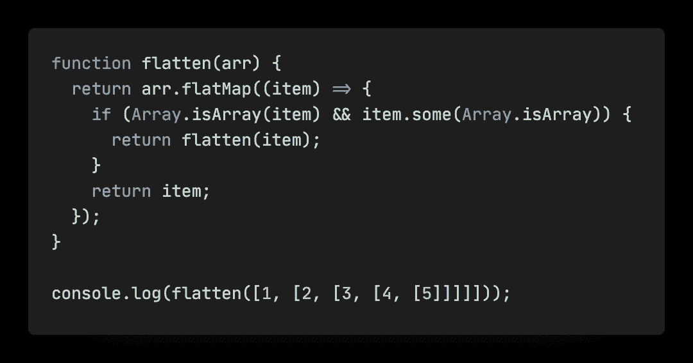
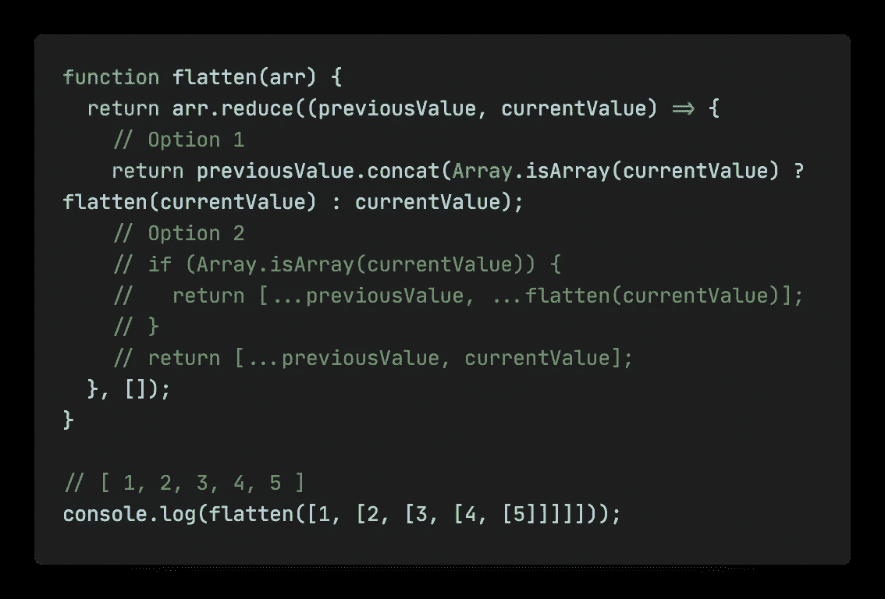
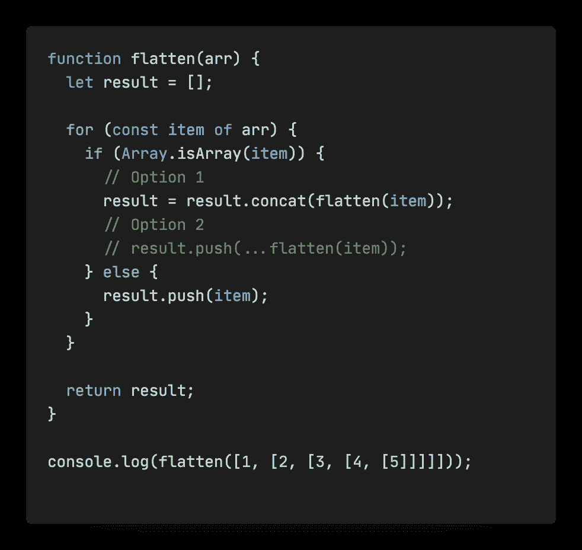
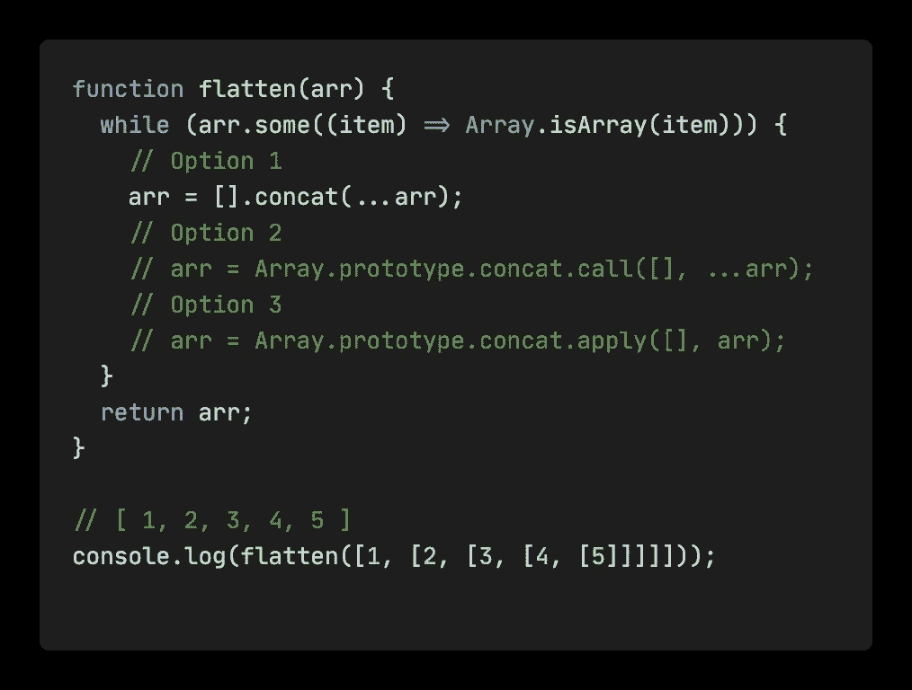
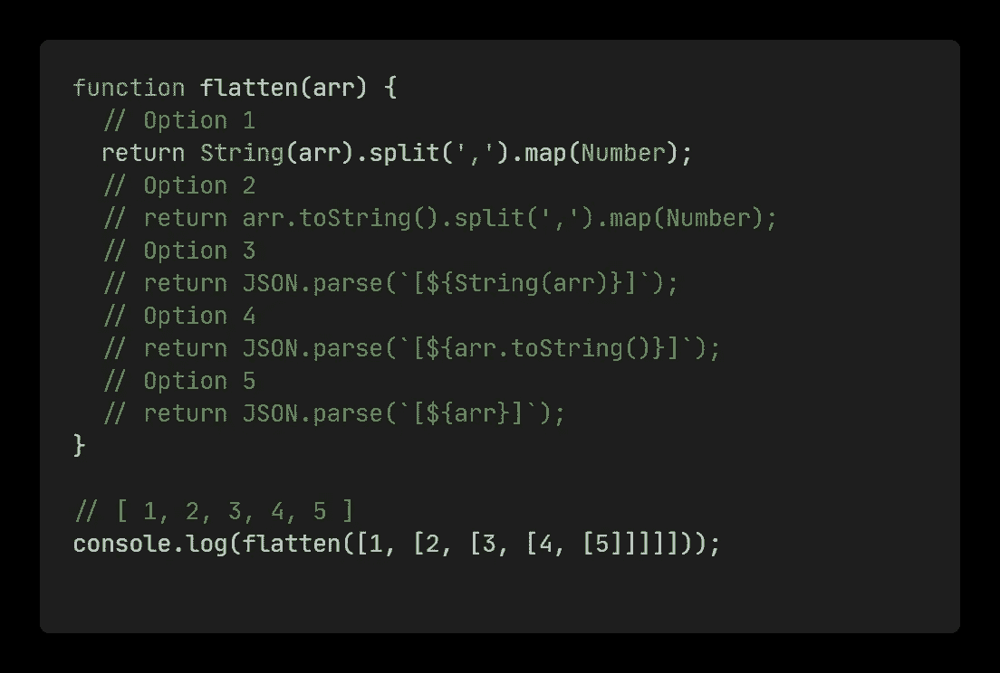
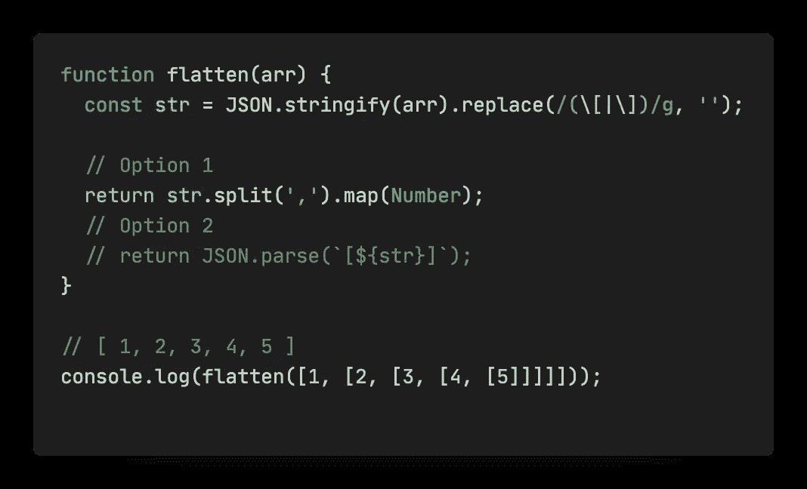
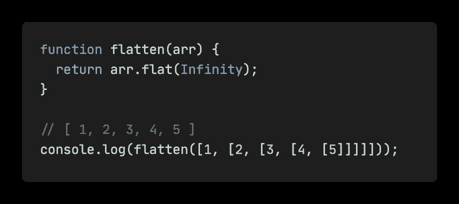

# JavaScript 中展平数组的 7 种方法

> 原文：<https://javascript.plainenglish.io/7-ways-to-flatten-arrays-in-javascript-2574db3aff2?source=collection_archive---------3----------------------->

## 我们来看看有什么可以替代扁平化的方法。

Photo by [Leone Venter](https://unsplash.com/@fempreneurstyledstock?utm_source=medium&utm_medium=referral) on [Unsplash](https://unsplash.com?utm_source=medium&utm_medium=referral)

数组扁平化就是将多层嵌套数组转换为只有一层。用代码来解释，应该是`[1, [2, [3, 4, 5]]] => [1, 2, 3, 4, 5]`。让我们看看它是如何工作的！

# 1.Array.prototype.flatMap +递归

我们先来看看 ES6 中提供的`flatMap`方法，就是调用`Array.prototype.map`得到结果然后在结果上调用`Array.prototype.flat(1)`，就是把结果扁平化一层。这比分别调用这两个方法要稍微高效一些。

我们可以判断当前项是否是循环中的嵌套数组，如果是，recurse，如果不是，直接返回。flatMap 会帮助我们在循环结束后将结果展平一层。

# 2.Array.prototype.reduce +递归

使用`Array.prototype.reduce`方法，我们可以进行累加计算，因为`concat`的参数既可以传递数组，也可以传递单项，所以可以直接在一行中实现。

这里`concat`这里也可以换成 push，详见选项 2。

# 3.for…of +递归

循环原数组，判断当前项是否为数组，递归调用 flatten，用`concat`串联递归结果。如果不是数组，直接推到结果。

同样，`concat`可以用 push 代替，详见选项 2。

# 4.while +迭代

这样就用`Array.prototype.some` API 连续判断`arr`中是否有数组，如果有，就展平直到 arr 中没有数组项。

这里`Array.prototype.concat` API 可以用三种方式编写。注意调用和应用之间的区别。

# 5.(String | | array . prototype . tostring)+(split | | JSON . parse)

在处理字符串数组或者数值数组的时候，我们可以调用`String()`或者`Array.prototype.toString`显式的将数组转换为字符串类型来移除原数组中的所有`[]`，这样就会得到字符串`1,2,3,4,5`。那么有两种处理方法:

1.  调用`String.split`方法以`,`分隔字符串，那么你将得到`['1','2','3','4','5']`。此时数组中每一项的类型都是字符串而不是数字，所以我们通过对数组的每一项调用`Number()`来调用`Array.prototype.map`将其显式转换为数字。
2.  将字符串拼接成`[1,2,3,4,5]`，然后调用`JSON.parse`将字符串构造成数组对象。

# 6.JSON . stringify+RegExp+(split | | JSON . parse)

在处理字符串数组或者数值数组的时候，我们也是用`JSON.stringify`对数组进行 get `'[1,[2,[3,[4,[5]]]]]'`，然后用 RegExp 去掉所有`[]`，get `1,2,3,4,5`。这与使用`String()`或`Array.prototype.toString`的效果相同。

接下来的步骤与方案 5 相同，使用`String.split`或`JSON.parse`得到我们想要的结果。

# 7.平的

我们可以直接使用 ES6 提供的`flat`方法，该方法可以传递一个深度作为参数来表示要扩展的深度。这里我们指定了`Infinity`，表示我们想要将任意深度的嵌套数组转换为一维数组。

如果我们也想像 flat 一样实现传入指定深度，然后再展平的方法呢？

只需要不断减少递归或迭代的次数，判断当前值是否大于 0。

我们还可以使用我在之前的文章中实现的[来验证结果，我们可以看到它们符合我们的预期。](https://levelup.gitconnected.com/how-to-get-a-perfect-deep-equal-in-javascript-b849fe30e54f)

最后，我是李。我会继续输出前端技术相关的故事。如果你喜欢这样的故事，想支持我，请考虑成为 [*中等会员*](https://medium.com/@islizeqiang/membership) *。每月 5 美元，你可以无限制地访问媒体内容。如果你通过* [*我的链接*](https://medium.com/@islizeqiang/membership) *报名，我会得到一点佣金。*

你的支持对我来说非常重要——谢谢。

*更多内容请看*[***plain English . io***](https://plainenglish.io/)*。报名参加我们的* [***免费周报***](http://newsletter.plainenglish.io/) *。关注我们关于*[***Twitter***](https://twitter.com/inPlainEngHQ)*和*[***LinkedIn***](https://www.linkedin.com/company/inplainenglish/)*。加入我们的* [***社区不和谐***](https://discord.gg/GtDtUAvyhW) *。*