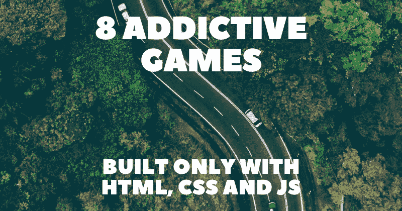

# 仅用 HTML、CSS 和 JavaScript 构建的 8 款令人上瘾的游戏🎮✨

> 原文：<https://javascript.plainenglish.io/8-addictive-games-built-only-with-html-css-and-javascript-97575d7612bd?source=collection_archive---------6----------------------->

## 我最喜欢的游戏列表，用 HTML、CSS 和 JS 构建，以激发你未来的创作。

游戏是你能创造的最酷的项目之一，因为它们很有趣，会让最终用户上瘾。在这篇文章中，我整理了一些我最喜欢的，所以你可以为你未来的创作获得一些灵感。

招聘人员通常也更看重有创意的游戏项目，因为它们展示了你对 HTML 结构、CSS 设计和 JS 功能的熟练程度。

对于每个项目，我将提供一个直接链接，一个互动的预览，这样你就可以在飞行中获得初步印象以及作者链接，这样你也可以探索他们的更多工作。

## 1.[键盘英雄](https://codepen.io/evilpaper/pen/dyyZjLQ)

作者: [evilpaper](https://codepen.io/evilpaper)

## 2. [Menja](https://codepen.io/MillerTime/pen/BexBbE)

作者:[凯勒·米勒](https://codepen.io/MillerTime)

## 3.[艾棋](https://codepen.io/jakealbaugh/pen/JjRGQPY)

作者:[杰克·阿尔博](https://codepen.io/jakealbaugh)

## 4.[倾斜迷宫](https://codepen.io/HunorMarton/pen/VwKwgxX)

作者:[胡诺尔·马顿·博贝利](https://codepen.io/HunorMarton)

## 5.[立方体](https://codepen.io/bsehovac/pen/EMyWVv)

鲍里斯·舍霍瓦茨

## 6. [Coloron](https://codepen.io/gregh/pen/yVLOyO)

作者:[格雷格·霍万尼斯扬](https://codepen.io/gregh)

## 7.[勇猛的兔子](https://codepen.io/Yakudoo/pen/YGxYej)

作者:[卡里姆·马罗尔](https://codepen.io/Yakudoo)

## 8. [CSS 纵横字谜](https://codepen.io/adrianroworth/pen/OpeyZq)

作者:[阿德里安·罗沃斯](https://codepen.io/adrianroworth)

写作一直是我的激情所在，帮助和激励他人给我带来了快乐。如果您有任何问题，请随时联系我们！

如果你觉得这些有用，请在 [Twitter](https://twitter.com/madzadev) 、 [LinkedIn](https://www.linkedin.com/in/madzadev/) 和 [GitHub](https://github.com/madzadev) 上联系我！

访问我的[博客](https://madza.dev/blog)获取更多类似的文章。

*更多内容看* [***说白了。报名参加我们的***](https://plainenglish.io/) **[***免费周报***](http://newsletter.plainenglish.io/) *。关注我们关于*[***Twitter***](https://twitter.com/inPlainEngHQ)*和**[***LinkedIn***](https://www.linkedin.com/company/inplainenglish/)*。加入我们的* [***社区***](https://discord.gg/GtDtUAvyhW) *。****