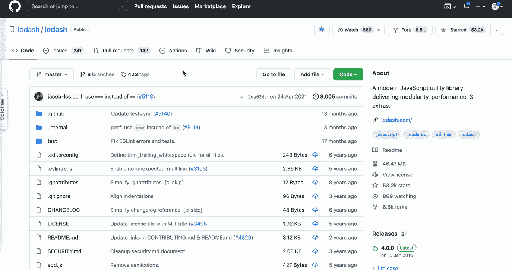
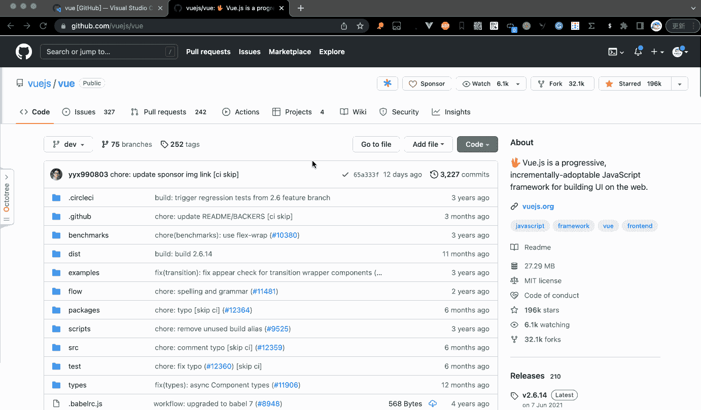
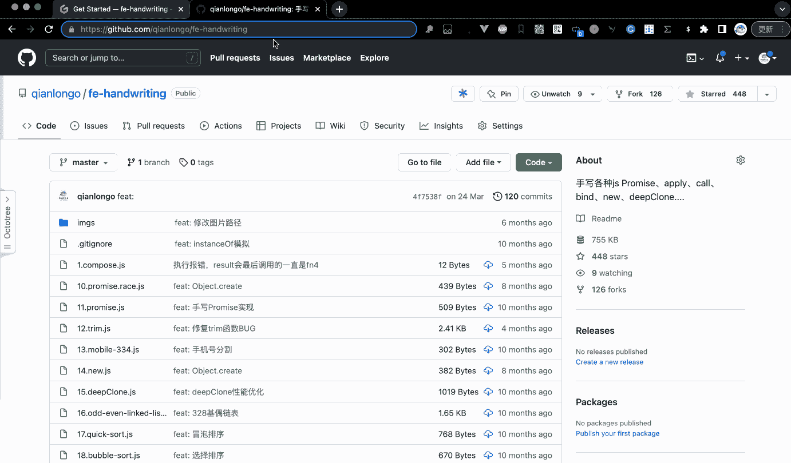
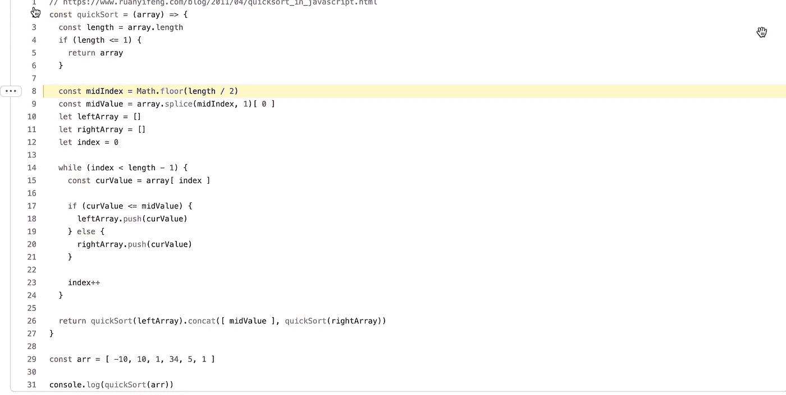
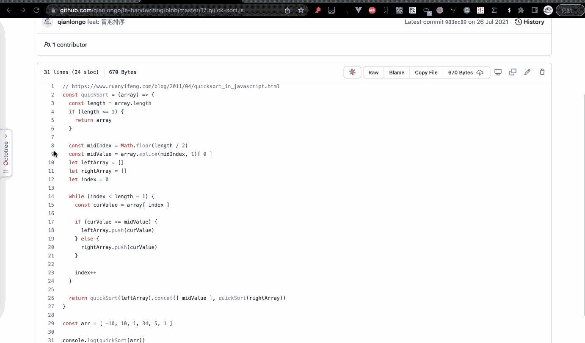
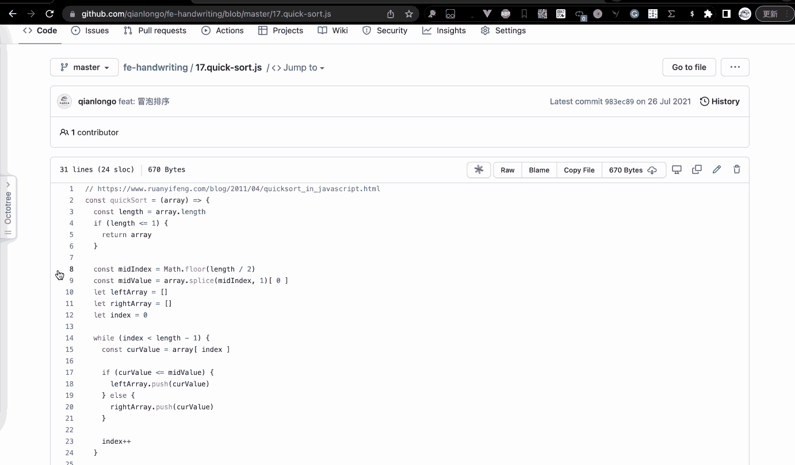
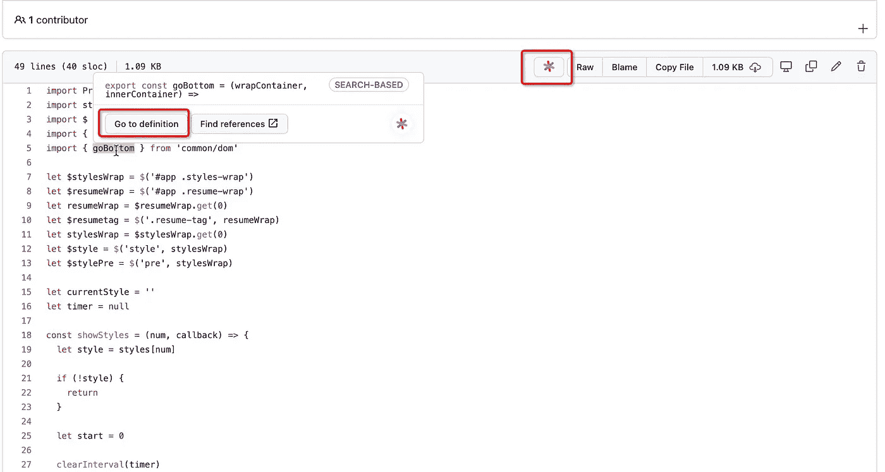
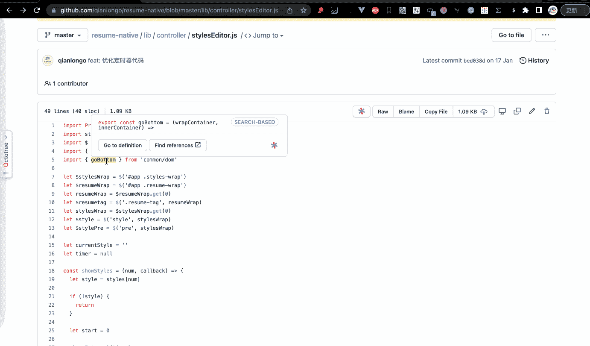
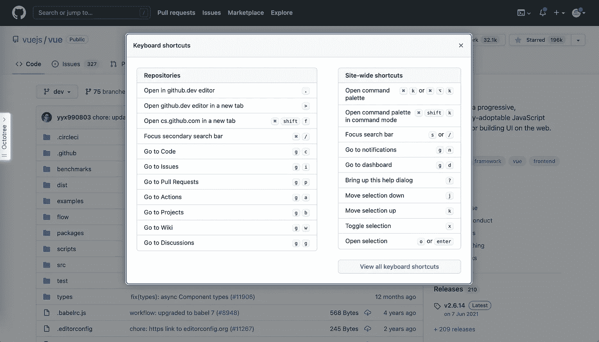

# 让你看起来像高级开发人员的 8 个很酷的 GitHub 技巧

> 原文：<https://javascript.plainenglish.io/8-cool-github-tricks-to-make-you-look-like-a-senior-developer-ab8fe9ae9b14?source=collection_archive---------0----------------------->

## 使用 GitHub 可以做的 8 件很酷的事情

# 前言

作为一名开发者，你一定很爱浏览 GitHub 网站。但是你知道有很多隐藏的神奇功能可以帮助我们更好地使用它吗？

# 1.使用“t”键快速搜索文件

我的好朋友们，这是一个只有少数人知道的很酷的功能。

当你想查看一个文件的内容时，你可以**击“T”键**，然后输入文件名，就可以直接跳转到目标文件。

**步骤**

1.  打开[https://github.com/lodash/lodash](https://github.com/lodash/lodash)(GitHub 上的任何项目)
2.  **按下“T”键**
3.  输入`add.test.js`(您想要搜索的任何文件名)
4.  点击跳转查看文件内容

# 2.使用在线“VSCode”编辑器查看代码的 3 种方法

虽然使用“T”键可以让我们快速搜索文件，但当您想要查看整个项目代码时，它会变得低效。

我将与您分享在线查看代码的三种方法，就像在您的 VSCode 编辑器中一样。第三种是我最喜欢的方式，我相信你会喜欢的。

# 2.1.方法 1:使用“.”快捷键

你需要点击“.”键来享受在线 VSCode 编辑器的遍历。

**步骤**

1.  打开[https://github.com/vuejs/vue](https://github.com/vuejs/vue)(GitHub 上的任何项目)
2.  **打“.”按键**
3.  然后你会被重定向到[**https://github.dev/vuejs/vue**](https://github.dev/vuejs/vue)
4.  好好享受吧…

# 2.2.方法 2:使用“github1s.com”

当你在 github 上看到自己喜欢的项目时，需要把“GitHub”改成“github1s”才能达到和方法 1 一样的效果！

**步骤**

1.  打开[https://github.com/vuejs/vue](https://github.com/vuejs/vue)(GitHub 上的任何项目)
2.  将`https://github.com/vuejs/vue`修改为`[https://github1s.com/vuejs/vue](https://github1s.com/vuejs/vue)`
3.  好好享受吧…

# 2.3.方法 3:使用“gitpod.com/#xxx”

第三种方式很神奇，你甚至可以**直接在线运行 Node.js 代码**，我太喜欢了。

非常好用，只需要在 GitHub 链接前加上`gitpod.com/#`就可以了。

**步骤**

1.  打开[https://github.com/qianlongo/fe-handwriting](https://github.com/qianlongo/fe-handwriting)(GitHub 上的任何项目)
2.  在`[https://github.com/qianlongo/fe-handwriting](https://github.com/qianlongo/fe-handwriting)`前增加`gitpod.com/#`
3.  好好享受吧…

# 3.链接到单行代码

有时您想要链接到特定的代码行。就像下图一样。

你该怎么办？

**步骤**

1.  打开`[https://github.com/qianlongo/fe-handwriting/blob/master/17.quick-sort.js](https://github.com/qianlongo/fe-handwriting/blob/master/17.quick-sort.js()`(GitHub 上的任何项目)
2.  单击左边的行号
3.  复制链接(`https://github.com/qianlongo/fe-handwriting/blob/master/17.quick-sort.js#L8`)

我相信你一定注意到了我们链接后面的“L8”。对，没错，你可以通过修改“L”+行号链接到你想要的代码。

# 4.链接到多行代码

既然我们可以链接到单行代码，那么我们可以链接到多行代码吗？

答案是可确定的。

**步骤**

1.  打开`https://github.com/qianlongo/fe-handwriting/blob/master/17.quick-sort.js`(GitHub 上的任何项目)。
2.  按住`"shift"`键，点击左边的行号。
3.  复制链接(`https://github.com/qianlongo/fe-handwriting/blob/master/17.quick-sort.js#L8-L24`)。

# 5.跳到定义函数的地方

如何快速链接到定义函数的地方？

推荐你一个 chrome 插件，名字叫 [sourcegraph](https://chrome.google.com/webstore/detail/sourcegraph/dgjhfomjieaadpoljlnidmbgkdffpack?hl=zh) 。

安装插件后，鼠标放在使用该功能的地方会出现一个按钮。单击以链接到定义它的位置。

**查看 gif**

# 6.查看快捷键列表

GitHub 提供了很多快捷键来帮助我们阅读代码，但是记住它们并不是一件容易的事情，幸运的是你可以使用“Shift”+“？”调出快捷方式列表。

# 最后

**感谢阅读。**期待期待您的关注和阅读更多高质量的文章。

 [## 10 个你可能不知道答案的简单面试问题

### 99%的人不一定知道答案。

javascript.plainenglish.io](/10-easy-interview-questions-you-may-not-know-the-answer-e9421a0953b8)  [## 面试官:可以“x！== x "在 JavaScript 中返回 True？

### 你可能不知道的五个神奇的 JavaScript 知识点！

javascript.plainenglish.io](/interviewer-can-x-x-return-true-in-javascript-7e1d1fa7b5cd)  [## 123['toString']。length + 123)用 JavaScript 打印出来？

### 95%的前端开发者回答错误的问题。

javascript.plainenglish.io](/what-does-123-tostring-length-123-print-out-in-javascript-2c804a414325)  [## 面试官:你工作 3 年了，这种算法题你都不会答？

### 一个女生的面试经历

javascript.plainenglish.io](/interviewer-you-have-been-working-for-3-years-and-you-cant-answer-this-algorithm-question-5f79cba18e06) 

*更多内容请看*[***plain English . io***](https://plainenglish.io/)*。报名参加我们的* [***免费周报***](http://newsletter.plainenglish.io/) *。关注我们关于*[***Twitter***](https://twitter.com/inPlainEngHQ)*和*[***LinkedIn***](https://www.linkedin.com/company/inplainenglish/)*。查看我们的* [***社区不和谐***](https://discord.gg/GtDtUAvyhW) *加入我们的* [***人才集体***](https://inplainenglish.pallet.com/talent/welcome) *。*