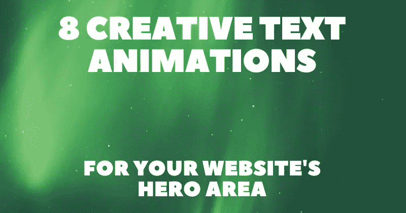

# 8 款针对网站英雄区域的创意文本动画😍🎉

> 原文：<https://javascript.plainenglish.io/8-creative-text-animations-for-your-websites-hero-area-df3ff7ec9615?source=collection_archive---------9----------------------->

现代网络开发是为了吸引访问者的注意力。有很多种方法可以让你的网站更加引人注目和吸引人。最吸引人的方法之一是将动画英雄文本添加到您的登录页面。

在这篇文章中，我汇编了一些我见过的最有创意的效果，来启发你在未来进行自己的项目。

对于每一个动画，我将提供一个直接的链接，一个互动的预览，这样你就可以得到一个初步的印象，就像作者的链接一样，这样你也可以探索更多他们的作品。

## 1.[悬停滑块(暗/亮)](https://codepen.io/ig_design/pen/MRbJWW)

作者:[伊万·格罗茨迪](https://codepen.io/ig_design)

## 2.[流畅文字悬停](https://codepen.io/robin-dela/pen/KKPYoBq)

作者: [Robin Delaporte](https://codepen.io/robin-dela)

## 3. [CSS 透视文本悬停](https://codepen.io/bosworthco/pen/YWBLpR)

作者: [James Bosworth](https://codepen.io/bosworthco)

## 4.[苹果电视-文字旋转](https://codepen.io/stevenlei/pen/RwpRgzy)

作者:[史蒂文·雷](https://codepen.io/stevenlei)

## 5.[聚光灯光标文本](https://codepen.io/carolineartz/pen/rNaGQYo)

委托人: [Caroline Artz](https://codepen.io/carolineartz)

## 6. [SVG 文本蒙版带/视频填充](https://codepen.io/dudleystorey/pen/QvvEYQ)

作者:[达德利·斯托里](https://codepen.io/dudleystorey)

## 7. [SVG 文本动画 w/笔划偏移](https://codepen.io/Ayachem/pen/KaLbZK)

作者: [Mack Ayache](https://codepen.io/Ayachem)

## 8.[粉碎文字动画](https://codepen.io/ARS/pen/pjypwd)

作者:[Arsen zbidiniakov](https://codepen.io/ARS)

写作一直是我的激情所在，它给我快乐去帮助和激励人们。如果您有任何问题，请随时与我们联系！

在 [Twitter](https://twitter.com/madzadev) 、 [LinkedIn](https://www.linkedin.com/in/madzadev/) 和 [GitHub](https://github.com/madzadev) 上给我接通！访问我的[博客](https://madza.dev/blog)获取更多类似的文章。

*更多内容看* [***说白了。报名参加我们的***](https://plainenglish.io/) **[***免费周报***](http://newsletter.plainenglish.io/) *。关注我们关于*[***Twitter***](https://twitter.com/inPlainEngHQ)*和*[***LinkedIn***](https://www.linkedin.com/company/inplainenglish/)*。加入我们的* [***社区***](https://discord.gg/GtDtUAvyhW) *。***