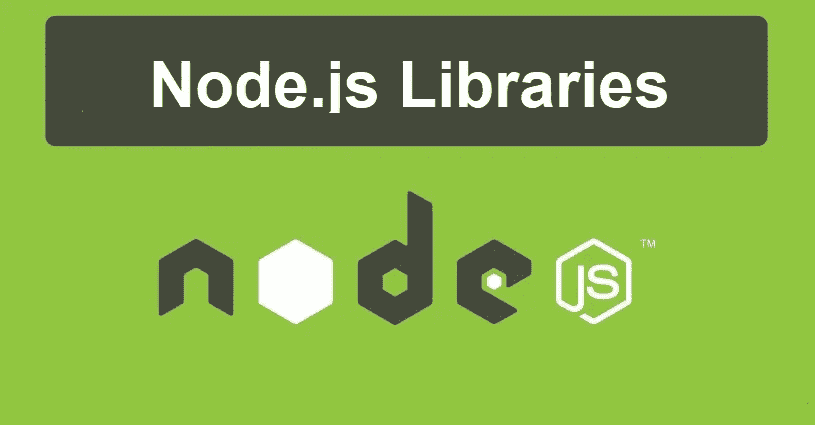

# 8 个非常方便的 Node.js 库来增强应用程序的功能

> 原文：<https://javascript.plainenglish.io/8-extremely-handy-node-js-libraries-to-enhance-app-functionality-fdece6b8d545?source=collection_archive---------9----------------------->

## 使用这些高效且资源丰富的 Node.js 库来提高您作为开发人员的技能。

Node.js 以其简单而活跃的结构而闻名，这使得应用程序开发成为一个简单而有趣的过程。Node.js 应用程序是高性能的，可以在单个进程中运行，也能够处理与单个服务器的多个连接。Node.js 由一个庞大的 JavaScript 库生态系统支持。对于 Node.js 开发人员来说，几乎不可能避免使用这样或那样的库来增强应用程序的整体功能。

通过正确应用这些库，开发人员可以节省大量的时间、精力和资源。但是正确的选择可能有点令人不知所措，因为 npm(节点包管理器)充满了高功能的管理器。

本文旨在通过引用八个最方便的 Node.js 库来缓解这一困境，这些库也可以证明是高效和资源丰富的。这些库还帮助 Node.js 开发人员扩展和完善他们的开发技能。让我们来看看它们。

## 面向开发人员的顶级 Node.js 库

**1。洛达什**

Lodash 将自己定义为“一个现代的 JavaScript 实用程序库”,提供模块化和高性能。它是使用最广泛的 Node.js 库之一，在处理数字、对象、数组和字符串等常见编程函数方面非常出色。

它受下划线. js 库的启发，由内置函数组成，使编码更好、更干净、更快。有了 Lodash，就不需要重复编写一个通用函数了。事实证明，其模块化方法在以下方面非常有效:

*   简化常见的数学运算和其他任务，如绑定、约束和节流。
*   编写和维护简洁的 JavaScript 代码。
*   创建、排序和压缩数组。
*   简化字符串函数，如 camel case 和 trimming。

**2。快递**

Express 是最通用的 Node.js 库。它无可争议地受到开发者的喜爱，因为它有无数的 HTTP 实用方法以及大量的函数和中间件。这些方法用于在短时间内创建健壮、可靠的 API。这种快速而简单的 web 框架也在构建 web 和移动的混合应用程序中得到了广泛应用。

Express 包含一个视图系统，支持超过 14 个模板引擎。它的其他有用功能包括:

*   良好的路由和极好的测试覆盖率。
*   动态 HTML 页面呈现。
*   基于节点的快速应用程序开发。
*   内容否定和可执行的更快的应用程序和 API 开发。

**3。Axios**

Axios 是一个简单易用的基于 promise 的 HTTP 客户端，适用于 Node.js 和浏览器。它提供了针对 XSRF 和 JS ES6 原生 Promise API 的客户端支持。Axios 本质上是同构的，这意味着相同的代码库可以在 Node.js 和浏览器中运行。HTTP 请求是从 Node.js 发出的，而 XMLHttpRequests 是从浏览器发出的。

这个 JavaScript 库用于拦截和转换请求和响应数据。下面列出了这个库的一些其他吸引人的特性。

*   它有内置的下载进度支持。
*   它允许取消请求和请求超时。
*   它执行 JSON 数据的自动转换。
*   它提供了广泛的浏览器支持。

**4。异步**

Async 是一个实用模块，是处理异步 JavaScript 操作的通用解决方案。它包含强大的函数，广泛用于 Node.js 来管理复杂的依赖关系。有了异步函数，开发人员可以用更简洁的方式编写异步行为。它还支持文本字符串和异步函数，并有助于避免内存泄漏。

**5。Dotenv**

Dotenv 是另一个有用的零依赖性模块，在 Node.js 中广泛用于设置环境变量和确保 API 密钥的安全性。通过使用 Dotenv，环境变量从。然后可以在代码中直接使用 process.env 来使用任何提供的变量。在 Dotenv 中，开发人员还可以基于 12 因素 App 方法将配置存储在与代码分离的环境中。

**6。Socket.io**

Socket.io 是另一个流行的 JavaScript 库，它允许服务器和客户端之间的双向实时通信。它由两组库组成——一个在浏览器中运行的客户端和一个在 Node.js 上运行的服务器端。凭借其简单而方便的 API，Socket.io 适合与任何平台和浏览器一起工作。

它非常足智多谋，并提供实时分析等生产工具来处理日志和图表、文档协作和即时消息。该库的一些其他显著特性包括断开检测、二进制流、自动重新连接支持和多路复用。它的一些主要用户是微软 Office 和 Zendesk。

**7。护照**

Passport 是一个简单且高度灵活的身份验证中间件，用于 Node.js。正如其官方网站所声明的那样，这种模块化中间件可以“不引人注目地”放入任何基于 Express 的 web 应用程序中。其最显著的特点是，它让用户可以选择以 300 多种方式验证应用程序，包括通过谷歌、脸书、Twitter 登录，甚至用户名和密码模式。

使用它的主要目的是验证请求，为此，Passport 使用一组可扩展的插件，称为策略。目前，它拥有近 537 项战略。它的其他显著特征包括:

*   实施定制策略。
*   应用程序中没有安装路线。
*   支持持久会话和动态范围和权限。
*   轻松处理成功和失败。

**8。因果报应**

一个高效实用的测试环境对任何开发人员来说都是一个福音。也许这就是为什么 Karma 是 Node.js 开发人员非常喜欢的库的原因。它是可靠的，稳定的，并充满了壮观的特点。Karma 最好的部分是它不会用繁重的配置设置来麻烦开发人员。

开发人员可以简单地编写代码并获得即时反馈。下面列出了它的一些显著特征:

*   能够用 Jasmine 和 Mocha 描述测试(开发人员也可以为他们喜欢的框架编写一个简单的适配器)。
*   在真实的浏览器和真实的设备上进行测试，比如智能手机和平板电脑(甚至在一个无头的 PhantomJS 实例上)。
*   从 IDE 或命令控制整个测试工作流程的能力。
*   从 IDE 或 Google Chrome 轻松调试。
*   与 Semaphore 和 Jenkins 简单而持续的集成。

**带走**

说到功能性和有效性的 Node.js 库，还有其他几个名字需要提及，比如 Mocha。JS、PM2、Moment 和 Nodemailer。但是这八个从人群中脱颖而出，因为它们有用的功能和特性提高了应用程序的生产力。但是如果你仍然处于困境，寻求一些专业的帮助不会有坏处。

您可以与经验丰富的 Node.js 开发机构合作，在那里您可以通过方便的参与模式获得 [Node.js 开发人员。](https://www.hiddenbrains.com/hire-node-js-developers-consultants-expert.html)

*更多内容请看*[***plain English . io***](https://plainenglish.io/)*。报名参加我们的* [***免费周报***](http://newsletter.plainenglish.io/) *。关注我们关于*[***Twitter***](https://twitter.com/inPlainEngHQ)*和*[***LinkedIn***](https://www.linkedin.com/company/inplainenglish/)*。加入我们的* [***社区不和谐***](https://discord.gg/GtDtUAvyhW) *。*