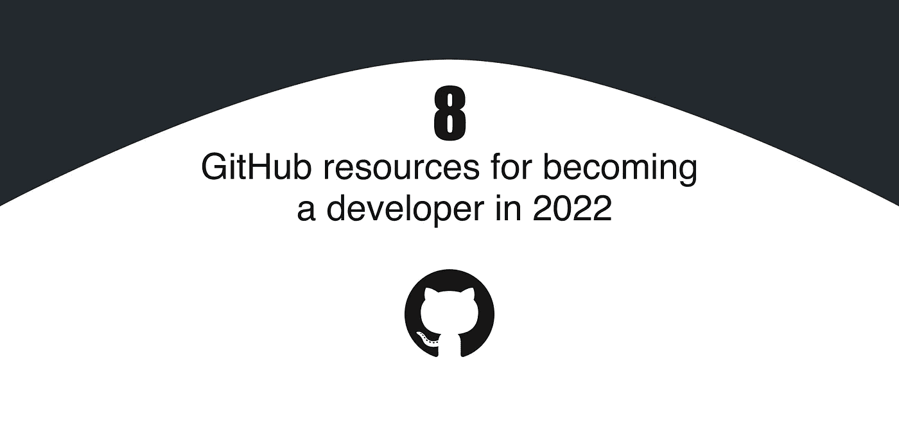
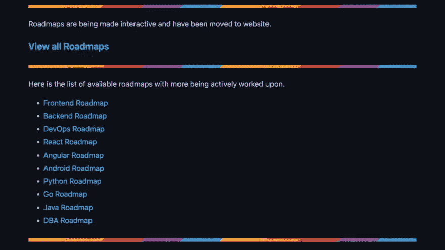
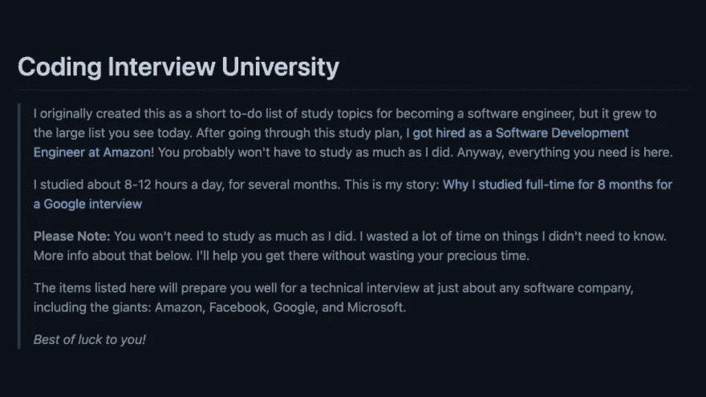
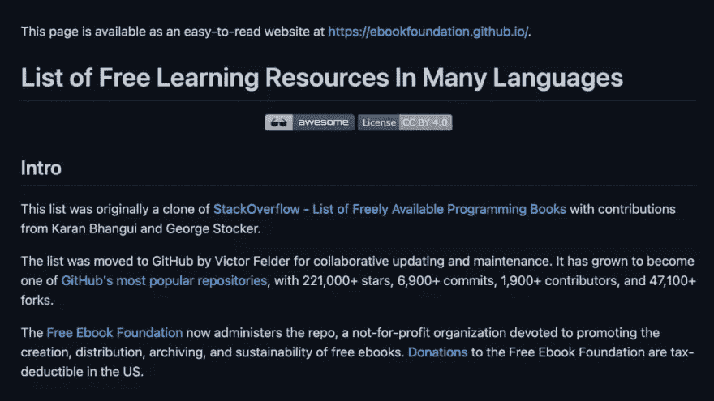
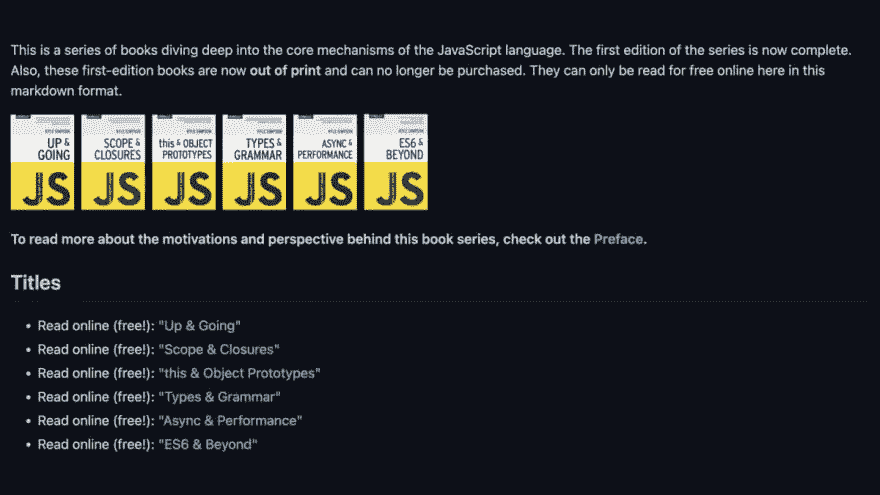
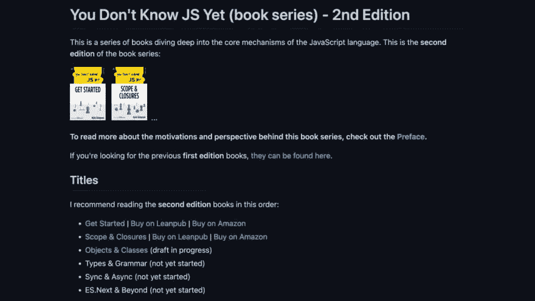
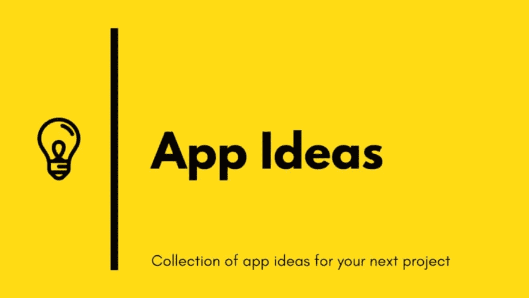
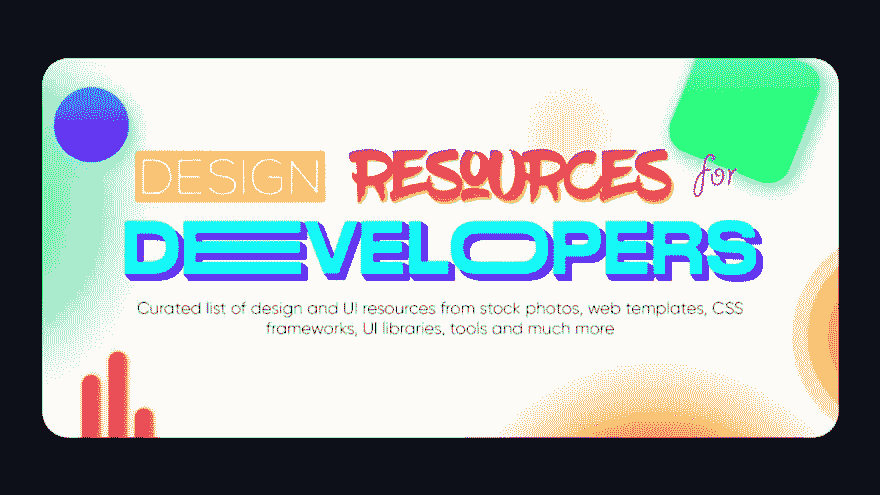
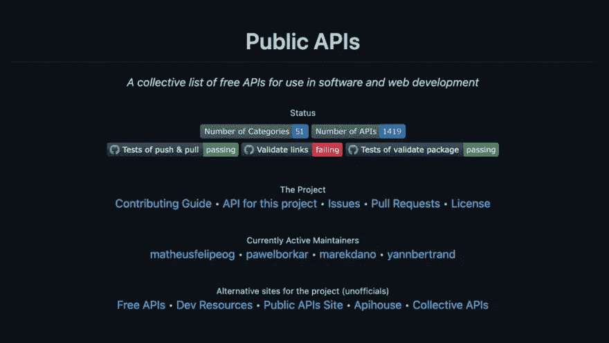

# 2022 年成为开发者的 8 个 GitHub 资源

> 原文：<https://javascript.plainenglish.io/8-github-resources-for-becoming-a-developer-in-2022-784d97cbc194?source=collection_archive---------5----------------------->

## 对初学者和已经熟悉编程的人都有用的资源列表。

对于初学者来说，学习如何成为一名开发人员可能是一个极其令人生畏的过程。我整理了一个资源列表，对初学者和已经熟悉编程的人都有用。

该列表包括:

*   路线图
*   学习计划
*   书
*   应用创意
*   设计资源
*   免费公共 API

GitHub 上有 8 个很棒的资源可以帮助你的编程之旅。

1)[2022 年成为开发者的路线图](https://github.com/kamranahmedse/developer-roadmap)

2) [完成计算机科学学习计划成为软件工程师](https://github.com/jwasham/coding-interview-university)

3) [免费提供的编程书籍](https://github.com/EbookFoundation/free-programming-books)

4) [你不知道的 JS(丛书)—第 1 版](https://github.com/getify/You-Dont-Know-JS/blob/1st-ed/README.md)

5) [你还不知道的 JS(丛书)—第 2 版](https://github.com/getify/You-Dont-Know-JS)

6) [可以用来提高你的编码技能的应用想法的集合](https://github.com/florinpop17/app-ideas)

7) [开发者设计资源](https://github.com/bradtraversy/design-resources-for-developers)

8) [免费 API 的集合列表](https://github.com/public-apis/public-apis)

现在你知道了。感谢您的阅读。

*更多内容请看*[***plain English . io***](https://plainenglish.io/)*。报名参加我们的* [***免费周报***](http://newsletter.plainenglish.io/) *。关注我们关于**[***推特***](https://twitter.com/inPlainEngHQ) *和*[***LinkedIn***](https://www.linkedin.com/company/inplainenglish/)*。加入我们的* [***社区***](https://discord.gg/GtDtUAvyhW) *。**