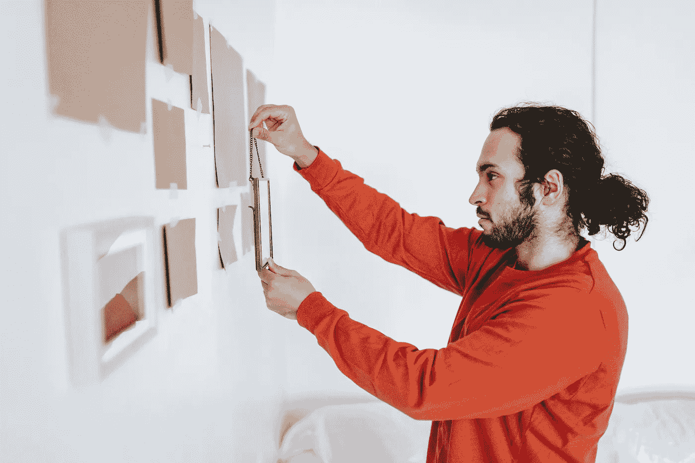

# 2022 年成为更好的开发者的 8 个习惯

> 原文：<https://javascript.plainenglish.io/8-habits-to-become-a-better-web-developer-in-2022-9da49403b5a6?source=collection_archive---------20----------------------->

## 第一——愿意适应

Captured by [Blue Bird](https://www.pexels.com/sk-sk/@blue-bird?utm_content=attributionCopyText&utm_medium=referral&utm_source=pexels) on [Pexels](https://www.pexels.com/sk-sk/fotka/miestnost-izba-pohlad-tvorivost-7218099/?utm_content=attributionCopyText&utm_medium=referral&utm_source=pexels)

几周前，我们告别了美好的 2021 年。

通常在新年伊始，是时候制定新年计划了。

大多数人选择一条安全的道路，去寻找古老的常青树。

***我会开始去健身房，我会戒烟，我会吃健康的食物！***

但是在这些人里面，存在着一小群完全不同的个体。

他们不在乎自己的健康，也不在乎自己的长相。他们只是想在他们的手艺上变得更好、更快、更有成效。

如果你想知道这群“秘密”的人是什么，**他们被称为开发者。**说实话，我就是其中之一！

GIF by [Giphy](https://giphy.com/gifs/microsoft-party-time-bill-gates-l3q2zbskZp2j8wniE)

如果你正在读这篇文章，很可能你也在读。你也想提高你的手艺。

好吧，你很幸运，因为 5 分钟后，你就会知道该怎么做了。如果你想在 2022 年**成为一名更好的开发者，你就会知道该采用什么习惯。**

所以不要浪费你的时间在我的“试着变得有趣”的独白上，让我们从第一个习惯开始。

# 愿意去适应

这篇文章将包含许多提示和技巧。但是在我们深入研究所有这些之前，有一件事你需要做——一个你需要改变的视角。

有人会把它描述为所有习惯中最重要的习惯。

如果你的视角没有这种改变，你将无法进步。但更重要的是，你将无法成长。

**是适应的能力，**如果你不愿意这样做，你还不如停止阅读这篇文章。

说真的，你的时间可以花得更好，比如在论坛上写为什么 jQuery 在 2022 年仍然是一个有效的选择。

另一方面，如果你对你的职业是认真的，如果你真的想成为一名更好的开发人员，你需要接受一件事——时代在变，我们也应该变。

正如《黑客帝国》中我最喜欢的角色会说的:*“解放你的思想！”。*

GIF by [Giphy](https://media.giphy.com/media/l2JhLHjBOER076Njy/giphy.gif)

几年前解决问题的好办法，现在可能不再适用了。

科技行业的发展速度比两个青少年之间的爱情还要快。

这给我们留下了两个选择。

我们可以适应并学习新的做事方式，或者我们可以憎恨一切全新的事物。**选择权完全在你！**

# 保持有条理

学起来很难，不断被打扰真的很难提高。

我们的思想和注意力在日常生活中不断受到干扰。扰动以各种形状和形式出现。

当你想学习的时候，可能是你妈妈在用吸尘器打扫。你编程的时候，你的邻居在吹风笛。或者是一只讨厌的苍蝇，不知何故是看不见的，但你仍然可以听到它在你周围飞。

这还没完呢！我们的注意力不断受到挑战。

GIF by [Giphy](https://media.giphy.com/media/Mt0IKnQaKdSTu/giphy.gif)

恼人的广告弹出，多任务处理，不断切换多个窗口，在你的工作场所，你的手机垃圾。

我提到的每一件事都会耗尽我们的注意力，直到什么都没有了，你需要睡觉了。

那么我们能做些什么呢？

**让我们的注意力分散到最低限度。专注于手头的任务。**

我不是说你应该对你的母亲或邻居大喊大叫。我的意思是把你控制下的事情组织起来。

打扫你的房间，整理你的工作空间，关闭那些打开的标签页(就像你有一天会再次打开它们一样)。

相信我，你会发现你的生产力和整体工作质量都有了很大的提高。

# 关注你自己

正如我前面已经说过的，技术产业正在快速向前发展。

每天都在开发新的框架。正如你可能猜到的，创作者希望我们使用它们。最重要的是，他们鼓励有影响力的人传播他们的产品。

他使用全新的框架，她使用令人敬畏的样式库。

让我们的注意力被闪亮崭新的东西吸引是非常容易的，但这不是你一年到头都应该做的事情。

Gif by [Giphy](https://media.giphy.com/media/12UUnm0znMSmyY/giphy.gif)

**让我问你一个问题！**

如果你花了一整年的时间研究新事物，并把它们与你当前的解决方案进行比较，你怎么能期望真正完成一些事情呢？

当然，你应该花些时间探索新事物，看看这项技术能提供什么。但是，这是否意味着，仅仅因为有人告诉你，你就应该把你的整个代码库都换掉呢？

答案是否定的！

你应该总是使用你觉得舒服的技术。最重要的是，你喜欢一起工作。

最后，如果你开始考虑换工作，一定要做好自己的尽职调查。不要只相信别人的话。

# 提前计划

无论你是独自工作，还是小团队或大组织的一员。

你应该总是有一个目标，你应该总是有一个如何实现它的计划。

船有它的航线，飞机有最终的目的地，每一件事物都朝着某个特定的方向发展。某些“东西”总是被严格定义的。

如果你没有明确的目标，你到底在做什么，你到底在朝着什么方向前进？

GIF by [Giphy](https://media.giphy.com/media/NiBMdMizycNCE/giphy.gif)

一个好的项目计划和相应的时间表会让你对你要做的事情有一个很好的了解。以及你将如何实现它。

你会知道你在哪里。你会知道你需要做什么。但最重要的是，为了到达终点，你会知道下一步该做什么(希望你不会像上图中的女士一样)。

如果你想成为一个优秀的开发盗版者，你应该始终有一个明确的目标。并告诉你如何去实现它。

总是有一个项目目标、项目里程碑和项目时间表。

# 庆祝小胜利

如果你注意了最后一条建议，你应该知道如何计划一个项目。

如果你没有，让我快速回顾一下。最后一条建议是要有项目目标、项目里程碑和项目时间表。

**当你有了这些目标，当你实现了它们，是时候庆祝了！**

现在，这是否意味着你应该在每次完成一个新功能或修复令人讨厌的 bug 时举办一个 Project-X 派对？如果你觉得你有所成就，那当然可以。

GIF by [Giphy](https://media.giphy.com/media/OEWT7a9RWDgju/giphy.gif)

然而，我有不同的想法。我要说的是。

**你应该学会庆祝小小的胜利。你应该学会享受它们。**

所以如果你一个人工作，给自己拿瓶啤酒。如果你在团队中工作，一起去吃顿好的。

如果你不学会接受小胜利，如果你不学会在取得胜利时善待自己。你对工作的热情和意愿可能会慢慢消退。

# 学会休息

我知道有时候当你编码的时候，你会觉得自己是上帝。你相信没有什么能阻止你，你比服用类固醇的超人更强大。

但是让我告诉你一件事！正如《圣经》中提到的，甚至上帝在创造世界后也休息了。

那么到底是什么阻止了你呢？为什么你不能休息一下？

这个习惯对我来说非常重要，所以我引用了一句话来解释这篇文章。

> 如果你在做任何事情，你只能休息一下。

休息一下，给电池充电，没什么不好。事实上，小小的休息会带来更好的表现和生产力。这得到了大量研究的支持。

如果你的屁股开始感到有点抽筋，如果你只是无休止地盯着屏幕，认为它会以某种方式解决你面临的问题。你的眼睛开始肿了。这些都是你应该休息一下的迹象。

我知道很难放下未完成的工作，把注意力转移到别的事情上——我也经历过。但是为了避免精疲力尽，这样做真的很重要。

# 建立良好的关系

你可能是世界上最聪明的人，或者是世界上最好的开发者。但我认为有一件事更重要。

我认为你只有在你工作的环境中才是好的。我相信你的工作环境和人际关系会极大地影响你的表现。

我说的工作环境，不是指你的办公室有没有乒乓球桌或者咖啡机。

我在考虑恋爱关系。

GIF by [Giphy](https://media.giphy.com/media/US0y4X7FONHaM/giphy.gif)

我说的是和你的同事，也许是你的老板的关系。或者是和你客户的联系。

**如果你想成为一名成功的开发人员，并交付让他们满意的工作，你需要建立这些。**

你需要了解你的客户面临什么问题，他们面临什么行业。在那个特定的行业，你想解决什么问题？

多做一点将表明你真的关心你正在开发的产品的最终结果。这也会给你的同事带来很好的体验。

# 采取行动

我希望我在这里提到的一些建议对你有意义。

**我真的希望你能试一试。**

我真的相信这是在你的工艺上变得更好的第一步。然而，这不是最重要的。

最重要的是采纳这些建议并养成习惯。

动力是暂时的，但纪律是永久的。

GIF by [Giphy](https://giphy.com/clips/dexter-showtime-new-blood-dexter-xCVgdcUiZemR05G9bq)

我在这篇文章中提到了相当多的引文。我保证这将是最后一篇，也是这篇文章的结尾。

> 保持饥饿，保持愚蠢，永不满足！—史蒂夫·乔布斯

*更多内容看* [***说白了。报名参加我们的***](http://plainenglish.io/) **[***免费周报***](http://newsletter.plainenglish.io/) *。在我们的* [***社区不和谐***](https://discord.gg/GtDtUAvyhW) *获得独家获取写作机会和建议。***