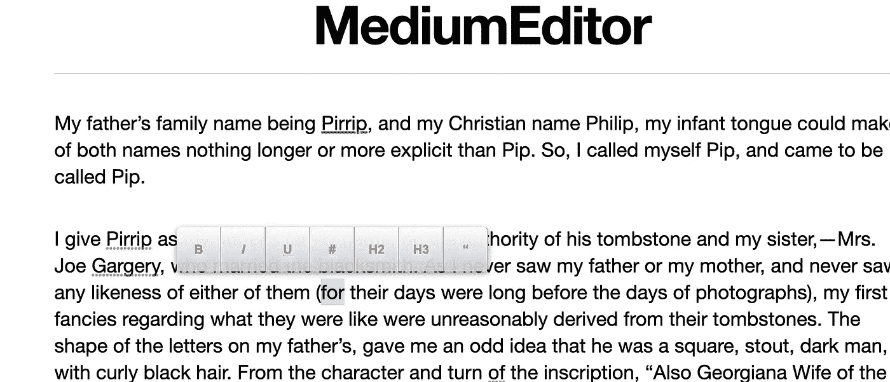
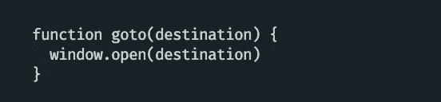

# 从头开始构建的 8 个 JavaScript 库，从中可以学到很多东西

> 原文：<https://javascript.plainenglish.io/8-javascript-libraries-built-from-scratch-2ed0429369bb?source=collection_archive---------6----------------------->

*Photo by Lorenzo Herrera on Unsplash*

作为 JavaScript 开发人员，当我们开始变得更好的旅程时，我们可以养成收集大量资源的习惯，因为这感觉是最有成效的事情。毕竟，掌握所有信息总比什么都没有好。

这些资源包括电子书、文章、在我们的浏览器上标记大量的网站，这样我们可以“稍后阅读”、视频，甚至付费视频课程。

虽然这些都是快速学习并成为你想成为的那样优秀的好方法，但它们也可能变得令人不知所措。

在这篇文章中，我们将列出 8 个从零开始构建的 JavaScript 库。

我们并不是说“这些库做得很好”或者“这是你应该学习的方式”或者“没有依赖的库更好”。我们共享这个列表*，因为他们没有依赖关系*。我不喜欢使用用不良实践编写的普通 JS 实现的库，而不是导入多个更高效、更小的依赖项的 JavaScript 库。然而，一个优点是，如果没有一个文件在其代码中的任何地方导入第三方包，您不需要点击比您正在查看的文件更远的地方。

# 小吃店

这个列表中的第一个库是 [snabbdom](https://github.com/snabbdom/snabbdom) ，一个专注于简单性和性能的模块化虚拟 dom 库。这个库没有依赖性，而且非常小[，只有 12.7kb](https://bundlephobia.com/package/snabbdom) 。

如果你想知道虚拟 DOM 到底是什么，它是由 facebook 的 [React](https://reactjs.org/) 库推广的一个编程概念，在这个库中，你对保存在内存中的“虚拟”(或占位符)DOM 进行操作。DOM 的虚拟表示与真实的 DOM 同步。这是构建 web 应用程序的一种性能更高、更现代的方法，因为每次直接操作 DOM 节点时，成本会很快变得很高。

浏览这个存储库很容易阅读和理解(如其描述中所述)。Snabbdom 是一个很好的学习工具。它证明了代码的简单性是强大的。它展示了模块化和可扩展性。它使我们能够思考生命周期的概念，以及如何通过它的 before/after 挂钩来管理内存清理和分配。

当我们是编程新手时，通常认为代码模块是巨大的代码块，可以做神奇的事情。如果影响到我们作为开发者的信心，这就会成为一个问题。这个库揭示了这样一个事实:模块只是“可插拔的”、可重用的部分，并且可以是任何大小的*，只要它们遵循这个原则。*

*例如，您可以编写自己的模块，只使用这些代码行来扩展这个库，只要它符合它们的接口:*

*模块只是扩展一些功能的*可重用部分*。*

*在下面的例子中，它用日志记录扩展了它们的`patch`功能(以及它们的默认模块`attributesModule`和`classModule`):*

# *媒体编辑*

*有没有想过文本编辑器是如何构建的？几年前，我通过 facebook 的 [DraftJS](https://draftjs.org/) 库第一次亲身体验了从零开始开发文本编辑器。没过多久我就意识到，文本编辑器可以很快变得*真的*复杂。*

*当我们考虑如何从头开始开发一个文本编辑器时，有很多神秘之处。*

*[medium-editor](https://github.com/yabwe/medium-editor) 是一个 JavaScript 库，它镜像了 [medium](https://medium.com) inline editor 工具栏。*

*它实现了按钮和功能，使文本编辑器的主要概念变得生动起来。*

*它提供了这样一个 api:*

*仅仅通过使用这个库就可以构建的一个例子可以让你在*基础层次*得到这样的东西:*

**

# *代码块编写器*

*[code-block-writer](https://github.com/dsherret/code-block-writer) 是一个小型的 JavaScript 库，帮助开发人员使用助手函数编写代码。*

*它简单明了:*

**

*对于那些想要熟悉设计模式(如 Builder 设计模式)的人来说，这可能是一个好方法，Builder 设计模式旨在通过提供流畅的界面来降低构造对象的复杂性。我认为这是它成功的一个很好的例子。*

# *提前*

*像 snabbdom 一样， [preact](https://github.com/preactjs/preact) 是另一个 JavaScript 库，它在真实 dom 之上提供了一个虚拟 DOM 的抽象，没有依赖性。*

*使用 preact 感觉就像在 react 代码中使用 JSX 一样。*

*下面是一个来自他们的[组件页面](https://preactjs.com/guide/v10/components)的实例:*

# *反应-彩色*

*是一个定制颜色选择器 react 组件的准系统实现。*

*这是许多很好的库之一，演示了从无到有的构建(除了导入 react)。*

*这是少数几个我会推荐给开发者的库之一，他们正在寻找构建自己的定制可重用 react 组件的灵感。*

# *传感器-js*

*[transducers-js](https://github.com/cognitect-labs/transducers-js) ，由 [Cognitect](http://cognitect.com/) 开发，是一个普通的 JavaScript 库，实现了作为其核心的[传感器协议](https://github.com/cognitect-labs/transducers-js#transformer-protocol)。*

*转换器是可组合的、高效的数据转换函数，不会创建中间集合。这是一个很好的代码框架示例，它将一个概念转化为各种可行的工具，以多种方式应用这个概念。*

*把它想象成迭代一个数组，其中有一个“for of”循环。我们可以采用不同的方法(比如说“forEach”)以不同的方式应用相同的概念。*

# *ram BDA/lodash/下划线/不可变-js*

*[rambda](https://github.com/selfrefactor/rambda) 、 [lodash](https://lodash.com/) 、[下划线](https://github.com/jashkenas/underscore)和[不可变-js](https://github.com/immutable-js/immutable-js) 构建时没有依赖关系，这为开发前端和后端应用程序提供了许多有用的实用程序。*

*你会注意到每一个都是非常相似的结构。*

*这是一个很好的资源组合，可以很好地掌握作为实用工具的模块化 JavaScript 库。*

# *js-金融-工具*

*[js-financial-tools](https://github.com/DiracKeeko/js-financial-tools) 封装了一些数学工具，以产生更适合金融用途的函数。没有依赖性，是模块化构建的。*

**更多内容请看*[***plain English . io***](https://plainenglish.io/)*。报名参加我们的* [***免费周报***](http://newsletter.plainenglish.io/) *。关注我们关于*[***Twitter***](https://twitter.com/inPlainEngHQ)*和*[***LinkedIn***](https://www.linkedin.com/company/inplainenglish/)*。加入我们的* [***社区不和谐***](https://discord.gg/GtDtUAvyhW) *。**