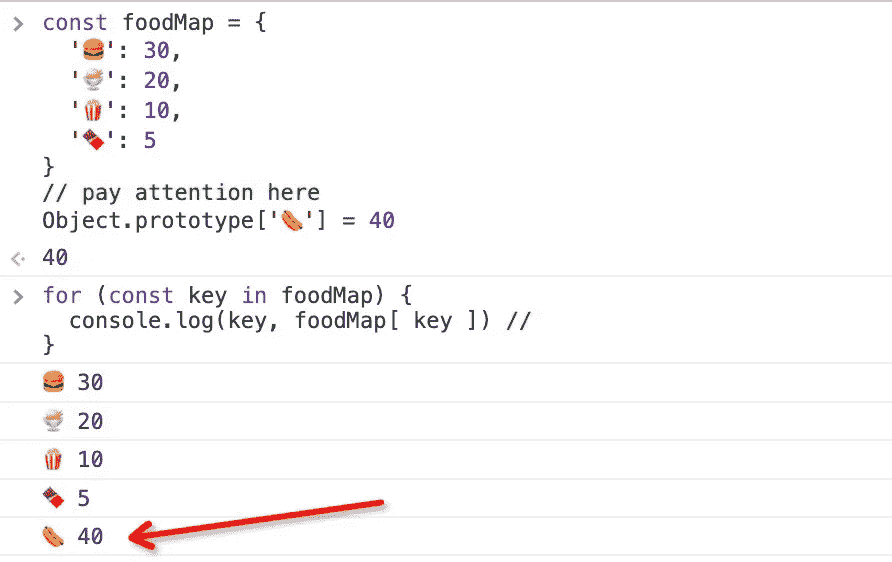

# 让你成为更好的程序员的 8 个 JavaScript 技巧

> 原文：<https://javascript.plainenglish.io/8-javascript-tricks-to-make-you-a-better-programmer-948b5a3c35b4?source=collection_archive---------0----------------------->

## 使用这些代码提示，让您的 JavaScript 更具可读性和可扩展性。

# 前言

优化我们的 JavaScript 代码有很多方法，本文总结了我在工作中经常使用的 **8 个 JavaScript 窍门**，希望也能帮到你。

# 1.减少如果…否则面条代码

写两个以上`if ... else`的时候要思考是否有更好的优化方式。例如，我们需要根据汉堡的名称来计算它的价格。你可能会这么做。

这样写会有很多条件判断语句，当我们要添加新的食物时，需要在函数中添加一个`if...else`语句。哦，那太痛苦了。

**更好的方法**

这是一个非常经典的优化，我们可以用一张地图来保存所有的食物。

# 2.用`filter" and "map”`代替`for”`循环

现在，如果让你找出属于第一组的食物，你会怎么找？

**这里是数据**

经常使用上述方法。显然，替换`filter`和`map`不仅可以简化代码，还可以使语义更加清晰。

# 3.使用析构交换两个值

现在我吃汉堡，你吃巧克力。我们是好朋友，想交换食物。我们平时是怎么做的？

**更好的方法**

我们可以使用数组析构赋值来简化食物交换。

# 4.智能对象.条目

如果你想知道仓库里食物的名称和价格，你该怎么做？

**一般方式**

使用`for in`迭代 foodMap，但是🌭也是打印出来的，这是我们不想看到的。

**更好的方法**

使用`Object.entries`至少有两个好处:

1.  仅打印对象的属性，忽略原型的属性。
2.  直接获取对象的值，而不是用`obj[key]`读取。

# 5.展平阵列的简单方法

这里有些乱七八糟的食物，我们怎么能把它们放在一个篮子里？如果`[]`是一个篮子。

**第一种方式**

**第二种方式**

你有更短的方法来达到这个目的吗？可以，我们可以用`[].flat`，更简单更智能的方式。

使用`Infinity`意味着我们不关心食物嵌套了多少层。

# 6.舍入技巧

哇，万圣节到了，为了庆祝这个节日，所有的食物都打折了，小数都被抹掉了。

我们可以用`Math.floor`，但是有更简单的方法吗？`~~`算子怎么样？

# 7.使用`reduce`计算总和

现在一个顾客买了很多东西。我需要知道他应该付多少钱。

**也许你会这样做:**

**更好的方法**

像上面这样写可以达到目的，但是代码量还是太多，我们有更简单的方法。

# 8.使用 console.table 而不是 console.log

我们经常用`console.log`打印一些信息，但有时候并不是那么直观。

`Let's try console.table`

👏🏻它看起来像一张桌子，简单明了。

# 最后

我们期待您的额外 JavaScript 代码提示，**感谢您的阅读。**

*更多内容请看**[***说白了. io***](https://plainenglish.io/) *。报名参加我们的* [***免费每周简讯***](http://newsletter.plainenglish.io/) *。关注我们*[***Twitter***](https://twitter.com/inPlainEngHQ)*和*[***LinkedIn***](https://www.linkedin.com/company/inplainenglish/)*。加入我们的**[***社区不和谐***](https://discord.gg/GtDtUAvyhW) *。***