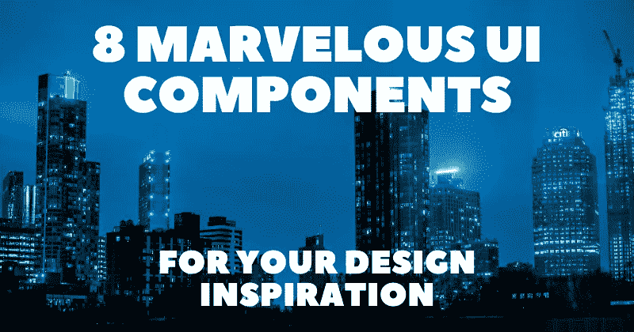

# 8 个非凡的用户界面组件激发你的设计灵感🎨😍

> 原文：<https://javascript.plainenglish.io/8-marvelous-ui-components-for-your-design-inspiration-b711ad2cc6f2?source=collection_archive---------6----------------------->

现代 web 开发是基于组件的。想出一个引人注目的设计可能很有挑战性，尤其是如果你是一个经验不足的 web 开发人员。

在本文中，我编译了一些我最喜欢的组件，您可以用它们来启发自己的项目。为了提供多样性，我包含了从按钮、栏和菜单到卡片、日历和神经形态元素的项目。

对于每个组件，我将包括代码的直接链接，嵌入式交互式预览，以及作者链接，这样您也可以检查他们的其他工作。

## 1.[异形元素](https://codepen.io/myacode/pen/PoqQQNM)

作者:[玛利亚·穆尼奥斯](https://codepen.io/myacode)

## 2.[动画标签栏](https://codepen.io/abxlfazl/pen/VwKzaEm)

作者: [abxlfazl khxrshidi](https://codepen.io/abxlfazl)

## 3.[覆盖菜单](https://codepen.io/ig_design/pen/VgaXaY)

作者:[伊万·格罗兹迪奇](https://codepen.io/ig_design)

## 4.[登录/注册](https://codepen.io/ig_design/pen/KKVQpVP)

作者:[伊万·格罗兹迪奇](https://codepen.io/ig_design)

## 5.[博客卡片滑块](https://codepen.io/JavaScriptJunkie/pen/WgRBxw)

作者:[穆罕默德·艾尔丹姆](https://codepen.io/JavaScriptJunkie)

## 6.[定价卡](https://codepen.io/ig_design/pen/VwedgWj)

作者:[伊万·格罗兹迪奇](https://codepen.io/ig_design)

## 7. [CSS 网格日历](https://codepen.io/knyttneve/pen/QVqyNg)

作者:[梅尔特·库库伦](https://codepen.io/knyttneve)

## 8.[发光按钮](https://codepen.io/bhadupranjal/pen/vYLZYqQ)

作者: [Pranjal Bhadu](https://codepen.io/bhadupranjal)

写作一直是我的激情所在，帮助和激励他人给我带来了快乐。如果您有任何问题，请随时联系我们！

在 [Twitter](https://twitter.com/madzadev) 、 [LinkedIn](https://www.linkedin.com/in/madzadev/) 和 [GitHub](https://github.com/madzadev) 上给我接通！

访问我的[博客](https://madza.dev/blog)获取更多类似的文章。

*更多内容看* [***说白了。报名参加我们的***](https://plainenglish.io/) **[***免费周报***](http://newsletter.plainenglish.io/) *。关注我们关于*[***Twitter***](https://twitter.com/inPlainEngHQ)*和*[***LinkedIn***](https://www.linkedin.com/company/inplainenglish/)*。查看我们的* [***社区不和谐***](https://discord.gg/GtDtUAvyhW) *加入我们的* [***人才集体***](https://inplainenglish.pallet.com/talent/welcome) *。***