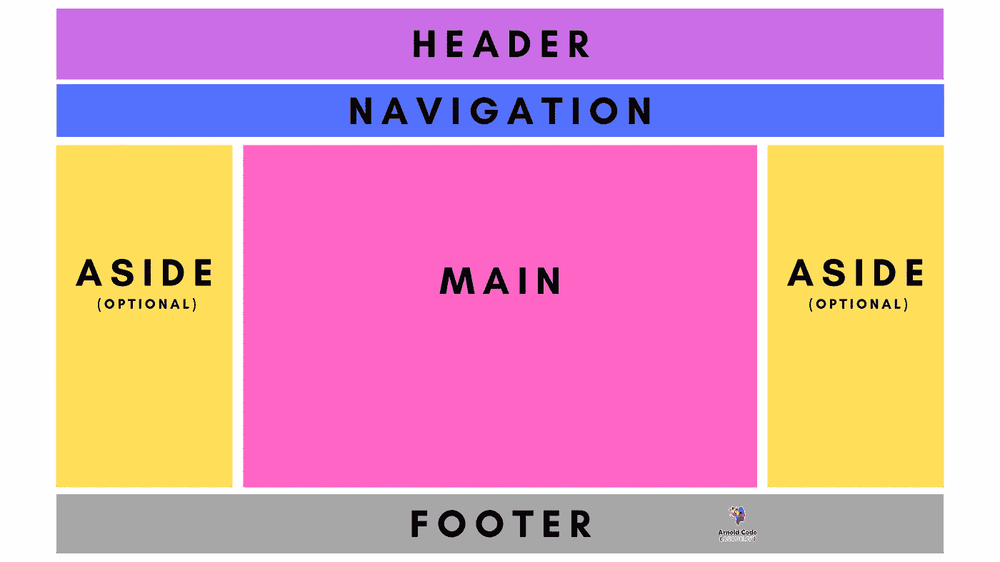
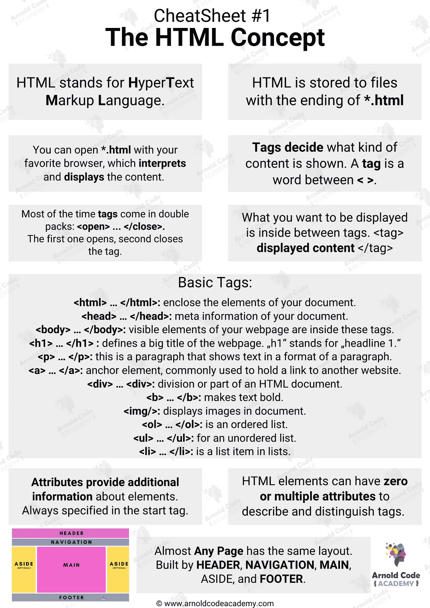

# 让你在求职面试中扭转局面的 8 个难忘的 HTML 秘密

> 原文：<https://javascript.plainenglish.io/8-memorable-html-secrets-that-let-you-turn-tables-at-your-job-interview-f405743e2c0e?source=collection_archive---------14----------------------->

## 包括**备忘单**与您分享重要知识

Image Made By Canva.com And The Author

HTML 有很多秘密，但是如何利用这些秘密获得初级 web 开发人员的工作呢？

这种语言有许多不常见的怪癖和特性。用精确的知识战胜你的面试官，获得真正专家的地位。即将到来的八个难忘的秘密会让你在申请过程中比竞争对手更有优势。

例如，您知道没有互联网连接也可以显示互联网吗？

# 1.你不需要连接到互联网

没有互联网连接的网络。

浏览器解释 HTML，JavaScript 在 V8 引擎中运行。你可以在本地打开你的 HTML 文件，甚至你的整个 JavaScript 应用程序都可以在你的浏览器中运行，而不需要任何互联网连接。想象一下，当你在求职面试中说出这个事实时，面试官会是什么表情。

你可以离线查看你的 HTML 元素，还有样式。

甚至整个 web 应用程序都可以在脱机状态下完全运行。

在你的面试中，尤其是在你作为初级开发人员的工作中，将这一事实作为一个优势。您可以在本地进行测试，并保存本地数据文件以跳过与服务器的通信。

# 2.没有 HTML 就不能运行 JavaScript

创建一个动态网站是用 JavaScript 完成的。

你必须实现

比面试官本身拥有更多的知识总是很优秀的，会给你带来了解自己领域的地位。

# 3.几乎所有网页都有这种布局

The Holy Grail Of Website Design

> 永远不要改变一支胜利的队伍。—比尔·蒂登

同样的规则也适用于网站布局。了解这一事实会让你在面试中受益匪浅。你已经知道网页布局的[圣杯](https://css-tricks.com/the-holy-grail-layout-with-css-grid/)看起来像什么，并能给公司带来实际价值。

你不应该重新发明轮子，坚持下去，你会做得很好。有些事情可能永远不会改变。

# 4.HTML 不是编程语言

**H**yper**T**ext**M**arkup**L**语言。

你看到了吗？[标记语言](https://en.wikipedia.org/wiki/Markup_language)，不是编程语言。您可以使用它来确定您的网页包含哪些元素，并粗略地指定结构。如果你知道一门语言是用来做什么的，你就能正确地使用它。您决定页面上的内容，而不是它的行为方式。

HTML 是用来决定一个段落、一个链接、一张图片等等是否应该出现在你的页面上。

# 5.每个有浏览器的设备都理解 HTML

甚至你的冰箱也能理解 HTML。

至少如果你有一个现代的。世界上任何浏览器都可以解释 HTML。它代表了互联网和你之间的可见实例。了解世界上一半人使用的技术会给人留下很好的印象。

你的第一步是了解一个网站是由什么组成的，然后你才能开始建立自己的网站，并以你的知识说服任何面试官。

# 6.每天只需要一些基本的标签

[抓住他们(神奇宝贝主题)](https://www.youtube.com/watch?v=rOIBqvlV1bU)

这是我童年时的一首好歌，但它的格言对 HTML 来说并不一样。你不需要研究所有的 [132 个可用标签](https://devpractical.com/how-many-html-tags/#:~:text=There%20are%20142%20and%20132,)%20and%20HTML.com%20respectively.)。大多数时候，你只需要几个标签。至于其他的电器，你可以在谷歌上搜索一下— *要查看最需要的，请到最后的备忘单部分*。

更重要的是听说过那些不常用的，这样你就知道何时何地去寻找。但是每天，你需要确定你需要记住的少数几个。

# 7.可以有多个标签

> 元素代表一个 HTML 文档的内容。一个文档中只能有一个`<body>`元素。— [MDN 网络文档](https://developer.mozilla.org/en-US/docs/Web/HTML/Element/body)

虽然它陈述了单例行为，但是你可以实现多个`<body>`标签。但是你不应该这么做。一些浏览器可能会因为多个 body 标签而遇到麻烦，并曲解你的文档。一个合适的 HTML 文档由以下标签组成:`<html>`、`<head>`和`<body>`。

如果你有一个合适的 HTML 文档和一个`<body>`标签，把你的内容放在里面，你就可以开始了。

# 8.使用属性来设置 HTML 元素的样式->不好的做法

HTML 带来了带有属性的内联样式。

不要用它们来设计我们的元素。这被认为是[不好的做法](http://seekoapp.io/61fd768ad492b9742453ba69),因为那些风格被明确地绑定到一个标签上。您必须将所有样式复制到另一个标签，以同样的方式对其进行样式化。最后，您或任何其他人都不能再正确地阅读 HTML 文档了——它变得很笨拙。

HTML 元素的样式是通过 CSS 实现的。所有其他选项都被认为是不好的做法。

# 额外收获:HTML 概念备忘单

[*拿到所有的 26 张小抄，只研究你真正需要的东西，以获得你的第一份网络开发工作！*](https://arnoldcodeacademy.ck.page/26-web-dev-cheat-sheets)

Arnold Code Academy 26 Web Developer Cheatsheets

*更多内容看* [***说白了。报名参加我们的***](http://plainenglish.io/) **[***免费周报***](http://newsletter.plainenglish.io/) *。在我们的* [***社区不和谐***](https://discord.gg/GtDtUAvyhW) *获得独家获取写作机会和建议。***