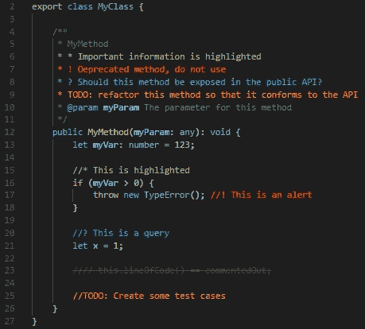
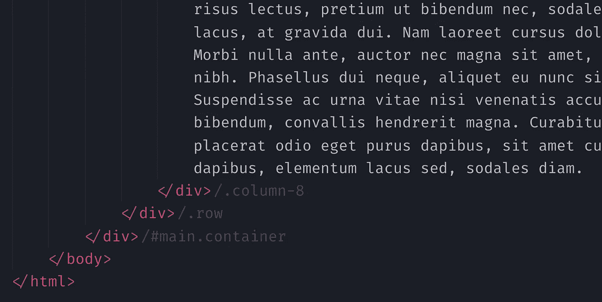

# 前端开发人员必备的 8 个 VS 代码扩展

> 原文：<https://javascript.plainenglish.io/8-must-have-vs-code-extensions-for-frontend-developers-30349ea169d8?source=collection_archive---------18----------------------->

## VS 代码扩展来提高您的生产力

VS Code

作为开发人员，您总是在寻找新的工具、技巧和扩展来提高您的工作效率。

时间管理是开发人员生活中非常重要的一部分。这就是我想出这个博客的原因。在这篇博客中，我将告诉你 8 个 VS 代码扩展，它们将至少提高你 10-20%的生产力。那么，让我们开始吧！

> 我还没有包括像 live server，beauty 或 live share 这样的扩展。因为这些是最常见的扩展。

# 1.波拉科德

What is Polacode and How to use it? Source: Visual Studio Marketplace.

你曾经使用过像 [Carbon](https://carbon.now.sh/) 这样的网站来设计你的代码片段吗？如果我告诉你不用离开 VS 代码也可以做同样的事情呢？那太好了，不是吗？

这节省了大量的时间和精力。最棒的是，就像 Carbon 一样，您也可以定制这些代码片段图像！

你可以在这里得到[波拉科德](https://marketplace.visualstudio.com/items?itemName=pnp.polacode)。

# 2.更好的评论

如果你和你的朋友合作，代码可读性的重要性会增加很多！顾名思义，这个扩展设计了你的评论，让它们更人性化，更有吸引力。你只需要放一个标签作为每行的第一个字符。比如:放“！”因为第一个字符会将你的评论设计为红色并显示警告。

默认情况下，这个扩展有 5 种风格，正如你在上面的图片中看到的。您还可以添加自己的样式，并编辑默认样式。

你可以在这里得到[更好的评论](https://marketplace.visualstudio.com/items?itemName=aaron-bond.better-comments)。

# 3.HTML 结束标记标签

HTML End Tag Labels

拥有太多的 div 标签有时可能会导致混乱。尤其是结束标签。因为对于开始标签，我们有一些标识符，比如类和 id，但是对于结束标签，我们什么都没有！

HTML 结束标签为这个问题提供了一个解决方案。顾名思义，这个扩展将类作为标签添加到每个结束标签的前面。

你可以在这里得到 HTML 结束标签。

# 4.CSS Peek

CSS Peek

你是否也讨厌切换到你的 CSS 文件来查看你在特定的类和 id 上应用了哪些属性？如果是，CSS peek 解决你的问题。它将您所有的类和 ID 转换成一个超链接，这个超链接会将您重定向到您对特定 ID/类进行样式化的部分。

如果你只是想看看为那个类/ID 写了什么，你基本上可以把鼠标悬停在那个类/ID 上，你会发现应用于它的每个属性。

你可以在这里得到 CSS Peek [。](https://marketplace.visualstudio.com/items?itemName=pranaygp.vscode-css-peek)

# 5.StackFinder

StackFinder Demo

我认为很少有开发者不使用 StackOverflow。这个 VS 代码扩展允许你直接从你的 VS 代码中提问。只要写下你的问题，它会给你看一些与之相关的问题。

它还允许您从答案中复制和粘贴代码，只需点击一下！如果你想在浏览器中打开它，它甚至会把你重定向到这个问题。

你可以在这里获得 CSS StackFinder [。](https://marketplace.visualstudio.com/items?itemName=mark-fobert.stackfinder)

# 6.Quokka.js

Quokka.js Sample

对于测试，我们经常需要 console.log 一个特定的变量，然后到控制台检查它是否正确。这个过程很无聊。这就是 Quokka.js 的用武之地。这是 VS 代码最省时的扩展之一。它帮助您在代码编辑器中查看 JavaScript 代码的结果。

你甚至没有你的 console.log 值/变量，正如你在上面的图片中看到的，它在声明变量的时候告诉你结果。省了很多时间和精力。

# 7.布洛普

Bloop Extension’s Demo

我个人最喜欢的一个来了！这个人工智能驱动的扩展通过官方文档和其他在线文档搜索一些最著名的 NPM 包的代码片段。它还有一个令人难以置信的特点！如果不确定要使用哪种方法，可以用它来搜索库和方法。

使用 Bloops 非常简单。当您工作时，它会自动继续搜索片段。要搜索方法，您可以使用扩展顶部的搜索栏。

你可以在这里得到 Bloop。

# 8.涡轮控制台日志

Turbo Console Log

Console.log()是 web 开发人员生活中非常重要的一部分。这就是我们在一个项目中多次使用它的原因。即使使用 VS Code Intellisense，花那么多时间编写 console.log()也是一件枯燥的工作。

涡轮控制台日志节省了时间。你只需要选择一个变量，然后按下`alt` + `ctrl` + `L`，然后嘣，工作完成了！这还不是结束，它有更多的功能，如自定义前缀，包装日志消息等。

你可以在这里找到这些特性并安装扩展。

# 结论

这个博客到此为止！嗯，我想继续这个博客，我甚至有更多的扩展！但问题是，如果我继续下去，这个博客会变得太长太无聊，这是我根本不想要的。但是不要担心，如果你想要更多的扩展，只需留下评论，我会写这个博客的第 2 部分。

像这样的文章，请关注我并评论这篇文章来启发我。

> 感谢阅读！编码快乐！

*更多内容请看*[***plain English . io***](http://plainenglish.io/)*。报名参加我们的* [***免费周报***](http://newsletter.plainenglish.io/) *。在我们的* [***社区***](https://discord.gg/GtDtUAvyhW) *获得独家获得写作机会和建议。*