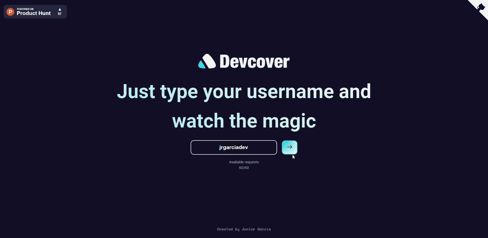
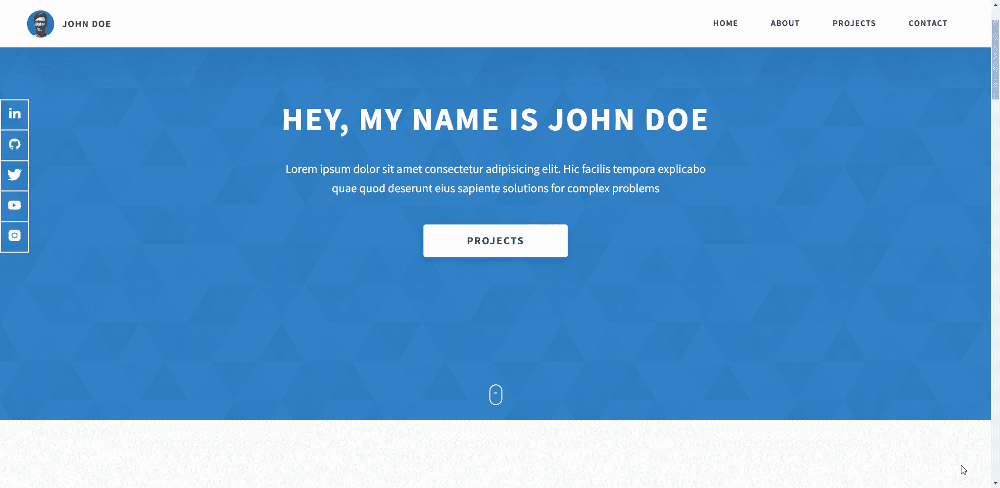
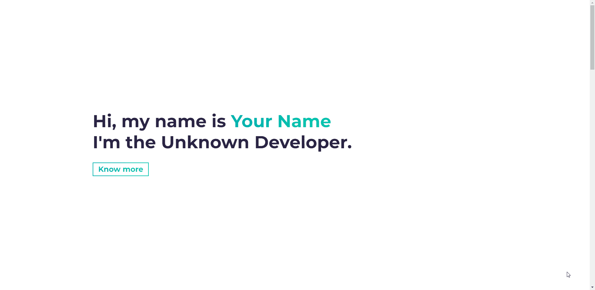
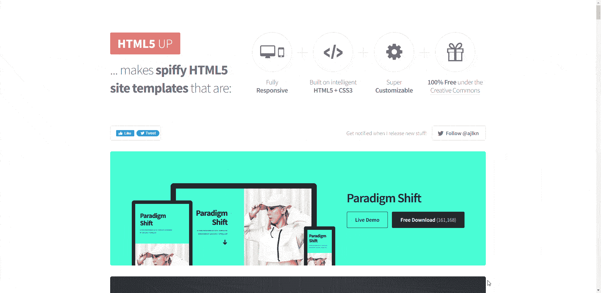
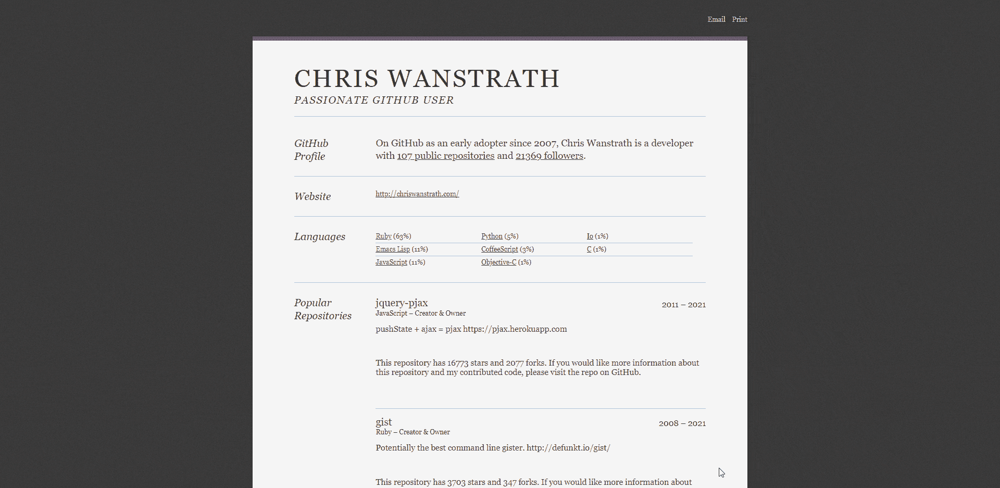
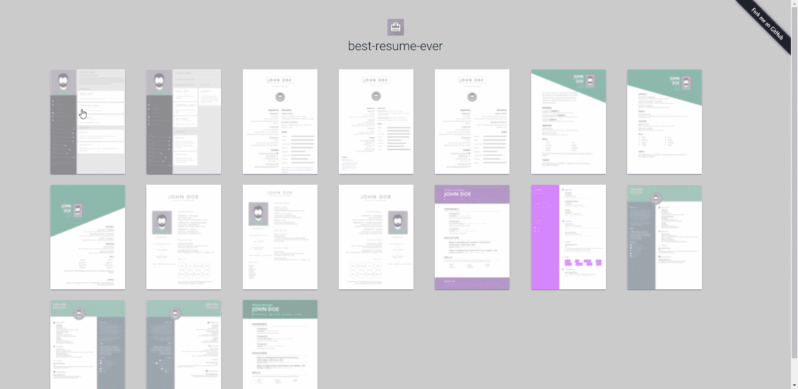
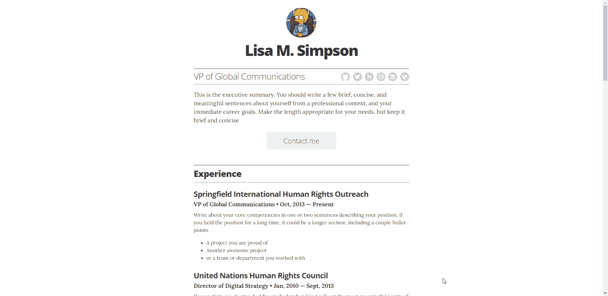
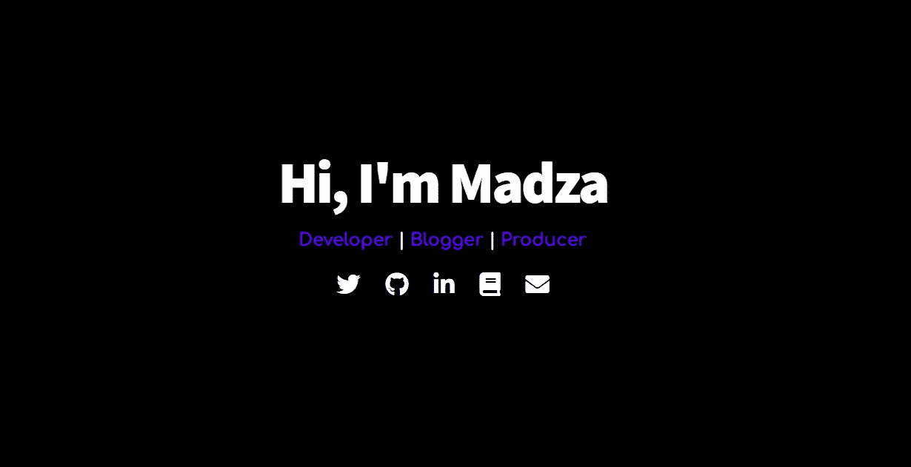

# 8 个以上的投资组合和简历模板来展示你的技能💼✨

> 原文：<https://javascript.plainenglish.io/8-portfolio-and-resume-templates-to-showcase-your-skills-8f8d8bf90af5?source=collection_archive---------13----------------------->

一份看起来很专业的作品集和一份写得很好的简历都是求职成功的关键。不幸的是，在我们快速发展的环境中，我们经常很忙，不想花很多时间来构建它们。

为了帮助你做到这一点，我用有用的免费工具编辑了一篇文章，在几分钟内创建你的专业在线形象。我将提供所有工具的描述、可视化预览和直接链接，因此您可以自己测试它们。

## 1. [DevCover](https://github.com/jrgarciadev/dev-cover)

这可能是创建开发人员投资组合的最简单的方法。您只需要提供您的 GitHub 和 Hashnode 用户名。只需点击一下就可以在 Vercel 上部署。

## 2.[多芬利奥](https://github.com/rammcodes/Dopefolio)

开发人员快速多页投资组合模板。易于设置，充分响应，优化搜索引擎优化，伟大的审计分数，和许多其他有用的功能。

## 3. [Simplefolio](https://github.com/cobidev/simplefolio)

开发人员的最小投资组合模板。现代用户界面设计+揭示动画，风格与 Bootstrap 4.3+自定义 SCSS，优化与包裹。

## 4.[HTML5up.net](https://html5up.net/)

可能是现代、时尚、高性能 HTML5 组合模板的最佳集合。高度可定制和响应，包括实时预览。

## 5.[Github-简历](https://github.com/resume/resume.github.com)

基于你的 GitHub 回复/活动创建简历的服务。创建一份简历只需要你的 GitHub 用户名。非常适合为精通技术的人提供概述。

## 6.[史上最佳简历](https://github.com/salomonelli/best-resume-ever)

通过克隆 repo 并编辑`data.yml`文件，创建一份看起来专业的简历。许多漂亮的模板可供选择。在`npm run export`前将简历导出为 pdf 格式。

## 7.[简历模板](https://github.com/jglovier/resume-template)

一个简单的 Jekyll + GitHub Pages 驱动的简历模板。在本地克隆它，并根据您的需要进行定制。对于内容，自定义`data`文件夹中的`.yml`文件，对于自定义选项，编辑根目录下的`_config.yml`。

## 8.[登陆页面](https://github.com/madzadev/landing-page)

不久前，我制作了一个作品集占位符模板，用来展示社交媒体链接。纯 HTML 和 CSS。设置就像克隆和打开`index.html`一样简单。

## ✨✨奖金资源公司

GitHub 上一些最好的开源组合的例子是由[塔尼亚·拉西亚](https://github.com/taniarascia/taniarascia.com)、[布里坦尼·蒋](https://github.com/bchiang7/v4)、[李·罗宾逊](https://github.com/leerob/leerob.io)和[苏米亚吉特·贝赫拉](https://github.com/soumyajit4419/Portfolio)创作的。研究这些回购协议，了解如何构建你的投资组合并编写干净的代码。

其他牛逼的简历生成器还有 [resume.io](https://resume.io) 、 [resumemaker.online](https://resumemaker.online) 和[standardresume.co](https://standardresume.co)。请注意，这些可能需要付费下载和定制。

一旦你创建了你的作品集和简历，是时候开始准备面试了。我收集了一份资源清单，对你也有帮助。

写作一直是我的激情所在，帮助和激励他人给我带来了快乐。如果您有任何问题，请随时联系我们！

如果这有所帮助，请在 [Twitter](https://twitter.com/madzadev) 、 [LinkedIn](https://www.linkedin.com/in/madzadev/) 和 [GitHub](https://github.com/madzadev) 上联系我！

访问我的[博客](https://madza.dev/blog)获取更多类似的文章。

*更多内容请看*[***plain English . io***](http://plainenglish.io/)*。报名参加我们的* [***免费每周简讯***](http://newsletter.plainenglish.io/) *。在我们的* [***社区【不和谐】***](https://discord.gg/GtDtUAvyhW) *获得独家获得写作机会和建议。*