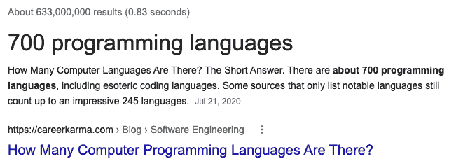

# 8 种编程语言将长期存在

> 原文：<https://javascript.plainenglish.io/8-programming-languages-that-are-here-to-stay-e110b71a7f1d?source=collection_archive---------10----------------------->

## 其他人随时可能消失。

据谷歌称，目前有 700 多种编程语言。考虑到我们只使用少数几种语言，或者至少可能没有一个程序员可以背诵所有 700 种语言，这是一个很大的数字。

因此，如果我要选择我想留下的编程语言，下面提到的将是我的首选:

# 1.JavaScript。

这是最受批评的语言之一，但如果你删除它，互联网就不再存在，或者处于如此退化的状态，以至于无法接受。

# 没有 C，就没有操作系统。

没有 Windows 或 Linux 的 PC、没有 OSX 的 Mac、没有 iOS 的 iPhone 或任何没有 Android 的智能手机都只能用作镇纸，许多小型电子设备的微控制器也是用 C 语言编程的，因为它们没有足够的内存来使用更高级的语言。所以 C 是第二种基本语言。

# **3。C++。**

唯一允许获得最大可能性能的高级语言。如果没有 C++，许多东西将不得不用 C 编程，但是生产力将会受到巨大的打击。但它可以与以下内容一起讨论:

# **4。Java**

如果我们放弃 C++，我们就离不开 Java。但是不管我们选择根除其中一个还是另一个，反正我们都是贵的。

# **5。SQL**

没有 SQL，就没有数据库。没有更多的网站或商业管理软件，等等。另一个不可或缺的东西是世界停止运转。仅举一个例子，我不动声色地忽略了 SQL 的所有变体，然而，它们彼此之间有很大的不同。

不幸的是，我们不能就此止步。否则，我们损失很大。我们已经不得不放弃 Java 或 C++，我们的情况很糟糕，所以如果我们不继续一点，我们就不会摆脱它。

# **6。汇编程序**

如果没有汇编语言，你就不能编写启动例程，这些例程必须使用高级语言无法访问的特定指令。如果我们移除汇编程序，我们就不能再启动任何计算机。所有的计算都消失了。所以我们保留汇编程序。

请注意，我把它算作一种语言，而实际上有几种。它与 PC 或智能手机上的汇编语言不同。如果分开算，我们已经超过五种语言了。

# **7。GLSL**

OpenGL 着色语言。图形卡的 GPU 编程语言。它是旧的和过时的，但是它是标准的。没有它，就没有视频游戏，没有复杂的图形界面，没有 CAD 软件。设计工业产品将变得几乎不可能。我们已经很久没有用纸和铅笔画汽车或飞机了。

# **8。Python**

即使这种语言被贬低，而且我们可以比 Java 或 C++更快地不用它，不命名它也是不负责任的。

我们在 8 点。但是也有其他我们没有想到的语言:HTML，CSS，XML，JSON 但是，嘿，如果我们接受纯粹主义者的批评，我会说它们是文件格式或协议，假设我们糟糕的信仰。

我们现在不得不思考，如果没有 C#、COBOL、FORTRAN、Haskel、VB、Lisp、Objective-C、Swift、Go、Rust、Ruby，这个世界还会剩下什么。很大一部分应用程序将不复存在，需要几十年的时间来取代它们。它承诺！

*更多内容请看*[***plain English . io***](http://plainenglish.io/)*。报名参加我们的* [***免费周报***](http://newsletter.plainenglish.io/) *。在我们的* [***社区***](https://discord.gg/GtDtUAvyhW) *获得独家获得写作机会和建议。*