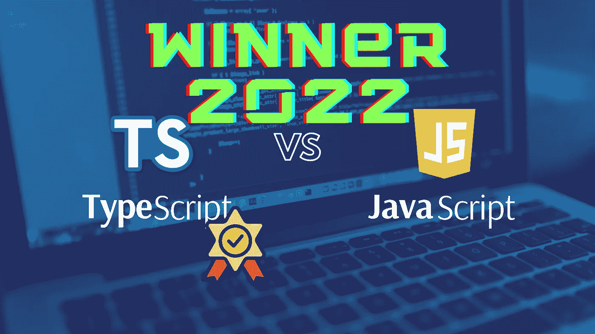

# 2022 年你应该选择 TypeScript 而不是 JavaScript 的 8 个理由

> 原文：<https://javascript.plainenglish.io/8-reasons-why-you-should-pick-typescript-over-javascript-in-2022-328ed97e9ba5?source=collection_archive---------7----------------------->

由于它的流行，TypeScript 已经成为开发大型应用程序的流行语言。

**TypeScript 是新的 JavaScript，对吗？** JavaScript 在前端和后端开发人员中的流行并不是最高效或最划算的解决方案。

TypeScript 越来越受欢迎，正在成为开发大型应用程序的首选语言

**你应该选择 JavaScript 而不是 TypeScript 的 8 个理由。**

# 1.TypeScript 具有更高的可靠性

用 TypeScript 编写的代码比 JavaScript 更具可重构性和可靠性。

你可以避免错误，更快地重写。当您编写新代码时，类型会使大多数可能潜入您的 JavaScript 代码库的愚蠢错误无效。

您的工作流程会产生一个快速反馈循环来修复所有不一致的地方。

# 2.静态类型意味着更健壮的代码

静态类型语言比动态类型语言更加健壮。

类型系统是通过以下方式增强应用程序的绝佳方式

*   改进缺陷检测和避免
*   类型可以用作代码内文档
*   类型化语言的 ide 和插件是大型重构的止痛药

# 3.你专注于规划你的系统

通过显式化类型，您可以将注意力集中在系统是如何构建的，以及系统的各个部分是如何相互交互的。

通过描述如何在代码中使用数据，类型可以在运行程序之前区分正确的程序和不正确的程序。在大规模系统中，记住上下文，同时抽象出其余内容是至关重要的。

类型允许您以精确的方式做到这一点。

# 4.两者都可以互换

随着 TypeScript 被转换成常规 JavaScript，两者可以互换使用。

可以很容易地用 Node.js 配置 TypeScript。您可以开始使用在 JavaScript 中运行 TypeScript 模块的 ts-node 程序。开发环境很优秀，但是生产环境消耗资源太多。这将需要您配置`tsc`进行编译。

现代前端往往会变得相当大。在更具体的场景中，您总是可以创建一个定制的构建管道，使用`tsc`将 TypeScript 编译成普通的旧 JavaScript。

# 5.你只需要知道一种口味

您可以将您的类型脚本代码转换成您的目标需要的任何 JavaScript 方言——不需要学习 IE 等的 N 种 JavaScript。

[有了一个好的 Babel 设置](https://gist.github.com/rstacruz/648cb4dc68a76c761dc9e989832d9a50)，您就可以获得在目标环境中运行代码所需的一切。

有一篇关于使用巴别塔而不是`tsc`来传输的漂亮博文:[用巴别塔打字稿:一场美丽的婚姻](https://iamturns.com/typescript-babel/)

# 6.现代框架鼓励打字稿

现代框架倾向于鼓励开发人员使用 TypeScript 而不是 JavaScript。

Angular 可能是最有名的，它完全基于 TS， [Angular Docs](http://angular.io/) 。 [Vue.js](https://vuejs.org/v2/guide/typescript.html) 也可以使用 TypeScript。有[Nest——一个渐进的 Node.js web 框架](https://nestjs.com/),它更基于后端，而 Angular 更基于前端。 [React & Webpack 类型脚本](https://www.typescriptlang.org/docs/handbook/react-&-webpack.html)。

所有的 JS 框架都可以配置成与 TS 一起工作。

# 7.促进更好的开发知识

TypeScript 有助于**更好地了解针对 JS 的开发知识**，因为它为程序员使用 Go、Rust、C++、Swift 等类型化语言做好了准备。众所周知，这些语言比 JavaScript 难学是有原因的。

# 8.类的行为类似于类

TypeScript 中的类甚至比 JavaScript 中的更强大。

您可以访问类型系统的额外语法，如箭头函数方法。像成员可见性和抽象类这样的新特性更是雪上加霜。

这为您提供了一种交付类型安全、更可靠、更好地代表应用程序业务模型的代码的方式。它们的行为本质上像 C++、Python 中的类，而不像 JavaScript 中的类，尤其是在定义方法或使用[“this”指针时。](https://medium.com/nerd-for-tech/i-am-sorry-but-we-javascript-developers-need-to-understand-this-first-e6b0683432b3)

# 结论

TypeScript 是 JavaScript 的一个伟大的超集。

TypeScript 为开发人员和项目涉众提供了实质性的好处。您需要编写更多的代码，但是这种语言有助于快速实现:

*   **更好的性能**
*   **更少的 bug**
*   **更快发布**
*   **对代码质量更有信心**

用 TypeScript 编写的每个项目都将与 JavaScript 对立。行业中的大玩家信任类型脚本。这并不像许多人认为的那样复杂。**毕竟 TypeScript 底下还是 JavaScript。**

事实不会说谎；纵观 JavaScript 世界中的所有数字和技术新闻， **TypeScript 是未来，未来就是现在。**

[***节省自己大量的时间，专注于重要的主题。***](https://arnoldcodeacademy.ck.page/26-web-dev-cheat-sheets)

*更多内容看* [***说白了。报名参加我们的***](https://plainenglish.io/) **[***免费周报***](http://newsletter.plainenglish.io/) *。关注我们关于*[***Twitter***](https://twitter.com/inPlainEngHQ)*和*[***LinkedIn***](https://www.linkedin.com/company/inplainenglish/)*。加入我们的* [***社区***](https://discord.gg/GtDtUAvyhW) *。***