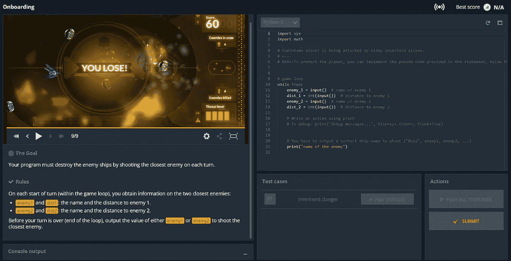
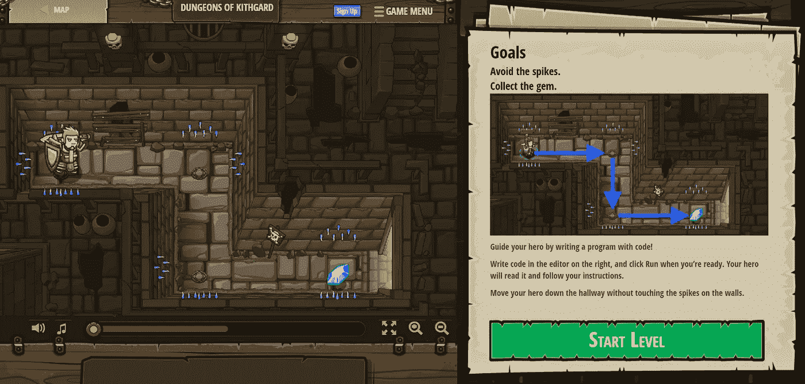
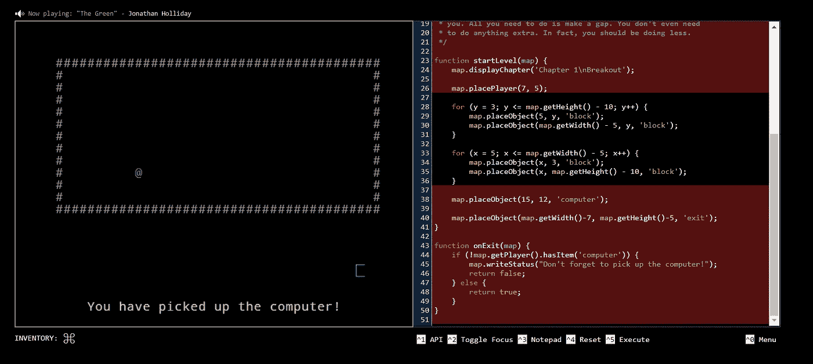
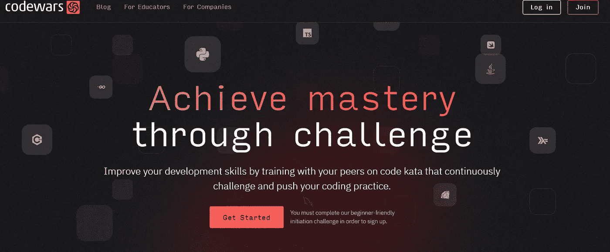
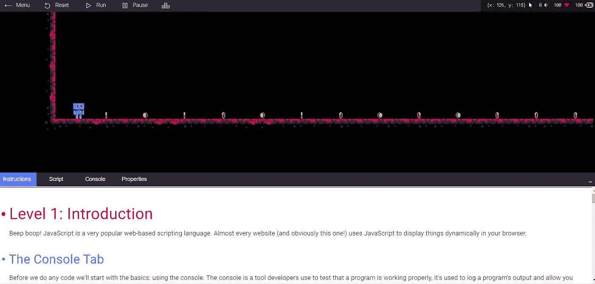
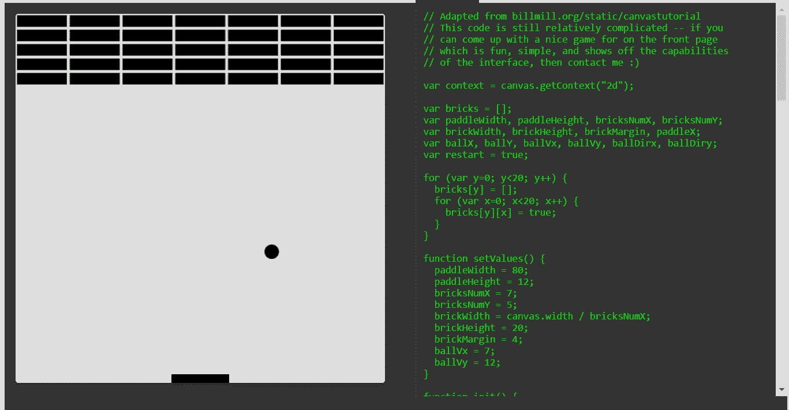
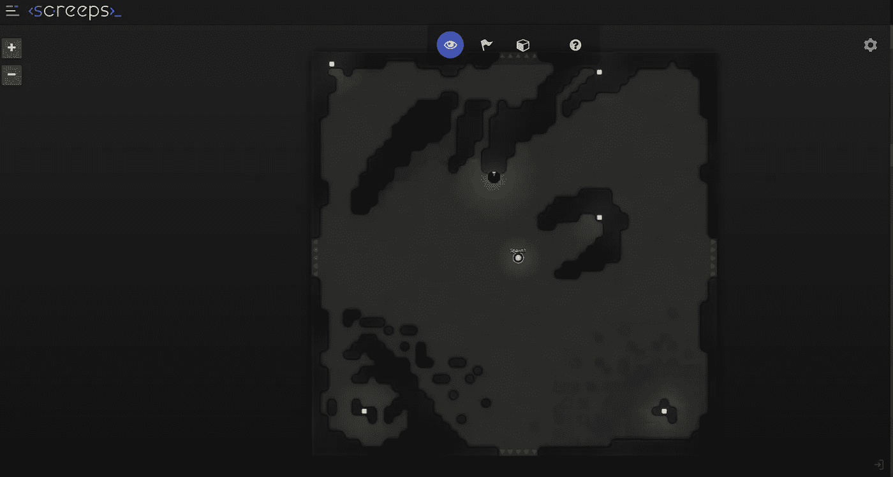
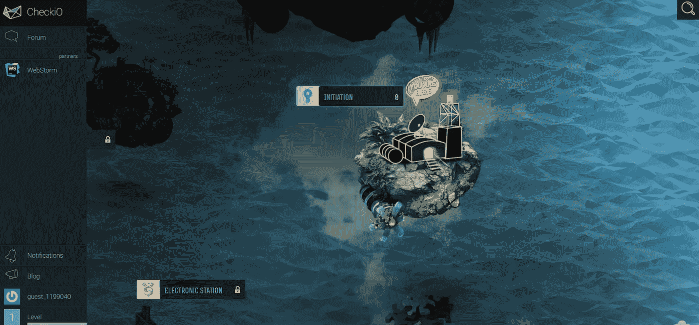

# 2023 年快速学习 JavaScript 的 8 大游戏

> 原文：<https://javascript.plainenglish.io/8-top-games-to-learn-javascript-faster-in-2023-797263bb2bc1?source=collection_archive---------4----------------------->

## 通过我们最新最棒的游戏列表，帮助您磨练编码技能，更快更有效地学习 JavaScript。

学习编码可能令人生畏，但是有了合适的资源和投入，精通一门编程语言是可能的。从 web 开发到移动应用，JavaScript 是最普及的编码语言之一。

为了让学习过程变得更简单、更有趣，我们整理了 10 个游戏，可以帮助你学习 JavaScript。每个游戏都提供了一种互动的方式来学习用 JavaScript 编写代码的基础知识，并创造性地应用你的知识。

从经典的卡片匹配游戏到模拟的编码项目，这些交互式的学习体验会让你着迷，因为你提高了你的语言技能。

另外，谁不喜欢玩游戏呢？那么为什么不用它们来学习新的东西呢？通过有趣的挑战和谜题，这十个优秀的基于游戏的教程将让你很快掌握 JavaScript。

# 编码游戏

[CodinGame](https://www.codingame.com/ide/puzzle/onboarding)

CodinGame 是一个创新的平台，使用互动游戏教授编程。它是一个多语言平台，允许你通过玩游戏来学习几种语言，包括 JavaScript。

除了教授编程技能，CodinGame 还为玩家提供了与来自世界各地的其他程序员竞争的机会。它最酷的一点是用户不用写一行代码就可以学习和磨练他们的技能。

CodinGame 通过有趣的挑战和谜题带领游戏玩家进行激动人心的编码冒险。玩家可以在游戏关卡中解锁成就，随着他们在精英程序员和开发人员中的排名上升，难度也会增加。通过成功完成每个级别，用户将获得编写 JavaScript 代码的宝贵经验——同时获得乐趣！

# 协同作战

[CodeCombat](https://codecombat.com/play/level/dungeons-of-kithgard)

CodeCombat 有 500 级，30 小时学习；CodeCombat 提供了一种学习 HTML、CSS、JavaScript 和 Python 等 web 开发基础知识的独特方式。用户可以在一个有趣、无压力的环境中通过互动游戏获得基本的编码知识。更重要的是，它允许多个玩家一起合作制定策略，这样他们就可以一起通过关卡。

由于其丰富的挑战库和对多种编程语言的支持，CodeCombat 使学习 JavaScript 变得更加容易！从完全没有编码经验的初学者到寻找新挑战的有经验的编码员——code combat 有适合每个人的东西！

# 不可信

[Untrusted](https://alexnisnevich.github.io/untrusted/)

这是一个奇妙的概念，把一个类似控制台的环境变成了一个密室。你需要输入 JavaScript 代码来退出每一关。很容易迷失在这个游戏的吸引力和挑战性的谜题中，但这也是学习 JavaScript 的好方法！

从有趣和令人兴奋的“逃离房间”挑战，其中你必须使用 JavaScript 命令来解决难题并通过关卡，通过 Hacknet 的现实黑客模拟-有很多方法可以在享受乐趣的同时学习编码。这些游戏可以帮助初学者理解基本的编程概念，并为更高级的用户提供额外的挑战。

# 代码战争

[Codewars](https://www.codewars.com/)

Codewars 是一个优秀的平台，为用户提供各种难度级别的编码挑战。你甚至可以和其他人合作，互相帮助找出解决问题的最佳方法。这使得 Codewars 成为学习 JavaScript 的绝佳游戏。

你在娱乐的同时了解新的概念，讨论和看到别人的解决方案很酷。此外，还有排行榜，你可以用它来激励自己提高编程技能。如果你正在寻找一种学习 JavaScript 的互动方式，Codewars 值得一试！

# JSRobot

[JSRobot](https://lab.reaal.me/jsrobot/#level=1&language=en)

JSRobot 是一款创新且令人兴奋的游戏，鼓励玩家学习 JavaScript。在这个游戏中，玩家可以使用键入的 JavaScript 命令来控制机器人。游戏的目标是通过解谜、与其他玩家竞争和完成挑战来通关。

该游戏有大量的背景信息，对于那些希望深入理解编程概念的人来说，它更具沉浸感和趣味性。

玩家会发现许多挑战和谜题，有助于提高解决问题的技能，因为他们通过各级进展。此外，JSRobot 为新程序员提供了一个极好的方法，让他们在享受乐趣的同时练习编码技能。

# JSDares

[JSDares](https://jsdares.com/)

JSDares 是一个优秀的开源游戏平台，允许你用社区提供的 Dares 玩各种游戏。这是学习 JavaScript 的一个很好的方法，因为挑战很小，可以很快完成。使用 JSDares，您会发现一系列的挑战，从基本的字符串操作任务到更复杂的算法——都是以娱乐的名义！

玩 JSDares 不仅有助于磨练您的 JavaScript 技能，还提供了与其他玩家合作的机会，因为他们会提供反馈和支持。因此，如果你正在寻找一个既有教育意义又有娱乐性的挑战，那么今天就试试 JSDares 吧！

# Screeps

[Screeps](https://screeps.com/a/#!/sim/tutorial/1)

Screeps 是一个令人兴奋的沙盒游戏，允许你用自定义的 JavaScript 代码控制一个殖民地。这是一个独特的概念，教玩家编码的基础，同时使他们能够定制他们的虚拟世界。你可以通过为你的殖民地编写自定义的算法和命令来让游戏变得简单或复杂。使用 Screeps，您可以创建和维护一个持久的世界，这个世界根据您对其虚拟居民的编码水平而发展。

这款游戏是基于浏览器的免费游戏，任何人都可以轻松加入并开始玩。它也是对学习 JavaScript 感兴趣的人最喜欢的游戏之一，因为它提供了一种理解语言语法和功能的实践方法。

# 切克奥

[CheckIO](https://js.checkio.org/)

CheckIO 是一款令人惊叹的基于文本的游戏，为关卡指示器提供了奇妙的图形。玩家还可以利用一个很酷的功能，让他们获得每个谜题的所有可能的解决方案。这是学习 JavaScript 的一个极好的方法，因为它有助于可视化不同的函数和命令是如何集成到代码中的。此外，它让你看到如何实施各种策略来解决难题。

这款游戏鼓励玩家进行批判性思考，并开发解决问题的技能，这些技能可以应用到游戏本身之外。随着级别的提高，您将更加熟悉基本的 JavaScript 概念，如对象和变量，这使得初学者很容易理解这些概念。

更重要的是，CheckIO 通过给玩家额外的积分来奖励那些能够提出创造性解决方案的玩家，这使得奖励更加丰厚！

*报名参加我们的* [***免费周报***](http://newsletter.plainenglish.io/) *。关注我们关于*[***Twitter***](https://twitter.com/inPlainEngHQ)，[***LinkedIn***](https://www.linkedin.com/company/inplainenglish/)*，*[***YouTube***](https://www.youtube.com/channel/UCtipWUghju290NWcn8jhyAw)*，以及* [***不和***](https://discord.gg/GtDtUAvyhW) ***。***

***有兴趣缩放你的软件启动*** *？检查* [***电路***](https://circuit.ooo?utm=publication-post-cta) *。*