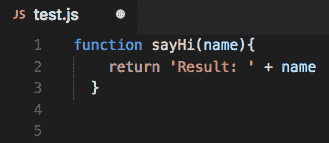

# VS 代码中 8 个有用的键盘快捷键

> 原文：<https://javascript.plainenglish.io/8-useful-keyboard-shortcuts-in-vs-code-1a8b5b879191?source=collection_archive---------5----------------------->

## VS 代码

## 使用选择的 8 个键盘快捷键在 VS 代码中操作

Photo by [Florian Krumm](https://unsplash.com/@floriankrumm?utm_source=medium&utm_medium=referral) on [Unsplash](https://unsplash.com?utm_source=medium&utm_medium=referral)

知道如何在 VS 代码中快速执行特定的操作是增强您的 IDE 体验和加速编码过程的保证。同时编辑更多的行或在文件之间切换对于编写更快的代码来说是必不可少的。

## 1.上下移动一行代码

如果你想将一行代码上下移动几行，而不需要不停地在鼠标和键盘之间切换，这个快捷键将会节省你的时间。

googleusercontent.com

## 2.多个光标

当您想要处理具有重复内容的文档中的大部分行，并且想要以类似的方式编辑所有行时，多个光标可能会很方便——在 Windows 设备上使用`Ctrl + Alt + Up/Down arrow`，在 Mac 设备上使用`⌥ + ⌘ + Up/Down arrow`。

googleusercontent.com

## 3.在文件之间切换

如果您在一个巨大的项目目录中工作，并且您需要通过在 Windows 设备和 Mac `⌘P`上的模态`Ctrl + P`中输入文件名来在文件之间快速导航，这个特性可能对您很有用。

mytechmint.com

## 4.格式化文件

格式化文件对于您或您的团队保持文件的清晰和可读性非常重要。VS 代码支持许多编程语言，这将节省您的时间——在 Windows 设备上使用`Ctrl + K Ctrl + F`，在 Mac 上使用`⌘K ⌘F`。

codereadability.com

## 5.选择颜色主题

选择一个配色方案或主题可能是 VS 代码不适合你的原因，你可以设置一个不同的主题来点亮你的 IDE。新的主题可以在 VS 代码市场直接下载到这个软件中，你可以在那里搜索主题这个词。你可以通过在 Windows 设备上输入— `Ctrl + K Ctrl + T`和在 Mac 上输入`⌘K ⌘T`来设置它。

code.visualstudio.com

## 6.删除代码行

对于更快的代码操作，您可以使用光标所在位置的删除一行代码特性——在 Windows 设备上使用`Ctrl + Shift + K`，在 Mac 上使用`⌘ + Shift + K`。

stackoverflow.com

## 7.注释和取消注释代码行

注释一行或多行代码可能是更快管理文件和试验新功能的好工具，总的来说，在 Windows 设备上使用`Ctrl + K Ctrl + C`和在 Mac 上使用`⌘K ⌘C`是一项很好的技能。

对于取消注释，您可以在 Windows 设备和 Mac 上使用—`Ctrl + K Ctrl + U``⌘K ⌘U`，对于在注释和取消注释状态之间切换，您可以在 Windows 设备和 Mac 上使用`Ctrl + /``⌘/`。

googleusercontent.com

## 8.上下复制一行代码

如果您需要将一行代码向上或向下复制几行，例如，由于大量的行重复，您可以在 Windows 设备和 Mac 上使用这个特性—`Shift + Alt + Up/Down arrow``⌥ + Shift + Up/Down arrow`。

googleusercontent.com

## 结论

我认为这些快捷方式是你在 VS 代码 IDE 软件中最有用的。我希望你能从这篇文章中得到一些有价值的东西，并从现在开始使用这些快捷方式。