# 85 JavaScript 代码辅助 Visual Studio 代码

> 原文：<https://javascript.plainenglish.io/85-javascript-code-assists-for-visual-studio-code-5c0646a07db8?source=collection_archive---------12----------------------->

在编辑器(如 Visual Studio 代码)中进行 JavaScript 编程通常涉及大量的手动文本编辑，偶尔会有复制粘贴键盘快捷键或多光标更改。

代码辅助，例如重构、代码动作和快速修复是这个清单中的另一个工具。您可以使用代码辅助**进行更高级别的语言感知更改**，例如，您可以将一个表达式及其所有出现的内容提取到一个变量中。当您手动进行这样的更改时，可能会很耗时，并且有出错的风险。

我为 Visual Studio 代码编写了一个名为[的 JavaScript 助手](https://marketplace.visualstudio.com/items?itemName=p42ai.refactor)的扩展，它为 JavaScript 和 TypeScript 添加了 85 个代码助手，让您的生活更加轻松。你可以找到代码来帮助重构和快速修复上下文菜单，或者用键盘快捷键来调用它们。JavaScript 助手有时也会推荐重构。

在这篇博文中，你可以了解代码辅助以及如何提高你的重构技能。以下是按类别分类的代码帮助:

*   [核心重构](https://dev.to/lgrammel/85-javascript-code-assists-for-visual-studio-code-1akh#core-refactorings)
*   [代码辅助反应](https://dev.to/lgrammel/85-javascript-code-assists-for-visual-studio-code-1akh#code-assists-for-react)
*   [代码辅助逻辑表达式](https://dev.to/lgrammel/85-javascript-code-assists-for-visual-studio-code-1akh#code-assists-for-logical-expressions)
*   [代码辅助分支语句](https://dev.to/lgrammel/85-javascript-code-assists-for-visual-studio-code-1akh#code-assists-for-branching-statements)
*   [数组和循环的代码辅助](https://dev.to/lgrammel/85-javascript-code-assists-for-visual-studio-code-1akh#code-assists-for-arrays-and-loops)
*   [代码辅助函数和方法](https://dev.to/lgrammel/85-javascript-code-assists-for-visual-studio-code-1akh#code-assists-for-functions-and-methods)
*   [代码辅助字符串和模板文字](https://dev.to/lgrammel/85-javascript-code-assists-for-visual-studio-code-1akh#code-assists-for-strings-and-template-literals)
*   [代码辅助变量](https://dev.to/lgrammel/85-javascript-code-assists-for-visual-studio-code-1akh#code-assists-for-variables)
*   [代码辅助语法转换](https://dev.to/lgrammel/85-javascript-code-assists-for-visual-studio-code-1akh#code-assists-for-syntax-conversion)
*   [JavaScript 现代化](https://dev.to/lgrammel/85-javascript-code-assists-for-visual-studio-code-1akh#javascript-modernizations)
*   [罗达什现代化](https://dev.to/lgrammel/85-javascript-code-assists-for-visual-studio-code-1akh#lodash-modernizations)
*   [代码清理](https://dev.to/lgrammel/85-javascript-code-assists-for-visual-studio-code-1akh#code-cleanups)
*   [其他代码辅助](https://dev.to/lgrammel/85-javascript-code-assists-for-visual-studio-code-1akh#other-code-assists)

属于几个类别的代码助手出现不止一次。

# 核心重构

视觉研究代码已经包含基本的重构，如重命名和提取功能。JavaScript 助手添加了额外的重构或扩展功能，如安全检查:

*   [**将选中的文本提取到变量**](https://p42.ai/documentation/code-assist/extract-substring-to-variable) :将选中的文本(包括模板文字的表达式)提取到一个`const`变量中。

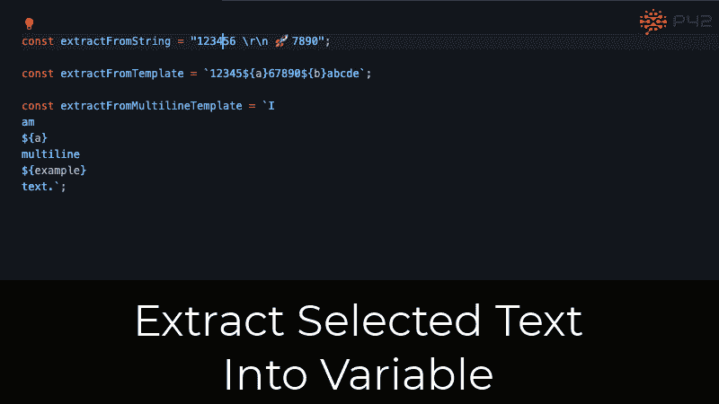

*   [**提取变量**](https://p42.ai/documentation/code-assist/extract-variable) :将一个或多个表达式提取到一个`const`变量中。

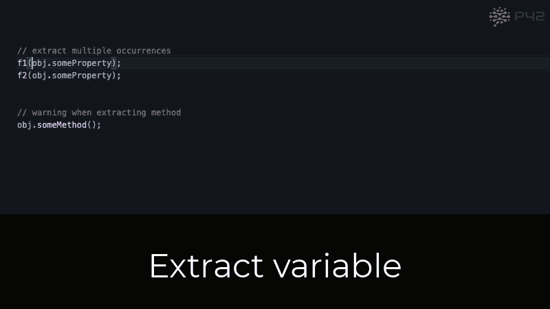

*   [**内联返回**](https://p42.ai/documentation/code-assist/inline-return) :将变量赋值转换为`return`语句。
*   [**内联变量**](https://p42.ai/documentation/code-assist/inline-variable) :将变量值内联到其引用中。

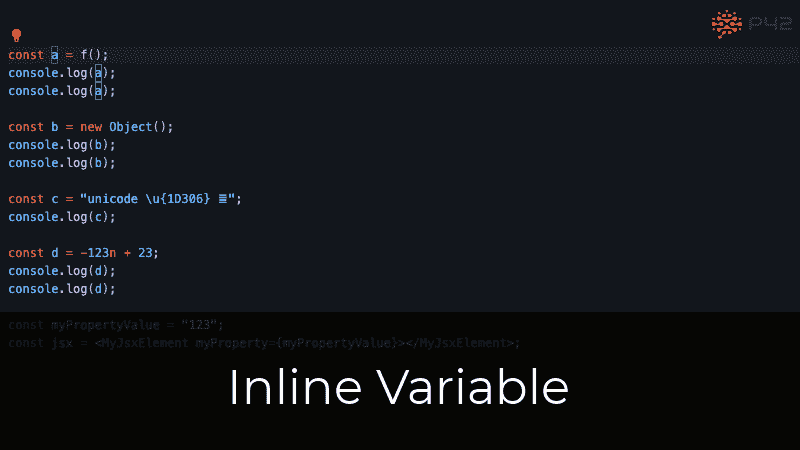

# React 的代码辅助

在 React 中，组件通常包含 JSX，一种 JavaScript 的语法扩展。JavaScript 助手提供代码辅助，使使用 JSX 和反应更容易:

*   [**给 JSX 属性**](https://p42.ai/documentation/code-assist/add-braces-to-jsx-attribute) 添加{…}:给 JSX 属性字符串文字值添加`{...}`。
*   [**折叠 JSX 标签**](https://p42.ai/documentation/code-assist/collapse-jsx-element) :将空的 JSX 标签转换成自结束标签。
*   [**展开 JSX 标签**](https://p42.ai/documentation/code-assist/expand-self-closing-jsx-element) :展开一个自闭的 JSX 标签。
*   [**提取 React 函数组件**](https://p42.ai/documentation/code-assist/extract-jsx-element) :将 JSX 元素或片段提取到 React 函数组件中。

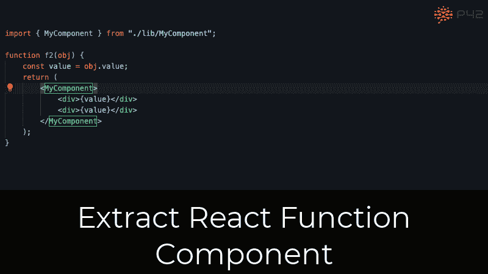

*   [**从 JSX 属性**](https://p42.ai/documentation/code-assist/remove-braces-from-jsx-attribute) 中删除{…}:从包含字符串文字的 JSX 属性表达式值中删除`{...}`。
*   [**删除不必要的 JSX 片段**](https://p42.ai/documentation/code-assist/remove-unnecessary-jsx-fragment) :用那个孩子替换只包含一个孩子的 JSX 片段`<></>`。
*   [**<>…</>**](https://p42.ai/documentation/code-assist/surround-with-jsx-fragment):将 JSX 元素包裹在一个 JSX 片段中`<>...</>`。

# 逻辑表达式的代码辅助

布尔逻辑很难读懂，尤其是当表达式变得更加复杂的时候。JavaScript 助手提供了几个重构功能，可以帮助您简化和梳理逻辑表达式，使它们更容易理解:

*   [**将字符串比较链转换为数组，包括**](https://p42.ai/documentation/code-assist/convert-comparison-chain-to-array-includes) :将`|| value === 'aString'`和`&& value !== 'aString'`链替换为`array.includes()`。

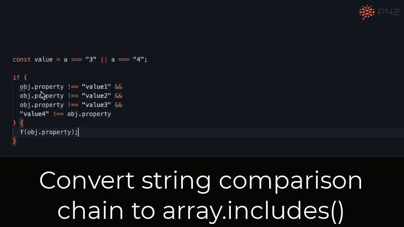

*   [**转换为可选链接**](https://p42.ai/documentation/code-assist/convert-to-optional-chaining) :用可选链接运算符(`?.`)替换各种保护表达式。
*   [**翻转运算符**](https://p42.ai/documentation/code-assist/flip-operator) :交换左右操作数，必要时更新运算符。
*   [**反转条件**](https://p42.ai/documentation/code-assist/invert-condition) :对 if 语句或条件表达式的条件求反，并交换其内容。

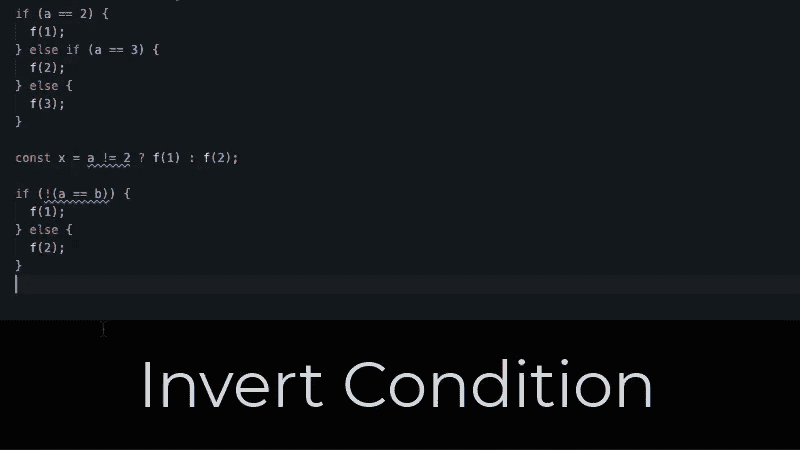

*   [**拔高否定**](https://p42.ai/documentation/code-assist/pull-up-negation) :将非运算符(`!`)移出二元表达式。
*   [**下推否定**](https://p42.ai/documentation/code-assist/push-down-negation) :将非运算符(`!`)下推成表达式，进行否定。
*   [**去除双重否定**](https://p42.ai/documentation/code-assist/remove-double-negation) :去除双重否定(`!!`)表达式。
*   [**简化二元表达式**](https://p42.ai/documentation/code-assist/simplify-binary-expression) :用更直白的等价表达式替换二元表达式。
*   [**Use == null 比较**](https://p42.ai/documentation/code-assist/use-eq-eq-null) :用`== null`替换不同的无效检查。

# 分支语句的代码辅助

诸如 if-else 和 switch 之类的分支语句是许多程序中的核心元素。重构它们可以增加程序的可读性，通常与重构它们的条件相结合:

*   [**将& &转换为 if 语句**](https://p42.ai/documentation/code-assist/convert-and-and-guard-to-if-statement) :将`condition && aFunction();`和类似的表达式语句转换为 if 语句。
*   [**将条件表达式转换为 if-else**](https://p42.ai/documentation/code-assist/convert-conditional-expression-to-if-else) :将条件表达式转换为 if-else 语句。
*   [**将 if-else 转换为条件表达式**](https://p42.ai/documentation/code-assist/convert-if-else-to-conditional-expression) :将一个`if` - `else`返回或赋值表达式转换为条件表达式。
*   [**将 if-else 转换为 switch**](https://p42.ai/documentation/code-assist/convert-if-else-to-switch) :将带有等式比较的 if-else 语句链转换为 switch 语句。

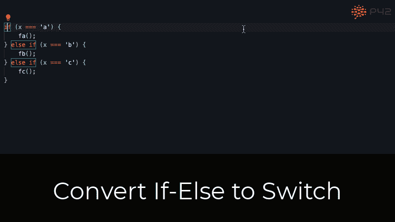

*   [**将 else 里面嵌套的 if 合并成 else-if**](https://p42.ai/documentation/code-assist/merge-nested-else-if) :可以将`else`块里面嵌套的单个`if`语句合并成`else if`语句。
*   [**合并嵌套的 if 语句**](https://p42.ai/documentation/code-assist/merge-nested-if) :将两个没有附加运算的嵌套`if`语句合并成一个`if`-语句，使用`&&`组合条件。
*   [**将重复的第一条语句移出 if-else**](https://p42.ai/documentation/code-assist/move-first-statement-out-of-if-else) :将同时出现在 if 和 else 块中的第一条语句移出 if-else 语句。

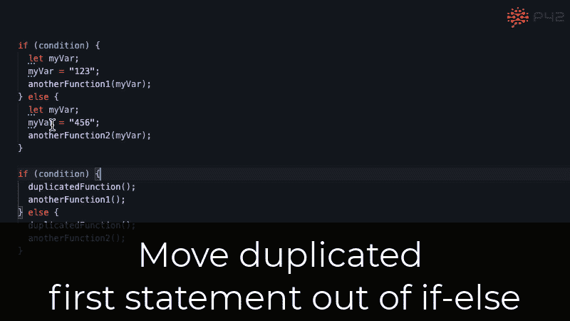

*   [**将重复的最后一条语句移出 if-else**](https://p42.ai/documentation/code-assist/move-last-statement-out-of-if-else) :将同时出现在 if 和 else 块的最后一条语句移出 if-else 语句。
*   [**删除空的 else 块**](https://p42.ai/documentation/code-assist/remove-empty-else-block) :从‘if’语句中删除一个空的‘else’块。
*   [**删除空 if 块**](https://p42.ai/documentation/code-assist/remove-empty-if-block) :从‘if’语句中删除一个空‘if’块。如果可用，用“else”块替换它。
*   [**删除多余的 else if**](https://p42.ai/documentation/code-assist/remove-redundant-else) :删除多余的 else-if 条件和不可达的 else 语句。
*   [**删除不必要的条件表达式**](https://p42.ai/documentation/code-assist/remove-unnecessary-conditional-expression) :用条件或结果替换条件表达式。
*   [**删除不必要的 else**](https://p42.ai/documentation/code-assist/remove-unnecessary-else) :用 return 语句将一个`if` - `else`的 else 内容提升到外缩进层次。
*   [**将重复的条件分离成嵌套的 if-else**](https://p42.ai/documentation/code-assist/separate-condition-into-nested-if) :将一个被完全覆盖的重复子条件分离成一个嵌套的 if-else。
*   [**拆分 if 语句**](https://p42.ai/documentation/code-assist/split-if) :在可能的情况下，在`||`或`&&`上拆分 if 语句的条件。

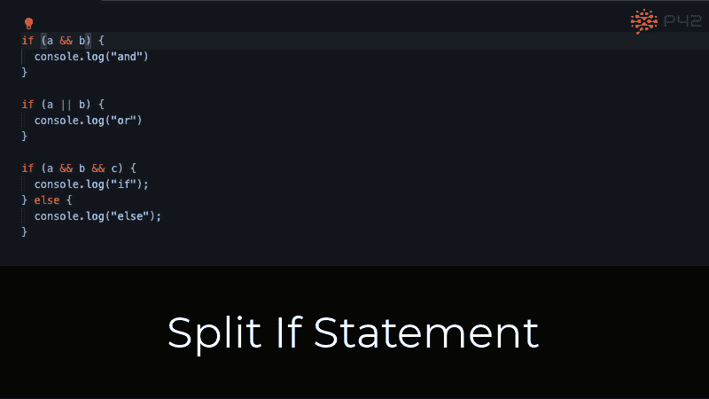

# 数组和循环的代码辅助

JavaScript 有几种定义循环的方法和许多作用于整个数组的数组方法。JavaScript Assistant 提供了几个代码动作，用于在不同类型的`for`循环之间进行转换，以及转换成更加惯用的数组方法，比如`array.includes()`。

*   [**将 array.indexOf()转换为 array.includes()**](https://p42.ai/documentation/code-assist/convert-array-index-of-to-array-includes) :用`array.includes()`替换`array.indexOf()`检查。
*   [**将字符串比较链转换为数组，包括**](https://p42.ai/documentation/code-assist/convert-comparison-chain-to-array-includes) :用`array.includes()`替换`|| value === 'aString'`和`&& value !== 'aString'`链。
*   [**将循环转换为。forEach**](https://p42.ai/documentation/code-assist/convert-loop-to-for-each) :用`.forEach()`循环替换常规`for`循环。
*   [**将循环转换为 for..**](https://p42.ai/documentation/code-assist/convert-loop-to-for-of) 中:用`for...of`回路替换常规`for`回路和`anArray.forEach`回路。

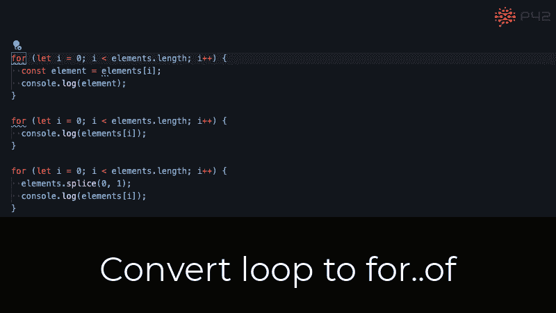

*   [**将循环转换为 for**](https://p42.ai/documentation/code-assist/convert-loop-to-for-with-index) :用有索引变量的常规`for`循环替换`for..of`。

# 函数和方法的代码辅助

函数和方法是任何重要程序的基本构件。下列代码操作使得使用函数、方法及其参数变得更加容易:

*   [**给箭头函数添加{…}**](https://p42.ai/documentation/code-assist/add-braces-to-arrow-function):将箭头函数表达式体转换成块体。
*   [**将函数转换成箭头函数**](https://p42.ai/documentation/code-assist/convert-function-to-arrow-function) :用箭头函数代替函数表达式，更简洁的语法。

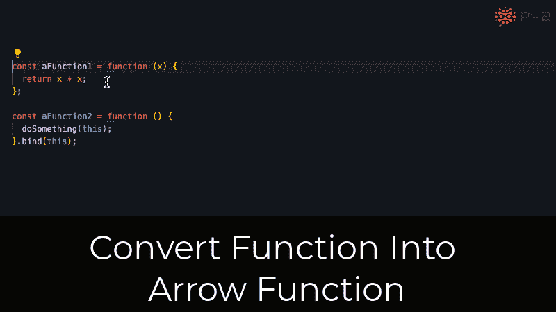

*   [**将函数转换为对象方法**](https://p42.ai/documentation/code-assist/convert-function-to-object-method) :将带有函数的属性赋值转换为方法声明。
*   [**将命名函数转换为函数表达式**](https://p42.ai/documentation/code-assist/convert-named-function-to-function-expression) :将命名函数转换为带有函数表达式的常量声明。
*   [**将默认值提升到参数**](https://p42.ai/documentation/code-assist/lift-default-into-parameter) :用默认参数值替换默认值赋值表达式。

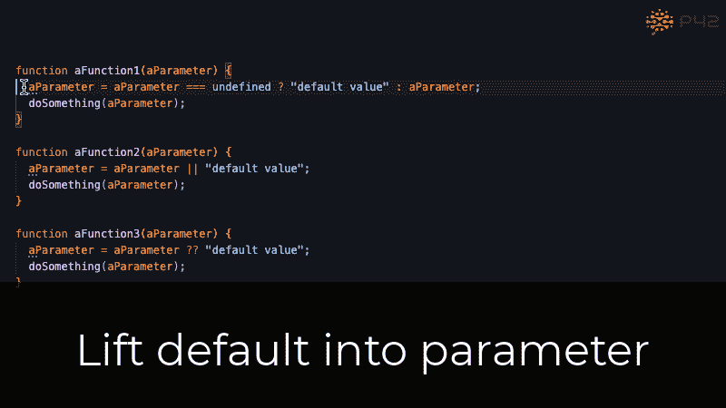

*   [**将参数推入生命/IIAF**](https://p42.ai/documentation/code-assist/push-parameter-into-iife) :将一个立即调用的函数表达式(IIFE)或一个立即调用的箭头函数(IIAF)的参数推入函数体。
*   [**从箭头函数**](https://p42.ai/documentation/code-assist/remove-braces-from-arrow-function) 中删除{…}:将箭头函数块体转换为表达式体。
*   [**移除生命/IIAF**](https://p42.ai/documentation/code-assist/remove-iife) :移除不带参数的立即调用函数表达式(IIFE)和立即调用箭头函数(IIAF)。

# 字符串和模板文字的代码辅助

随着 JavaScript 中模板文字的引入，文本操作变得更加强大。JavaScript 助手提供了几个代码操作来帮助您处理文本，无论是字符串还是模板文本:

*   [**将字符串比较链转换为数组，包括**](https://p42.ai/documentation/code-assist/convert-comparison-chain-to-array-includes) :将`|| value === 'aString'`和`&& value !== 'aString'`链替换为`array.includes()`。
*   [**将字符串转换成模板文字**](https://p42.ai/documentation/code-assist/convert-string-to-template-literal) :将字符串转换成不带表达式的基本模板文字。
*   [**将模板文字转换成字符串**](https://p42.ai/documentation/code-assist/convert-template-literal-to-string) :将一个没有表达式的简单模板文字转换成字符串。
*   [**将选中的文本提取到变量**](https://p42.ai/documentation/code-assist/extract-substring-to-variable) :将选中的文本(包括模板文字的表达式)提取到一个`const`变量中。
*   [**内联到模板**](https://p42.ai/documentation/code-assist/inline-into-template) :将一个字符串或一个基本模板文字内联到一个外部模板文字中。

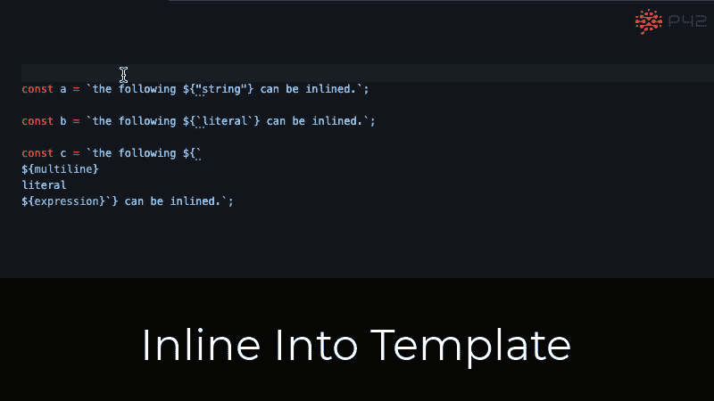

*   [**删除不必要的模板文字**](https://p42.ai/documentation/code-assist/remove-unnecessary-template) :用一个内部表达式简化一个模板文字，没有前缀和后缀。
*   [**使用 string . endswith()**](https://p42.ai/documentation/code-assist/use-string-ends-with):`string.endsWith()`检查一个字符串是否以另一个字符串结尾。
*   [**使用 string . starts with()**](https://p42.ai/documentation/code-assist/use-string-starts-with):`string.startsWith()`检查一个字符串是否以另一个字符串开头。
*   [**合并字符串拼接**](https://p42.ai/documentation/code-assist/use-template-literal) :将字符串和模板文字拼接成一个模板文字或字符串。

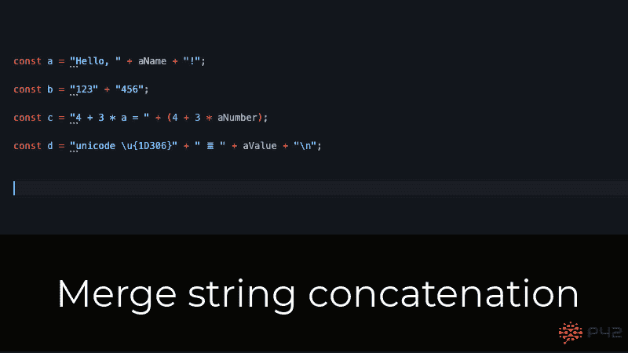

# 变量的代码辅助

*   [**转换字母为常量**](https://p42.ai/documentation/code-assist/convert-let-to-const) :用`const`声明替换没有重新赋值的`let`声明。
*   [**转换成析构赋值**](https://p42.ai/documentation/code-assist/convert-to-destructuring-assignment) :将访问对象属性的变量声明转换成析构赋值。

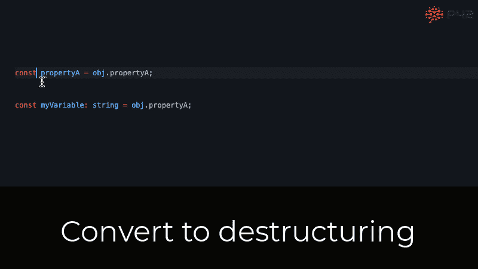

*   [**提取变量**](https://p42.ai/documentation/code-assist/extract-variable) :将一个或多个表达式提取到一个`const`变量中。
*   [**内联返回**](https://p42.ai/documentation/code-assist/inline-return) :将变量赋值转换为`return`语句。
*   [**将默认值提升到参数**](https://p42.ai/documentation/code-assist/lift-default-into-parameter) :用默认参数值替换默认值赋值表达式。
*   [**合并到前面的析构赋值**](https://p42.ai/documentation/code-assist/merge-into-preceding-destructuring-assignment) :将一个对象的析构赋值与其前面的兄弟合并。
*   [**合并变量声明和初始化**](https://p42.ai/documentation/code-assist/merge-variable-declaration-and-initialization) :将变量的初始赋值转换为其声明初始化式。
*   [**将字段初始化移入构造函数**](https://p42.ai/documentation/code-assist/move-field-initializer-into-constructor) :将初始字段值的赋值移入类构造函数。

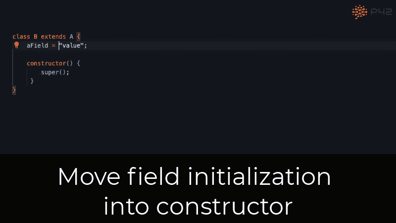

*   [**将初始化移入字段声明**](https://p42.ai/documentation/code-assist/move-field-initializer-into-declaration) :将初始字段值的赋值移入字段声明。
*   [**将参数推入生命/IIAF**](https://p42.ai/documentation/code-assist/push-parameter-into-iife) :将立即调用的函数表达式(IIFE)或立即调用的箭头函数(IIAF)的参数推入函数体。
*   [**删除未使用的变量**](https://p42.ai/documentation/code-assist/remove-unused-variable) :删除一个未被读写的变量。
*   [**将 var 转换为 let 或 const**](https://p42.ai/documentation/code-assist/replace-var-with-let-and-const) :用块范围的变量`let`和`const`替换`var`。
*   [**拆分变量声明顺序**](https://p42.ai/documentation/code-assist/split-variable-declaration) :将多个变量的声明转换成每个变量单独的声明。
*   [**拆分变量声明和初始化**](https://p42.ai/documentation/code-assist/split-variable-declaration-and-initialization) :将变量初始化与其声明分开。
*   [**在默认表达式**](https://p42.ai/documentation/code-assist/use-nullish-coalescence-in-default-expression) 中使用无效合并:用无效合并运算符(`??`)表达式替换默认值表达式。

# 语法转换的代码辅助

通过编辑文本进行小的语法更改通常很烦人。通常需要编辑不止一个位置，在编辑过程中代码会被破坏，导致不正确的错误和自动完成。您可以在代码辅助下执行以下语法转换:

*   [**给箭头函数添加{…}**](https://p42.ai/documentation/code-assist/add-braces-to-arrow-function):将箭头函数表达式体转换成块体。
*   [**给 JSX 属性**](https://p42.ai/documentation/code-assist/add-braces-to-jsx-attribute) 添加{…}:给 JSX 属性字符串文字值添加`{…}`。
*   [**增加数字分隔符**](https://p42.ai/documentation/code-assist/add-numeric-separator) :增加下划线分隔符，增加长数字和不常用数字格式的可读性。
*   [**折叠 JSX 标签**](https://p42.ai/documentation/code-assist/collapse-jsx-element) :将空的 JSX 标签转换成自结束标签。

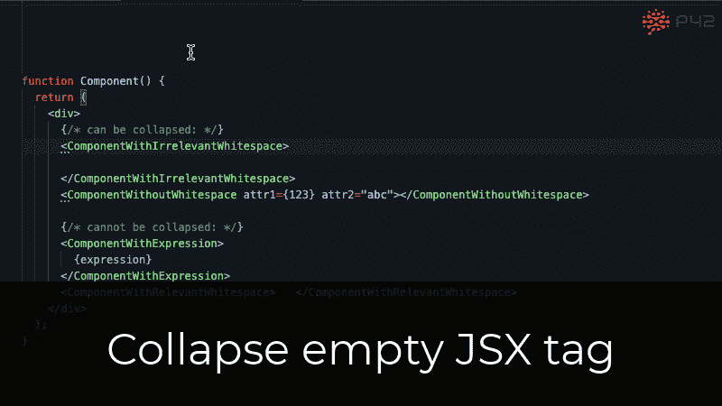

*   [**将对象属性折叠成简写**](https://p42.ai/documentation/code-assist/collapse-property-into-shorthand) :当属性名与属性值相同时，缩短对象属性。
*   [**将属性访问转换为点符号**](https://p42.ai/documentation/code-assist/convert-bracket-notation-property-access-to-dot-notation) :将括号符号属性访问`o['a']`转换为点符号属性访问`o.a`。
*   [**将属性访问转换为括号符号**](https://p42.ai/documentation/code-assist/convert-dot-notation-property-access-to-bracket-notation) :将点符号属性访问`o.a`转换为括号符号属性访问`o['a']`。
*   [**展开 JSX 标签**](https://p42.ai/documentation/code-assist/expand-self-closing-jsx-element) :展开一个自闭的 JSX 标签。
*   [**展开速记属性**](https://p42.ai/documentation/code-assist/expand-shorthand-property) :将速记对象属性(如`{ a }`)展开为常规属性(如`{ a: a }`)。
*   [**合并变量声明和初始化**](https://p42.ai/documentation/code-assist/merge-variable-declaration-and-initialization) :将变量的初始赋值转换为其声明初始化式。
*   [**将运算符从赋值中取出**](https://p42.ai/documentation/code-assist/pull-operator-out-of-assignment) :将运算符从赋值中取出，放入二元表达式中。
*   [**将运算符推入赋值**](https://p42.ai/documentation/code-assist/push-operator-into-assignment) :将二元表达式中的运算符移入赋值运算符，如`+=`。

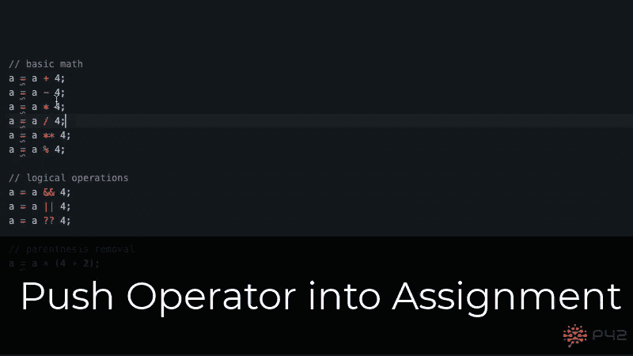

*   [**从箭头函数**](https://p42.ai/documentation/code-assist/remove-braces-from-arrow-function) 中删除{…}:将箭头函数块体转换成表达式体。
*   [**从 JSX 属性**](https://p42.ai/documentation/code-assist/remove-braces-from-jsx-attribute) 中删除{…}:从包含字符串文字的 JSX 属性表达式值中删除`{…}`。

# JavaScript 现代化

Javascript 生态系统正在快速发展。然而，很难用较新的 JavaScript 特性来保持代码库的更新，并且 codemods 并不总是一个选项，因为它们有很大的变动和损坏的可能性。JavaScript Assistant 支持类似 codemod 的大规模代码重构，以及针对以下升级的更多机会性代码现代化:

*   [**增加数字分隔符**](https://p42.ai/documentation/code-assist/add-numeric-separator) :增加下划线分隔符，增加长数字和不常用数字格式的可读性。
*   [**将对象属性折叠成简写**](https://p42.ai/documentation/code-assist/collapse-property-into-shorthand) :当属性名与属性值相同时，缩短对象属性。
*   [**转换。apply() to spread 语法**](https://p42.ai/documentation/code-assist/convert-apply-to-spread-syntax) :用 spread 运算符`...`替换`.apply()`调用
*   [**将 array.indexOf()转换为 array.includes()**](https://p42.ai/documentation/code-assist/convert-array-index-of-to-array-includes) :用`array.includes()`替换`array.indexOf()`检查。

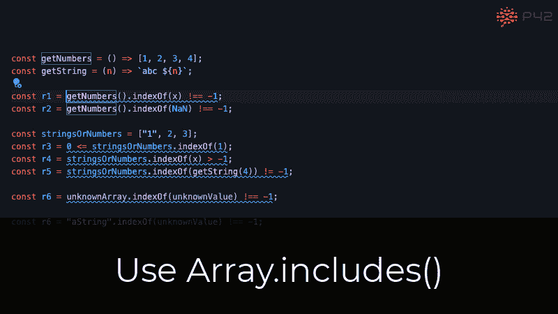

*   [**将字符串比较链转换为数组，包括**](https://p42.ai/documentation/code-assist/convert-comparison-chain-to-array-includes) :将`|| value === 'aString'`和`&& value !== 'aString'`链替换为`array.includes()`。
*   [**将函数转换成箭头函数**](https://p42.ai/documentation/code-assist/convert-function-to-arrow-function) :用箭头函数代替函数表达式，更简洁的语法。
*   [**将函数转换为对象方法**](https://p42.ai/documentation/code-assist/convert-function-to-object-method) :将带有函数的属性赋值转换为方法声明。
*   [**将循环转换为 for..**](https://p42.ai/documentation/code-assist/convert-loop-to-for-of) 中:用`for...of`循环替换常规`for`循环和`anArray.forEach`循环。
*   [**将 Math.pow 转换为取幂运算符**](https://p42.ai/documentation/code-assist/convert-math-pow-to-exponentiation) :用取幂运算符`**`代替`Math.pow()`。

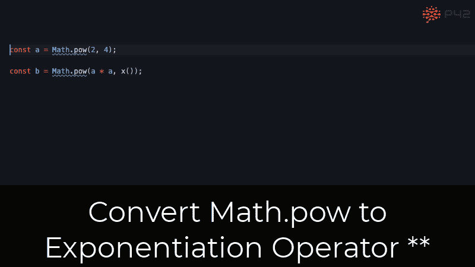

*   [**将字符串转换成模板文字**](https://p42.ai/documentation/code-assist/convert-string-to-template-literal) :将字符串转换成不带表达式的基本模板文字。
*   [**转换为析构赋值**](https://p42.ai/documentation/code-assist/convert-to-destructuring-assignment) :将访问对象属性的变量声明转换为析构赋值。
*   [**转换为可选链接**](https://p42.ai/documentation/code-assist/convert-to-optional-chaining) :用可选链接运算符(`?.`)替换各种保护表达式。
*   [**将默认值提升到参数**](https://p42.ai/documentation/code-assist/lift-default-into-parameter) :用默认参数值替换默认值赋值表达式。
*   [**将 var 转换为 let 或 const**](https://p42.ai/documentation/code-assist/replace-var-with-let-and-const) :用块范围的变量`let`和`const`替换`var`。

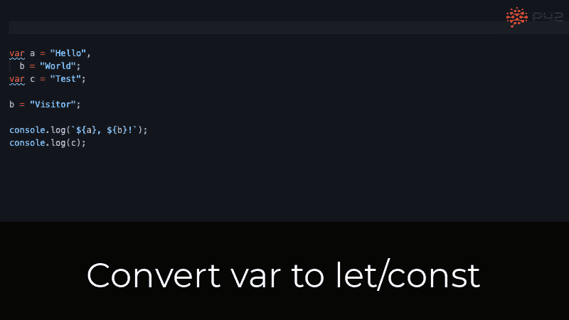

*   [**用未定义的**](https://p42.ai/documentation/code-assist/replace-void-0-with-undefined) 替换 void 0:用`undefined`替换`void 0`等常量`void`表达式。
*   [**Use == null 比较**](https://p42.ai/documentation/code-assist/use-eq-eq-null) :用`== null`替换不同的无效检查。
*   [**在默认表达式**](https://p42.ai/documentation/code-assist/use-nullish-coalescence-in-default-expression) 中使用无效合并:用无效合并运算符(`??`)表达式替换默认值表达式。

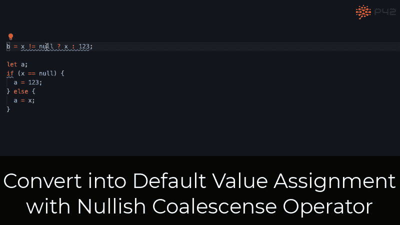

*   [**使用 string . endswith()**](https://p42.ai/documentation/code-assist/use-string-ends-with):`string.endsWith()`检查一个字符串是否以另一个字符串结尾。
*   [**使用 string . starts with()**](https://p42.ai/documentation/code-assist/use-string-starts-with):`string.startsWith()`检查一个字符串是否以另一个字符串开头。
*   [**合并字符串串联**](https://p42.ai/documentation/code-assist/use-template-literal) :将字符串和模板文字串联合并成一个模板文字或字符串。

# 洛达什现代化

随着 ES6 和更新的 JavaScript 版本中各种集合助手和新语法的引入，一些 [Lodash](https://lodash.com/) 函数已经变得有些多余。

*   [**替换 _。every with array.every**](https://p42.ai/documentation/code-assist/replace-lodash-every-with-javascript-array-every) :用`array.every`替换 Lodash `_.every`。
*   [**替换 _。用数组过滤，filter**](https://p42.ai/documentation/code-assist/replace-lodash-filter-with-javascript-array-filter) :用`array.filter`替换 Lodash `_.filter`。

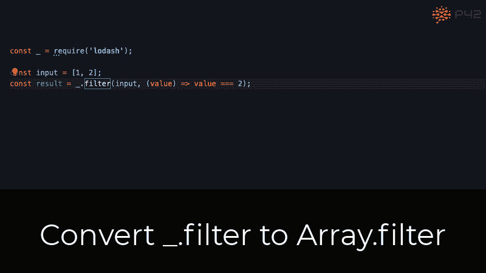

*   [**替换 _。各和 _。用数组 forEach . forEach**](https://p42.ai/documentation/code-assist/replace-lodash-foreach):用`array.forEach`替换 Lodash `_.each`和`_.forEach`。
*   [**替换 _。用 array.map** 映射](https://p42.ai/documentation/code-assist/replace-lodash-map-with-javascript-array-map):用`array.map`替换 Lodash `_.map`。
*   [**替换 _。用箭头功能**noop](https://p42.ai/documentation/code-assist/replace-lodash-noop-with-arrow-function):用`() => undefined`替换`_.noop`。
*   [**替换 _。有些带有 array . some**T42:将 Lodash `_.some`替换为`array.some`。](https://p42.ai/documentation/code-assist/replace-lodash-some-with-javascript-array-some)

# 代码清理

代码清理删除不必要的代码。这种代码可能来自代码变动，例如，通过应用其他重构、添加新功能或修复错误。JavaScript 助手会针对以下情况显示提示并自动清理:

*   [**删除 console.log**](https://p42.ai/documentation/code-assist/remove-console-log) :删除 console.log 语句。
*   [**去除双重否定**](https://p42.ai/documentation/code-assist/remove-double-negation) :去除双重否定(`!!`)表达式。
*   [**删除空的 else 块**](https://p42.ai/documentation/code-assist/remove-empty-else-block) :从‘if’语句中删除一个空的‘else’块。
*   [**删除空的 if 块**](https://p42.ai/documentation/code-assist/remove-empty-if-block) :从“if”语句中删除一个空的“if”块。如果可用，用“else”块替换它。
*   [**移除生命/IIAF**](https://p42.ai/documentation/code-assist/remove-iife) :移除不带参数的立即调用函数表达式(IIFE)和立即调用箭头函数(IIAF)。
*   [**去掉多余的 else if**](https://p42.ai/documentation/code-assist/remove-redundant-else) :去掉多余的 else-if 条件和不可达的 else 语句。
*   [**删除不必要的条件表达式**](https://p42.ai/documentation/code-assist/remove-unnecessary-conditional-expression) :用条件或结果替换条件表达式。
*   [**删除不必要的 else**](https://p42.ai/documentation/code-assist/remove-unnecessary-else) :用 return 语句将一个`if` - `else`的 else 内容提升到外缩进层次。

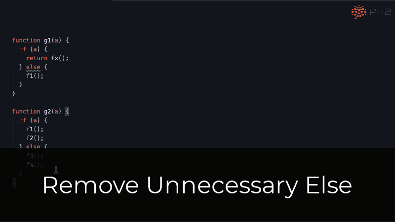

*   [**删除不必要的表达式语句**](https://p42.ai/documentation/code-assist/remove-unnecessary-expression-statement) :删除没有副作用的表达式语句。
*   [**删除不必要 JSX 片段**](https://p42.ai/documentation/code-assist/remove-unnecessary-jsx-fragment) :用那个孩子替换只包含一个孩子的 JSX 片段`<></>`。
*   [**删除不必要的模板字面量**](https://p42.ai/documentation/code-assist/remove-unnecessary-template) :简化一个只有一个内部表达式，没有前缀和后缀的模板字面量。
*   [**删除未使用的变量**](https://p42.ai/documentation/code-assist/remove-unused-variable) :删除未被读写的变量。
*   [**用未定义的**](https://p42.ai/documentation/code-assist/replace-void-0-with-undefined) 替换 void 0:用`undefined`替换`void 0`和其他常量`void`表达式。

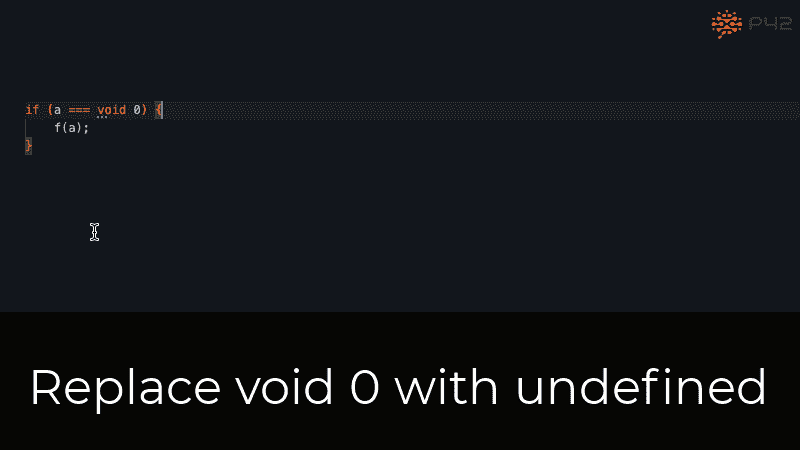

*   [**简化二元表达式**](https://p42.ai/documentation/code-assist/simplify-binary-expression) :用更直接的等价表达式替换二元表达式。

# 其他代码辅助

*   [**为变量**](https://p42.ai/documentation/code-assist/insert-console-log) 插入 console.log:在可能的情况下，为所选变量插入' console.log '语句。
*   [**用 try 包围…catch**](https://p42.ai/documentation/code-assist/surround-with-try-catch) :将一系列语句包围在一个`try…catch`块中。

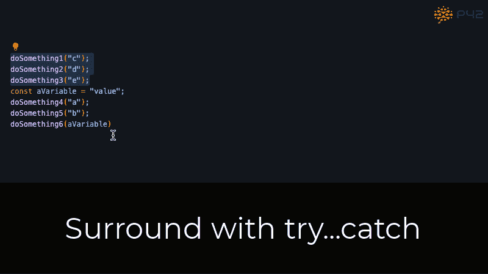

# 结论

有了这篇博文中展示的 85 个代码助手，您可以在比文本更高的层次上编辑您的 JavaScript 源代码，并对您的代码进行更快、更安全的更改。

> *💡如果你想试一试* [*JavaScript 助手*](https://marketplace.visualstudio.com/items?itemName=p42ai.refactor) *，可以在* [*Visual Studio 代码集市*](https://marketplace.visualstudio.com/items?itemName=p42ai.refactor) *上找到。*

*更多内容请看*[***plain English . io***](https://plainenglish.io/)*。报名参加我们的* [***免费周报***](http://newsletter.plainenglish.io/) *。关注我们关于*[***Twitter***](https://twitter.com/inPlainEngHQ)*和*[***LinkedIn***](https://www.linkedin.com/company/inplainenglish/)*。查看我们的* [***社区不和谐***](https://discord.gg/GtDtUAvyhW) *加入我们的* [***人才集体***](https://inplainenglish.pallet.com/talent/welcome) *。*