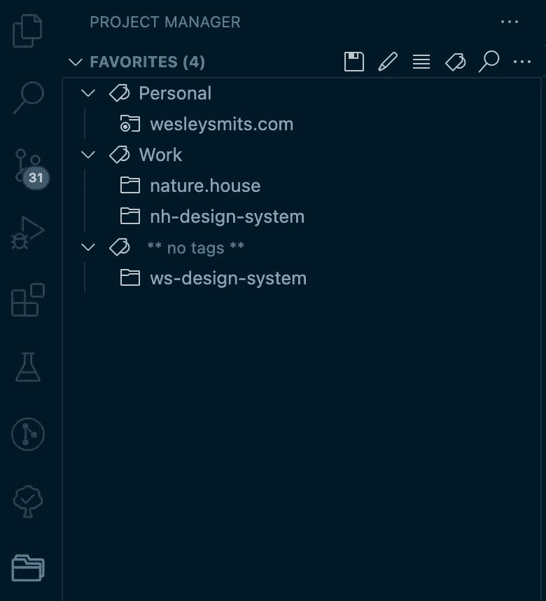
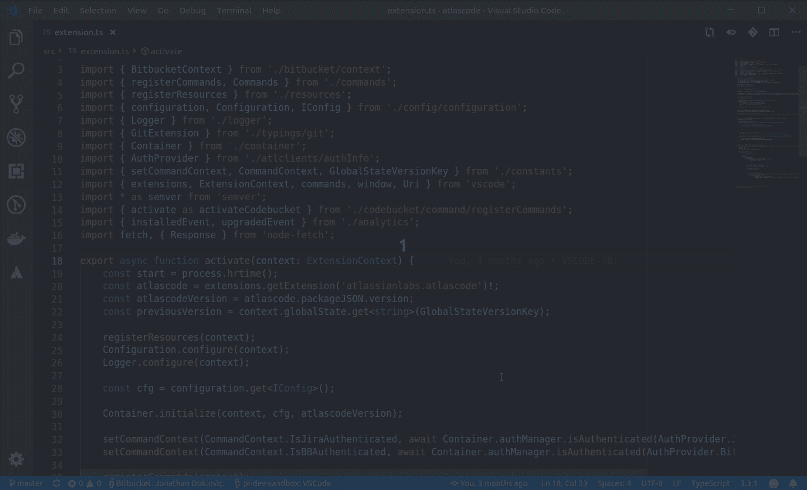

# 9 个惊人的 Visual Studio 代码扩展，大幅提高工作效率

> 原文：<https://javascript.plainenglish.io/9-amazing-visual-studio-code-extensions-to-skyrocket-productivity-f281f7827b53?source=collection_archive---------1----------------------->

## VISUAL STUDIO 代码

## 使用这些扩展可以节省时间，提高生产力，编写更好的代码

Photo by [Alan Chen](https://unsplash.com/ja/@chzenan?utm_source=unsplash&utm_medium=referral&utm_content=creditCopyText) on [Unsplash](https://unsplash.com/@wesleysmits/likes?utm_source=unsplash&utm_medium=referral&utm_content=creditCopyText)

Visual Studio 代码是一个了不起的编辑器，它有一个很大的扩展市场，可以根据您的用例来调整编辑器。它提供了超过 40，000 个扩展功能，并且每天都在增加。

最近，我分享了一个扩展列表，这些扩展在 Medium 和其他地方的文章中被推荐了很多，它们的功能已经被本地支持，并且可以被卸载。

 [## 您不需要的 11 个 Visual Studio 代码扩展

### 这些流行的扩展解决了不存在的问题

javascript.plainenglish.io](/10-visual-studio-code-extensions-you-dont-need-6f7904132a57) 

今天我想分享我认为在 Web 开发者工具包中最重要的扩展。

## VS 代码扩展来改善您的工作流程

下面你会发现的 7 个扩展都是围绕着改善你的工作流程。它们帮助你节省时间或者防止你进行上下文切换。

**1。** [**项目经理**](https://marketplace.visualstudio.com/items?itemName=alefragnani.project-manager) **— 2.8M 下载量**

Project Manager — VS Code Extension

项目管理器是一个简单的插件，只需点击一下，就可以在项目之间快速切换。您可以选择在当前窗口或新窗口中打开项目。

在下载这个扩展之前，我通过简单的键盘命令和从 VS 代码中的*最近的项目*列表中选择项目，切换项目的速度相当快。现在，我已经使用这个扩展几个月了，我可以说这要容易得多，特别是当你的项目列表比 VS 代码中的*最近项目*列表长的时候。

**2。**[**git lens**](https://marketplace.visualstudio.com/items?itemName=eamodio.gitlens)**—18M 下载量**

虽然 Visual Studio 代码具有原生 Git 集成，但 GitLens 使体验变得更好。它可以可视化代码作者身份，而不会扰乱用户界面。

以下是让我爱上 GitLens 的一些特性:

*   轻松地在修订之间导航，一目了然地查看文件的整个历史。
*   一个不引人注目的当前行责备。这可以让您看到谁最后编辑了当前代码行，以及最后一次修改是什么时候。悬停时，这将显示更详细的信息。
*   文件的状态栏和顶部会显示一个小注释，指示最后编辑该文件的人和时间。
*   许多详细的侧边栏视图来查看提交、更改、文件历史、行历史、分支、存储、标签、远程等等。

**3。** [**直播分享**](https://marketplace.visualstudio.com/items?itemName=MS-vsliveshare.vsliveshare) **— 10.2M 下载量**

Live Share 是微软自己开发的一个扩展，它允许你在 VSCode 中与另一个开发者合作。可以同时写代码，互相跟随，一起调试。

> 与传统的结对编程不同，Visual Studio Live Share 允许开发人员一起工作，同时保留他们的个人编辑器首选项(例如主题、键绑定)，并拥有他们自己的光标。这让你可以无缝地在跟随他人和探索自己的想法/任务之间转换。在实践中，这种协同工作和独立工作的能力提供了一种协作体验，对于许多常见的用例来说，这种体验可能更加自然。—微软

在疫情期间，Live Share 成为我的一个重要扩展。在我目前的职位上——我们几乎都是两人一组工作——连续两年在家工作让我可以尝试不同的工具。相比其他结对编程工具，我更喜欢实时共享，原因如下:

1.  直播分享 100%免费。
2.  你能感觉到它是微软开发的。感觉像是 VS 代码的原生部分，而不像是第三方集成。
3.  加入其他人的实时共享会话时，您可以保留自己的整个设置、主题、编辑器首选项和按键绑定。这使得上下文切换毫不费力。
4.  没有性能问题。许多实时结对编程工具降低了编辑器的速度。使用 Live Share，我从未遇到过这方面的问题。

Live Share 也非常适合在技术工作面试中跟随候选人或主持开发人员流，因为 Live Share 有一个用于编辑器内聊天和/或音频通话的扩展包。

**4。** [**吉拉和比特斗(Atlassian Labs)**](https://marketplace.visualstudio.com/items?itemName=Atlassian.atlascode)**—120 万次下载**

Atlassian 的这个扩展在你的编辑器中增加了对吉拉和比特桶的强大支持。它通过减少上下文切换并在编辑器中给出清晰的信息来加快您的工作流程。以下是这个扩展中我最喜欢的一些特性:

1.  从编辑器中轻松创建吉拉门票。
2.  从侧边栏中找到并选择一个问题，然后创建一个分支，立即开始处理它。您可以设置命名约定，让扩展为您处理它。此外，它还会立即将票证分配给您。
3.  从 VS 代码中创建一个拉/合并请求。

如果你使用 Bitbucket，你也可以在 VS 代码中轻松地执行代码审查，并开始构建。

*PS:对于* [*Github*](https://marketplace.visualstudio.com/items?itemName=GitHub.vscode-pull-request-github) *和*[*git lab*](https://marketplace.visualstudio.com/items?itemName=GitLab.gitlab-workflow)*类似的扩展存在，它们提供了惊人的编辑器内体验。如果您可以从编辑器中访问，那么管理代码审查、基于问题打开分支、管理操作/管道以及其他功能将变得更快。*

**5。** [**GitHub 副驾驶**](https://marketplace.visualstudio.com/items?itemName=GitHub.copilot) **— 2.6M 下载量**

GitHub Copilot 目前是一个有点争议的话题，然而，它是一个很好的工具。

当人们谈到它时，他们通常指的是 Copilot 根据一个注释为您编写完整的功能，对我来说，真正的强大之处在于简单的自动完成。

在大多数情况下，它可以按照您的计划自动完成模板、函数和循环。这是一个巨大的时间节省。

6。 [**笑话**](https://marketplace.visualstudio.com/items?itemName=Orta.vscode-jest) **— 1.2M 下载量**

如果你用 Jest 编写单元测试，这个扩展是一个福音。这个扩展可以向您显示单元测试覆盖了哪些代码行，通过/失败测试的可视化界面，轻松运行测试套件或单个测试，等等。

 [## 用 Jest 在 Visual Studio 代码中进行更好的单元测试

### 使用 Jest 扩展来极大地改进您的测试流程

javascript.plainenglish.io](/better-unit-testing-in-visual-studio-code-with-jest-6b2393401c33) 

**7。** [**涡轮控制台日志**](https://marketplace.visualstudio.com/items?itemName=ChakrounAnas.turbo-console-log) **— 585K 下载量**

如果您是 console.log 开发人员，这是适合您的扩展。您可以突出显示一个变量，并使用键盘快捷键自动插入一个有意义的 console.log。(Mac 上的 CTRL+Option+L 或 Windows 上的 CTRL + Alt+L)。

它还具有快捷键，可以注释或删除当前文件中的所有 console.log 消息，因此您可以在调试完文件后轻松清理它。

## VS 代码扩展以提高代码质量

**1。**[**ESLint**](https://marketplace.visualstudio.com/items?itemName=dbaeumer.vscode-eslint)**—23M 下载**

如果您使用 ESLint 进行静态代码分析，这个扩展将增加您在 VSCode 方面的经验。它提供实时支持，帮助您在编码时可视化并修复问题，而不是在运行构建命令之后。

**2。** [**更漂亮**](https://marketplace.visualstudio.com/items?itemName=esbenp.prettier-vscode)**—2570 万下载量**

漂亮是一个固执己见的代码格式化程序。它通过解析和重印你的代码来加强一致的风格。它支持许多语言，并真正改善了保持一致的编码风格的体验。看看他们的网站，了解更多关于如何使用更漂亮的[的信息。](https://prettier.io/)

## 结论

Visual Studio 代码是一个很棒的轻量级代码编辑器，可以通过各种扩展进行定制。上面列出的 9 个扩展是我发现的最有用的 9 个扩展。

请在评论中告诉我，我可能遗漏了这个列表中的哪些扩展。

您喜欢这篇文章吗？您想了解更多关于定制 VS 代码并提高您的生产力吗？看看下面我的 VS 代码文章列表。

[韦斯利·斯密茨](https://medium.com/@WesleySmits?source=post_page-----f281f7827b53--------------------------------)

## Visual Studio 代码

[View list](https://medium.com/@WesleySmits/list/visual-studio-code-b99af6ef41b8?source=post_page-----f281f7827b53--------------------------------)6 stories

如果你喜欢我的内容，并想支持我的努力，考虑通过[我的会员链接](https://medium.com/@WesleySmits/membership)成为一个媒体订阅者。这不会花费你任何额外的费用，但 Medium 会把部分收益给我，让我推荐你。

如果你愿意，你可以在 LinkedIn 或者 Twitter 上和我联系！

 [## 通过我的推荐链接加入 Medium-Wesley Smits

### 阅读韦斯利·斯密特(以及媒体上成千上万的其他作家)的每一个故事。您的会员费直接支持…

medium.com](https://medium.com/@WesleySmits/membership) 

*更多内容请看*[***plain English . io***](https://plainenglish.io/)*。报名参加我们的* [***免费周报***](http://newsletter.plainenglish.io/) *。关注我们关于*[***Twitter***](https://twitter.com/inPlainEngHQ)[***LinkedIn***](https://www.linkedin.com/company/inplainenglish/)*[***YouTube***](https://www.youtube.com/channel/UCtipWUghju290NWcn8jhyAw)*[***不和***](https://discord.gg/GtDtUAvyhW) *。对增长黑客感兴趣？检查* [***电路***](https://circuit.ooo/) *。***