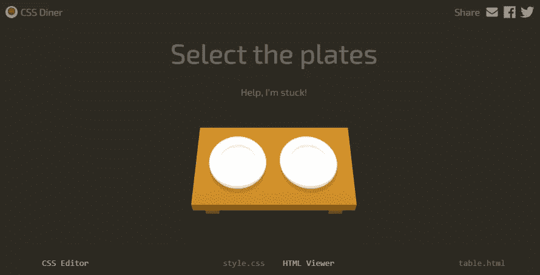
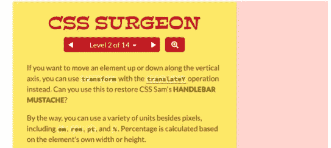
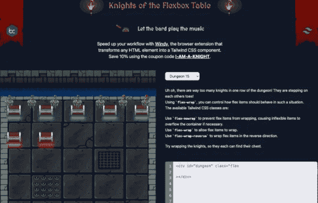
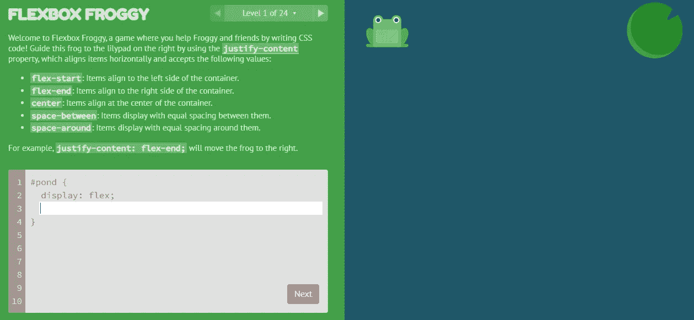
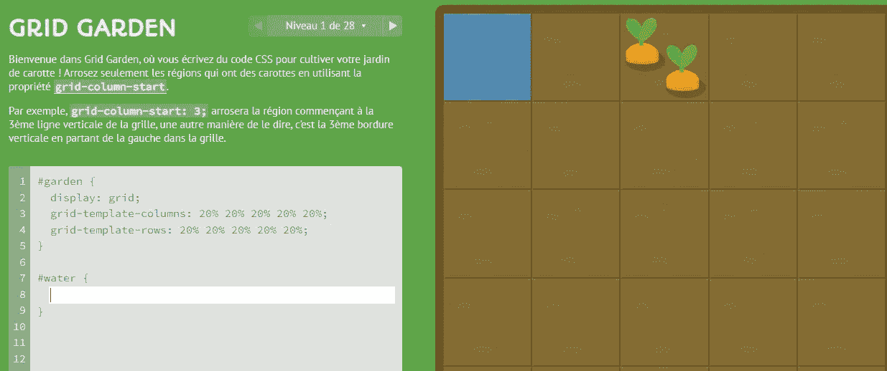
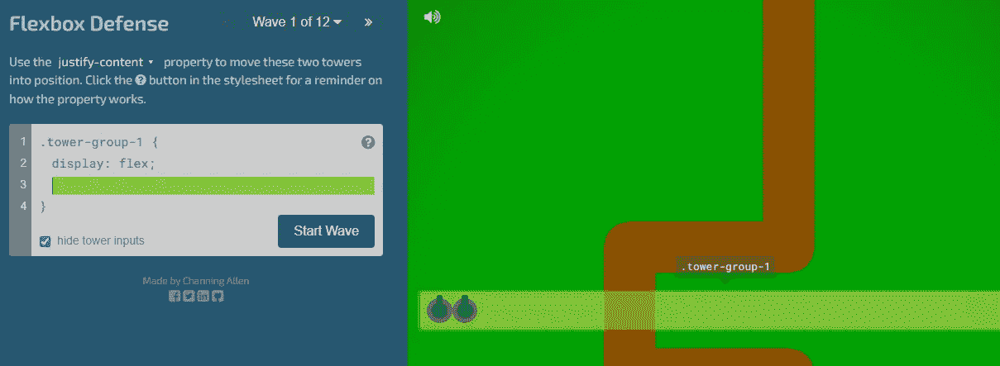
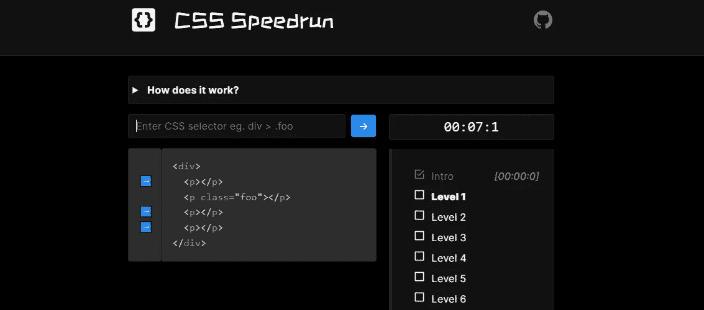
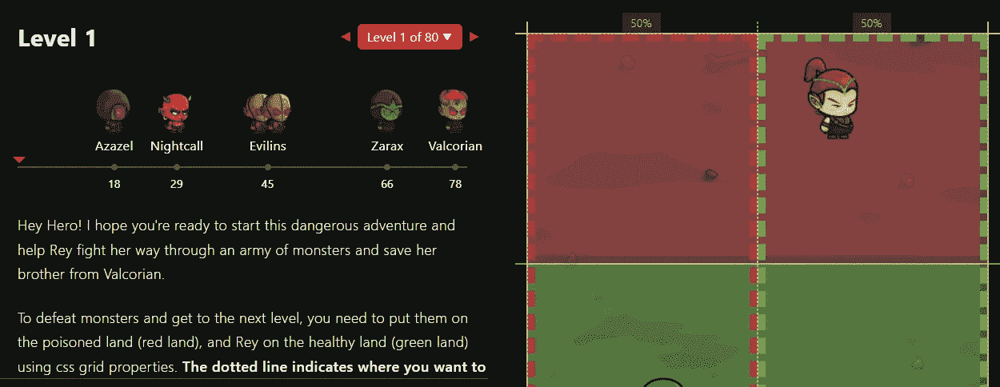
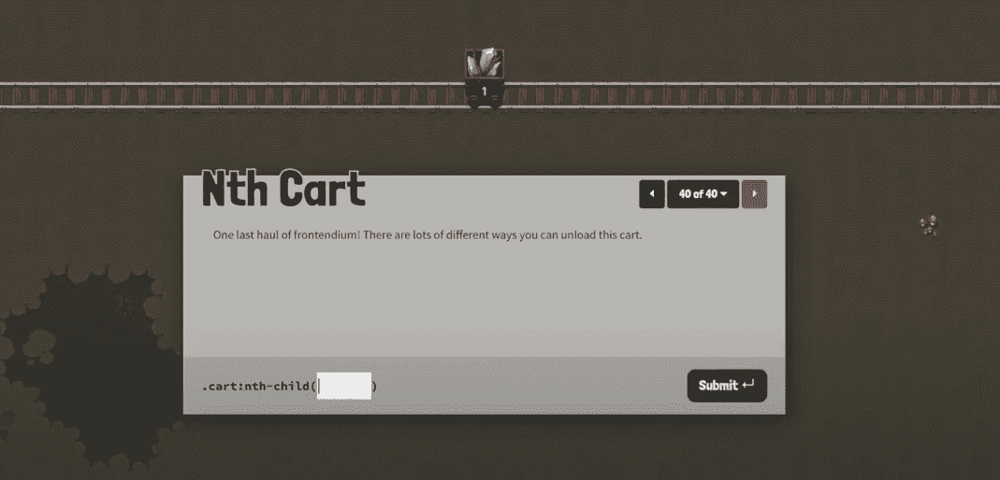

# 2022 年你应该玩的 9 款超棒的 CSS 游戏

> 原文：<https://javascript.plainenglish.io/9-awesome-css-games-that-you-should-play-in-2022-6809ca8df058?source=collection_archive---------14----------------------->

## 神奇的游戏，帮助开发者轻松学习 CSS。

Photo by [Louise Viallesoubranne](https://unsplash.com/@louisemink?utm_source=medium&utm_medium=referral) on [Unsplash](https://unsplash.com?utm_source=medium&utm_medium=referral)

CSS 是一种非常棒的样式表语言，每个 web 开发人员都必须知道。它可以让我们设计网页风格，让网页更具响应性，等等。CSS 的美妙之处在于它有很多你需要知道的强大特性和概念。

学习 CSS 有时会有点挑战性。有很多概念和属性需要学习。没有捷径，如果你想提高你的技能，你必须潜心学习这门语言并练习它。

现在的好事情是我们有很多网络资源可以学习。然而，通过看视频或阅读文章来学习 CSS 有时会有点无聊。

这就是为什么你应该总是寻找有趣的方法来帮助你轻松地学习新技术。CSS 游戏是这些有趣的方式之一，可以帮助你学习和练习一些 CSS 技能。

在这篇文章中，我会给你列出一些你可以玩的有趣的游戏，以帮助你学习和练习 CSS。所以让我们开始吧。

# 1.CSS 晚餐

[CSS 晚餐](https://flukeout.github.io/)是一款很棒的游戏，可以让你轻松了解 CSS 选择器。

Image captured by the author from CSS Dinner.

这个游戏有将近 32 个关卡可供你玩。所有这一切都与惊人的动画，帮助您使用正确的选择器。这是掌握 CSS 中选择器的好方法。

# 2.CSS 外科医生

[CSS Surgeon](https://codepip.com/games/css-surgeon/) 是另一个非常有用的游戏，可以让你学习 CSS 变换。

Image captured by the author from CSS Surgeon.

这个游戏教你如何旋转、缩放和移动元素。所有这些都以有趣的方式让你享受学习 CSS 转换的乐趣。

# 3.Flexbox 表的骑士

如果你使用顺风，这个[游戏](https://knightsoftheflexboxtable.com/)会很有用。它教你如何使用顺风类灵活选择。

Image captured by the author from Knights of The Flexbox Table.

游戏几乎有 18 个级别，你可以尝试和学习。

# 4.Flexbox 青蛙

Flexbox Froggy 是一款很棒的 CSS 游戏，它将帮助你以一种非常有趣的方式轻松学习 Flexbox。它是由 [CodePip](https://codepip.com/) 创建的，作为一种更容易了解 CSS flexbox 属性的方式。

Image captured by the author from Flexbox Froggy.

该游戏有 24 个级别，你可以玩来提高你的 CSS flexbox 技能。

# 5.网格花园

[格子花园](https://cssgridgarden.com/)是 Codepip 的又一款惊艳游戏。它允许你以一种有趣的方式学习和练习 CSS Grid。

Image captured by the author from Grid Garden.

该游戏有 28 个级别，涵盖了许多 CSS 网格属性，作为一名 web 开发人员，您必须了解这些属性。

# 6.Flexbox 防御

[Flexbox 防御](http://www.flexboxdefense.com/)是一个快速了解 CSS flexbox 属性的神奇游戏。它有 12 个级别，教你很多关于 flexbox 的知识，如果你想练习和提高你的技能，它绝对值得。

Image captured by the author from Flexbox Defense.

# 7.CSS Speedrun

CSS Speedrun 是一款很棒的游戏，它教你如何编写针对 CSS 中特定元素的选择器。

Image captured by the author from CSS Speedrun.

这个游戏有 10 个关卡。除此之外，还有一个计时器，这意味着你必须尽可能快地编写选择器。所以这是一个具有挑战性和趣味性的游戏，你可以通过玩这个游戏来提高你的 CSS 选择器技能。

# 8.网格攻击

网格攻击是一个非常有趣的游戏，你必须把怪物放在红色的土地上才能打败它们。所有这些都是通过使用 CSS 网格属性实现的。

Image captured by the author from Grid Attack.

除此之外，游戏还有很多有用的 CSS 网格知识可以学习。它有 80 个级别，给你足够的机会和时间以有趣的方式学习 CSS Grid。

# 9.第 n 辆车

第 n 辆车是一个很棒的游戏，它可以让你以一种有趣而简单的方式了解 CSS 选择器。这个游戏是由 Codepip 开发的，有 40 个关卡可以玩。

Image captured by the author from Nth Cart.

# 结论

正如你在上面的列表中看到的，这些是一些有趣的游戏，你可以玩这些游戏来练习和提高你的 CSS 技能。你不必总是从视频和文章中学习。

*感谢您阅读本文。此外，如果您发现我的内容有用，而您不是媒体会员，您可以在此处获取您的媒体会员资格***(媒体推荐链接)以无限制访问所有内容并支持我们作为作者。**

* [## 通过我的推荐链接加入 Medium-Mehdi Aoussiad

### 作为一个媒体会员，你的会员费的一部分会给你阅读的作家，你可以完全接触到每一个故事…

mehdiouss.medium.com](https://mehdiouss.medium.com/membership)* 

***更多阅读:***

* [## 你应该知道的 7 个有用的 JavaScript 对象方法

### JavaScript 中需要了解的强大对象方法列表。

javascript.plainenglish.io](/the-7-useful-javascript-object-methods-that-you-should-know-d46c4d5f5d15)  [## 你可能从未用过的 9 个很棒的 CSS 属性

### 非常有用和有趣的 CSS 属性，你应该知道。

javascript.plainenglish.io](/9-awesome-css-properties-that-you-probably-have-never-used-8cc4c385c3c6) 

*更多内容请看*[***plain English . io***](https://plainenglish.io/)*。报名参加我们的* [***免费周报***](http://newsletter.plainenglish.io/) *。关注我们关于*[***Twitter***](https://twitter.com/inPlainEngHQ)*和*[***LinkedIn***](https://www.linkedin.com/company/inplainenglish/)*。加入我们的* [***社区不和谐***](https://discord.gg/GtDtUAvyhW) *。**