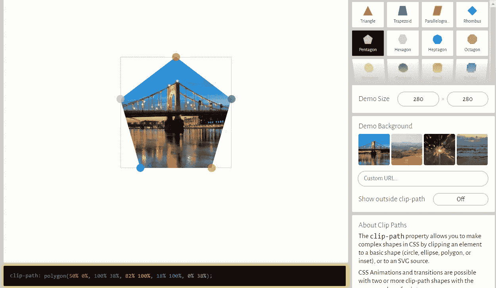
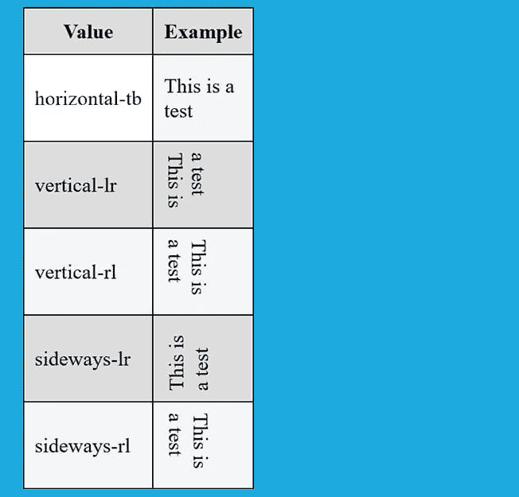
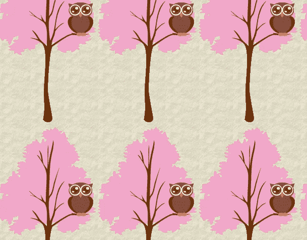
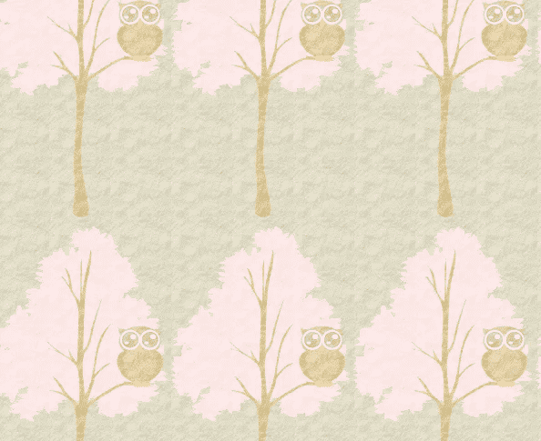

# 你可能从未用过的 9 个很棒的 CSS 属性

> 原文：<https://javascript.plainenglish.io/9-awesome-css-properties-that-you-probably-have-never-used-8cc4c385c3c6?source=collection_archive---------2----------------------->

## 非常有用和有趣的 CSS 属性，你应该知道。


Photo by [Afif Kusuma](https://unsplash.com/@javaistan?utm_source=medium&utm_medium=referral) on [Unsplash](https://unsplash.com?utm_source=medium&utm_medium=referral)

现在，web 上的每个网站或 web 应用程序都需要大量的 CSS 代码来使事情看起来漂亮和突出。我认为如果不使用 CSS，你永远不会有一个好的网页设计可以帮助你脱颖而出。

CSS 是一种非常有用的样式表语言，它允许你描述你的网站或 web 应用程序的外观。您可以轻松地设计网页样式，并使它们在所有设备上都能充分响应。

多年来，CSS 带来了许多新的特性和属性，使 web 开发人员的生活更加轻松。Flexbox、网格、新的有趣属性等等。CSS 在过去的几年里有了很大的改进，总有一些我们可能从未使用过或听说过的有趣的新属性。

这就是为什么在这篇文章中，我想与你分享一些有用和有趣的 CSS 属性，我没有看到许多开发人员谈论它们。你们中的一些人可能从未使用过它们。所以我们现在就去看看。

# 1.属性剪辑路径

属性`clip-path`非常有趣，它允许我们使用 CSS 创建不同类型的复杂形状(椭圆、圆形、多边形和其他不同的形状)。

属性使您能够通过定义应显示元素的哪些部分来创建复杂的形状。`clip-path`可以取不同的值，如形状函数和剪辑源。您可以在 [MDN](https://developer.mozilla.org/en-US/docs/Web/CSS/clip-path) 文档中了解更多关于该酒店的信息。

下面是一个代码语法示例:

```
**clip-path**: **polygon**(50% 0%, 100% 38%, 82% 100%, 18% 100%, 0% 38%);
```

如果你想使用属性`clip-path`轻松创建复杂的形状，我强烈推荐使用一个叫做[剪辑路径生成器](https://bennettfeely.com/clippy/)的工具。它是 100%免费的，允许你使用拖放功能创建形状。创建形状后，该工具会自动为您生成 CSS 代码。



Image Captured by the author from [bennettfeely](https://bennettfeely.com/clippy/)(external link).

# 2.写入模式属性

CSS 属性`writing-mode`允许你定义文本行是垂直布局还是水平布局。除此之外，它还允许设置块应该前进的方向。

所有主流浏览器都支持该属性，它可以采用以下值:

```
**horizontal-tb, vertical-rl, vertical-lr, sideways-rl, and sideways-lr**
```



Image created by the author.

下面是一个代码示例:

```
h1{
  **writing-mode: vertical-lr;**
}h2{
  **writing-mode: horizontal-tb;**
}
```

*输出:*

Pen by the author from [Codepen](https://codepen.io/)(external link).

# 3.属性用户选择

如果你想阻止用户高亮显示或选择网页上的文本，CSS 中的属性`user-select`很有用。属性定义是否可以选择元素的文本。

因为默认情况下，当你用鼠标双击文本时，它会被选中(高亮显示)。属性`user-select`可以用来防止这种情况发生。

下面是一个代码示例:

```
div{
 **user-select: none;**
}
```

# 4.对象匹配

属性`object-fit`允许您设置或定义如何调整[替换元素的](https://developer.mozilla.org/en-US/docs/Web/CSS/Replaced_element)内容(`img`、`video`等)的大小，以适应其容器。

所有主流浏览器都支持该属性。它可以取以下值:`***fill***, ***contain***, ***cover***, ***scale-down***, and ***none***` 。你可以在 [MDN 文档](https://developer.mozilla.org/en-US/docs/Web/CSS/object-fit)上了解更多关于这些价值观的信息。

下面的代码示例允许图像保持其纵横比并填充给定的尺寸。图像被裁剪以适合。

```
img{
 **object-fit: cover;**
}
```

看看下面的例子:

Pen by the author from [Codepen](https://codepen.io/)(external link).

# 5.属性背面-可见性

CSS 中的`backface-visibility`属性设置一个元素的背面在面向用户时是否可见。

当创建具有悬停效果的翻转卡片时，经常使用该属性。它可以取这两个值之一:`visible`或`hidden`。

下面是一个代码示例:

```
div{
 **backface-visibility: hidden;** }
```

你可以看看下面的 Codepen 例子:

Pen by the author from [Codepen](https://codepen.io/)(external link).

# 6.混合模式属性

CSS 属性`mix-blend-mode`是另一个没人谈论的有用属性。大多数 web 开发人员甚至不知道它。

因此，属性设置并定义元素的内容应该如何与父元素及其背景的内容混合。简单说吧，它定义了一个元素和它后面的另一个元素之间的融合。

这个属性有很多值，比如`normal`、`multiply`、`overlay`、`screen`等等。

下面是一个代码示例:

```
.parent img{
  position: absolute;
}

.parent h1 { 
  **mix-blend-mode: overlay;**
}
```

*输出:*

Pen by the author from [Codepen](https://codepen.io/)(external link).

# 7.背景混合模式

CSS 中的`background-blend-mode`是另一个有用的混合模式属性，它允许定义和设置元素的背景图像和背景颜色之间的混合。

该属性有许多值(*正常、相乘、加网等等*)，允许您设置不同的混合模式。除了旧版本之外，所有主流浏览器都支持它。

看看下面的例子:

*混合模式:正常*

```
div{
 background: url("tree.png"), url("paper.png");
 **background-blend-mode: normal;**
}
```

*输出:*



Image captured by the author.

*混合模式:叠加*

```
div{
 background: url("tree.png"), url("paper.png");
 **background-blend-mode: overlay;**
}
```

*输出:*



Image captured by the author.

# 8.物业位置-项目

CSS `place-items`属性是对属性`align-items`和`justify-items`的一个极好的简写。它允许您在布局系统(如 Flexbox 或 Grid)中轻松地在两个方向(行内和块)对齐元素。

属性可以同时接受两个值。但是，如果您只使用一个值，该值将自动用作第二个值。`place-items`属性可以取以下值:`center`、`start`、`end`、`stretch`等等。

下面是一个代码示例:

```
div{
 **place-items: center stretch;**
}
```

# 9.resize 属性

CSS 中的属性`resize`允许用户通过点击并拖动元素的右上角来调整元素的大小。因此它定义了用户是否可以调整元素的大小以及如何调整。

该属性经常用在`textarea`等元素上，用户可以方便地调整文本区域的大小来编写长格式文本。

有 4 个值可以与`resize`属性一起使用:

*   垂直:用户可以垂直调整元素的大小。
*   水平:用户可以水平调整元素的大小。
*   both:元素可以在两个方向上调整大小。
*   无:无法调整元素的大小。

下面是一个代码示例:

```
textarea{
 **resize: none;**
}
```

# 结论

正如你在上面的列表中看到的，CSS 有很多有趣的属性，很多开发人员没有使用或者不知道。你学习 CSS 越多，你就越发现有很多东西要学。CSS 是一种很棒的样式表语言，它有很多功能，我们可以用它来让网页变得更漂亮。我们只需要一直保持更新，不断学习新的东西。

*感谢您阅读这篇文章。此外，如果您发现我的内容有用，并且您不是媒体会员，您可以在此处获取您的媒体会员资格*[](https://mehdiouss.medium.com/membership)**(媒体推荐链接)以无限制地访问媒体上的所有文章，并支持我们作为作家。**

*[](https://mehdiouss.medium.com/membership) [## 通过我的推荐链接加入 Medium-Mehdi Aoussiad

### 作为一个媒体会员，你的会员费的一部分会给你阅读的作家，你可以完全接触到每一个故事…

mehdiouss.medium.com](https://mehdiouss.medium.com/membership) 

**延伸阅读:**

[](/6-awesome-css-shorthand-properties-that-you-probably-dont-know-f593b21ebf3) [## 你可能不知道的 6 个很棒的 CSS 速记属性

### 每个开发人员都应该知道的有用的 CSS 速记属性列表。

javascript.plainenglish.io](/6-awesome-css-shorthand-properties-that-you-probably-dont-know-f593b21ebf3) [](/7-free-react-templates-you-can-use-for-your-projects-fb041304bf90) [## 7 个免费的 React 模板可以用于您的项目

### 真棒 React 模板和主题，你可以开始建立你的下一个项目。

javascript.plainenglish.io](/7-free-react-templates-you-can-use-for-your-projects-fb041304bf90) 

*更多内容请看*[***plain English . io***](http://plainenglish.io/)*。报名参加我们的* [***免费周报***](http://newsletter.plainenglish.io/) *。在我们的* [***社区***](https://discord.gg/GtDtUAvyhW) *获得独家获得写作机会和建议。**