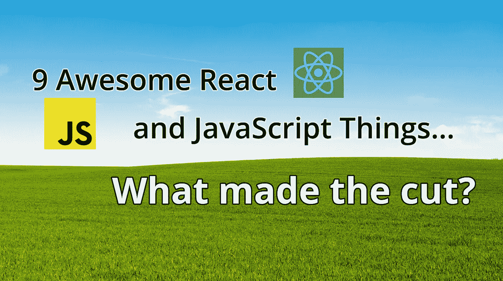

# 9 个令人敬畏的反应&令人兴奋的 JavaScript 事情

> 原文：<https://javascript.plainenglish.io/9-awesome-react-javascript-things-to-be-excited-about-1ffb07e4fddc?source=collection_archive---------11----------------------->

## 这里列出了新老 JavaScript 开发人员需要关注的一些事情。

original image by author

无论您是 JavaScript 新手还是经验丰富的老手，以下是未来几年需要关注的事项。错过了你最喜欢的工具/平台？请在评论中告诉我们！

这个列表是为所有用过 JavaScript 或者对它感兴趣的人准备的！在过去的几年里，一些真正伟大的技术已经问世。

找一个新的副业或理由开始使用清单上的一些东西。它可能会改变你的生活。

让我们从全栈开发人员开始吧。

# tRPC — [https://trpc.io](https://trpc.io/)

你有没有觉得 GraphQL 很烦人或者很麻烦？

如果我告诉你有更好的方法呢？

使用 tRPC，您可以为您的 Next.js、React 和 Node.js 应用程序构建可靠和安全的 API 接口。

tRPC 是端到端类型安全的，因此您可以在编译时而不是运行时发现前端和后端之间的编码错误。

tRPC 旨在与 TypeScript 全栈应用程序一起工作。您的前端 API 实现为强类型的 TypeScript 服务器端函数。tRPC 客户端 API 本质上是 API 的 SDK，这要归功于类型签名。

使用 tRPC 在边缘为你的前端获取数据。

说到边缘，我们来谈谈 JavaScript 框架中的新黄金标准。

# next . js—[https://nextjs.org/docs/](https://nextjs.org/docs/)

有很多内容要讲，所以请系好安全带。我将介绍亮点以及我认为 Next.js 的特别之处。

# 图像和字体优化

我不想优化我创建的每个页面上的资产。优化资产应该很容易。Next.js 有那个。你放入一张图片，它会自动调整大小。当布局发生偏移时，您不必担心。此外，它有懒惰的负荷！

# API 服务器内置

在 pages/api 文件夹中，我可以指定 api 端点。以下是一些很好的用法:

1.  API 中间件允许我改变一个请求(例如，它的头),向不同的服务器发出另一个请求。
2.  我想从其他域请求资源，但是 CORS 阻止了我。Next.js 可以使用`pages/api`来处理它。

在前端构建您的 TypeScript API，它可以全局伸缩，并自动从 IDE 项目中为每个浏览器窗口加载大小正确的图像。

# 环境变量

Next.js 应用程序有两个环境:浏览器和服务器。如果愿意，您可以查看捆绑代码中的环境变量；服务器变量是隐藏的，因为用户无权访问远程主机及其代码。

js 允许我创建这两个 env 变量，而无需设置 Webpack 或安装库来处理它们。

# 基于文件名的路由

Next.js 处理每个带有扩展名的文件。js“，”。jsx“，”。ts”，或者”。tsx "作为路由，自动使用文件系统进行路由。

你知道，如你所料？最后，一个有意义的 JavaScript 框架。

要知道，Next.js 做得好的是托管。

# vercel Hosting—[https://vercel.com](https://vercel.com/)

使用 Vercel，部署网站或应用程序非常简单。您再也不必担心诸如服务器不可用之类的问题，因为您可以即时部署您的业务站点。

它还配备了自动缩放功能，因此您的网站将始终拥有足够的计算能力来支持它，无论它变得多么受欢迎。

开发人员可以将他们的项目设置到他们的自定义域(或免费的 URL)和免费的 SSL 证书，自动加密服务器和客户端之间的数据。

开发人员可以托管静态网站和 web 应用程序，这些网站和应用程序部署在每个 push 或 pull 请求上，以便直接使用 Vercel 预览更改。

带有 Next.js 的 Vercel 组合使它成为了一个无头 WordPress 网站的最佳平台。有了 WordPress，你可以建立一个完整的或者无头的网站。此外，WordPress 内置的 REST API 可以在无头架构中获取内容，允许以这种方式使用 WordPress。

所以你知道对于一个无头 CMS 来说什么比 WordPress 更好吗？

# strapi—[https://strapi . io](https://strapi.io/)

他们的口号是，无头 CMS 开发者会喜欢，你可以看到为什么。

Strapi 是一个基于 Node.js 的开源无头 CMS。它有一个功能强大的管理面板和一个拖放界面，并为开发人员提供了一个可视化环境来创建他们的无头 CMS。

Strapi 允许开发人员构建自定义 api，并且可以与任何前端技术一起使用，如 React、Vue 或 Angular。

Strapi 内置了对最流行的开源数据库(MySQL、PostgreSQL、MongoDB)的支持，但它也通过其适配器系统支持任何其他数据库。

它可以与 Stripe 集成，但由于其模块化架构和适配器系统，也可以连接到任何计费系统。

如果你不做服务器端渲染，需要一个静态选项，该怎么办？

# Cloudflare 页面—【https://pages.cloudflare.com 

Cloudflare Pages 是一个 JAMstack 平台，用于前端开发人员协作和部署网站。它由 Cloudflare 提供支持，后者对性能略知一二。

使用页面使协作变得简单。

我喜欢使用页面来托管静态站点，这里有更多的理由来说明为什么它是一个很棒的服务。

它是免费的。

它很快。

很简单。

您可以在几分钟内构建一个站点，并让您的团队开始在 Git 中开发代码库。有了 Pages，您的站点就直接部署到了边缘，离客户只有几毫秒的距离，并且在全球范围内运行。

你可能会问，无服务器怎么样？

Cloudflare 的全球无服务器平台 Cloudflare Workers 使前端开发人员可以轻松地用 JavaScript 为他们的应用程序构建可扩展的后端。

工人成本低至 5/1000 万美元的请求，比其他无服务器平台便宜十倍；每天前 100，000 个请求是免费的。

说到托管不是 Node.js 的东西，你还想要更多选择吗？

# Deno & Deno Deploy—[https://Deno . land](https://deno.land/)

不要使用 Node.js，考虑使用基于 V8、Rust 和 Tokio 构建的 Deno。

内置 TypeScript，支持 JSX，支持 WebAssembly，内置测试，默认安全，包含依赖注入器和代码格式化程序；换句话说，欢迎来到你需要的最后一个 JS 平台/框架/东西。

使用 Deno 时，您可以从运行时和包管理器中获益。此外，模块加载很容易，有点类似于 Golang 模块加载；放入一个网址。

Deno 可以用来替代以前用 Bash 或 Python 编写的实用程序脚本。

要不要谈谈部署速度？在不到十*秒*内完成全球部署！很难打破这个记录。

Deno 的目标是遵循规范，尽可能使用现有的 web 平台 API。有时，由于安全模型的原因，稍微偏离一下是有意义的。然而，它有一套很棒的标准模块，保证能正常工作。

想要更多的编译器框架选项吗？

# 苗条— [https://svelte.dev](https://svelte.dev/)

Svelte 是你前端的编译器。Deno 紧随其后，Svelte 是 JavaScript 最受欢迎的框架。

想要比没有虚拟 DOM 反应更快的东西吗？当你编译一个苗条的应用程序时，特定于苗条的代码被翻译成 JavaScript，由浏览器执行。Svelte 首先是一个编译器。

Svelte 通常比 VanillaJS 需要更少的代码，执行起来也一样快。Svelte 不仅仅是另一个 JavaScript 框架。

在编译时，Svelte 获取 HTML、CSS 和 JavaScript 组件，并将它们构建成微小的 JavaScript 模块。

它使用组件模板的静态分析来保证浏览器执行尽可能少的动作。

很好，但是如果你需要一个与前端捆绑在一起的后端框架呢？

# Remix — [https://remix.run](https://remix.run/)

混音已进入聊天。

Remix 是一个类似 Svelte 的编译器，构建在 React 路由器之上和周围。

但是等等，还有更多。Remix 是一个前端和后端框架。Remix 比 Next.js 更固执己见，但没有 Angular 固执己见。

作为服务器端 MVC 框架的 Remix 覆盖了应用程序的视图和控制器部分，将模型留给了您。

支持很多支持 JavaScript 的数据库，包括 ORM 和库。

您还可以通过 Remix 的 Fetch API 助手获得 cookie 和会话管理。

Remix Stacks 是学习 JavaScript Fullstack 开发的另一个很棒的特性。它们是使用 Remix CLI 生成的，提供快速简单的项目创建。

几个内置和官方栈都是全功能应用，超级容易上手。

Remix 的特别之处在于，它可以运行在 Vercel 或 Netlify 这样的任何 Node.js 服务器上，也可以运行在 Cloudflare Workers 和 Deno Deploy 这样的非 Node.js 环境上。

# Vite — [https://vitejs.dev](https://vitejs.dev/)

让我们讨论一下构建工具。你想要最好的吗？用 Vite。

停止使用 Webpack，改用 Vite。

停止使用 Snowpack，改用 Vite。

Vite 采用了一种独特的方法，不使用 JavaScript bundler。相反，我们发现它使用了一个名为 Esbuild 的包。

用 Golang 编写的 Esbuild 比基于 JavaScript 的捆绑器快 100 倍。

Vite 可以根据路径确定必须加载哪些代码段。因此，它不需要重新捆绑所有东西。

Vite 是一个*无捆绑器*构建工具。

有了 Vite，你可以把你的 HMTL/CSS/JS 转换成原生 ESM。支持 ES 模块的现代浏览器可以自动加载正确的代码。

当你开始使用 Vite 时，你会发现这是一个非常好的层，支持浏览器端所有最新的东西，但位于前端和后端之间。

有了 Vite，你就能创造伟大的东西。

Vite 是最后一名，但这份名单上的第十件事值得一提。

# 二等奖；荣誉奖；H 奖

用 JS 做前端，用另一种语言如 Ruby 或 PHP 做后端全栈？

# https://inertiajs.com

这是一个轻量级的模块化解决方案，可以轻松地与任何服务器端技术集成。它可以让您使用 React、Vue 和 Svelte 应用程序创建单页面应用程序体验。

此外，Inertiajs 还有两个官方支持的全栈框架适配器，分别用于 Rails 和 Laravel。Inertiajs 使我们能够将现代 JavaScript 框架集成到您的后端模块中。

你猜怎么着？Inertia.js 是用 Vite 搭建的。看到这一切是如何联系在一起的了吗？

*喜欢文章？给它鼓掌👏，关注* [*Twitter*](https://twitter.com/intent/follow?screen_name=llbbl) *，注册*[*Medium*](https://blog.llbbl.com/membership)*，加入*[*phpops*](https://www.phpops.dev/subscribe/)*上的 DevOps 社区。*

*查看我的项目，*[*keywords . direct*](https://keywords.direct/)*—AI 生成，SEO 优化的博客标题。包括这篇文章标题！*

*更多内容请看*[***plain English . io***](https://plainenglish.io/)*。报名参加我们的* [***免费每周简讯***](http://newsletter.plainenglish.io/) *。关注我们关于* [***推特***](https://twitter.com/inPlainEngHQ) ， [***领英***](https://www.linkedin.com/company/inplainenglish/) *，以及* [***不和***](https://discord.gg/GtDtUAvyhW) *。*