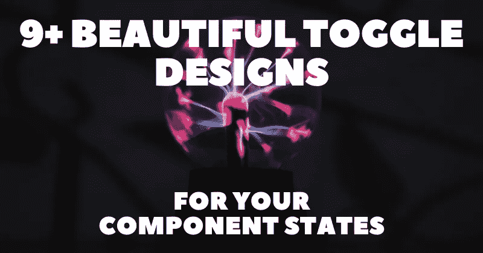

# 9+漂亮的组件状态切换设计😍✨

> 原文：<https://javascript.plainenglish.io/9-beautiful-toggle-designs-for-your-component-states-2716af3fe1ee?source=collection_archive---------5----------------------->

拨动开关是用于控制两个互斥状态(例如，开和关)的组件。切换可用于在应用程序中的暗模式和亮模式之间切换，启用或禁用控制中心设置，以及许多其他情况。

在这篇文章中，我整理了一些我最喜欢的定制 toggle 设计，以激发你自己的创作。策展的重点是对细节的关注和用来给参观者留下专业印象的动画。

对于每个切换设计，我将提供一个直接链接，一个交互式预览，以及作者链接，所以你也可以探索他们的工作。

## [3D 橙色开关](https://codepen.io/ykadosh/pen/jOwjmJe)

作者:[约夫·卡多什](https://codepen.io/ykadosh)

## [让那里有光](https://codepen.io/dilums/pen/eYgPrNq)

作者:[迪卢姆·桑佳亚](https://codepen.io/dilums)

## [不可能的复选框](https://codepen.io/jh3y/pen/ZjLKGY)

作者: [Jhey](https://codepen.io/jh3y)

## [日夜拨动开关](https://codepen.io/aybukeceylan/pen/QWWrbyK)

作者:[艾布克·塞兰](https://codepen.io/aybukeceylan)

## [电源开关动画](https://codepen.io/milanraring/pen/KKwRBQp)

作者:[米兰·拉宁](https://codepen.io/milanraring)

## [飞行模式拨动开关](https://codepen.io/Kia8/pen/dyPLpaP)

作者: [Kiarash Zarinmehr](https://codepen.io/Kia8)

## [快乐和悲伤的开关](https://codepen.io/kLeosrisook/pen/VweNjrV)

作者:[卡莉娅达](https://codepen.io/kLeosrisook)

## [打开/关闭 CSS 无线电开关](https://codepen.io/nickbottomley/pen/ndqVQP)

作者:[尼克·博顿利](https://codepen.io/nickbottomley)

## [切换组](https://codepen.io/oliviale/pen/xxboXzo)

作者:[吴小燕](https://codepen.io/oliviale)

写作一直是我的激情所在，帮助和激励他人给我带来了快乐。如果您有任何问题，请随时联系我们！

在 [Twitter](https://twitter.com/madzadev) 、 [LinkedIn](https://www.linkedin.com/in/madzadev/) 和 [GitHub](https://github.com/madzadev) 上给我接通！

访问我的[博客](https://madza.dev/blog)获取更多类似的文章。

*更多内容看* [***说白了。报名参加我们的***](https://plainenglish.io/) **[***免费周报***](http://newsletter.plainenglish.io/) *。关注我们关于* [***推特***](https://twitter.com/inPlainEngHQ)[***领英***](https://www.linkedin.com/company/inplainenglish/)**和* [***不和***](https://discord.gg/GtDtUAvyhW) ***。******