# 你需要知道的 9 个控制台方法(不包括 console.log())

> 原文：<https://javascript.plainenglish.io/9-console-methods-excluding-console-log-you-need-to-know-f8fc97770d3a?source=collection_archive---------9----------------------->

## 控制台对象非常适合调试！

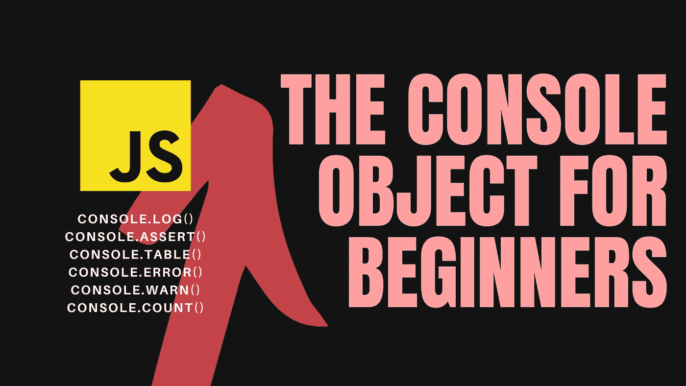

早上好，我的开发者伙伴们，

今天，我们要提高我们的调试技巧。我们将回顾 9 个简单易懂的控制台方法，希望它们能让我们看起来不像新手。

让我们开始吧。

# 控制台对象

到目前为止，您肯定已经浏览了许多 YouTube 视频、博客文章和论坛，并且看到其他开发人员使用了`console.log()`方法。我们所有人——无论是新手还是专家——都无时无刻不在关注我们的程序何时终止、导致错误、陷入循环等等。

如果不清楚，`console`是一个对象，使用点符号，我们访问控制台对象的`log`方法(或函数)。根据这一原理，我们可以理解，除了 log 方法之外，console 对象还提供了其他方法，可以帮助我们调试代码。

我们将要介绍的方法包括:

*   `console.error()`
*   `console.warn()`
*   `console.assert()`
*   `console.count()`和`console.countReset()`
*   `console.time()`和`console.timeEnd()`
*   `console.table()`

# console.error()

此方法用于将错误打印到控制台。

如果您使用一些编译器，如在线编译器 [Programiz](https://www.programiz.com/javascript/online-compiler/) ，您的控制台可能如下所示:

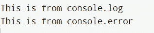

For some compilers, there may be no visible difference between different console methods

显然没有什么不同。他们看起来一模一样。你还不如直接用`console.log()`让你的生活更轻松。

然而，如果我们使用谷歌 Chrome 的 DevTools 并查看控制台，您应该会看到一个不同之处。*(要使用 DevTools: (1)在浏览器窗口中右键单击(2)单击‘Inspect’(3)导航至‘Console’选项卡)*

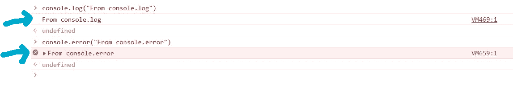

Screenshot of Google Chrome DevTools Console that showcases the difference between console error and console log

注意`console.error()`是如何用红色突出显示信息的。与`console.log()`方法不同，在错误消息之前还有一个红色的 X 符号。

如果您想将错误打印到控制台，并使这些错误在控制台中明显突出，则使用`console.error()`。

# console.warn()

接下来，我们有一个打印警告消息的方法。

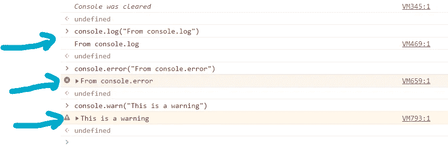

Screenshot of Google Chrome DevTools Console that showcases difference between console error, console log, and console warn

请注意，警告消息以黄色突出显示。并且在警告信息之前，还有一个黄色的警告符号。

现在，你可能想知道:什么时候我应该选择警告而不是错误信息？什么时候应该选择错误消息而不是警告消息？

一般来说，错误是停止编译的错误。您的程序将停止运行，因为它不能忽略这个错误。也许你试图使用一个不存在的变量。

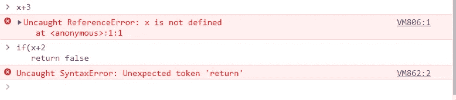

Screenshot of Google Chrome DevTools Console that showcases natural error messages provided by the browser

以下是浏览器提供的一些错误消息示例。如果你使用了一个不存在的变量，浏览器会给你一个红色的错误信息。如果您忘记了插入结束括号或花括号，您也会看到错误消息。像这样的错误，你的程序真的不能继续运行。

另一方面，有了警告，你的程序可以继续运行，因为错误不是致命的。也许你在问用户的年龄，他们的年龄是一个负数。

# console.assert()

`console.assert()`真酷。它有两个参数:一个计算结果为 true 或 false 的表达式和一条打印到控制台的消息。

如果表达式为 false，那么消息将被打印到控制台。

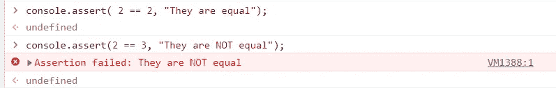

Screenshot of Google Chrome DevTools Console that shows console assert method

在第一个示例中，表达式(2 == 2)的计算结果为 true。因此，控制台上没有打印任何内容。在下一个示例中，表达式(2 == 3)的计算结果为 false。因此，该消息会打印在控制台上。

这是一个神奇的工具。

**你可以用它来验证一个变量是否为空(包含 null、undefined 或 0 的值)。**

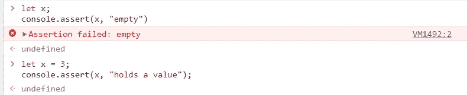

Screenshot of Google Chrome DevTools Console

**你可以用它来验证一个变量持有真值还是假值**。

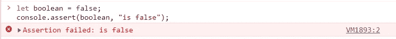

Screenshot of Google Chrome DevTools Console

您可以用它来理解为什么您的循环提前终止、从不执行，或者可能无限循环多次。这种方法有很多使用案例。

# console . count()& console . count reset()

这个方法很直观。这才算数。

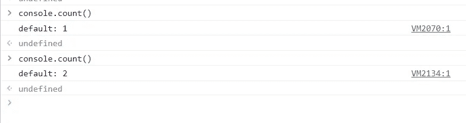

Screenshot of Google Chrome DevTools Console

你可以写`console.count()`无限多次，它就会计数。

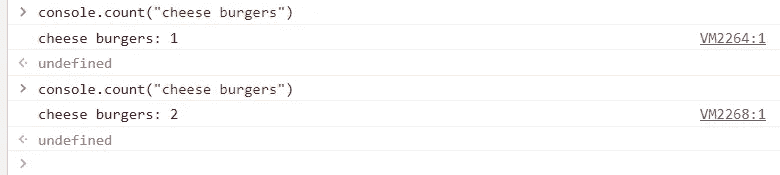

Screenshot of Google Chrome DevTools Console

如果你想计算不同的东西，你可以放一个标签作为参数。也许你想同时数芝士汉堡和汉堡！你肯定能做到。它将保持计数分离。

然后如果你想重置计数，你可以做`console.countReset()`

这对于循环肯定是有用的。

```
let arr = [0,1,2,3]
for(var i= 0; i<arr.length; i++){
    //code
    console.log("inside iteration " + i)
}
```

有太多的情况下，for 循环并没有像预期的那样工作。可能 for 循环不执行。也许它比我预期的要早结束，也许它比我预期的要晚结束。在很多情况下，我会使用 console.log 来确定我处于哪个迭代中。

这个方法`console.count()`在这里肯定行得通。

# console.time() & console.timeEnd()

这是另一个非常酷的控制台方法。如果您关心代码的时间复杂度和效率，这是一个适合您的方法。否则，你可能不会经常使用这个。

基本上，它是一个计时器。

使用`console.time()`，你启动计时器。使用`console.timeEnd()`停止计时器。

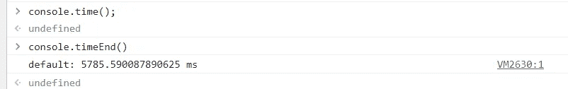

Screenshot of Google Chrome DevTools Console

这就是它的样子。

# console.table()

`console.table()`在控制台中创建表格。这个方法只接受一个数组或对象作为参数。这是可视化数组或对象的好方法。

让我们从简单的开始:**一个简单的数组。**

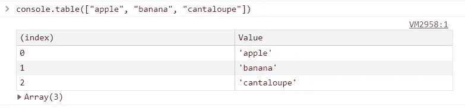

在这里，您可以看到数组索引及其对应的值。

接下来，让我们来看看这个**对象数组**。

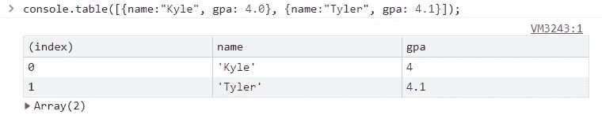

在这里，您可以看到每个属性都有自己的列，并且值显示得很整齐。

接下来，让我们看看表格如何组织对象。

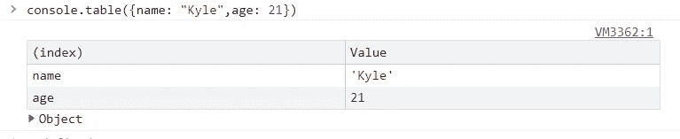

# console.clear()

最后，这里有一个你可能已经知道的额外方法:`console.clear()`用来擦除你的主机。执行此方法后，您可以从头开始。您的控制台将不再拥挤不堪。

非常感谢你和我一起学习。一定要亲自尝试所有这些方法。请记住，如果您看不到所有这些控制台方法之间的明显差异，请确保您使用的是浏览器的控制台。一些编译器和浏览器可能不支持这些控制台方法。

有关更多信息，请查看 [MDN Web 文档](https://developer.mozilla.org/en-US/docs/Web/API/console)。还有一些方法我没有在这篇博文中大声说出来，所以一定要检查一下。

再次感谢:)干杯

*更多内容看* [***说白了。报名参加我们的***](https://plainenglish.io/) **[***免费周报***](http://newsletter.plainenglish.io/) *。关注我们关于*[***Twitter***](https://twitter.com/inPlainEngHQ)*和*[***LinkedIn***](https://www.linkedin.com/company/inplainenglish/)*。查看我们的* [***社区不和谐***](https://discord.gg/GtDtUAvyhW) *加入我们的* [***人才集体***](https://inplainenglish.pallet.com/talent/welcome) *。***