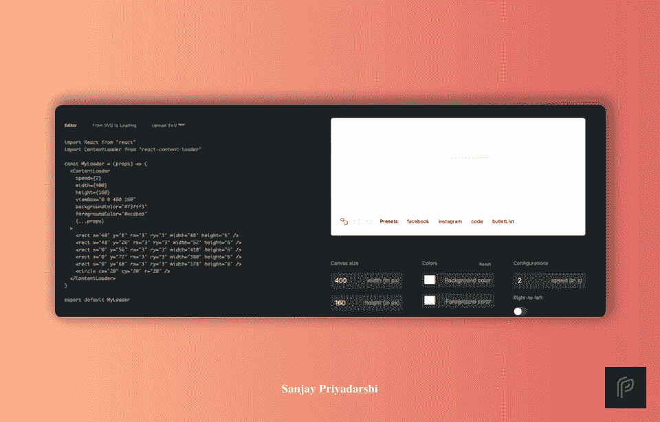
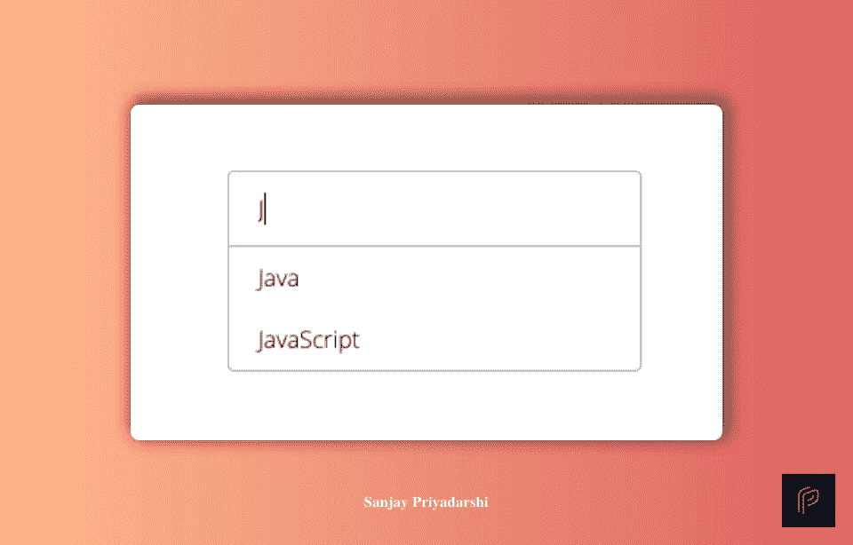
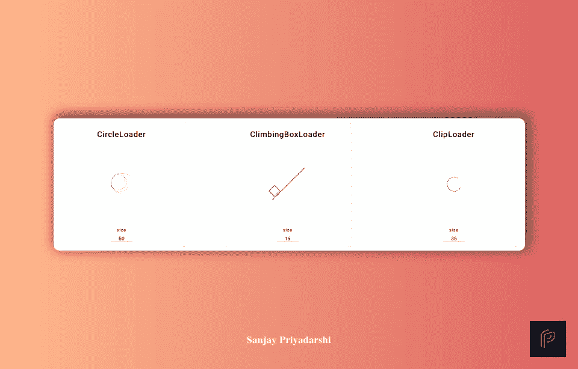

# 没有人谈论的 9 个破坏性反应库

> 原文：<https://javascript.plainenglish.io/9-disruptive-react-libraries-nobodys-talking-about-4699034dd506?source=collection_archive---------2----------------------->

## 这些库将为 Web 开发人员的生活增加巨大的价值

Photo by [Andrea Piacquadio](https://www.pexels.com/@olly?utm_content=attributionCopyText&utm_medium=referral&utm_source=pexels) from [Pexels](https://www.pexels.com/photo/portrait-photo-of-excited-man-in-blue-t-shirt-standing-in-front-of-white-background-3768724/?utm_content=attributionCopyText&utm_medium=referral&utm_source=pexels)

*这个故事的背后是 Medium 的* [*会员制付费墙*](https://help.medium.com/hc/en-us/articles/360017581433-About-the-metered-paywall) *，意思是作家通过合作伙伴计划赚取收入。喜欢在媒体上阅读？* [*购买会员资格*](https://sanjay-priyadarshi.medium.com/membership) *获取全部权限。*

React 不仅仅是另一个 JavaScript 库。

对于成千上万的开发者来说，这是爱情的别称。React 是最受欢迎的 JavaScript 库之一。

对 React 开发人员的需求正以惊人的速度增长。每个科技公司都想雇佣优秀的 react 开发人员。

在这里，我提到了 9 个改变游戏规则的 React 库，它们为开发人员的生活增添了价值。

# 1.甜蜜警报

Photo from [Sweetalert](http://sweetalert.js.org) Website

*   使用 [SweetAlert](http://sweetalert.js.org) ，您可以漂亮地替换成功消息。
*   有了这个库，您可以为错误消息和无聊的警告方式提供一个漂亮的替代品。
*   所有无聊和奇怪的警告信息都可以变成漂亮的信息。

# 2.反应查询

Photo from [React Query](http://react-query.tanstack.com)

*   使用 [React Query](http://react-query.tanstack.com) ，开发人员可以在 React 和 React 本地应用程序中恢复、缓存和更新数据。
*   最有趣的部分是，你甚至不需要接触任何“全球状态”。您不需要编写任何逻辑来获取数据。
*   您只需要通知 react 查询，从哪里获取数据以及您希望数据有多新鲜。其余的由 React query 自动处理。不需要更多的配置。
*   你所需要知道的就是如何处理承诺和异步/等待。如果您知道这两者，那么您可以很容易地使用 React query。
*   你不需要管理全局状态。不需要理解减速器、标准化系统或重型配置。
*   你只需要传递一个函数来处理你所有的数据需求。从字面上看，你不需要做任何额外的事情。

# 3.对热吐司做出反应

Photo from [React-hot-toast](https://react-hot-toast.com)

*   使用 [React Hot Toast](https://react-hot-toast.com) ，您可以为您的反应请求添加漂亮的通知。
*   使用方便，重量轻。它的重量不到 5KB。
*   它带有表情符号支持，你可以定制它，而不需要付出很大的努力。
*   功能包括悬停暂停和无头挂钩。

# 4.反应骨架

Photo from [React Skeleton](https://skeletonreact.com/)

*   使用 [React Skeleton](https://skeletonreact.com) ，您可以轻松创建动画骨架屏幕组件。
*   React Skeleton 帮助你取代通常的加载，为用户提供更好的体验。
*   它提供了页面的线框，作为任何类型的内容和图像的占位符框。
*   它支持 React，React Native，Vue 和 Vanilla HTML。

# 5.反应挂钩形式

Photo from [React Hook Form](https://react-hook-form.com/)

*   使用 [React Hook Form](https://react-hook-form.com/) ，您可以减少需要编写的代码量，同时消除不必要的重新渲染。
*   您将获得隔离组件重新呈现的能力，这将提高页面甚至应用程序的性能。
*   在创建用户表单的用户体验中，性能扮演着重要的角色。
*   有了这个库，您将能够订阅单个输入和表单状态更新，甚至不需要重新处理整个表单。

# 6.反作用运动

Photo from [React Motion](https://github.com/chenglou/react-motion) Github

*   有了[反应动作](https://github.com/chenglou/react-motion)，你就可以解决你的动画问题了。
*   一旦你开始使用这个库，你就不会陷入像中断动画行为这样的情况。
*   这也简化了 API。你将升级你的动画游戏。

# 7.反应无限滚动器

Photo from [React Infinite Scroller](https://danbovey.uk/react-infinite-scroller/)

*   通过 [React 无限滚动条](https://danbovey.uk/react-infinite-scroller/)，你可以使用 React 组件无限加载内容。
*   网格和列表项都包括在内。
*   这允许您通过支持窗口和可滚动元素来创建一个简单和轻量级的无限滚动元素。
*   您不需要指定元素高度。
*   还支持“聊天记录”(反向)模式。
*   它已经过全面测试，每天都有成千上万的网站在使用。
*   与其他可用选项相比，它非常轻便。

# 8.反应自动建议

Photo from [React Auto Suggest](http://react-autosuggest.js.org/)

*   使用 [React Auto Suggest](http://react-autosuggest.js.org/) ，您可以轻松地为您的用户提供自动建议选项。
*   符合 WAI-ARIA 标准的[支持 ARIA 属性和键盘交互。](https://rawgit.com/w3c/aria-practices/master/aria-practices-DeletedSectionsArchive.html#autocomplete)
*   它是完全移动友好的。
*   它支持自定义建议呈现、多个部分和各种其他东西。

# 9.反应旋转器

Photo from [React spinners](https://www.davidhu.io/react-spinners/)

*   它是加载微调器的集合。
*   每个加载程序都有自己的默认属性。您可以通过将属性传递给加载器来覆盖默认值。
*   如果 loading 为 false，加载程序将呈现 null。

[点击这里](https://codertoentrepreneurs.substack.com)加入一个由热爱编程和技术的人组成的社区。喜欢在媒体上阅读？[购买会员资格](https://sanjay-priyadarshi.medium.com/membership)获得全部权限。

 [## 通过我的推荐链接加入 Medium-Sanjay Priyadarshi

### 作为一个媒体会员，你的会员费的一部分会给你阅读的作家，你可以完全接触到每一个故事…

sanjay-priyadarshi.medium.com](https://sanjay-priyadarshi.medium.com/membership) 

*更多内容请看*[***plain English . io***](http://plainenglish.io/)*。报名参加我们的* [***免费周报***](http://newsletter.plainenglish.io/) *。在我们的* [***社区***](https://discord.gg/GtDtUAvyhW) *获得独家获得写作机会和建议。*