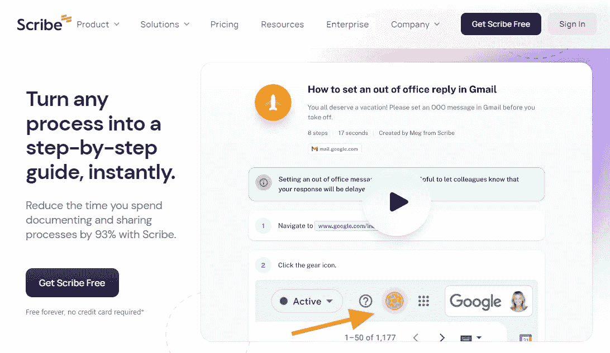
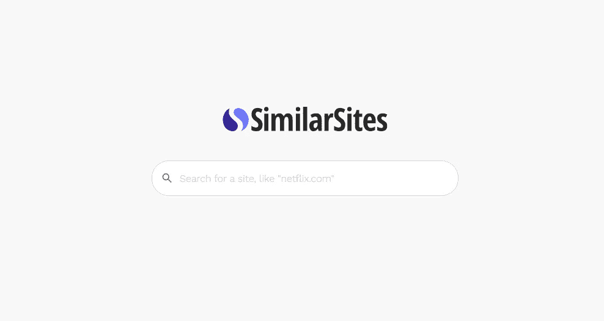
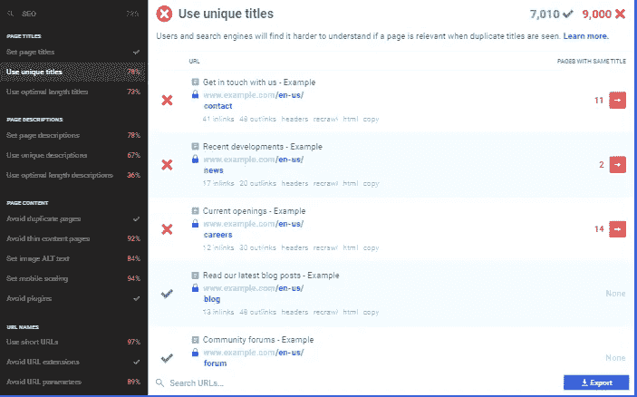
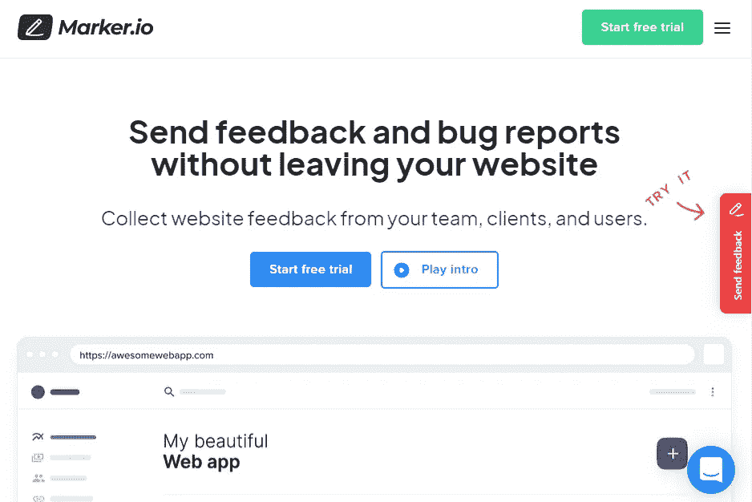
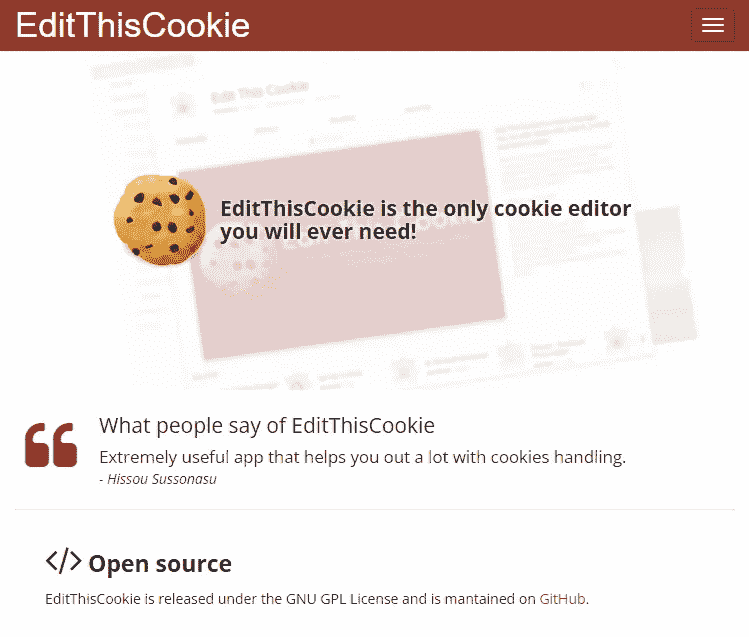
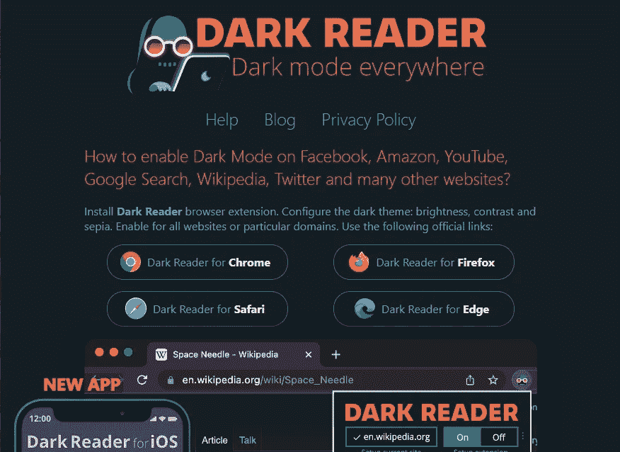

# 9 个免费的 Chrome 扩展，让每个 Web 开发人员都能充分发挥生产力

> 原文：<https://javascript.plainenglish.io/9-free-chrome-extensions-for-every-web-developer-to-unlock-full-productivity-18768f0f0126?source=collection_archive---------6----------------------->

## 您可能以前没有尝试过这些扩展。

Photo by [Stillness InMotion](https://unsplash.com/es/@stillnes_in_motion?utm_source=medium&utm_medium=referral) on [Unsplash](https://unsplash.com?utm_source=medium&utm_medium=referral)

最近，我写了 [14 个最好的教程](/14-insanely-free-web3-tutorials-youll-ever-find-on-the-internet-no-bs-7e07e8690ced)来帮助你开始使用 Web3，然后是 6 个易于开始的[编程方催促](https://medium.com/geekculture/6-easy-to-start-programming-side-hustle-to-earn-1-000-a-month-no-bs-34e2e8f58a38)每月赚 1000 美元以上，接着是 [7 个杀手级工具](https://medium.com/swlh/7-killer-tools-youre-probably-not-using-that-could-save-you-1-000-aecd9f37b216)可能会帮你节省 1000 美元甚至更多。

后来，我在寻找写另一篇博客的灵感，Twitter 派上了用场。更具体地说，我在 Twitter 上关注了一位开发人员，他刚刚提供了最好的 chrome 扩展来提高生产率。

老实说，我想和大家分享一下。我不想再更新或添加任何东西了，因为我想感谢所有这些 chrome 扩展的原创者。

所以这篇博客文章的全部功劳归于 [Pratham](https://twitter.com/Prathkum) ，他在 Twitter 上分享了所有这些扩展[。](https://twitter.com/Prathkum/status/1555248989523611649)

我们开始吧。

1.  [**划线方式**](https://scribe.how/chrome) :

瞬间将任何过程转换成一步一步的教程。您不需要手动解释该过程。简单地记录下来，ScribeHow 扩展会把它变成一个指南。

多酷啊，对吧？

**2。******:****

****

**Source: SimilarSites**

**大多数时候，我想搜索相同的网站或替代网站，以便发现理想的网站。**

**这时这个扩展就派上用场了。**

**最常见的是，我还能找到几个提供相同功能的免费网站。**

****3。**[**check bot**](https://checkbot.io)**:****

****

**Source: Checkbot**

**当我创建一个网站时，即使经过测试，我也可能会遇到某些问题。**

**例如，网站可能加载缓慢，包括损坏的页面链接，呈现阻塞的 JavaScript，或者缺乏独特的页面名称。**

**相信我，发现真相要困难得多。一些企业雇用特定的受众来了解所有这些问题，而其他企业则手动承担大量工作，并可能采用各种其他方法。**

**但是让我告诉你一个最简单的:使用这个扩展就可以了。**

**是的，它将帮助你识别搜索引擎优化，网页速度，甚至安全问题。**

****4。** [**瓦帕莱泽**](https://www.wappalyzer.com/) **:****

****

**Source: Wappalyzer**

**您可能已经发现自己处于这样一种情况，您希望了解更多关于网站的信息，比如它用来帮助用户的技术、框架和工具。**

**例如，您想了解更多关于`medium.com`采用的技术堆栈的信息。**

**为此，您可以使用这个扩展，它将帮助您几乎任何事情，包括编程语言、认证、支付处理器、javascript 框架、安全性等等。**

**如果你觉得很棒，就鼓掌 50 次，并留下评论。**

****5。** [**标记**](https://marker.io/) :**

****

**Source: Marker**

**我们大多数人都不想在工作时分心。而且，作为一名网络开发人员，我甚至不想离开我的网站或网络应用。**

**如果您是同类型的开发人员，这个扩展可能会很有用。**

**简而言之，你可以在不离开你的网站或网络应用的情况下，快速向你喜欢的工具报告问题。**

**是不是很奇妙？**

**因此，您现在可以更高效地工作:)**

****6。** [**编辑 ThisCookie**](https://www.editthiscookie.com/) **:****

****

**Source: EditThisCookie**

**如果你是一名网络开发人员，你可能会经常处理 cookies。这个扩展可能会有帮助。**

**顾名思义，您可以添加、删除、修改、搜索、保护和阻止 cookies！**

**7。 [**黑暗阅读器**](https://darkreader.org/) **:****

****

**Source: Dark Reader**

**让我问你一个简单的问题:你喜欢使用黑暗模式吗？**

**如果你问我，我会毫无疑问地说。我在所有设备上都使用黑暗模式。**

**如果你像我一样，通常你会使用一些不提供黑暗模式的网站，为此你可以安装这个扩展。**

**[**8。动作一**](https://motion.dev/) **:****

****

**Source: Motion One**

**是的，一个网站应该总是简单，互动，吸引消费者，添加动画是最好的方法之一。**

**另外，我不喜欢缺乏动画的网站。要添加动画，最好的扩展之一是 Motion One。**

**[**9。霍伊里奥**](https://www.heurio.co/) **:****

****

**Source: Heurio**

**作为一名 web 开发人员，我必须创建网站，使它们响应迅速，并经常添加一些功能。**

**这个插件在我的 web 开发道路上对我非常有用。**

**它是 UX 测试、设计和开发评审、启发式评估和用户测试的理想选择。**

**希望你喜欢。**

**就这样——谢谢。**

**如果你愿意，你可以免费获得我的 side hustle [电子书](https://nitinfab.gumroad.com/l/programming-side-hustle-book)。**

**[*如果你喜欢看这样的故事，并想帮助我成为一名作家，可以考虑成为一名中等会员*](https://nitinfab.medium.com/membership) *。它每月花费 5 美元，给你* [*无限制访问媒体内容*](https://nitinfab.medium.com/membership) *。如果你通过我的链接注册，我会得到一点佣金。***

** [## 11 愚蠢的简单的一面，作为一个程序员赚取额外的钱

### 没有废话，请不要期待博客，YouTube，自由职业者，或媒体。

javascript.plainenglish.io](/11-stupidly-simple-side-hustles-to-earn-extra-money-as-a-programmer-23fd30ca5cda)** 

***更多内容看* [***说白了就是***](https://plainenglish.io/) *。报名参加我们的* [***免费周报***](http://newsletter.plainenglish.io/) *。关注我们关于* [***推特***](https://twitter.com/inPlainEngHQ) ， [***领英***](https://www.linkedin.com/company/inplainenglish/) ，*和* [***不和***](https://discord.gg/GtDtUAvyhW) *。***