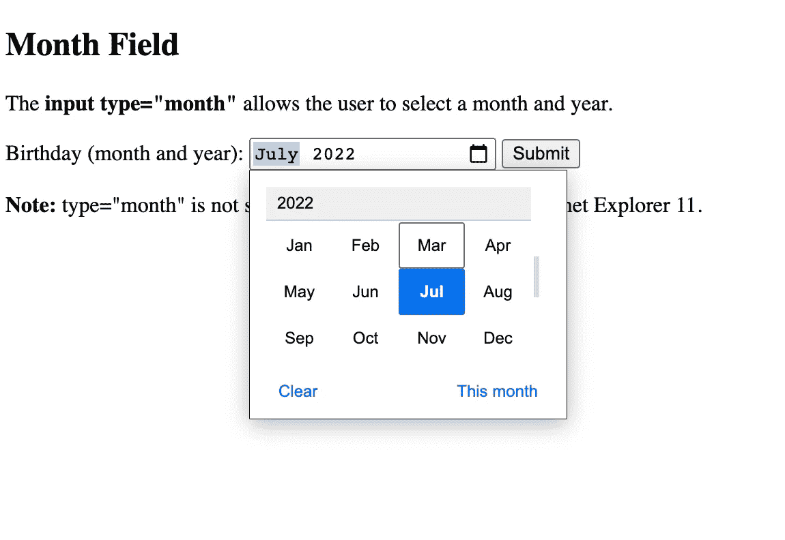

# 没有人谈论的 9 个 HTML 一行程序— 2022 版

> 原文：<https://javascript.plainenglish.io/9-html-tips-nobody-is-talking-about-2022-edition-b7c095029030?source=collection_archive---------3----------------------->

## 2022 年你应该知道的 HTML 标签和属性


Photo by [alan King](https://unsplash.com/@alanking?utm_source=medium&utm_medium=referral) on [Unsplash](https://unsplash.com?utm_source=medium&utm_medium=referral)

去年我写了一篇[文章](/5-html-tricks-nobody-is-talking-about-a0480104fe19)讨论一些不太流行的 HTML 标签和属性，我发现它们在我访问的大多数网站上都没有。

我在那篇文章中写道，不管你选择哪种框架或后端语言，所有的 web 开发人员都必须广泛使用 HTML(超文本标记语言)。

显然，自去年以来，HTML 的流行程度和影响范围没有任何变化。

无论你使用 Node.js、Django 还是 React，或者其他一些框架/库，你都需要了解 HTML 来构建 web 应用，甚至是基于 web 的应用。

然而，大多数开发者只是尽可能快地学习 HTML，这样他们就可以跳到“酷的东西”上，我也是那些自学成才的开发者之一。

因此，在这篇博客中，我将讨论一些有趣的、鲜为人知的 HTML 技巧和标签，它们是我从去年开始接触到的。

以下是 2022 年你应该知道的 9 个 HTML 技巧和标签:

## 1.后备图像

```

```

`onerror`属性可用于`img`,可用于提供后备图像或允许您处理无法正常加载的图像。

在上面的代码中，当加载图像出错时，我们将`display`属性设置为 none。通过将`display`设置为 none，我们实际上隐藏了图像。

在第二个例子中，我们将`src`属性更改为另一个图像*，这是默认的后备图像，我们可以在整个站点*中使用，让用户知道预期的图像无法加载。

## 2.从 HTML 直接调用

```
<a href="tel:123-456-7890">123-456-7890</a><a href="mailto:insertemailhere@xyz.com">Email</a>
```

您可以轻松实现从普通 HTML 直接调用或打开邮件应用程序的功能。

正如我在上面所展示的，你所需要做的就是设置`href`属性，就像我分别为 call 和 email 所做的那样。

很多次，我在登陆页面的联系人部分点击电子邮件或电话号码，但没有打开 apt 电子邮件应用程序或电话应用程序，它什么也不做。

出于隐私考虑，我不会分享任何这样做的网站，但你可以自由搜索你附近的商业或餐馆网站，并检查他们的联系方式。

顺便说一下，你也可以链接 JavaScript。

```
<a href="javascript:alert('Hello World!');">Execute JavaScript</a>
```

## 3.进度条

```
<label for="file">Downloading progress:</label>
<progress id="file" value="32" max="100"> 32% </progress>
```

不需要花哨的框架和 UI 库来实现一个简单的进度条；HTML 支持开箱即用。


Source: Author

每当出于可访问性目的使用进度标签时，添加标签是明智的。

值得注意的是,`<progress>`标签不适合仪表(例如圆空间的使用或查询结果的重要性)。要解决这个问题，请使用`<meter>`来代替。

## 4.缩略图图像

您可以为缩略图创建不同的图像，并在点按它时显示不同的图像。

这是通过使用与回退映像类似的方法来完成的。

```

```

如您所见，我们使用了`onclick`事件监听器，就像我们使用`onerror`事件监听器处理回退图像一样。

这可以用来优化网站和减少加载时间。

## 5.输入类型

```
<input type="button"> 
<input type="checkbox"> 
<input type="color"> 
<input type="date"> 
<input type="datetime-local"> 
<input type="email"> 
<input type="file"> 
<input type="hidden"> 
<input type="image"> 
<input type="month"> 
<input type="number"> 
<input type="password"> 
<input type="radio"> 
<input type="range"> 
<input type="reset"> 
<input type="search"> 
<input type="submit"> 
<input type="tel"> 
<input type="text"> 
<input type="time"> 
<input type="url"> 
<input type="week">
```

有这么多输入类型可用，但我们只使用少数如`submit`、`text`和`button`。

这些类型中有许多是不言自明的，但是有一些有趣的我直到最近才知道。

`Week`和`month`是两种可以派上用场的输入类型。



[Source](https://www.w3schools.com/html/tryit.asp?filename=tryhtml_input_month).

另一种有用的输入类型是颜色类型，它可以打开颜色选择器。

## 6.翻译

```
<p translate=”no”>Don’t translate this!</p><p>This can be translated to any language.</p>
```

translate 属性指定是否应该翻译元素的内容。

注意，并不是所有的浏览器都能识别这个属性，但是它受到自动翻译系统的尊重，比如 Google Translate。

这个属性派上用场的一个有用的例子是在品牌名称上使用它。

```
<span translate="no">BrandName</span>
```

## 7.海报

你的网站包含视频吗？如果是，海报属性将有助于提高视频播放器的整体美感。

视频播放器使用视频的第一帧作为视频的海报显示。但是，您可以使用普通的旧 HTML 来设置海报。

```
<video controls poster="/images/w3html5.gif">
  <source src="movie.mp4" type="video/mp4">
  <source src="movie.ogg" type="video/ogg">
  Your browser does not support the video tag.
</video>
```

`poster`属性帮助您设置在视频下载时或用户点击播放按钮之前显示的图像。

## 8.空索引文件

这实际上不是 HTML 技巧或标签，而是避免安全漏洞的一般 web 开发技巧。

直接公开资产或公共资产在所有框架中都很常见，但是，因为它是公开的，所以会导致安全风险。

您可以在这些公共文件夹中放置一个空的 index.html，以防止目录浏览。

## 9.使用人手不足的人

尽可能使用速记属性，以避免编写不必要的长文件。

```
p {
  border: 5px solid red;
}
```

这一行属性相当于设置`border-width`、`border-style`和`border-color`。

我很清楚这是一个 HTML 指南，但是很多像我一样的人经常把 CSS 直接写在我们的 HTML 文件中，这样更容易编写和理解不必要长的文件。

## 最后的想法…

这些天来，越来越多的框架成为关注的焦点，但是有一点仍然是普遍的，CSS 和 HTML 继续扮演着重要的角色。

HTML 和 CSS 对于构建优秀的网站来说绰绰有余，再加上一些 JavaScript，你可以创建一些令人惊叹的网站。

然而，你知道的越多越好，学习这些技巧和窍门会很有用。

如果你喜欢读这篇文章，考虑使用[我的推荐链接](https://medium.com/@anuragkanoria/membership)，这样你就可以通过点击[这里](https://medium.com/@anuragkanoria/membership)无限制地访问我的博客以及其他作者的博客。

如果你也计划使用 JavaScript，那么一定要看看我最近的博客。

[](/5-modern-javascript-tips-and-tricks-to-save-time-7773aff6be26) [## 节省时间的 5 个现代 JavaScript 技巧和窍门

### 使用这些 JavaScript 技巧减少工作量并编写干净的代码

javascript.plainenglish.io](/5-modern-javascript-tips-and-tricks-to-save-time-7773aff6be26) 

*更多内容看* [***说白了就是***](https://plainenglish.io/) *。报名参加我们的**[***免费周报***](http://newsletter.plainenglish.io/) *。关注我们关于*[***Twitter***](https://twitter.com/inPlainEngHQ)*和*[***LinkedIn***](https://www.linkedin.com/company/inplainenglish/)*。加入我们的* [***社区***](https://discord.gg/GtDtUAvyhW) *。**