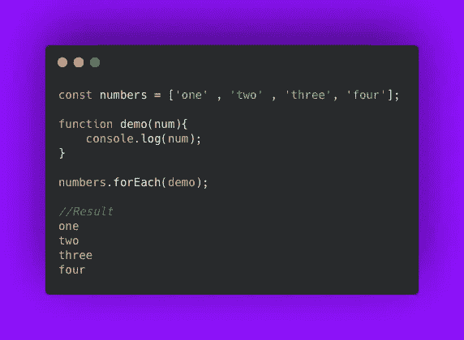
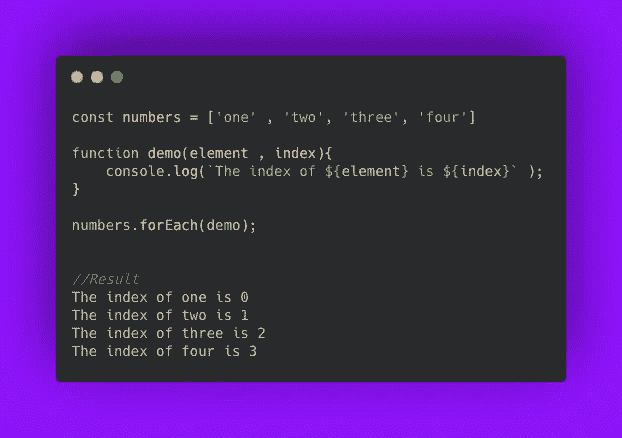
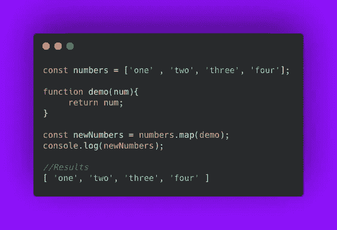
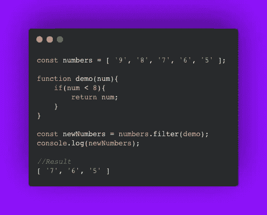
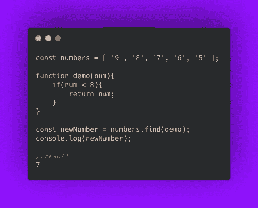
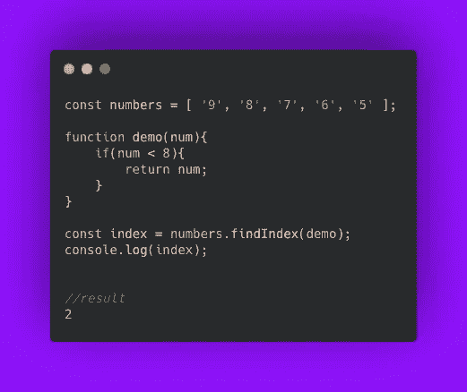
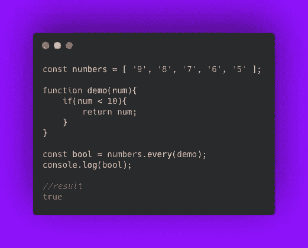
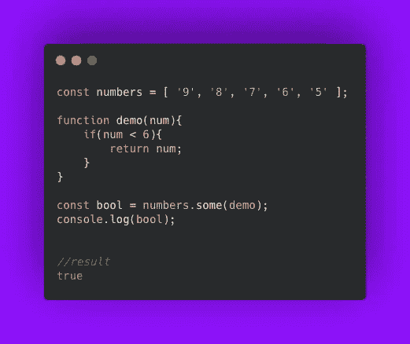
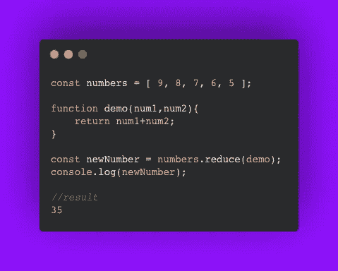
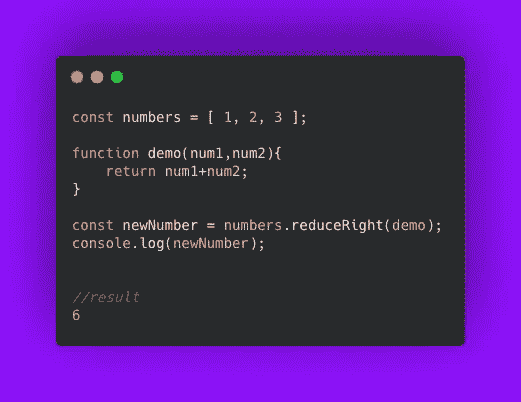

# 9 个 JavaScript 数组方法，让你像专业人士一样工作

> 原文：<https://javascript.plainenglish.io/9-javascript-array-methods-thatll-make-you-work-like-a-pro-f2e2d05f83d9?source=collection_archive---------4----------------------->

## 在大约 8 分钟的时间里，学习整个 JavaScript 迭代器方法系列


Photo by [Diva Plavalaguna](http://: https://www.pexels.com/photo/multiracial-men-in-a-fun-photoshoot-6150579/) from Pexels

有些数组方法会修改调用它们的数组。

一些数组方法保持调用它们的数组不变。

这就是为什么详细了解每个 JavaScript 迭代器方法非常重要，这里我将帮助您更好地了解它们。

# 1.Array.forEach()

`.forEach()`方法的工作方式类似于`for` 循环。

`.forEach()`方法以升序遍历数组的元素，不改变数组。

作为`.forEach()`的第一个参数，传递一个回调函数。为数组中的每个元素调用这个回调函数。

## 基本的例子。forEach()起作用

```
const numbers = ['one' , 'two', 'three', 'four'];
```

考虑上面用文字写的数字数组。

正如你所看到的，上面的数组名是`numbers`。

```
function demo(num){ console.log(num);}
```

上面的`demo()`函数将被用作回调函数。

这个函数只是把它收到的所有东西都记录为一个参数。

```
numbers.forEach(demo);
```

numbers.forEach(demo)为`numbers`中的每个可用元素运行演示函数，其中迭代的元素是第一个参数。

这样，`demo()`函数被调用了四次。

```
demo(‘one’)
demo(‘two’)
demo(‘three’)
demo(‘four’)
```

以下是将被记录的内容:

```
//result:
one
two
three
four
```



Basic .forEach() method example

## 数组的索引

`.forEach()`用三个参数执行回调函数。

第一个是当前迭代元素的值。

第二个是当前迭代元素的索引。

第三个是数组实例本身。

```
anArray.forEach(callback(element [, index [, anArray]]))
```

在上面的基本`forEach()`例子中，我们忽略了第二个和第三个参数。

一个例子:

```
const numbers = ['one' , 'two', 'three', 'four'];
```

包含单词中的数字的元素数组。

数组名为`numbers`。

```
function demo(element , index){ console.log(`The index of ${element} is ${index}`);}
```

`demo()`函数是回调函数。

它沿着元素的值记录索引。

```
numbers.forEach(demo);
```

将对`numbers`列表中的每个元素执行演示功能。

演示功能将对原始数组`numbers`的每个元素执行。

它将运行四次。

```
demo('one' , 0)
demo('two' , 1)
demo('three' , 2)
demo('four' , 3)
```

这将是结果:

```
//Results:
The index of one is 0
The index of two is 1
The index of three is 2
The index of four is 3
```



Index of array using forEach()

## 注意。forEach()

使用`array.forEach()`，在每个元素都被传递给所提到的函数之前，没有办法终止迭代。

在 for 循环的情况下，我们有一个`break`语句来终止迭代。`.forEach()`方法没有 break 语句。

# 2.Array.map()

`Array.map()`创建一个新的和修改过的数组版本，它在该数组上被调用。

`.map()`方法将数组中的每个元素带到所提到的函数中，并返回一个新的数组。

这个新数组将包含上述函数返回的值。

当您希望以某种方式修改数组的所有元素并返回一个新数组时，可以使用 map()方法。

## 一个例子

取一个包含数字作为元素的数组。

数组的名字是`numbers`。

```
const numbers = ['one' , 'two', 'three', 'four'];
```

假设`demo()`函数是这样写的:

```
function demo(num){ return num;
}
```

现在 map 函数在`numbers`数组上被调用，返回值被保存在一个名为`newNumbers`的新数组中。

```
const newNumbers = numbers.map(demo);
console.log(newNumbers);
```

的。map()方法将数组中的每个元素传递给`demo()`函数，结果如下:

```
//results
[ 'one', 'two', 'three', 'four' ]
```



Example of .map() method

## 注意。地图()

对于 map()方法，提到的函数必须返回值。

在使用`map()`方法的情况下，先前的数组不会被修改。

# 3.Array.filter()

顾名思义，这个方法帮助您根据特定的条件选择数组的元素。

它将返回一个数组，该数组是调用`.filter`的前一个数组的子集。

该函数传递给`Array.filter()`方法将根据条件返回 true 或 false。

如果返回的值是`true`或可转换为`true` 值。在这种情况下，传递给函数的元素将成为稍后返回的子数组的元素。

让我们借助一个例子来看看这一点。

```
const numbers = [ ‘9’, ‘8’, ‘7', ‘6’, ‘5' ];
```

现在我们编写演示函数来检查一个条件。

```
function demo(num){ if(num < 8) return num;
    }
}
```

现在我们要调用 filter 方法()。

将根据前面的条件进行过滤。

```
const newNumbers = numbers.filter(demo);
console.log(newNumbers);
```

这就是被归还的东西。

```
//result
[ '7', '6', '5' ]
```



Example of Array.filter()

# 4.Array.find()

`Array.find()`方法的工作原理与`.filter()`方法相似。

Array.find()遍历数组，搜索前面提到的函数返回真值的元素。

下面是 array.filter()和 array.find()方法之间的细微差别。

一旦函数找到所需的元素，Array.find()方法就停止迭代数组。

一旦找到该元素。find()方法返回该元素。

**返回匹配的元素。**

让我们借助一个例子来看看这一点。

```
const numbers = [ ‘9’, ‘8’, ‘7', ‘6’, ‘5' ];
```

现在我们编写演示函数来检查一个条件。

```
function demo(num){ if(num < 8){

        return num;
    }
}
```

现在对原始数组调用 find()方法。

```
const newNumber = numbers.find(demo);
console.log(newNumber);
```

结果如下:

```
//result
7
```

不返回新数组。

只返回主数组的一个元素。



Example for Array.find() method

## 注意。find()方法

当`Array.find()`方法搜索所需的元素，但在这种情况下没有找到该元素时，我们的。find()方法返回一个`undefined`。

# 5.Array.findIndex()

`Array.findIndex()`的工作方式类似于`filter()` 和`find()`的方法。

Array.findIndex()遍历数组，搜索上述函数返回真值的元素。

找到所需的元素后，该方法返回原始数组中存在的元素的索引。

**返回匹配元素的索引。**

让我们借助一个例子来看看这一点。

```
const numbers = [ ‘9’, ‘8’, ‘7', ‘6’, ‘5' ];
```

现在我们编写演示函数来检查一个条件。

```
function demo(num){ if(num < 8){

        return num;
    }
}
```

现在对原始数组调用 findindex()方法。

```
const index = numbers.findIndex(demo);
console.log(index)
```

结果如下:

```
//result
2
```



Example for Array.findIndex() method

## Array.findIndex()的注释

当`Array.findIndex()`方法搜索所需的元素时，如果没有找到这个元素，我们的`.findIndex()`方法将返回一个`-1`。

# 6.Array.every()

`Array.every()`方法的工作原理类似于数学量词“for all”。

顾名思义，“`Array.every()`”方法返回 true 当且仅当所提到的函数为数组中存在的所有元素返回 true 时。

让我们借助一个例子来看看这一点。

```
const numbers = [ ‘9’, ‘8’, ‘7', ‘6’, ‘5' ];
```

现在我们编写演示函数来检查一个条件。

```
function demo(num){ if(num < 10){

        return num;
    }
}
```

现在调用原始数组上的 every()方法。

```
const bool = numbers.every(demo);
console.log(bool)
```

结果如下:

```
//result
true
```



Example for Array.every() method

# 7.Array.some()

`Array.some()`方法的工作原理类似于数学量词“存在”。

顾名思义，如果数组中至少存在一个元素，那么“`Array.some()`”方法将返回 true。

当且仅当数组中不存在至少一个上述函数返回 true 的元素时，`Array.some()`方法返回 false。

让我们借助一个例子来看看这一点。

```
const numbers = [ ‘9’, ‘8’, ‘7', ‘6’, ‘5' ];
```

现在我们编写演示函数来检查一个条件。

```
function demo(num){ if(num < 6){

        return num;
    }
}
```

现在调用原始数组上的 some()方法。

```
const bool = numbers.some(demo);
console.log(bool);
```

结果如下:

```
//result
true
```



Example for Array.some() method

# 8.Array.reduce()

`Array.reduce()`方法根据您指定的函数组合数组中的所有元素。

这个方法将返回给我们一个值。

`Array.reduce()`需要两个参数。

第一个是必须指定的函数。该功能有助于减少。该函数的作用是将两个值缩减为最终可以返回的单个值。

第二个参数是可选的。这是要传递给归约函数的初始值。

让我们借助一个例子来看看这一点。

```
const numbers = [ 9, 8, 7, 6, 5 ];
```

现在我们编写指定操作的`demo()`函数:

```
function demo(num1, num2){ return num1+num2;
}
```

现在对原始数组调用 reduce()函数。

```
const newNumber= numbers.reduce(demo);
console.log(newNumber);
```

结果如下:

```
//result
35
```



Example for Array.reduce() Method

# 9.Array.reduceRight()

`Array.reduceRight()`方法的工作原理类似于`reduce()`方法，只做了一点修改。

Array.reduceRight()和 Array.reduce()之间唯一的区别是`reduceRight()`从最高索引到最低索引处理数组。

表示`reduceRight()`从右向左操作，而`reduce()`从左向右操作。

假设你想用一个归约函数把数组从右向左归约。

让我们借助一个例子来看看这一点。

```
const numbers = [ 1, 2, 3];
```

现在我们编写指定操作的`demo()`函数:

```
function demo(num1, num2){ return num1+num2;
} 
```

现在对原始数组调用 reduceRight 函数。

```
const newNumber= numbers.reduce(demo);
console.log(newNumber);
```

结果如下:

```
//result
6
```



Example for Array.reduceRight() Method

# 你想加速你的程序员生涯吗

加入一群热爱编程和技术的人。

你可以在这里加入。

在我们社区的帮助下，我们将解决程序员生活中的主要问题，并讨论前端和后端工程。

我们将帮助你重新规划你对科技中各种事物的理解。

*更多内容看* [***说白了。报名参加我们的***](https://plainenglish.io/) **[***免费周报***](http://newsletter.plainenglish.io/) *。关注我们关于* [***推特***](https://twitter.com/inPlainEngHQ) ，[***LinkedIn***](https://www.linkedin.com/company/inplainenglish/)*，*[***YouTube***](https://www.youtube.com/channel/UCtipWUghju290NWcn8jhyAw)*，* [***不和***](https://discord.gg/GtDtUAvyhW) *。***