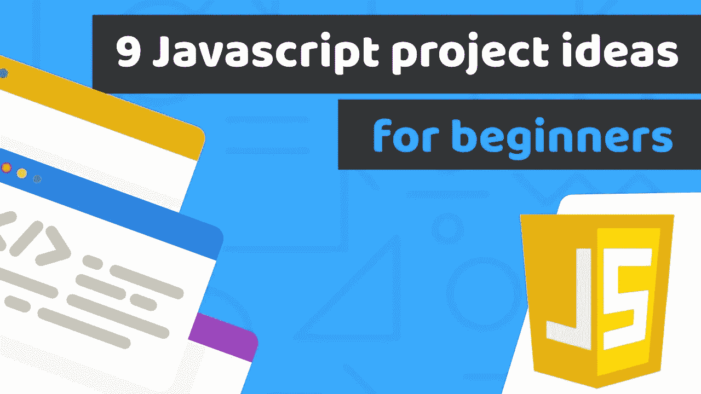

# 您可以构建 9 个 JavaScript 项目来完善您的编码技能

> 原文：<https://javascript.plainenglish.io/9-javascript-projects-you-can-build-to-perfect-your-coding-skills-1e8b23e53392?source=collection_archive---------1----------------------->

## 2022 年提高 JavaScript 技能的简要指南

Source: Google

如果你正在寻找 Javascript 项目来提高你的 Javascript 技能，或者你是一个 Javascript 初学者。在本指南中，您将了解 Javascript 项目列表指南

从初级到高级。

首先，为了深入项目，我们将讨论什么是 Javascript？

JavaScript 是一种脚本语言，用于 web 开发、web 应用程序、游戏开发等等。它允许你在网页上实现动态特性，而这仅仅用 HTML 和 CSS 是做不到的。

## 2022 年面向初学者的 JavaScript 项目

1.  **JavaScript 倒计时钟**

如果你用 Javascript 构建一个数字倒计时钟，这是一个相对简单和容易的项目来练习变量和简单的循环。

涵盖的主要概念:

*   getFullYear()
*   getMonth()
*   获取日期()
*   Math.floor()
*   setInterval()
*   clearInterval()

**2。回顾转盘**

这是电子商务网站或销售产品或服务的网站的重要特征之一。

涵盖的主要概念:

*   目标
*   DOMContentLoaded
*   addEventListener()
*   数组.长度
*   文本内容

**3。彩色翻盖**

在这个项目中，你将学习如何创建一个随机的颜色背景，并在点击按钮时改变背景的颜色。

在这个项目中，您将了解 DOM

涵盖的主要概念:

*   数组
*   document.getElementById()
*   document.querySelector()
*   addEventListener()
*   document . body . style . background 颜色
*   Math.floor()
*   Math.random()
*   数组.长度

## **2022 年面向中级的 JavaScript 项目**

1.  **Javascript 模态**

在这个项目中，你将学习如何在一个网站中创建一个可以与用户交互来完成一些特定任务的模型。

涵盖的主要概念:

*   document.querySelector()
*   addEventListener()
*   classList.add()
*   classList.remove()

**2。图像滑块**

图像滑块包含 2 或 3 个图像，在特定时间后会发生变化，以创建一个更具吸引力的网站。

涵盖的主要概念:

*   querySelectorAll()
*   addEventListener()
*   forEach()
*   if/else 语句

**3。显示不同内容的标签**

这是练习 Javascript 的好项目之一。该功能主要用于单页应用程序。

涵盖的主要概念:

*   classList.add()
*   classList.remove()
*   forEach()
*   addEventListener()

## 2022 年的高级 JavaScript 项目

1.  **石头剪刀布游戏**

从这一点，我们在 Javascript 的高级项目列表中。

涵盖的主要概念:

*   addEventListener()
*   Math.floor()
*   Math.random()
*   switch 语句

**2。Flappy Bird**

涵盖的主要概念:

*   createElement()
*   forEach()
*   setInterval()
*   clearInterval()
*   removeChild()
*   appendChild()
*   addEventListener()
*   removeEventListener()

**3。Tac Tac Toe(反应 Js)**

在这个项目中，您将学习一些基本的钩子、导入导出模块、组件和 JSX。

## 结论:

最后，如果你是一个初学者或中级程序员，这些项目是很好的实践。如果你需要 PHP 或 Python 的项目想法，或者想要井字游戏的教程，请在下面评论。

谢谢！

*更多内容请看*[***plain English . io***](http://plainenglish.io/)*。报名参加我们的* [***免费周报***](http://newsletter.plainenglish.io/) *。在我们的* [***社区***](https://discord.gg/GtDtUAvyhW) *获得独家获得写作机会和建议。*