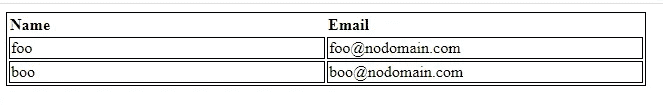
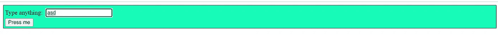

# 9 个强大的 CSS Pro 提示供您考虑

> 原文：<https://javascript.plainenglish.io/9-powerful-css-pro-tips-for-you-to-consider-12489213897b?source=collection_archive---------4----------------------->

## 让我们尽量避免一些造型错误。


Photo by [KOBU Agency](https://unsplash.com/@kobuagency?utm_source=medium&utm_medium=referral) on [Unsplash](https://unsplash.com?utm_source=medium&utm_medium=referral)

在 web 开发领域，CSS 是一项基本技能。另一方面，仅用 CSS 实现某些 web 设计模式可能是一项困难的工作，通常需要彻底掌握这门语言。

在过去的几年里，web 前端开发领域取得了显著的进步。从用户的角度来看，web 前端保持不变:使用 CSS 样式化的 HTML 标记。

在这篇文章中，我将分享一些有用的 CSS 技巧，利用你可以在日常工作中使用的鲜为人知的 CSS 属性。

所以，让我们跳到精彩的部分:)

## 1.防止文本换行

在 HTML 中，每当我们在 HTML 容器中放置一些文本时，比如说 **div** ，文本会根据容器大小自动换行。让我们看看下面的代码:

```
<style>
    div {
        border: 1px solid black;
        width: 170px;
    }
</style><div>
value && Object.keys(value).length === 0 && value.constructor === Object;
</div>
```

这段代码将产生如下输出:


这是因为默认情况下`white-space: normal`属性适用于 HTML 元素。大多数时候，这是我们希望 HTML 工作的方式。但是对于一些用例，我们希望防止文本换行。因为文本的分离会产生意想不到的效果，创建一个笨拙的用户界面，伤害用户体验。

就像上面提到的代码一样，输出不是我们想要向用户显示的东西。为了防止这种默认行为，我们可以使用`white-space: nowrap` 属性。

现在，如果我们将它应用到上面的代码，它将产生如下输出:

```
<style>
    div {
        border: 1px solid black;
        width: 170px;
        white-space: nowrap
    }
</style>
<div>
value && Object.keys(value).length === 0 && value.constructor === Object;
</div>
```


现在，这对用户来说看起来更容易理解。

`nowrap`的另一个用例是当我们显示一些超链接时。由于断开超链接不是一个好的 UX，我们可以使用这个属性。

在这里详细阅读`white-space`[。](https://www.w3schools.com/cssref/pr_text_white-space.asp)

## 2.重置元素的所有属性

在开发 Web 应用程序的前端时，您可能会面临这样的情况:您希望从 HTML 元素中移除所有已经应用的属性。现在困难的是，如果这个元素在一个 CSS 文件中的很多地方被访问，或者甚至在多个文件中被访问。在这种情况下，找到所有应用的 CSS 并删除它们会变得有点忙乱。

对于这种情况，我们可以只使用一个 CSS 属性，所有以前应用的 CSS 都将被浏览器丢弃。

```
button {
    all: unset;
}
```

现在，您可以按照自己喜欢的方式设计元素的样式。点击阅读更多关于`all`及其可能值[的信息。](https://www.w3schools.com/cssref/css3_pr_all.asp)

## 3.使表格的每列宽度相等

为了理解这一点，让我们看一下下面提到的代码和输出:

```
<style>
  table {
    width: 40rem;
  }

  table, td {
    border: 1px solid black;
  }thead {
    text-align: left;
  }
</style><table>
  <thead>
    <tr>
      <th>Name</th>
      <th>Email</th>
    </tr>
  </thead>
  <tbody>
    <tr>
      <td>foo</td>
      <td>[foo@nodomain.com](mailto:foo@nodomain.com)</td>
    </tr>
    <tr>
      <td>boo</td>
      <td>[boo@nodomain.com](mailto:boo@nodomain.com)</td>
    </tr>
  </tbody>
</table>
```


如您所见，表格列具有自动生成的不同宽度。现在最有可能的情况是，我们希望给每个表列分配相等的宽度，而不考虑内容。为了实现这一点，我们可以使用`table-layout: fixed` CSS 属性。

```
table {
    table-layout: fixed;
}
```



要了解更多关于该房产的信息，[点击此处](https://www.w3schools.com/cssref/pr_tab_table-layout.asp)。

## 4.将文本限制为 N 行

如果我们想创建 **Read More** like 特性并限制文本可见的行数，那么这里也一样，我们可以使用 CSS。例如:

```
<style>
  p {
    width: 40rem;
  }
</style><p>Lorem ipsum dolor sit amet consectetur adipisicing elit. Dignissimos itaque vero, blanditiis vel dolor perspiciatis
  incidunt rem rerum beatae accusamus est quos, labore magnam praesentium doloribus nemo repellendus quidem dolore
  ducimus qui assumenda quae optio similique veritatis! Sit odit quasi quibusdam recusandae, reprehenderit accusantium.
  Possimus veniam ut at numquam perferendis cum adipisci obcaecati, sequi vero iusto blanditiis sit harum quam quisquam
  minima rerum molestias ratione atque facere et autem deserunt tenetur distinctio? Ipsum esse veniam eum officiis
  maiores culpa accusamus dicta nobis, neque error eaque labore nam officia est laborum praesentium sit fugit, aliquam
  quidem. Cupiditate laborum non commodi ducimus.</p>
```


现在，如果我们只想显示 3 行文本，我们可以使用下面的 CSS:

```
p {
    overflow: hidden;
    text-overflow: ellipsis;
    display: -webkit-box;
    -webkit-line-clamp: 3;
    -webkit-box-orient: vertical;
}
```


## 5.仅将样式应用于 Firefox

我们实际上可以将特定于浏览器的 CSS 应用于 HTML 元素。可能会有这样的要求，你必须只在 Firefox 中突出显示一些文本。在这种情况下，您可以像这样使用 CSS:

```
@supports (-moz-appearance: none) {
    p {
        color: red;
    }
}
```

## **6。覆盖范围内的变量值**

在前端开发领域，我们总是使用局部和全局变量的概念。我们实际上也可以在 CSS 中实现类似的功能。为了清楚地理解这一点，让我们看一下下面的代码:

```
<style>
  :root {
    --color: green;
  }
  div {
    width: 15rem;
  }
  h1 {
    color: var(--color);
    border: 1px solid var(--color);
    padding: 1rem;
  }
  h2 {
    color: var(--color);
    border: 1px solid var(--color);
    padding: 1rem;
  }
</style><div>
  <h1>Michael Scott</h1>
  <h2>Dwight Schrute</h2>
</div>
```


让我们假设你想改变 **h2** 的颜色。一种方法是在**根**块中创建一个新变量，并在 **h2** CSS 块中使用它。现在，如果你不得不在很多地方替换这个变量，这可能会有点忙乱。

更好的方法是更新 **h2** 块本身中**颜色**变量的值。像这样:

```
h2 {
    --color: red;
    color: var(--color);
    border: 1px solid var(--color);
    padding: 1rem;
 }
```


如你所见，更新 **h2** 中的**颜色**变量只会影响 **h2** 块本身的 CSS 属性。如果你在那个 **h2** 块之外使用那个变量，那些属性将保持不变。

## 7.我们可以让用户调整元素的大小

让我们直接将它付诸行动。

```
<style>
  div {
    border: 2px solid;
    padding: 20px;
    width: 300px;
    resize: both;
    overflow: auto;
  }
</style><div>
  <p>You can resize the height and width of this div.</p>
</div>
```


正如我们在输出中看到的，div 是可调整大小的。那么是什么让它可以调整大小呢？答案是 **resize** property。当我们结合使用 **resize** 和 **overflow** 属性时，我们可以调整任何 **div** 的大小。

要阅读更多关于**调整**的信息，请点击[此处](https://www.w3schools.com/cssref/css3_pr_resize.asp)。

## 8.确保重置默认浏览器样式

每当我们打开一个 web 应用程序时，您的浏览器都有可能将一些默认的 CSS 添加到 HTML 元素中。最常见的添加 CSS 属性是**边距**和**填充**。所以永远记得重置这些样式。

我们可以通过使用**星号(*)** 来访问每一个 HTML 元素。像这样:

```
* {
    margin: 0;
    padding: 0;
}
```

> 请记住，无论何时开始开发新的应用程序，都必须将它作为主 CSS 文件中的第一个条目。

## 9.:焦点-在伪类内

如果一个元素中有多个可聚焦的元素，那么应用 **:focus-within** 将在它的任何后代被聚焦时生效。当窗体的任何输入元素被聚焦时，可用于突出显示窗体。

```
<style>
  form {
    border: 1px solid;
    color: gray;
    padding: 4px;
  }
  form:focus-within {
    background: #18fbb7;
    color: black;
  }
  input {
    margin: 4px;
  }
</style><form>
  <label for="given_name">Type anything: </label>
  <input id="given_name" type="text" />
  <br />
  <button type="button">Press me</button>
</form>
```



正如您所看到的，每当您关注按钮或输入时，表单都会变成绿色。

这就是这篇文章的内容。我希望你今天学到了一些新东西。你可以在[媒体](https://gouravkajal.medium.com/membership)上[关注我](https://gouravkajal.medium.com/)或者在 [LinkedIn](https://www.linkedin.com/in/gouravkajal/) 上与我联系。想看更多这样的文章，敬请期待！

感谢阅读！

*更多内容看* [***说白了。报名参加我们的***](http://plainenglish.io/) **[***免费周报***](http://newsletter.plainenglish.io/) *。在我们的* [***社区不和谐***](https://discord.gg/GtDtUAvyhW) *获得独家获取写作机会和建议。***