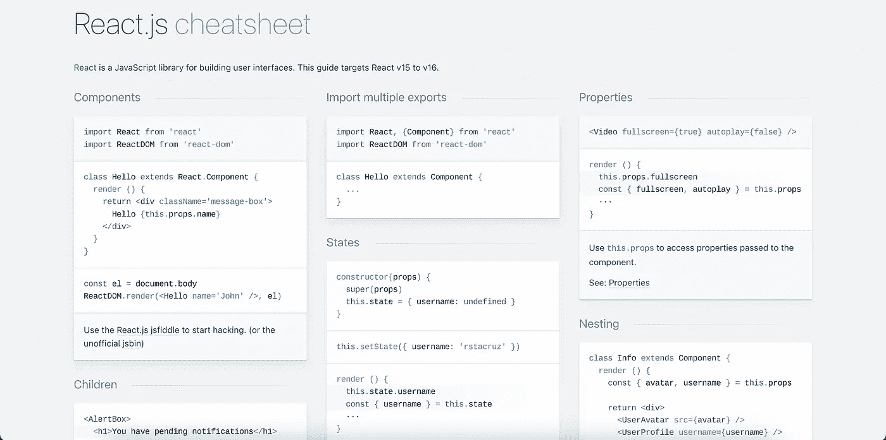
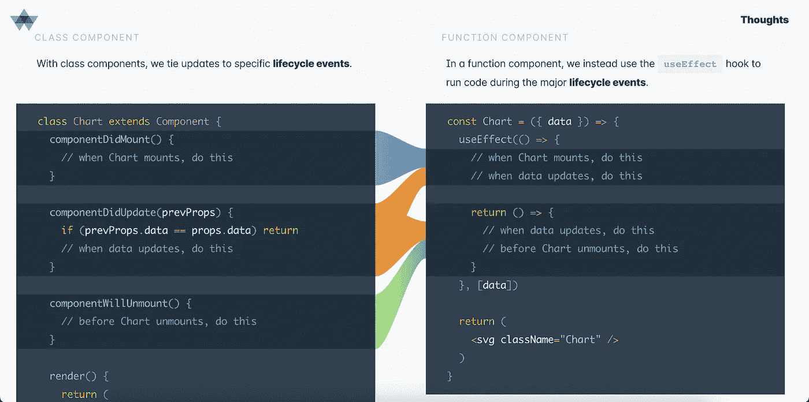
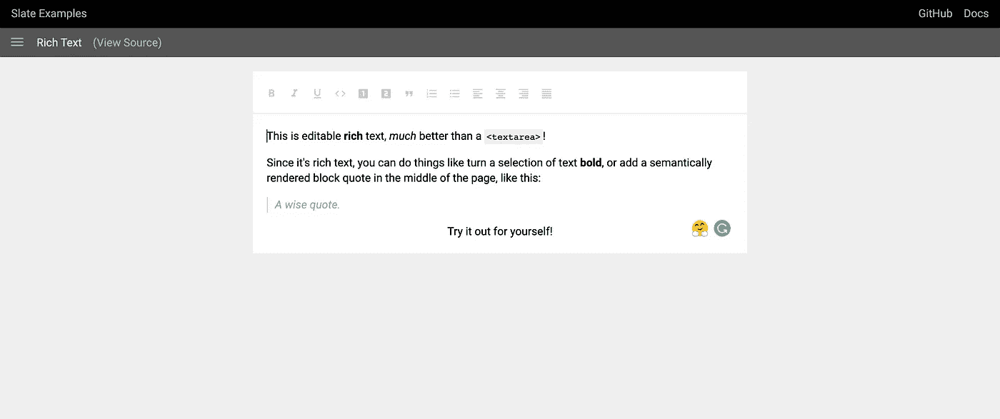
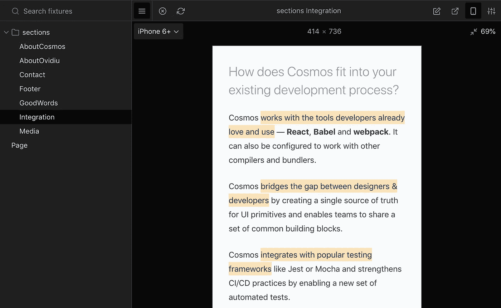
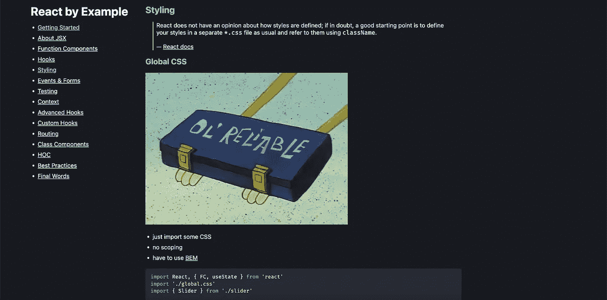
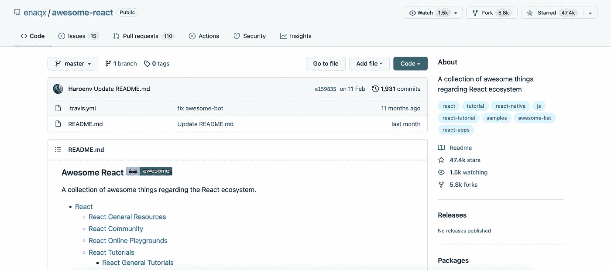

# 我希望我能早点知道

> 原文：<https://javascript.plainenglish.io/9-react-resources-i-wish-i-knew-earlier-9be62e9a1193?source=collection_archive---------2----------------------->

## 使用这些资源可以节省时间，避免麻烦。


Photo by [Elena Koycheva](https://unsplash.com/@lenneek?utm_source=medium&utm_medium=referral) on [Unsplash](https://unsplash.com?utm_source=medium&utm_medium=referral)

我使用 React 已经有两年多了，一旦你越过陡峭的学习曲线，你就会发现它是一个坚实、全面的库。

在过去的 2 年里，我用各种各样的工具开发了多种应用程序，从关系数据库到使用 Redis 作为持久存储。

我也尝试过像 Next.js 和 Preact 这样的框架。

在这段时间里，我学习并接触了各种资源、库和技巧，它们使我成为一名更好的开发人员，并帮助我节省了大量时间。

在这篇博客中，我将分享一些你在开始任何 React 项目之前应该了解的资源，这样你就可以避免我犯的错误。

下面是每个 React 开发人员都应该知道的 9 个资源:

## 1.[反应备忘单](https://devhints.io/react)



[Source](https://devhints.io/react).

React 是一个优秀的库，但它只是用于前端，如果你是一名独立开发者，你可能也曾使用过 Node 和 Django 等后端框架。

我们也经常试验不同的反应替代品，例如 Vue 和 Svelte。

关键是，我们可能会忘记常见的模式，需要时不时地复习，如果我们是 React 世界的新手，更是如此。

React Cheatsheet 是实现这一目的的绝佳资源。

它不仅涵盖了非常基本的概念，还包括错误处理、水合作用等等。

## 2.UI 框架


[Source](https://mui.com/templates/).

我清楚地记得，当我构建第一个大型项目时，在 React 中使用普通 CSS 花费了大量时间来构建定制组件及其变体。

当时我对 UI 框架的存在知之甚少。

不久之后，我听说了 Material UI，但觉得它会涉及到一个学习曲线，并使我的项目膨胀(我仍然不知道为什么我会有这种感觉)。

现在我已经开始使用 UI 框架&我认为这是我做出的最好的决定之一。

我对 UI 组件的一致性非常挑剔，我喜欢主题和黑暗模式的想法。

此外，还有一些 UI 生成器，您可以使用它们来可视化地构建 UI，然后将代码复制到 React 项目中。

我使用 [OpenChakra](https://openchakra.app/) ，它允许我更快地创建漂亮的用户界面。

## 3.[思考中做出反应的钩子](https://wattenberger.com/blog/react-hooks)



[Source](https://wattenberger.com/blog/react-hooks).

有一个使用类组件的旧 React 项目，并希望将其转换为功能组件？别再看了。

React Hooks 中的思考是一个优秀的、精致的网站，顾名思义，它教授如何使用钩子来思考和实现生命周期方法。

我钦佩这个网站的简单事实是，它迎合了真实的开发场景，甚至为开发人员提供了额外的资源。

我还在这个页面上发现了一些有用的定制挂钩。其中一个是[货架](https://usehooks.com/useLocalStorage/)挂钩。

## 4.[你为什么渲染](https://github.com/welldone-software/why-did-you-render)

```
class BigListPureComponent extends React.PureComponent {**static whyDidYouRender = true**// a lot of logic and handlersrender(){
    return (
      // a list of 1000000000000 entries
    )
  }
}
```

另一个我今年才发现的优秀资源。

我在寻找一种方法来找出为什么我的组件被重新渲染，过了一会儿，我发现了这个优秀的仓库。

为什么你渲染补丁的反应，以通知开发者关于潜在的可避免的重新渲染和反应原生也是受支持的。

您还可以跟踪此包的自定义挂钩。

让我们看一个演示，看看这个包在哪里有用。

```
const **FatherComponent** = props => (
  <div>
    <OtherComponent something={**props.something**}/>
    **<ClassDemo a={1}/>**
  </div>
)
```

在这种情况下，当`FatherComponent`重新渲染时，`ClassDemo`也会重新渲染。

这是不必要的，因为你看到 ClassDemo 的道具没有改变，如果 ClassDemo 是一个大组件，事情会变得更糟。

这个软件包帮助您找到这些问题的解决方案并修复这些问题。

## 5. [React 扫描仪](https://github.com/moroshko/react-scanner)

```
{
  "Text": {
    "instances": 17,
    "props": {
      "margin": 6,
      "color": 4,
      "textStyle": 1
    }
  },
  "Button": {
    "instances": 10,
    "props": {
      "width": 10,
      "variant": 5,
      "type": 3
    }
  },
  "Footer": {
    "instances": 1,
    "props": {}
  }
}
```

React 扫描仪是我的 SaaS 的救命稻草。

顾名思义，它扫描和分析给定的代码，并提取组件的正确用法。

它搜索文件目录，编译要扫描的文件列表，然后扫描每个单独的文件，并以如上所示的易于理解的 JSON 格式提取组件及其 props 用法。

你为什么需要它？

如果您有许多接受各种组件的组件，这是很有用的。这种用法的一个例子是自定义设计组件。

在我的例子中，我有不同的网站部分，如页脚、行动号召等，并传递给它们不同的道具。我需要每个组件的正确用法列表，这个包让我不用手动操作。

## 6.[石板](https://github.com/ianstormtaylor/slate)



[Source](https://www.slatejs.org/examples/richtext).

我用过几个文本编辑器，从 Draft.js 到 CK 编辑器再到 Slate。

其中一个突出的编辑器是 Editor.js，我甚至在 2020 年写了一个关于它的博客。

但是最近，我一直在使用&阅读关于 Slate 的文章。

原因很简单:它试图解决我和其他编辑一起工作时遇到的所有棘手问题。

从复杂的编辑器模式到净化 HTML 和 markdown 输出，再到定制嵌套文档体验，Slate 承诺解决所有这些问题。

它提供了广泛的插件，无模式的核心，直观的命令，等等来帮助你构建一个个性化的富文本编辑器。

## 7.[反应宇宙](https://github.com/react-cosmos/react-cosmos)



[Source](https://github.com/react-cosmos/react-cosmos).

就我个人而言，我没有使用过这个工具，但是看了指南，听了开发人员的经验，如果你喜欢测试驱动开发，它似乎是一个很好的工具。

它允许你孤立地使用组件，而不需要重新加载整个应用程序。

我发现一个突出的特性是你可以标记组件的状态，这可以帮助你处理边缘情况并保持有序。

但是，值得注意的是，它不是一个测试框架。

我想透露的是，我刚刚开始使用 TDD，我需要更多的经验。

自从推出 React Cosmos 以来，还有许多其他项目，但以我有限的经验，我发现这很有用。我正在研究的另一个软件包是 [Docz](https://www.docz.site/) 。

## 8.[以身作则](https://reactbyexample.github.io/)



[Source](https://reactbyexample.github.io/styling).

React By Example 是一个简单明了的网站，提供基于代码的教程。

它有很多代码片段会派上用场。

它不仅涵盖了钩子、表单、HOC 等基础知识，还包含了测试指南、高级钩子和最佳实践。

当我有一段时间没有使用 React 时，我发现这个网站非常有用。

## 9.[牛逼的反应](https://github.com/enaqx/awesome-react#react-tutorials)



[Source](https://github.com/enaqx/awesome-react#react-tutorials).

Awesome React 是 React devs 的一个令人惊叹的一站式目的地。

这是 React 的优秀资源的精选列表。

它包含了 React 的所有内容，从教程到状态管理到数据管理。它甚至拥有 GraphQL、Relay 和 React 原生资源。

不管你是反应新手还是专家，这个资源库都有有趣的资源，一定会帮助你或教会你一些新东西。

***如果你喜欢读这篇文章，可以考虑使用*** [***我的推荐链接***](https://medium.com/@anuragkanoria/membership) ***，这样你就可以无限制地访问我的博客以及其他作者的博客，只需点击*** [***这里***](https://medium.com/@anuragkanoria/membership) ***。***

## 奖励:[反应通量](https://www.reactiflux.com/)

Reactiflux 是 Discord 上的一个聊天社区，你可以加入其中。

在我写这篇文章的时候，这个群中大约有 17 万成员，你可以免费加入&通过回答和提问参与到这个社区中来。

他们每个月还会举行问答会议，这非常有用。

而且，呆在一个社区也有自己的好处。

## 最后的想法…

React 是一个令人惊叹的库，它令人惊叹的一个方面是围绕 React 及其开发的社区支持。

当我开始学习 React 时，我部分讨厌它如此依赖像 Redux 和 React Router 这样的库来实现基本目的，但随着时间的推移，我喜欢 React 提供的自由。

但是随着时间的推移，我的观点已经完全改变了。

从 Next.js & Remix 这样的全栈框架到 Draft.js 这样的库，使用 React 快速构建企业级栈是非常直观的，而使用 Vercel 这样的平台，托管成本也是最低的。

如果你喜欢阅读这个资源列表，可以看看我讨论 React 受欢迎程度的博客。

[](/why-dont-we-use-other-frameworks-instead-of-react-3fcfaec5604b) [## 为什么不用其他框架代替 React 呢？

### React 到底为什么这么受欢迎？

javascript.plainenglish.io](/why-dont-we-use-other-frameworks-instead-of-react-3fcfaec5604b) 

*更多内容请看*[***plain English . io***](https://plainenglish.io/)*。报名参加我们的* [***免费周报***](http://newsletter.plainenglish.io/) *。关注我们关于*[***Twitter***](https://twitter.com/inPlainEngHQ)*和*[***LinkedIn***](https://www.linkedin.com/company/inplainenglish/)*。加入我们的* [***社区不和谐***](https://discord.gg/GtDtUAvyhW) *。*