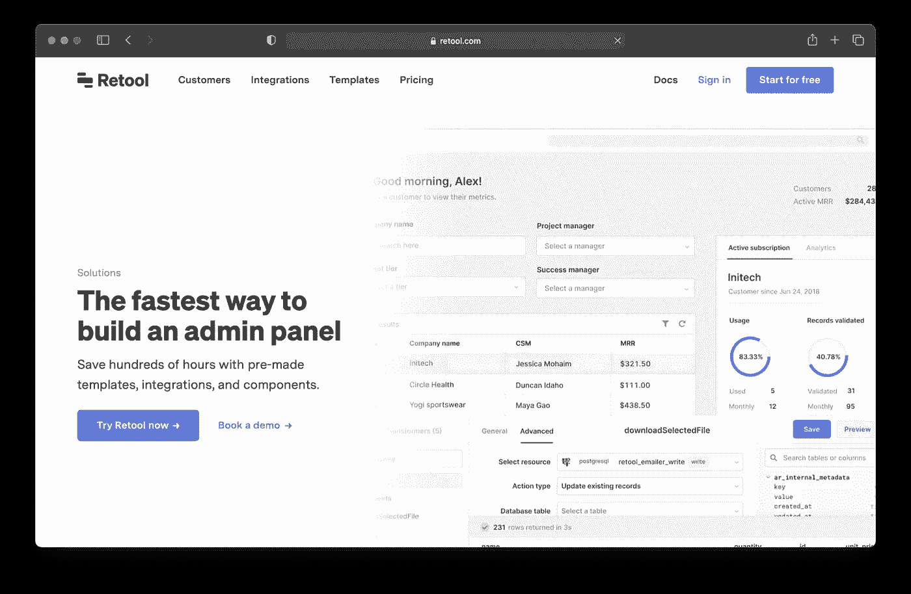

# 9 个省时工具，将管理面板构建速度提高 10 倍

> 原文：<https://javascript.plainenglish.io/9-time-saver-tools-to-build-admin-panel-10x-faster-6ac7c211621d?source=collection_archive---------1----------------------->

也许你对编码一无所知，所以构建你梦想中的管理面板可能看起来是一个漫长而无聊的过程。

例如，当我第一次开始构建我自己的 WordPress 管理面板时，我花了几天时间来编写代码。

那是因为我当时知道的很少。今天，我将向您介绍我最喜欢的工具，这些工具可以节省我的时间，并使开发工具变得轻而易举。

很快你就可以告诉我:“我很快就建立了我的管理面板！”

构建管理面板是一项耗时的任务。大量的后端工作被完成来设置基本的和高级的组件，这就是为什么很多时候你会看到公司自称为“开发者”,但只回答基本的请求。

但是有了下面的工具，这个耗时的任务将会变成一个快乐的任务。

# 背包

您想在几分钟内拥有一个定制的 [Laravel 管理面板](https://backpackforlaravel.com/)吗？Backpack for Laravel 提供了一种使用 Laravel 编程语言创建和定制自己的管理面板的简单方法。对于想要构建 HTML 块而不需要了解 CSS 或 JavaScript 的开发人员和设计人员来说，它是完美的。

# 管理

你的 NodeJS 应用程序需要管理面板吗？ [AdminJS](https://adminjs.co/) 可以帮忙！这个开源管理面板具有允许开发者管理和显示来自多个来源的数据的特性。开发者选择他们想要的，剩下的我们来处理。

# [科瑞](https://coreui.io/)

CoreUI 是那些寻找快速解决方案来为他们的应用程序或网站创建管理面板的人的终极管理模板。它拥有您需要的所有工具，包括响应式组件、即用型用户界面、数百个 UI 元素和图标、大量文档、出色的设计等等！

# UI 烘焙管理面板工具

UI Bakery 的管理面板工具是一个可定制的预建工具，您可以根据自己的内部业务流程进行定制。它完全可定制和调整，包括预先构建的可重复使用的组件，您可以开箱即用或定制以适应您独特的工作流程。

# 森林管理员

[Forest Admin](https://www.forestadmin.com/) 让您可以轻松构建一个内部工具来管理公司的数据。这个工具可以用于各种有趣和复杂的数据分析，包括创建表格，读取和更新 Excel 电子表格，管理访问控制列表和角色。

# 重组的面板生成器

使用管理面板生成器，您可以在几个小时内，而不是几周内，用数百个预建模板和集成来构建管理面板。通过导入可重复使用的组件来满足您的特定需求，从而节省时间。在您需要时，添加您需要的功能。[访问这里](https://retool.com/use-case/admin-panels)。

# Appsmith

如果您想通过提高通用业务流程的效率来加快内部工作流程、减少错误和降低开发成本， [Appsmith](https://www.appsmith.com/) 正是您所需要的。

# 内部的

您是否正在寻找一种用户友好的工具，使开发人员能够更容易地创建内部工具？有了[内部](https://www.internal.io/)，你不用写任何代码就可以构建内部工具。**此外，对用户的访问或存储大小没有限制。**

# Budibase

[Budibase](https://budibase.com/) 是一款强大的组织管理工具，支持企业使用我们的开源平台快速轻松地创建和部署内部应用。

*更多内容看* [***说白了。报名参加我们的***](https://plainenglish.io/) **[***免费周报***](http://newsletter.plainenglish.io/) *。关注我们关于* [***推特***](https://twitter.com/inPlainEngHQ) ，[***LinkedIn***](https://www.linkedin.com/company/inplainenglish/)*，*[***YouTube***](https://www.youtube.com/channel/UCtipWUghju290NWcn8jhyAw)*，以及* [***不和***](https://discord.gg/GtDtUAvyhW) *。***