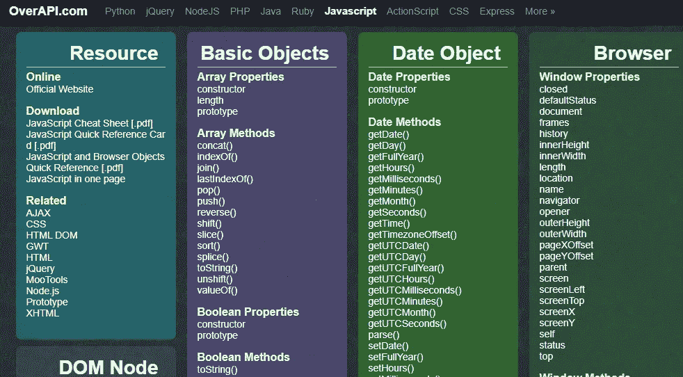
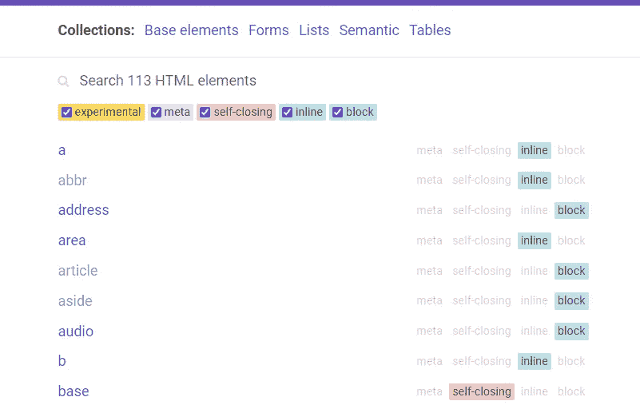
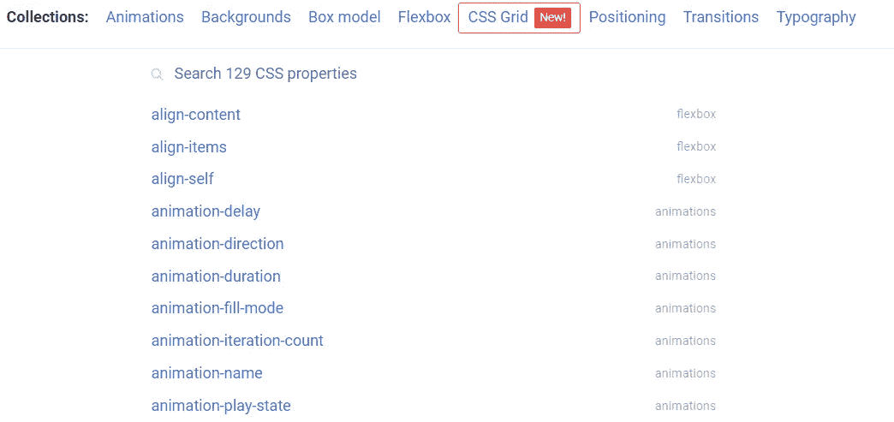
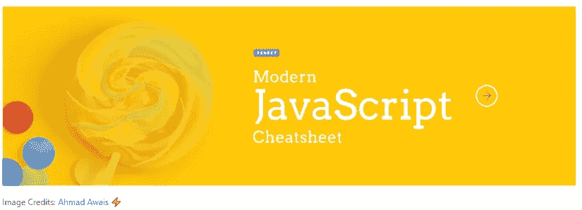
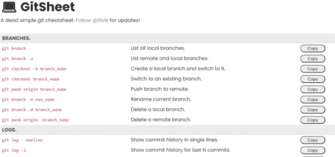
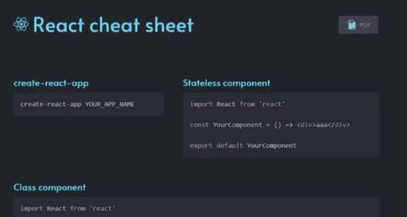
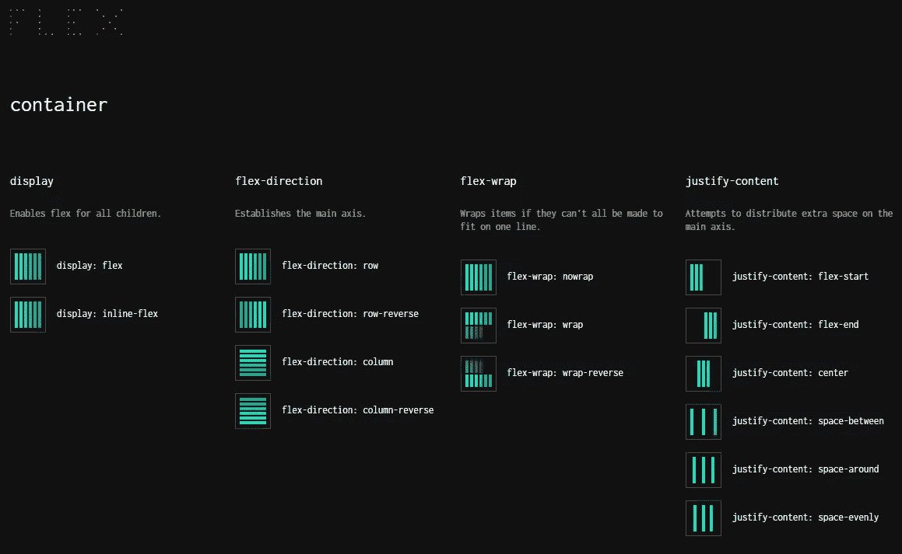
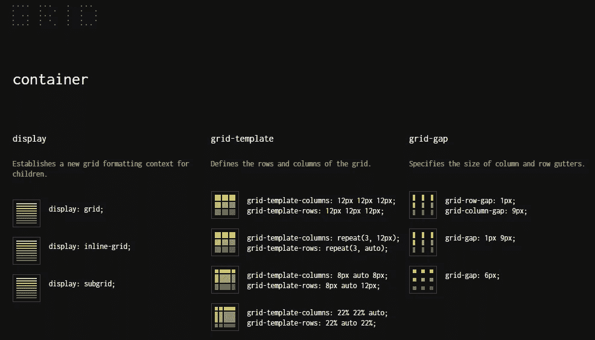
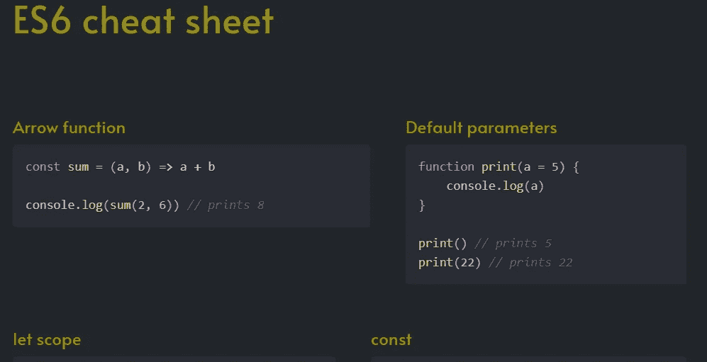

# 9 个有用的前端 Web 开发人员备忘单来节省时间

> 原文：<https://javascript.plainenglish.io/9-useful-front-end-web-developer-cheatsheets-to-save-time-2e1fe7495e8?source=collection_archive---------6----------------------->

## 2022 年每个 web 开发人员都应该知道的惊人的备忘单。

Photo by [Mohammad Rahmani](https://unsplash.com/@afgprogrammer?utm_source=medium&utm_medium=referral) on [Unsplash](https://unsplash.com?utm_source=medium&utm_medium=referral)

如今，技术行业总是随着新的更新而发展。有很多技术和工具需要学习，尤其是在 web 开发方面。我们需要学习的知识和信息量总是在增长。跟上时代并记住所有的基础知识是很难的。

幸运的是，我们可以利用一些 cheatsheet 网站快速更新我们的知识，了解我们需要的东西。因此，这些网站使您作为开发人员获得项目所需的信息变得简单。

在这篇文章中，我们将介绍一些 2022 年你作为一名 web 开发人员可以使用的最佳备忘单。所以让我们开始吧。

# 1.通过 API

[Over API](https://overapi.com/javascript) 是最好的 cheatsheet 网站之一，作为一名 web 开发人员，你可以用它来促进你的学习。

capture by the author from over API.

它包含许多编程语言和技术的备忘单。这是一个你可以利用的很棒的资源。

# 2.HTML 参考

[HTML Reference](https://htmlreference.io/) 是一个了不起的 cheatsheet 网站，它给你解释 HTML 元素和属性。

capture by the author from HTML Reference.

这个很棒的备忘单允许你通过实际例子学习 HTML 中的元素和属性。你可以搜索你正在寻找的任何元素，并轻松地了解它。

# 3.CSS 参考

[CSS Reference](https://cssreference.io/) 是另一个 cheatsheet 网站，它引用了许多有用的 CSS 属性，并用详细实用的例子来解释它们。

Capture by the author from CSS Reference.

您可以搜索超过 129 个 CSS 属性，并轻松了解它们。这是学习 CSS 的最佳资源之一。

# 4.现代 JavaScript 备忘单

这个 [GitHub 库](https://github.com/mbeaudru/modern-js-cheatsheet)是一个很棒的备忘单，可以轻松学习构建项目时经常需要的现代 JavaScript 知识。

Capture by the author from Modern JavaScript Cheatsheet.

如果你花一点时间，这个备忘单绝对可以提高你的 JavaScript 知识。

# 5.GitSheet

如果你在项目中使用 Git，我会说 [GitSheet](https://gitsheet.wtf/) 是最好的备忘单网站，可以作为 Git 命令的参考。

Capture by the author from GitSheet.

GitSheet 收集了许多重要的 Git 命令及其用法。您可以了解并复制每个命令，以便在项目中使用。

# 6.反应备忘单

这是一个非常有用的 [React cheatsheet](http://www.developer-cheatsheets.com/react) ，它包含了许多你可以使用的 React 代码片段。

Capture by the author from React CheatSheet.

这是一个非常好的资源，可以很容易地学习一些 React 编码概念，并提高您的知识。

# 7.弯曲

[FLEX](https://flexbox.malven.co/) 是一个非常棒的 cheatsheet 资源，可以轻松了解 CSS flexbox。它带有视觉图形，使您更容易学习 flexbox 的属性和概念。

Capture by the author from FLEX.

# 8.格子

[GRID](https://grid.malven.co/) 是另一个视觉备忘单，与 FLEX 概念相同。但是它可以让你以一种简单的视觉方式轻松地了解 CSS 网格属性。

Capture by the author from GRID.

# 9.ES6 备忘单

这个棒极了的[备忘单](http://www.developer-cheatsheets.com/es6)附带了许多代码片段，让你可以用 JavaScript 轻松了解 ES6 的特性。

Capture by the author from the ES6 cheat sheet.

通过使用代码示例，这是了解 JavaScript ES6 的一种快速方法。

# 结论

备忘单是一个很好的方法，可以很容易地学习新的东西，或者获得一些您可能不总是记得的编码概念的参考。所以这是一个惊人的备忘单的快速列表，你可以作为一个 web 开发人员来尝试。希望你觉得有用。

*感谢您阅读本文。此外，如果你发现我的内容有用，而你不是一个媒体成员，你可以抓住你的媒体成员* [***这里***](https://mehdiouss.medium.com/membership) *(媒体推荐链接)获得所有内容的无限访问和支持我们作为作家。*

 [## 通过我的推荐链接加入 Medium-Mehdi Aoussiad

### 作为一个媒体会员，你的会员费的一部分会给你阅读的作家，你可以完全接触到每一个故事…

mehdiouss.medium.com](https://mehdiouss.medium.com/membership) 

**更多阅读:**

 [## 你可能从未用过的 9 个很棒的 CSS 属性

### 非常有用和有趣的 CSS 属性，你应该知道。

javascript.plainenglish.io](/9-awesome-css-properties-that-you-probably-have-never-used-8cc4c385c3c6)  [## 7 个免费的 React 模板可以用于您的项目

### 真棒 React 模板和主题，你可以开始建立你的下一个项目。

javascript.plainenglish.io](/7-free-react-templates-you-can-use-for-your-projects-fb041304bf90) 

*更内容于* [***普通英语***](https://plainenglish.io/) *。报名参加我们的* [***免费周报***](http://newsletter.plainenglish.io/) *。* [***推特***](https://twitter.com/inPlainEngHQ) *和*[***LinkedIn***](https://www.linkedin.com/company/inplainenglish/)*追随我们。加入我们的* [***社群不和***](https://discord.gg/GtDtUAvyhW) *。*