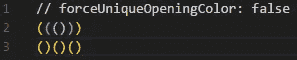
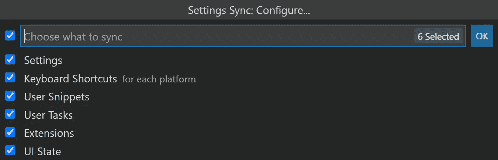
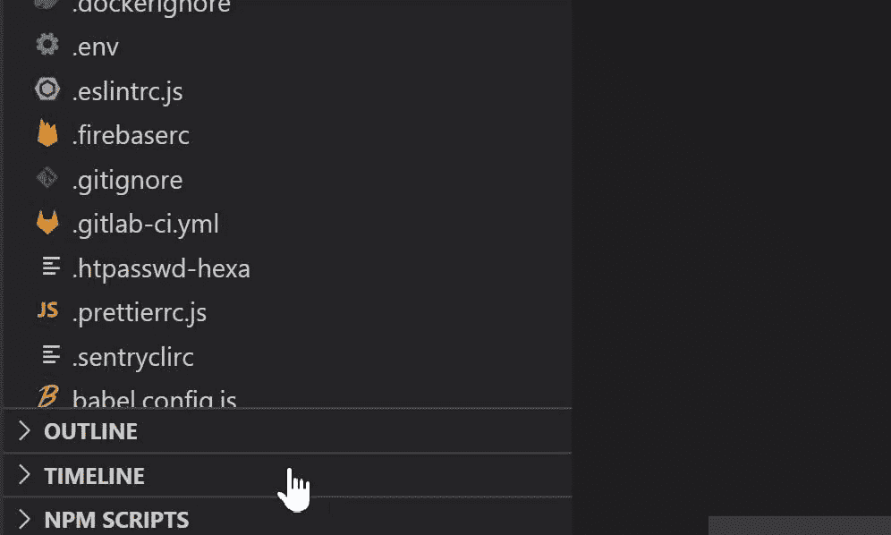
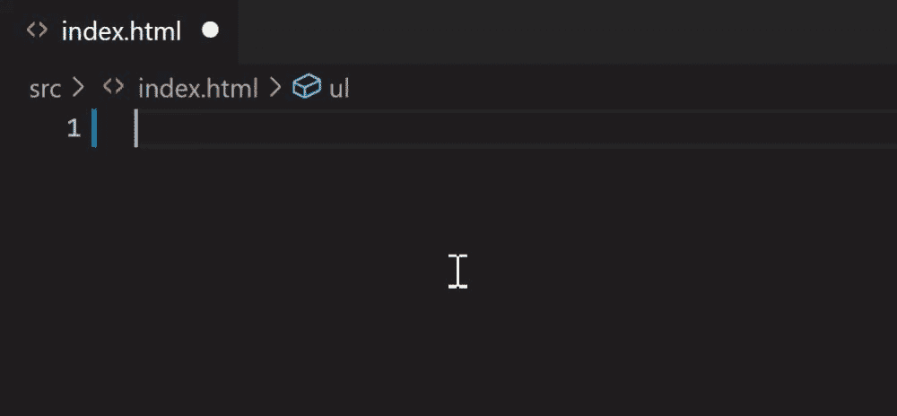
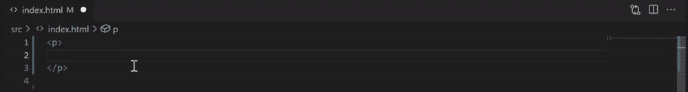

# 9 VS 你需要避免的代码扩展

> 原文：<https://javascript.plainenglish.io/9-vs-code-extensions-you-need-to-avoid-c26e3ae34009?source=collection_archive---------1----------------------->

## 别在这些上浪费时间了

By [Andrea Piacquadio](https://www.pexels.com/sk-sk/@olly?utm_content=attributionCopyText&utm_medium=referral&utm_source=pexels) on [Pexels](https://www.pexels.com/sk-sk/fotka/vyraz-tvare-osobnost-individualita-tvar-3812729/?utm_content=attributionCopyText&utm_medium=referral&utm_source=pexels)

如果你使用 VS 代码，我保证你至少安装了这些扩展中的一个。说实话，它们完全没用。

它们只是减缓你的 IDE，以你的记忆为食，让你的生活变得更加复杂。但是没有理由担心。

在你读完这篇文章后，你会知道这些扩展是什么，是什么让它们变得无用，并且希望，**你会永远摆脱它们。**

但首先，让我们听听是什么让我有资格告诉你在你的编辑器中卸载扩展。

# 我与 VS 代码的关系

我用 VSCode 已经很久了。直到今天，**还是我最喜欢的用任何编程语言编写**代码的编辑器。

在早期，我安装了很多扩展来增强它的功能。但是随着我不断安装越来越多的扩展，我注意到我的编辑器变得越来越慢。

现在，我只安装了必要的扩展。而且我可以自豪地说，我的 VS 代码运行起来比婴儿的屁股还要流畅。

话虽如此，以下是我认为 VS 代码扩展不好的原因:

*   **他们正在增加 CPU 的使用量:**这是不言自明的。
*   **它们让你慢下来:**当 VS 代码开始时，许多扩展正在被加载。如果你安装了太多的扩展，这会减慢你的启动时间。
*   **它们复制了 VS 代码内置的功能:**有些扩展只是做了 VS 代码本身能做的事情。

# VS 要避免的代码扩展

正如我在本文开始时承诺的，这里有一个可以从 VS 代码中卸载的扩展列表。

> 请注意，此列表中的扩展名没有特定的顺序。我不认为一个比另一个差。我只是不完全使用它们。

## 自动关闭标签

*   💾**安装次数:**6361790 次
*   🔗**链接:** [VS 代码市场](https://marketplace.visualstudio.com/items?itemName=formulahendry.auto-close-tag)

作为一名开发者，我无法想象没有这个功能的生活。而且说实话，这个扩展我用了很久。原因是以前 VS 代码不支持这个功能。

但是现在有了！而且默认是开启的。然而，您可以通过如下设置您的`settings.json`文件来强制执行此操作。

## 自动重命名标签

*   💾**安装次数:**7940824 次
*   🔗**链接:** [VS 代码市场](https://marketplace.visualstudio.com/items?itemName=formulahendry.auto-rename-tag)

这个扩展的故事和上面的非常相似。以前不支持，现在支持了。然而，目前它只能在 HTML 文件中工作。(另外还有一个 [**开刊**](https://github.com/microsoft/vscode/issues/85707) 添加对 JSX 文件的支持)

要使用此功能，您需要应用以下设置。

## 括号对着色机

*   💾**安装次数:**7442552 次
*   🔗**链接:** [VS 代码市场](https://marketplace.visualstudio.com/items?itemName=CoenraadS.bracket-pair-colorizer)

正如我们从安装数量上看到的，这个扩展受到了极大的欢迎。这是它应得的。

括号对允许用相似的颜色识别匹配的括号。这在很多情况下非常有用。

[Original Source](https://marketplace.visualstudio.com/items?itemName=CoenraadS.bracket-pair-colorizer)

但是正如这个扩展的作者所指出的，这个功能现在已经被 VS 代码支持了。为了使用它，你必须相应地修改你的`settings.json`。

## 设置同步

*   💾**安装次数:**3006307 次
*   🔗**链接:** [VS 代码市场](https://marketplace.visualstudio.com/items?itemName=Shan.code-settings-sync)

如果您在多个设备上使用编辑器。或者如果您只是想保存您的设置，以备更改设备时使用。在这两种情况下，设置同步都非常有用。

当然，有一个处理设置同步的扩展。但是 VS 代码支持不同机器之间的设置同步。这些设置链接到一个 [Github](https://github.com/) 或[微软](https://www.microsoft.com/es-es/)账户。您还可以配置应该同步哪些类型的设置。

Captured by author

## 路径智能感知

*   💾**安装次数:**6345124 次
*   🔗**链接:** [VS 代码市场](https://marketplace.visualstudio.com/items?itemName=christian-kohler.path-intellisense)

这个扩展为所有可用的导入查找、解析并提供代码动作和代码完成。当我们编写导入语句时，自动完成文件名。而且作为一个开发者，我也说不出有多喜欢。但是有一点我不喜欢。

当你阅读安装这个扩展的说明时，它特别指出要禁用 VS 代码提供的自动完成功能。这让我很好奇，**为什么我们不能使用内置的自动补全功能呢？**

事实证明我们可以，使用以下设置。

## NPM

*   💾**安装次数:**4692787 次
*   🔗**链接:** [VS 代码市场](https://marketplace.visualstudio.com/items?itemName=eg2.vscode-npm-script)

这个扩展提供了一种运行在`package.json`中定义的 npm 脚本的方法。脚本可以直接从编辑器中运行。我通常直接从控制台运行脚本，但是我可以想象这个扩展是有用的。

然而，通过打开 npm 脚本面板，您可以在 VS 代码中实现同样的事情。

Captured by author

## 自动导入

*   💾**安装次数:**1988281 次
*   🔗**链接:** [VS 代码市场](https://marketplace.visualstudio.com/items?itemName=steoates.autoimport)

这个扩展**为所有可用的导入找到、解析并提供代码动作和代码完成** **。**它对 [JavaScript](https://www.javascript.com/) 和 [TypeScript](https://www.typescriptlang.org/) 都有效。

这个扩展我最喜欢的就是不需要。其实也没什么用。我们可以使用下面的 VS 代码设置来实现同样的事情。

## HTML 片段

*   💾**安装次数:**6978511 次
*   🔗**链接:** [VS 代码市场](https://marketplace.visualstudio.com/items?itemName=abusaidm.html-snippets)

这个扩展帮助您生成各种 HTML 代码片段。而且说实话，这个我也不用多说。相反，让我们听听作者对此有什么看法。

> 禁用此扩展，因为它当前与现有的 VS 代码 HTML 扩展冲突(来源: [VS 代码市场](https://marketplace.visualstudio.com/items?itemName=abusaidm.html-snippets))

VS 代码有内置的 [Emmet](https://emmet.io/) 支持，这意味着我们可以使用所有可用的 [Emmet 缩写](https://docs.emmet.io/abbreviations/)。

Captured by author

## Lorem Ipsum

*   💾**已安装:**359854 次
*   🔗**链接:** [VS 代码市场](https://marketplace.visualstudio.com/items?itemName=Tyriar.lorem-ipsum)

Lorem Ipsum 是一个方便的扩展，可以在我们需要时生成虚拟文本。它节省了我很多复制粘贴的时间，但我不再使用它了，这是有原因的。

Lorem ipsum 也可以使用 Emmet 生成。正如我们已经知道的，Emmet 在 VS 代码中有原生支持。

为了生成虚拟文本，您需要键入`lorem`，然后键入`Tab`或`Enter`键。

Captured by author

# 总结想法

保持我们的工作环境自由是必要的。确保它平稳运行是很重要的。通过删除垃圾扩展，我们可以实现这两个目标。

在本文中，我与您分享了完全过时的、不再需要的、因此应该删除的扩展列表。消除不必要的扩展是实现有组织环境的良好开端。但它需要坚持到底。

为了保持我们的环境整洁，我们还应该评估未来将要安装的每个扩展。一个好的经验法则是总是检查 VS 代码是否支持你需要的功能。

> VS 代码团队会定期添加特性，所以很有可能之前缺失的一些特性已经集成到编辑器中了。

我超级好奇听到的最后一句话是这个。所以请在评论中告诉我。

***你的 VS 代码编辑器中安装了多少这样的扩展？***

我希望你喜欢这个故事。如果你想从我这里听到更多或阅读更多，请考虑使用 [***这个链接成为一个中等会员。***](https://bernardbad.medium.com/membership)

*更多内容看* [***说白了就是***](http://plainenglish.io/) *。报名参加我们的* [***免费每周简讯***](http://newsletter.plainenglish.io/) *。在我们的* [***社区不和谐***](https://discord.gg/GtDtUAvyhW) *获得独家获取写作机会和建议。*