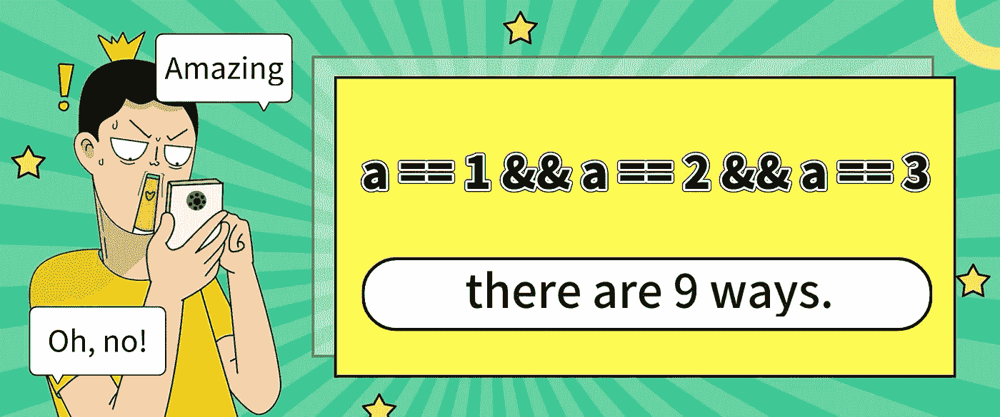
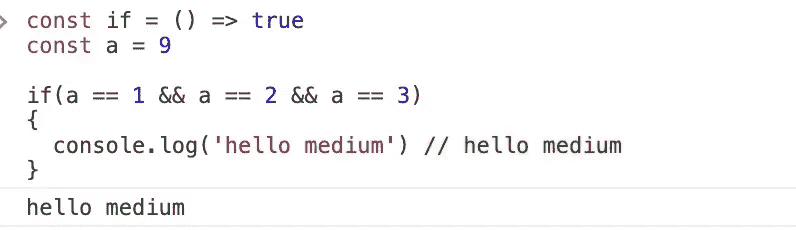
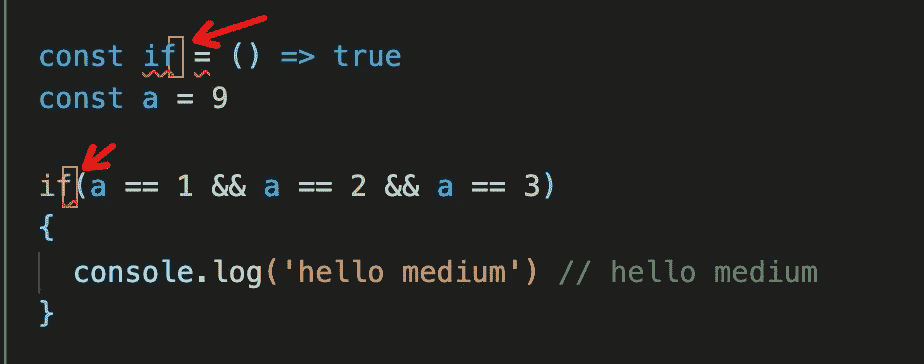
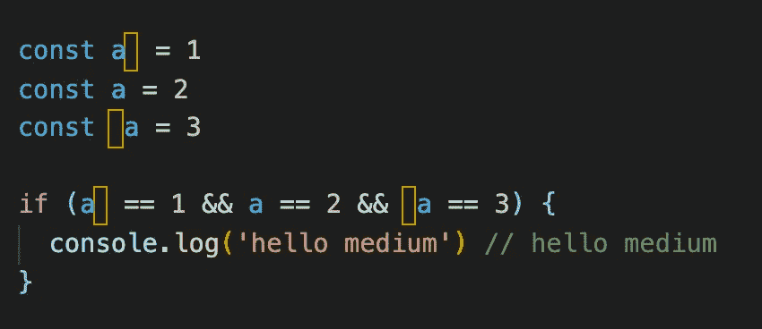
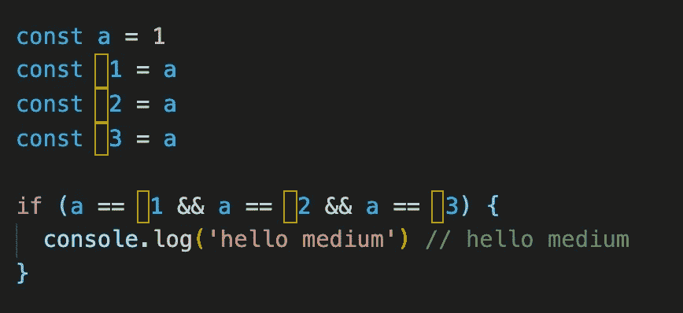
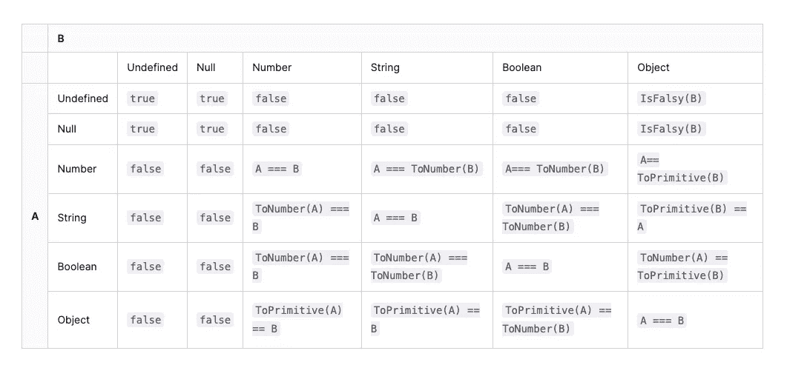

# 在 JavaScript 中(a==1 && a==2 && a==3)能计算为真吗？

> 原文：<https://javascript.plainenglish.io/9-ways-to-make-a-1-a-2-a-3-true-in-javascript-c2e1903b24b?source=collection_archive---------0----------------------->

## 是的，这可能是真的，而且有 9 种方式——太神奇了！

# 前言

最近有人问了我一个很有意思的面试问题:在 JavaScript 中(a== 1 && a ==2 && a==3)有没有可能求值为 true？。

那一刻，我被问题惊呆了，以为面试官在开玩笑。

但当我看到他的“微笑”时，一种“你一定不知道答案”的感觉划过我的脑海。这绝对不是一个容易解决的问题。

文章会给**三个神奇答案**和**五个专业答案**。让我们马上开始。

# 隐藏的角色很有趣

首先，我们先来看看一些神奇的答案，不管面试官问这个问题背后的目的是什么，他们渴望具体考察哪些知识。

# 解决方案 1:隐藏字符+ if

**眼见为实**🙈

可能这个时候，你也在大大的怀疑自己的眼睛:**如果**也可以改写？ **a** 是 9 但可以等于 1，2，3？

别担心，这其实是掩饰。这只是一个蒙蔽我们双眼的把戏，请看下图。

真相大白:**if 后面有一个隐藏字符，本质上声明了一个无论输入什么都返回 true 的函数。以下代码块与此函数无关。反正是要执行的！**

**太神奇了！**

# 解决方案 2:隐藏字符+变量

有了以上的经验，接下来的回答你就不会惊讶了。

# 解决方案 3:隐藏字符+数字变量

既然可以伪造三个`a`变量，那么也可以伪造三个`1`、`2`、`3`数字变量。

**眼见为实！**

# 解决方案 4:使用“with”运算符

以上答案本质上都没有让`a == 1 && a == 2 && a == 3`回归`true`，这只是一个障眼法。让我们微笑吧！哈哈哈下次我要认真了。

[MDN](https://developer.mozilla.org/en-US/docs/Web/JavaScript/Reference/Statements/with) 有一个关于`with`使用的警告，仿佛它的存在就是一个错误。我在工作中没有用过，但是可以用来解决这个问题。

你太聪明了，甚至不需要我解释代码的意思。

# 隐式转换规则是解决问题的关键

上面给出的四种解法有些不规则。为了说服面试官，下一个才是最完美的答案，JavaScript 中隐含的转换规则也是解决这个问题的关键。

# 解释部分隐式转换规则

当在 JavaScript 中使用`==`比较两个值时，执行以下操作:

1.  将两个比较值转换为同一类型。
2.  转换后(等式的一侧或两侧可能被转换)，比较这些值。

下表显示了比较规则

从表中可以获得一些信息。为了使(`a == 1`)，a 只能是这几种情况。

1.  `a`的类型是字符串，可以转换成数字 1 ( `'1' == 1 => true`)。
2.  `a`的类型为布尔型，可以转换为数字 1 ( `true == 1 => true`)。
3.  `a`的类型是 Object，可以通过“转换机制”转换成数字 1。

# 对象到原始类型的“转换机制”

规则 1 和规则 2 没有什么特别之处。让我们来看看 3:

当对象转换为原始类型时，将调用内置的[top primitive]函数。逻辑大致如下:

1.  如果有`Symbol.toPrimitive`方法，先调用它，否则 2。
2.  调用`valueOf`，如果可以转换成原来的类型，返回，否则
3.  调用`toString`，如果能转换成原来的类型，返回，否则，4。
4.  如果没有返回原始类型，将会报告一个错误。

# 解决方案 5: Symbol.toPrimitive

我们可以用隐式转换规则 3 来完成问题(看完答案你就知道为什么了！).

# 解决方案 6: valueOf vs toString

当然，你也可以使用 **valueOf** 和 **toString。**

# 解决方案 7:数组和连接

数组对象的隐式转换也符合规则 3，但是“join”方法会在“toString”之前调用。所以你可以从这里开始。

# 数据劫持也是一种出路

通过隐式转换，我们做了 3 个让`a == 1 && a == 2 && a == 3`返回真的答案，你一定想到了另一个答案，`data hijacking`，伟大的 Vue 我们用它赢得了百万开发者的心，我们也尝试用它来解决这个面试问题。

# 解决方案 8: Object.defineProperty

通过劫持“窗口”对象，每次读取“a”属性时，a 都会加 1。

# 解决方案 9:代理

还有一种劫持数据的方式，Vue3 也已经把`Object.defineProperty`换成了`Proxy`。

# 最后

希望这是一次美妙的旅行，并给你带来快乐，**感谢阅读。**

*更多内容看* [***说白了就是***](https://plainenglish.io/) *。报名参加我们的* [***免费周报***](http://newsletter.plainenglish.io/) *。关注我们关于*[***Twitter***](https://twitter.com/inPlainEngHQ)*和*[***LinkedIn***](https://www.linkedin.com/company/inplainenglish/)*。加入我们的* [***社区***](https://discord.gg/GtDtUAvyhW) *。*