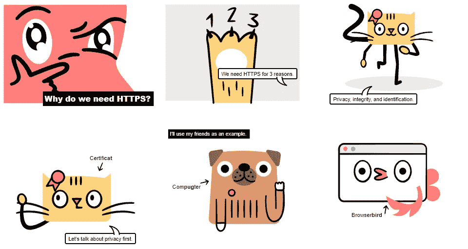

# 帮助你更快学习 Web 开发的 9 个网站——免费

> 原文：<https://javascript.plainenglish.io/9-websites-that-will-help-you-learn-web-development-faster-for-free-eb81ccea1999?source=collection_archive---------0----------------------->

## 当然，大多数你都没听说过。

Photo by [Taylor Deas-Melesh](https://unsplash.com/@taylor_deas_melesh?utm_source=medium&utm_medium=referral) on [Unsplash](https://unsplash.com?utm_source=medium&utm_medium=referral)

如果你关注我，你可能会知道我做了几年的网页开发。在那段时间里，我创建了多个网站，卖掉了其中的大部分，并且[赚了钱](https://medium.com/swlh/ive-made-3-000-through-my-programming-side-hustle-here-s-how-facad58120a5)。

我不是吹牛，但这就是现实。

之前，我与你分享了几个 [web 开发资源](/80-free-resources-for-web-designers-and-web-developers-in-2021-f400be2875ea)，随着时间的推移，我学习了额外的 web 开发[工具](/7-stupidly-simple-programming-tools-youve-probably-never-heard-of-d1f0edf54645)和[资源](/9-free-chrome-extensions-for-every-web-developer-to-unlock-full-productivity-18768f0f0126)并分享给你。

现在是时候提供一些更不可思议的资源了。

> 注意:我写这篇文章并没有从这些工具中得到任何报酬。换句话说，我没有从他们的创始人那里得到任何报酬。没有附属链接，每一个都是免费使用的。

激动吗？我们开始吧。

1.  [**JS 机器人**](https://lab.reaal.me/jsrobot/)

信不信由你，前端 web 开发就是将 JavaScript 与 HTML 和 CSS 结合起来。

准确的说，学习 HTML 和 CSS 是相当简单的。但是，说到 JavaScript，大多数人都很纠结。如果你想学习 React、Angular 或 Vue，你还需要 JavaScript 的基础知识。

在我看来，如果你想成为一名 web 开发人员，理解 JavaScript 是至关重要的。初学者经常试图研究文档，观看 YouTube 教程，并学习 JavaScript。

然而，你现在可以简单地通过[玩游戏](https://lab.reaal.me/jsrobot/)来学习。是的，你没看错。

**2。** [**练习**](https://exercism.org/)

我总是喜欢追寻掌握新技能的路线图。不管是针对 web 开发，web3 开发，还是其他什么人才。

它简化了学习过程，让我尽可能高效地学习。你也知道下一步需要学习什么语言或者需要走什么程序。

这个网站遵循同样的程序，但是有不同的变化。

假设你想学习 web 开发，你想要一个路线图来帮助你入门。

类似地，如上所述，通过遵循路线图，您可以掌握 JavaScript 的基础知识及其许多主题。

这不仅仅是为了 JavaScript 你可以学习 61 种不同的编程语言。

酷吧？

**3。** [**关键帧**](https://keyframes.app/)

每当我浏览网站或使用应用程序时，我都更喜欢动画。我相信你也喜欢它。

而且，作为一名 web 开发人员，您必须添加动画和阴影，以确保您的网站看起来令人惊叹。

是的，你可以通过参加课程和阅读博客文章来了解动画。但还有比这更酷的东西，即使用关键帧。

这是一个允许你生成动画和阴影的网站，但是你也可以通过实验 CSS 动画属性来学习。

例如，如下图所示，我们可以更改属性。

是不是很酷？

同样地，你可以学习盒子阴影和其他相关的主题。

**4。** [**Getform**](https://getform.io/)

当我刚开始学习 web 编程时，我发现学习表单处理很难。

有人被建议学 PHP，有人被建议学后端。

当时对我来说是势不可挡的，但对你不会。

如果你只想研究前端方面，而把复杂的后端部分留给表单处理，你可以使用这个网站。

所以，如果你正在做一个个人项目或者学习网络开发，这个[网站](https://getform.io/)将会帮助你提供一个完全功能化的后台。

**5。**[**HTTPS 如何运作**](https://howhttps.works/)

老实说，Web 开发涉及几个主题，很难在一天或一周内掌握。

是的，你必须学会如何建立一个网站，然后使用 React、Angular 或 Vue 等任何一种语言使其具有响应性。

这不是进程的结束；您还必须使用 API，构建后端代码，并提供安全性。是的，确保安全性至关重要。

这个网站可以帮助你学习 HTTPS 的基本知识。

**6。**[**DNS 如何工作**](https://howdns.works/)

当你开发一个网站的时候，你会学到很多东西。然而，当你把它放入任何一个浏览器时，你可能会有一些关于 URL 如何工作的问题。

是的，我也有同样的问题，并且做了很多研究。当时我没有这个网站来帮助我学习最好的方法。

但对你来说不是。

它是一个基础网站，制作了一个漫画，帮助你尽可能清楚地解释事情。

**7。** [**学习 Git 分枝**](https://learngitbranching.js.org/)

你是编码团队的一员吗？如果有，你是怎么处理代码的？Git 和 GitHub 是明显的解决方案。

然而，作为初学者，使用 git 可能很困难，简单地理解理论对您没有帮助。

所以我唯一的建议是看 YouTube 视频或者去这个网站。

你可以在 YouTube 上搜索一些视频。如果你想通过网站学习，我会推荐[学习 Git 分支](https://learngitbranching.js.org/)。

大多数 Git 基础知识和命令都是在这里可视化教授的。

**8。** [**算法可视化器**](https://algorithm-visualizer.org/)

学习数据结构和算法对我来说一直很有挑战性。仅仅买一本关于这个主题的书就会让你挠头。

说实话，抓住它是相当艰难的。

但不是在这篇文章之后，[这里有一个很棒的网站，通过可视化地呈现每个算法主题来帮助你理解算法。](https://algorithm-visualizer.org/)

我可以告诉你，学习数据结构和算法会帮助你很快找到工作。是的，它增加了你找到工作的机会和收入。

9。 [**学什么东西**](https://learn-anything.xyz/)

你想要一个能帮助你学习任何东西的网站吗？更具体地说，一个网站，你只需输入你想获得的技能的名称，它就会提供资源、路线图和博客文章。

而且绝对免费。

那么[这个网站](https://learn-anything.xyz/)就派上用场了。

希望你喜欢。

就这样——谢谢。

老实说，Pratham 在 Twitter 上分享了这些资源的大部分，所以这都归功于他。

如果你愿意，你可以免费获得我的 side hustle [电子书](https://nitinfab.gumroad.com/l/programming-side-hustle-book)。

[*如果你喜欢看这样的故事，并想帮助我成为一名作家，可以考虑成为一名中等会员*](https://nitinfab.medium.com/membership) *。它每月花费 5 美元，给你* [*无限制访问媒体内容*](https://nitinfab.medium.com/membership) *。如果你通过我的链接注册，我会得到一点佣金。*

 [## 9 个让你大吃一惊的侧推工具

### 无论你是程序员、员工还是创造者。

medium.com](https://medium.com/swlh/9-side-hustle-tools-that-will-blow-your-mind-6ebb57787eb6)  [## 7 个黑仔生产力工具如此有价值，以至于他们觉得知道它们是违法的

### 是的，我不能没有这些。

javascript.plainenglish.io](/7-killer-productivity-tools-that-are-so-valuable-they-feel-illegal-to-know-6cf8506b2bb9) 

*更多内容看* [***说白了就是***](https://plainenglish.io/) *。报名参加我们的* [***免费周报***](http://newsletter.plainenglish.io/) *。关注我们* [***推特***](https://twitter.com/inPlainEngHQ) ，[***LinkedIn***](https://www.linkedin.com/company/inplainenglish/)*，*[***YouTube***](https://www.youtube.com/channel/UCtipWUghju290NWcn8jhyAw)*，*[*不和*](https://discord.gg/GtDtUAvyhW) *。对增长黑客感兴趣？检查出* [***电路***](https://circuit.ooo/) *。*