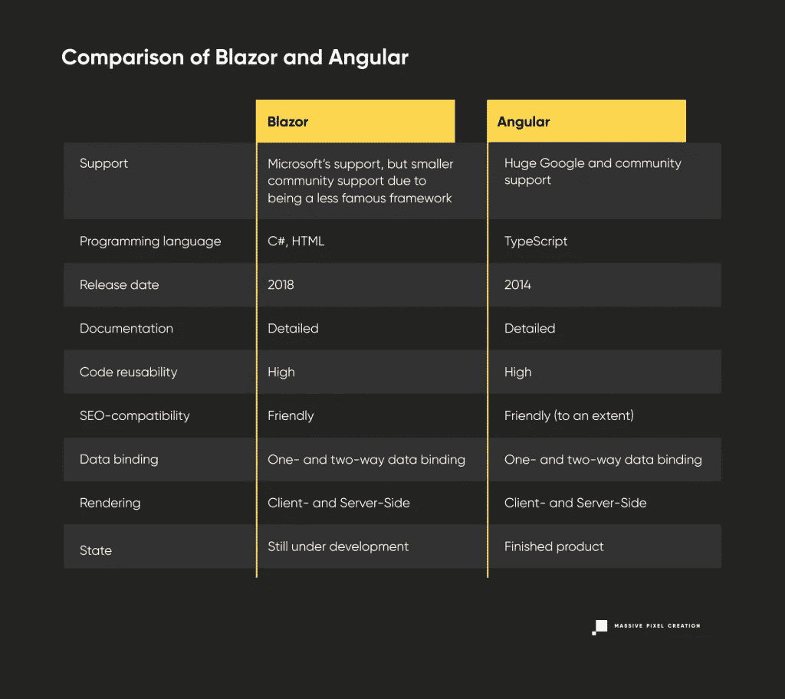

# 一场 2022 年的布拉索大战安格拉

> 原文：<https://javascript.plainenglish.io/a-2022-battle-of-blazor-vs-angular-8624fdc5dcda?source=collection_archive---------0----------------------->

全世界开发人员可用的不同框架的数量正在与日俱增。仅这一点就让做出选择的决定变得更加困难。

问题是:Blazor vs [Angular](https://massivepixel.io/services/angular-development-services/) 之战谁赢了？或者甚至有可能以诚实和公正的方式比较框架吗？继续读下去，让我们一起寻找答案。

# 有角的

# 这是什么？

基于 TypeScript(与其过时的前身 AngularJS 相反，Angular js 是一个 JavaScript 框架)，Angular 是市场上最受欢迎的开源 web 框架之一****。在框架的帮助下，开发者可以创建**交互式用户界面**、**单页应用**、**渐进式 web 应用、企业 web 应用等等**。****

****然而，Angular 是如何诞生的呢？这个故事并不复杂。起初，AngularJS 似乎对所有项目都足够了。然而，随着时间的推移，它开始需要越来越多的调整，比如新的 JavaScript 标准，对未来缺乏远见，甚至更多的其他限制。事实上，如此之多，以至于谷歌在 2014 年决定是时候改变了。那时整个 AngularJS 框架被重写，变成了我们现在知道的 Angular(对 AngularJS 的支持在 2021 年 12 月 31 日结束)。****

# ****优势****

****即使 Angular 因为它的本来面目而受人喜爱，就像这个世界上的其他事物一样，它也有优点和缺点。所以，事不宜迟，现在就让我们深入探讨一下。****

## ****持续支持****

****由于 Angular 是 Google 的框架，我们所有人都可以放心，**更新将会及时发布，并将在未来继续。Angular 的未来看起来很光明，对它的支持肯定不会很快停止。******

****而且不仅仅是谷歌。 **Angular 有一个专门的开发者社区**支持它，他们积极参与框架的开发，无论是插件、工具还是更多。如果你面临的任务看起来有点太多，你一个人无法完成，社区的人肯定会尽力帮助你。****

## ****以打字打的文件****

******干净、易懂，最重要的是，可预测的代码**可以归于 TypeScript。多亏了这种编程语言的使用，Angular 可以处理比 AngularJS 更多的东西，例如，更大的代码库。****

## ****服务器端渲染****

****Web 应用开发者可以深呼吸放松一下，因为 Angular 实际上对 SEO 行为很友好——尽管在某些条件下。这种事情的一个例子可能是在 [Angular Universal](https://angular.io/guide/universal) 的帮助下开发服务器端应用程序，而不是客户端应用程序。通过这样做，开发者可以**大大增加网站被谷歌**索引的机会，以及它在搜索引擎结果页面(SERP)中的可见性。****

## ****详细文件****

****Angular 的文档不仅非常**庞大而详细，而且很容易阅读**。每一次更新都有详细的解释，让 web 开发世界变得更容易导航。此外，文档还提供了代码示例，以防您对解释感到困惑。****

## ****复用性****

****与其他框架相比，用 Angular 开发交互式用户界面更容易。对大多数人来说。但是当你能够在不同的项目中重用部分代码时，事情会变得更加容易。****

## ****MVVM****

****Angular 是一个**开源 MVVM 框架**，这意味着程序逻辑和界面控制是分离的。在模型-视图-视图模型(也称为模型-视图-绑定器)的帮助下，用户可以保持代码有组织，项目分离。通过这样做，他们可以更快、更容易地更新、更改和修复代码。在这个模型中，视图负责容纳可视元素和接收输入。另一方面，ViewModel 将视图和模型绑定在一起。最后，模型包含程序的逻辑。****

# ****不足之处****

## ****难学****

****Angular 不是一个容易解决的框架，即使对于久经考验的开发人员也是如此。陡峭的学习曲线或需要透彻理解的详细文档——这些都会影响 Angular 的难度。此外， **Angular 是一个固执己见的框架**，这实质上意味着它有自己处理事情的方式，这使得开发人员除了遵循文档和规则之外别无选择。然而，一旦学会了，Angular 可以成为一个非常有益的朋友。****

## ****搜索引擎优化****

****尽管这也可以在 advantages 中找到，Angular 默认对搜索引擎优化并不友好。搜索引擎爬虫努力索引网站，除非它是在服务器端。如果满足这样的条件，那么网站在被索引和在 SERP 中被看到时应该不会有问题。****

## ****要人****

****与 React 或 Vue 等框架相比，Angular 项目的捆绑包通常比其他项目更重，尤其是对于较小的应用程序。不幸的是，这会降低速度。****

# ****布拉佐尔****

********

# ****这是什么？****

****[Blazor](https://dotnet.microsoft.com/apps/aspnet/web-apps/blazor) ，方便地说是 browser + razor 的简称，是一个相对**的新微软网络框架**，于 2018 年发布。与 Angular 类似，Blazor 既是开源的，也是免费的。该框架使开发者能够在现有的 web 技术如 C#或 HTML 中构建交互式和**可重用的 web UI** **。当谈到语法和句法时，该框架允许开发人员使用 Razor 和 C#的语法和句法。******

****即使 Blazor 在 GitHub 上只积累了 [9k+启动，但还是值得考虑的。为了理解 Blazor，我们需要更深入地了解它到底是什么。Blazor 有两种开发可能性——服务器和 WebAssembly。前者是的一部分。NET Core 3，用于在 ASP.NET 核心服务器上以 ASP.NET Razor 格式运行服务器端(SignalR 连接用于处理 UI 更新)。另一方面，后者用于现代 web 浏览器和开发交互式客户端 spa。](https://github.com/dotnet/blazor)****

****此外，还有三个已经宣布，但尚未发布。****

*   ****blazor PWA——专为开发渐进式 web 应用程序而设计。****
*   ****blazor Hybrid——专为开发混合应用程序而设计。****
*   ****blazor Native——专为移动平台开发本地应用程序而设计。****

# ****优势****

## ****共享的服务器端和客户端代码****

****Blazor 的一个有趣之处是，它允许在服务器端和客户端之间重用代码，许多开发人员可能会发现这很有用。这意味着您可以从后端获取代码，并将其放在前端。****

## ****Visual Studio 代码****

****由于 Blazor 是微软的框架，它得到了无可争议的可用开发工具之王的支持——Visual Studio**代码**。VSC 编辑器允许开发人员突出显示、调试、重构代码，以及许多其他有用的功能。****

## ****依赖注入****

****由于依赖注入，Blazor 制作的应用程序可以使用**控制反转**。它本质上允许为对象提供依赖关系。但是什么是依赖呢？它是一个可以充当服务的可用对象。****

****依赖注入可以分为类:注入器、客户端和服务类。它还具有不同的注入器，如构造函数、方法和属性。****

## ****JavaScript 互操作****

****JavaScript Interop 是 Blazor WebAssembly 的一项功能，允许处理 DOM 操作以及浏览器 API 调用。多亏了它，用 Blazor 开发的应用程序可以使用。NET 方法 JavaScript 函数。****

# ****不足之处****

****这真的很难写下 Blazor 的缺点作为一个整体，因为有两种方式的主机，他们都是不同的。这就是为什么我们决定把缺点一分为二 Blazor Server 和 Blazor WebAssembly 的缺点。****

## ****Blazor 服务器****

******装载速度变慢******

****由于应用程序需要不断与服务器连接，加载速度和延迟可能会较慢。加载速度慢的原因是浏览器必须下载。NET 库以及一些。dll 库，这可能会导致延迟问题。****

******没有离线支持******

****该应用程序需要主动连接到互联网。如果它以某种方式失败，应用程序将停止工作。为什么会这样？这是因为项目的每一部分都托管在服务器端，因此有连接要求。****

****【ASP.NET 核心】T4****

****为了运行应用程序，它需要 ASP.NET 核心服务器。没有它，应用程序就不可能正常启动和运行，所以一定要事先下载它！****

## ****Blazor WebAssembly****

******低端硬件的问题******

****所有的 PC 硬件都应该具有良好的质量和大小，因为 Blazor 在低端计算机上运行时可能会遇到问题。****

******受浏览器限制******

****Blazor 受限于浏览器的能力，所以只要浏览器能处理 Blazor，应该没问题。然而，并不是所有的浏览器都支持 WebAssembly，所以如果您正在使用 Internet Explorer，您可能会意外发现一个令人不快的惊喜。****

******重量问题******

****用 Blazor WebAssembly 制作的应用程序越重，加载的时间就越长。****

******初始加载时间******

****初始启动加载时间可能比大多数其他 web 开发框架要长。****

# ****冲突:布拉索 vs 角斗士****

****既然我们已经介绍了 Blazor 和 Angular 的优点和缺点，那么让我们把重点放在直接比较上。****

# ****结果****

****谷歌的 Angular 和微软的 Blazor 都是为构建现代网络应用而开发的开源网络框架，但两者之间有着重要的区别。让我们快速浏览一下。****

********

****看了一下上面的表格，真的很难选出一个唯一的赢家。这两种框架肯定各有利弊，但是有什么东西是最突出的并且可能影响决策呢？****

****当然，两者之间最大的区别是编程语言、年龄和受欢迎程度。[Angle 被世界各地的大公司使用](https://stackshare.io/angularjs)，如果您是 Angle 的开发人员，这将使您更容易找到工作。此外，Angular 是一个完美的企业解决方案，它主要用于此目的。根据您想要实现的目标，您应该选择合适的框架。如果你想确保你选择的框架有一个庞大的社区，以防你需要任何帮助，你应该选择 Angular。另一方面，如果您想在客户端和服务器端重用代码，Blazor 允许您这样做。也许你在寻找成品？在这种情况下，Angular 是给你的。****

****如您所见，这实际上取决于需求。仔细考虑你想要达到的目标，分析两个框架的优点和缺点，最后选择一个最合适的。祝你好运，下次再见！****

*****原为发表于*[*https://massivepixel . io*](https://massivepixel.io/blog/blazor-vs-angular/)*。*****

*****多内容于* [***中。***](https://plainenglish.io/) **[***报名参加我们的免费周报***](http://newsletter.plainenglish.io/) *。跟随我们登上* [***推特***](https://twitter.com/inPlainEngHQ) 和*[***领英***](https://www.linkedin.com/company/inplainenglish/) *。加入我们的* [***社群不和***](https://discord.gg/GtDtUAvyhW) *。********