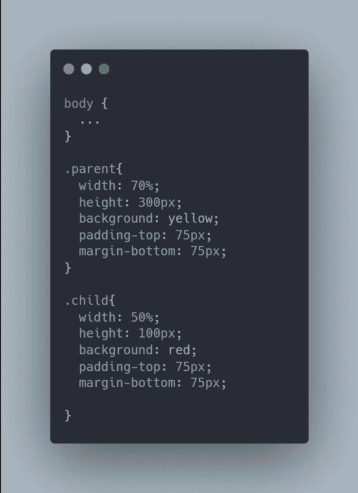
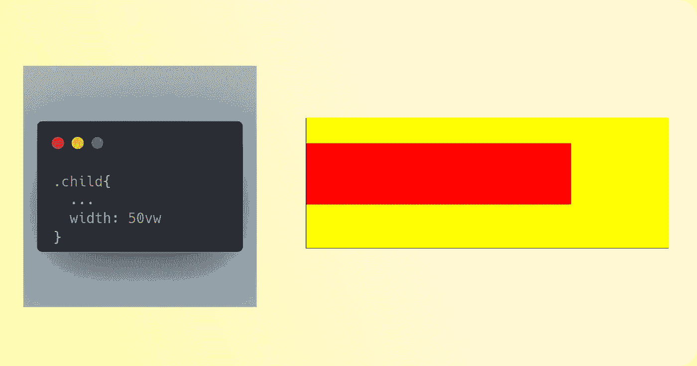

# CSS 视窗单元 3 分钟指南

> 原文：<https://javascript.plainenglish.io/a-3-minute-guide-to-css-viewport-units-39b3dc019113?source=collection_archive---------2----------------------->

## 前所未有地使用 CSS

CSS 视口单位是真正的响应长度单位，它们随着浏览器调整大小而改变值的事实使它们在现代 web 应用程序中更加灵活。

视口单元由 ***四个*** 单元组成，分别是 ***vh、vw、vmin*** & ***vmax、***CSS 中的所有这些视口单元都是您在处理个人项目时的绝佳选择，因为它们不太可能导致错误。我会给你一个这些设备的快速指南以及如何使用它们。

## 四个视口单元

*   **视口高度(vh):** 基于视口的**高度**，例如 ***1vh*** 的值等于视口高度的 ***1%*** 。
*   **视口宽度(vw):** 类似于 ***vh*** 单位，它是基于视口&的**宽度*****1vw***的值等于视口*宽度*。**
*   ****视口最小值(vmin):** 在此单位中，视口的较小尺寸将是 ***vmin*** 的值。*例如*，假设你的视口高度小于宽度，那么 **1vmin** 的值将等于视口高度的 **1%** 。*同理如果* ***宽度*** *小于* ***高度*** *。***
*   ****视口最大值(vmax):** 安静类似于 ***vmin*** ，这个单位是基于视口的较大尺寸。*例如，如果视口高度大于宽度，则****1 VMAX***的值将等于视口高度的 ***1%*** 。如果 ***宽度*** 大于 ***高度*** 也是如此。**

## **视区与 CSS 中的百分比**

**开发人员有时会混淆视口单位和百分比，它们可能看起来一样，但实际上有很大不同。子元素的**宽度** & **高度**依赖于父元素，而使用百分比使得两者在不同的情况下有所不同。**

*****例如:*****

*   **假设我们有两个 ***div*** ，它们各自的类是**父** & **子**。**

****

*   **此时，你可以注意到我们仅使用**百分比**来定义**div**的宽度。**
*   **在这种情况下，子对象的**宽度**取决于父对象的宽度，这可以在下面给出的结果中看到。**

****

*   **当我们在 **vw，**中改变子元素的宽度时，你可以注意到它的宽度发生了变化，因为现在宽度取决于视口。**

****

**现在你知道了。感谢您的阅读。**

** [## 6 个最佳反应数据可视化库

### 立即升级您的 React 项目

javascript.plainenglish.io](/6-best-react-data-visualization-libraries-fc155b573168)  [## 开发人员永不过时的 4 项技能

### 提升自信的技巧

javascript.plainenglish.io](/4-skills-that-never-gets-old-for-developers-6c90ef901fb8)  [## 2022 年自学成才的开发者赚钱的 5 种方式

### 2022 年挣得比全职工作还多

javascript.plainenglish.io](/5-ways-to-make-money-as-a-self-taught-developer-in-2022-54e18603c8e0) 

*更多内容请看*[***plain English . io***](http://plainenglish.io/)*。报名参加我们的**[***免费每周简讯***](http://newsletter.plainenglish.io/) *。在我们的* [***社区***](https://discord.gg/GtDtUAvyhW) *获得独家获得写作机会和建议。****