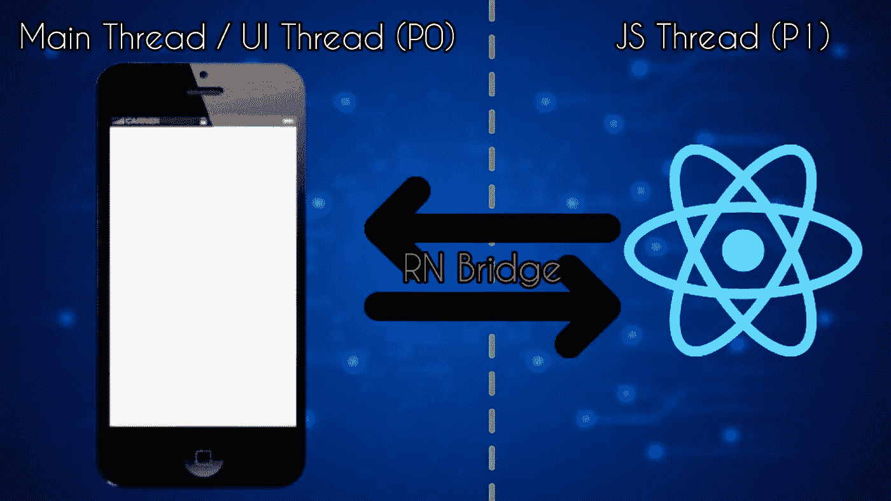

# 所有关于 React Native 的初学者:优点、缺点和未来

> 原文：<https://javascript.plainenglish.io/a-beginners-friendly-article-on-react-native-simply-explained-f3098b1873ec?source=collection_archive---------2----------------------->

## 了解什么是 React Native 及其优缺点，以确定您是否应该作为 React Native 开发人员开始您的旅程。

欢迎来到另一个博客，在这个博客中我们将回答一些问题，比如什么是 React Native 以及使用它的利与弊。这也会让你清楚地了解你是否应该选择 React Native。对于任何想要开始使用 React Native 的 React 开发人员来说，这篇文章都是必读的。

什么是 React Native，它的宣传是什么？

React Native 是一个由 Meta(以前是脸书)创建的开源 UI 应用框架。它主要用于创建跨平台应用程序(可以在 Android 和 iOS 上轻松运行的应用程序)，使开发人员能够在使用原生平台功能的同时使用 React。React 和 React Native 之间的主要区别在于，与 React 不同，它不执行 DOM 操作(通过虚拟 DOM ),而是直接在终端设备上作为 Javascript 线程(P1)运行，该线程在后台运行，并通过称为 React Native Bridge 的特殊桥与本机平台(主线程— P0)通信。这座特殊的桥梁确保了:

1.  以优化的方式(使用批处理)在 P1 和 P0 之间传输序列化数据。
2.  通信是异步进行的，因此它永远不会被阻塞。

根据 Stack Overflow Survey 2021——React Native 是十大最受欢迎的技术框架之一，在竞争对手 Flutter 面前表现强劲。Flutter 是 Google 发布的 UI 软件开发工具包，用于构建 React Native 这样的跨平台应用。由于 React Native app 是使用 JavaScript 构建的，所以 Flutter apps 是用 Dart 语言编写的。作为对比，Instagram、Messenger、Uber Eats 等热门 app。使用 React Native 构建，而 GPay、阿里巴巴、Dream 11 等应用程序则使用 Flutter 构建。

*关于最佳编码实践——请查看我之前的博客:* [***最佳编码实践——React Native Edition 2022***](/best-coding-practices-react-native-edition-2022-da833c8161de)

现在，让我们集中讨论使用 React Native 的优点和缺点:

# 优点:

1.  React 母语自夸的主要优势是——一次学习，随处书写。通过这种方法，有经验的 web React 开发人员可以开始构建移动应用程序，因为 React 的核心概念对两者来说是相同的。
2.  它提供的下一个优势是，它允许我们构建一个省时且易于维护的跨平台应用程序。
3.  React Native 提供了**热重载**功能，这意味着开发者的工作可以实时实现，无需重新编译代码。是的，这节省了地狱很多时间。
4.  广泛的社区支持——React Native 每天都在流行，并被广泛接受为年轻组织的首选。它自诩拥有最大的开发者社区之一。
5.  易于安装和开始使用。你可以用任何一种方式设置开发环境——如果不熟悉移动开发，那么可以从 **Expo CLI** 开始，或者如果已经熟悉移动开发，那么可以设置 **React Native CLI** 。
6.  它可以节省高达 50%的测试时间。

# 缺点:

1.  使用 react native 构建跨平台应用的机会成本是——性能低，质量一般。当任何应用程序建立在本地语言之上时，它肯定会利用专用系统/设备的所有功能，但当我们使用 React Native 时，我们会有一些限制。
2.  对于构建大量运行动画/构建游戏的应用程序，react native 成为不可取的选择。颤动在那个空间更有效。
3.  新的、动态的、未经 100%测试的——每一个新版本都在不断更新代码语法、模式、架构等。由于向后兼容性差，当更新到最新版本时，这有时可能会导致一些破坏性的更改。这对开发人员来说是一种开销。

以上是关于什么是 React Native 的一些关键信息，以及从初学者的角度来看使用它的利弊。感谢您的阅读，请关注我的下一次更新，我们可能会深入了解 React 原生架构。

*更多内容看* [***说白了就是***](https://plainenglish.io/) *。报名参加我们的* [***免费周报***](http://newsletter.plainenglish.io/) *。关注我们关于* [***推特***](https://twitter.com/inPlainEngHQ) ， [***领英***](https://www.linkedin.com/company/inplainenglish/) *，以及* [***不和***](https://discord.gg/GtDtUAvyhW) *。*