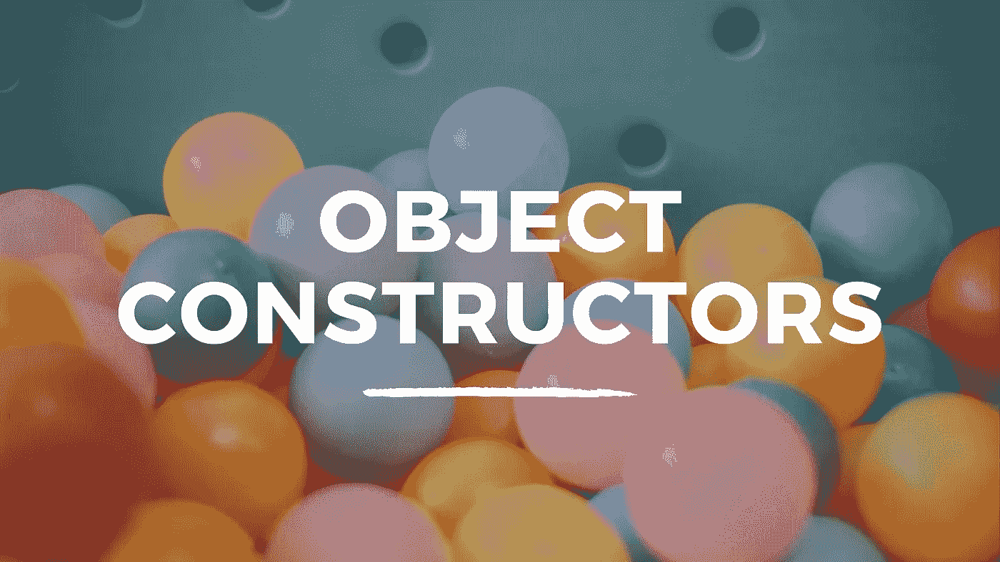
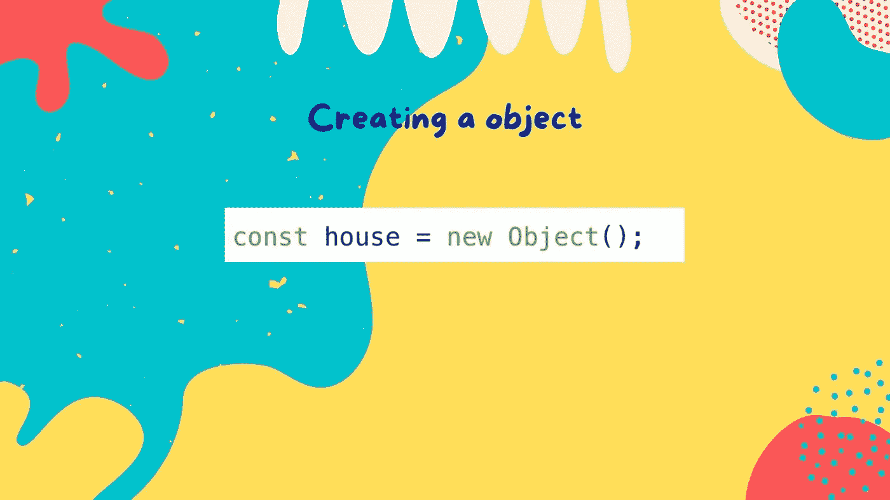
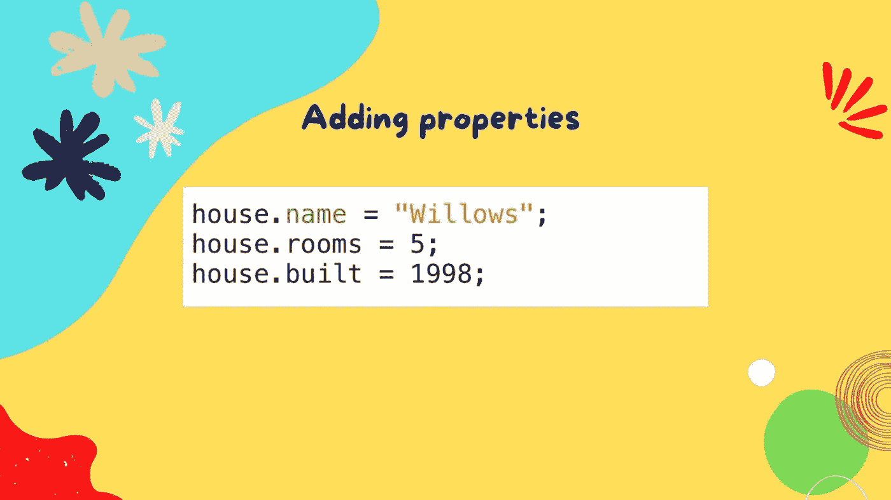
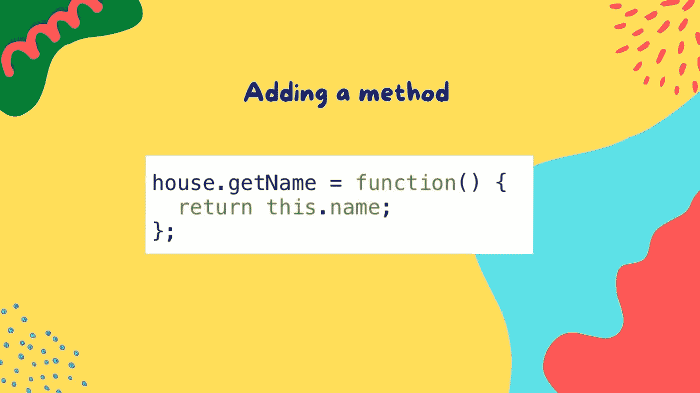
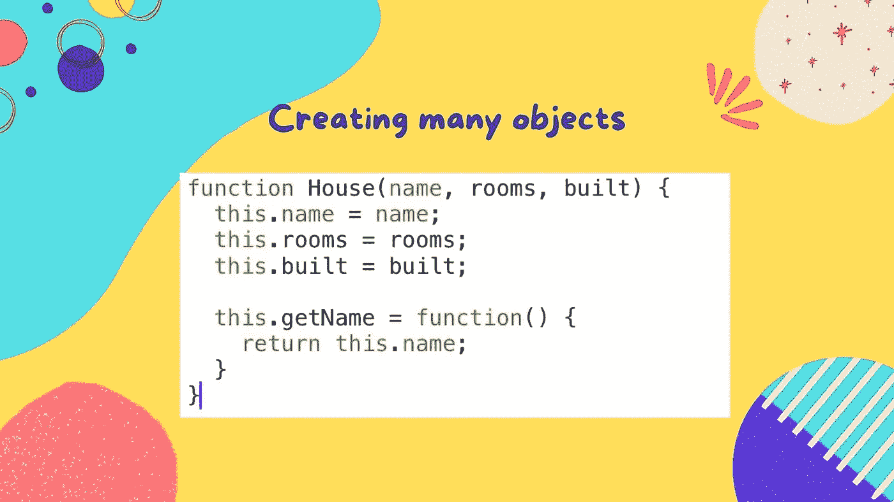
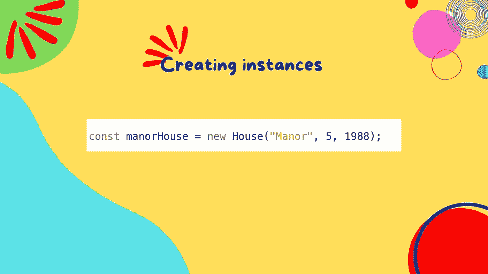

# 使用 JavaScript 中的对象构造函数创建对象

> 原文：<https://javascript.plainenglish.io/a-beginners-guide-to-object-constructors-in-javascript-b61e9af7a153?source=collection_archive---------3----------------------->

## 关于如何使用 JavaScript 中的对象构造器符号创建对象的初学者指南。



不久前，我写了一篇介绍对象[文字](https://medium.com/javascript-in-plain-english/a-beginners-guide-to-object-literals-in-javascript-7dea59d3a21d)的文章。JavaScript 提供了另一种创建对象的方法，这被称为对象构造器符号。我们可以从简单地创建一个对象开始。



在上面的图像中，我们创建了一个空白对象，它被分配给变量 house。new 关键字和对象构造函数( *Object()* )创建对象。我们可以在控制台中检查该对象，我们会看到这一点。

```
const house = new Object();
console.log(house);//Returns ---> {}
```

目前，我们的房子没有做太多。我们可以给对象添加一些属性。



我们为房子添加属性*名称*为串*柳树*，*房间*为值 *5、*和年份*建造*为值 *1998* 。现在让我们再次检查我们的对象。

```
console.log(house);//Returns ---> {name: 'Willows', rooms: 5, built: 1998}
```

房子对象现在添加了属性，但这不是很动态。我们可能想要添加一个方法来返回一些值。在我们的例子中，我们将使用一个方法来返回房屋的名称。



现在，当我们再次检查我们的 house 对象时，我们可以看到 *getName* 方法已经作为属性添加到了该对象中。

```
console.log(house);
//Returns ---> {name: 'Willows', rooms: 5, built: 1998, getName: ƒ}
```

让我们试着使用这个方法。

```
house.getName();
//Returns ---> 'Willows'
```

我们可以使用点符号或括号符号来更新对象的属性。让我们试着用点符号把房子的名字改成字符串。

```
house.name = "Manor";
console.log(house);
//Returns ---> {name: 'Manor', rooms: 5, built: 1998, getName: ƒ}
```

我们可以使用 delete 关键字，后跟我们希望删除的属性的名称来删除属性。让我们尝试一下，再次检查对象。

```
delete house.name;
console.log(house);
//Returns ---> {rooms: 5, built: 1998, getName: ƒ}
```

当我们检查该对象时，我们可以看到它不再包含该房屋的*名称*属性。让我们使用括号符号将属性添加回字符串 *Willows* 。这也可以用点符号来完成。

```
house['name'] = "Willows";
console.log(house);
//Returns ---> {rooms: 5, built: 1998, name: 'Willows', getName: ƒ}
```

上面的方法很有效，但是有时候你可能会多次使用一个对象。也许您想要代表多个用户，或者在我们的例子中，我们可能想要创建使用相似属性的多个房屋。使用构造函数符号，我们可以用一个对象作为其他对象的模板或蓝图。让我们改变我们的房子功能来做到这一点。



房子函数现在使用括号中的三个参数，*名称*，*房间，*和*建造*。每个参数设置对象内部的属性值。我们使用`this`关键字，这样每个属性和方法都属于用函数创建的对象的单个实例。我们使用大写字母表示 *House* 函数，这样我们就可以区分该函数使用了构造函数符号。它在代码运行时没有影响，但它是 JavaScript 中使用的命名约定。

现在我们准备好使用我们的函数并创建对象的实例。我们使用关键字`new`来完成这项工作，然后调用创建对象的函数，在我们的例子中是 *House* 。我们将 *House* 参数的属性作为参数传递给函数。让我们看一个例子。



在上面的例子中，我们创建了一个名为 *manorHouse* 的变量。最初，这将是未初始化的，但我们随后通过使用`new`关键字创建了*房屋*对象的实例。我们为*名称*参数传入字符串*庄园*，为*房间*参数传入值 5，为*建成*参数传入 1988。让我们以`console.log`*庄园*为例。

```
console.log(manorHouse);
//Returns ---> House {name: 'Manor', rooms: 5, built: 1988, getName: ƒ}
```

让我们尝试创建对象的第二个实例。

```
const willowHouse = new House("Willow", 4, 1990);
console.log(willowHouse);//Returns ---> House {name: 'Willow', rooms: 4, built: 1990, getName: ƒ}
```

我们现在有两个对象， *manorHouse* 和 *willowHouse* 。这两个对象都代表房屋，但是*名称*、*房间、*和*已建*属性的值对于所创建的特定对象是独立的。当我们在每个对象上使用 *getName* 方法时，我们可以确认这一点。

```
willowHouse.getName();
//Returns ---> 'Willow'manorHouse.getName();
//Returns ---> 'Manor'
```

如果你想看这个教程的视频，请看下面的视频。

我希望你喜欢阅读这篇文章。请随时发表任何评论、问题或反馈，并关注我以获取更多内容！

*更多内容请看*[***plain English . io***](https://plainenglish.io/)*。报名参加我们的* [***免费周报***](http://newsletter.plainenglish.io/) *。关注我们关于*[***Twitter***](https://twitter.com/inPlainEngHQ)*和*[***LinkedIn***](https://www.linkedin.com/company/inplainenglish/)*。加入我们的* [***社区不和谐***](https://discord.gg/GtDtUAvyhW) *。*