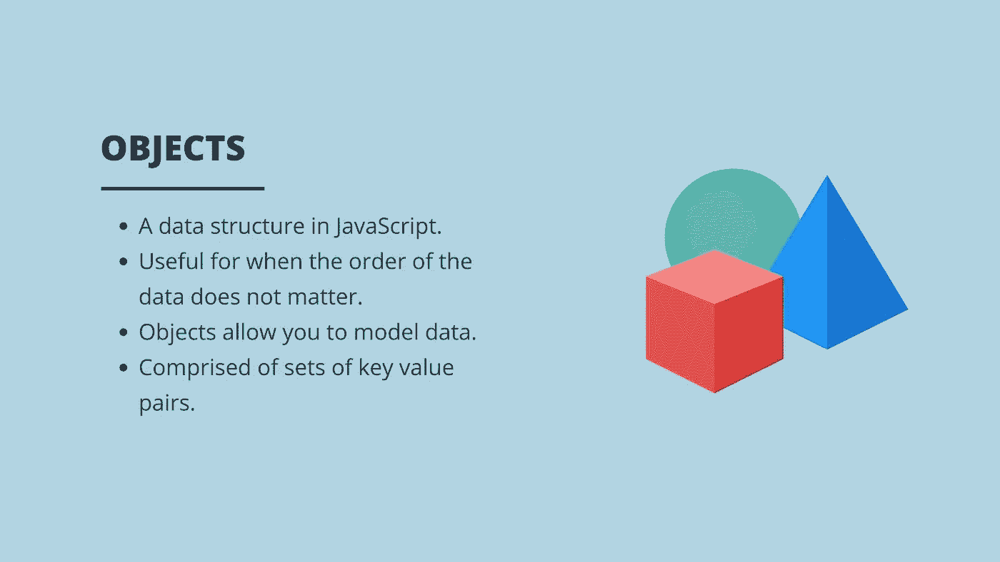

# JavaScript 中对象文字的初学者指南

> 原文：<https://javascript.plainenglish.io/a-beginners-guide-to-object-literals-in-javascript-7dea59d3a21d?source=collection_archive---------20----------------------->

## 用例子理解 JavaScript 中的对象。



## 什么是对象？

对象是 JavaScript 中的一种数据结构，就像*数组*一样，但是不同之处在于，当我们想要存储无序的数据或者保持数据的顺序无关紧要时，对象是有用的。举个例子，如果你想存储一只狗的详细信息，虽然我们可以用数组来实现，但是对象会更合适。这是因为我们对狗的细节更感兴趣，而不是保留细节的顺序。

对象还使我们能够扩展对象以包含关于另一个对象的数据。所以我们的狗对象可以存储多只狗的数据。一个对象是一组*键值*对的容器。回到狗的例子，如果我想存储一只叫 ted 的狗的详细信息，那么在对象中我可能想存储狗的名字、年龄和品种。所以名字是键，值是字符串 ted。

```
const ted = {
  name: "Ted"
};//name is the key
//"Ted" is the value
```

## 创建对象

和数组一样，对象也是引用类型，所以在使用 *let* 或 *const 时，同样的规则也适用。如果对象是用 const 创建的，我们可以改变它，但是一旦创建了，我们不能把它完全重新分配给一个不同的对象。*

```
const dog = {};
dog = { name: "Bob" };
//Returns ---> Uncaught TypeError: Assignment to constant variable.
    at <anonymous>:1:5let dog = {};
dog = { name: "Bob" };
//Returns ---> {name: 'Bob'}
```

现在让我们试着创建一个对象，我们将通过使用创建一个*对象文字*的语法来完成。我们将从创建一个空对象开始，我们称之为空对象，我们使用左花括号和右花括号来创建它。

```
let emptyObject = {};
```

这不会做太多，所以现在让我们创建一个具有一些属性的新对象。我们将创建前面讨论过的 dog 对象，我们将把它分配给一个名为 dog 的变量，并设置名称、年龄和品种属性。

```
let dog = {
  age: 5,
  name: "Fred",
  breed: "Labrador"
};
```

我们使用*年龄*作为键，并将 *5* 设置为值。在添加下一个属性之前，我们使用逗号。然后，我们将*名称*设置为键，将字符串“ *Fred* ”设置为值。最后，我们设置*品种*键和字符串“*拉布拉多*”作为值。因为这是最后一个属性，所以我们不需要添加逗号。

在控制台中，我们可以检查我们创建的对象，如果我们 *console.log* 退出我们的对象。

```
console.log(dog);
//Returns ---> 
{age: 5, name: 'Fred', breed: 'Labrador'}
```

你可以看到我们在对象中定义了所有的键值对。因为顺序对于一个对象来说无关紧要，所以您也可以看到该对象已经更改了属性，它们现在是按字母顺序排列的，这很好。

一个旁注。保存对象时，所有对象键都被转换为字符串，因此您可以使用数字作为键，但它将被保存为字符串，除非您使用符号。

## 访问属性

有两种方法可以访问单个对象的属性。首先是点符号。如果您知道希望访问的属性键的名称，并且该属性不包含任何特殊字符，例如，它不是使用数值或空格创建的。然后，您可以使用点符号来访问键值。我们写下对象的名字，后面跟着一个点，后面跟着属性的名字。

```
objectsName.propertyName
```

如果我们试图访问一个不存在于该对象中的属性，那么将返回 undefined。让我们试着从我们的 dog 对象中访问 name 属性。

```
dog.name;
//Returns ---> 'Fred'
```

现在让我们尝试访问一个在我们的狗对象中不存在的属性。我们将尝试访问财产耳朵。如下例所示，返回 undefined。

```
dog.ears;
//Returns ---> undefined
```

接下来，让我们尝试使用点符号来访问一个数字属性。为此，我们将创建一个名为 *testObject* 的对象文字，键为 1，值为 2。

```
let testObject = {
  1: 2
};
```

现在，如果我们尝试使用点符号来访问它，你可以看到，我们不能这样做，我们会得到一个错误。

```
testObject.1;
// Returns ---> Uncaught SyntaxError: Unexpected number
```

如果我们真的需要进入这个地方呢？我们可以使用第二种方法来访问一个称为*括号符号*的属性。括号表示法与访问字符串中的元素非常相似，除了不是传入要访问的属性的键。如果我们需要访问一个字符串属性，那么我们应该将一个字符串传递到方括号中。

```
testObject[1];
//Returns ---> 2
```

## 添加和更新属性

要向对象添加属性，可以使用点符号或括号符号，然后使用赋值运算符。返回值将是您添加到对象的属性值。回到我们的狗对象，我们将使用点符号为狗的颜色添加一个新属性，并将值设置为字符串 brown。

```
dog.colour = "Brown";
console.log(dog);//Returns ---> {age: 5, name: 'Fred', breed: 'Labrador', colour: 'Brown'}
```

当我们在上面的例子中注销我们的狗对象时，我们可以看到颜色属性已经被添加了。让我们做另一个例子，但使用括号符号，并为狗的大小添加一个属性。

```
dog['size'] = "Small";
console.log(dog);Returns ---> {age: 5, name: 'Fred', breed: 'Labrador', colour: 'Brown', size: 'Small'}
```

这一次，当我们 console.log 出狗对象时，我们还在对象中添加了带有字符串“Small”的狗的大小。

我希望你喜欢这篇文章，请随时发表任何意见，问题或反馈，并关注我的更多内容！

*更多内容看* [***说白了就是***](http://plainenglish.io/) *。报名参加我们的* [***免费周报***](http://newsletter.plainenglish.io/) *。在我们的* [***社区获得独家访问写作机会和建议***](https://discord.gg/GtDtUAvyhW) *。*