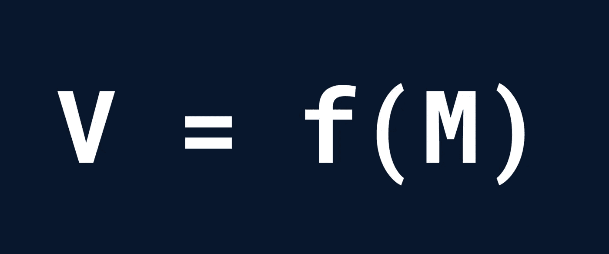
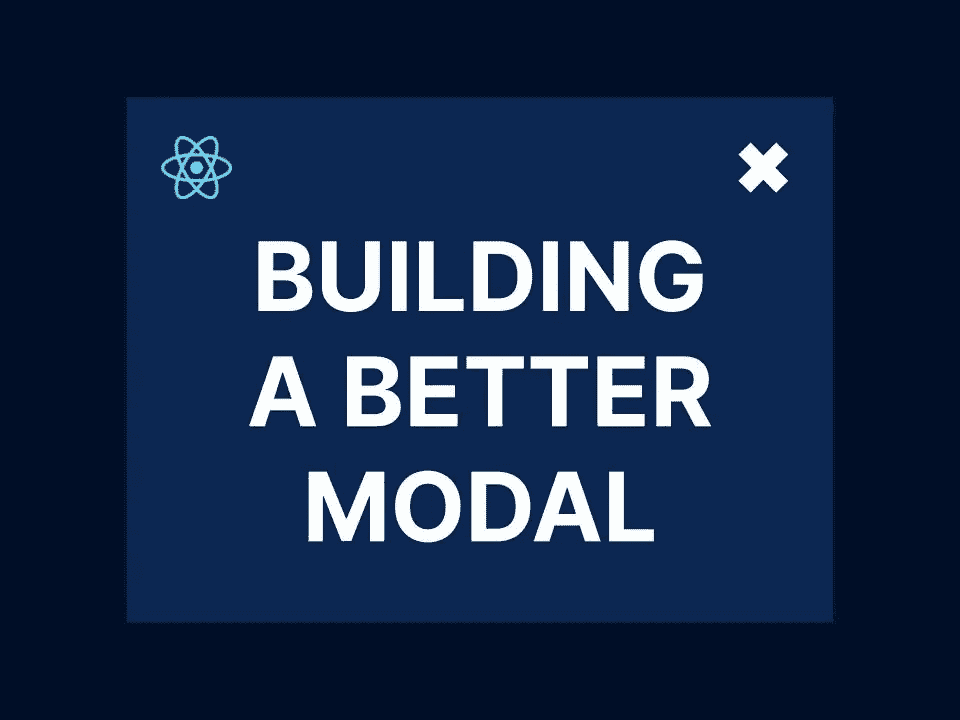

# React 中情态动词的更好处理方法

> 原文：<https://javascript.plainenglish.io/a-better-approach-to-modals-in-react-236439955bab?source=collection_archive---------2----------------------->

我喜欢 React 的一点是，它都围绕着一个基本概念:视图(用户看到的内容)是 T2 模型(与用户相关的所有数据)的一个功能。



在大多数情况下，这是一个构建 ui 的极好的概念模型。不过，有时候命令式方法更容易推理。

以情态动词为例。在 React 的世界中，与模态的完全交互(打开它、与之交互和/或关闭它)是移动部件管弦乐队的微妙结果，包括:

1.  指示模式是否应该显示的状态变量
2.  可能更多的状态包含了与模态相关的数据，比如显示什么样的文本或按钮
3.  每个按钮的事件处理程序

所有这些数据都需要通过组件树向上、向下和横向传递。与它看起来应该有多简单相比，这是一个令人纠结的混乱:显示一个新屏幕，等待用户的按钮点击，并根据用户点击的按钮做一些事情。

在我的上一个项目中，我面临着实现多个模态的恼人任务，我只需要用户的一个简单回答，比如一个 OK/cancel，或者一个简短的文本响应。

我对钩子很着迷，所以我的第一个想法是:我能不能写一个钩子，把所有讨厌的状态和回调简化成一个简单的、命令式的 API，我可以在我的应用程序的任何地方使用它？

原来我可以，你也可以。在这个过程中，你会学到很多关于承诺和反应的知识。



Let’s have some fun.

# API

所有好的软件模块都是从接口开始的。这就像描述系统的目标——它应该能够做什么，使用什么命令？

从概念上讲，提示就像返回承诺的函数一样简单。我们将模态需要的任何数据传递给函数，经过一段延迟(无论用户花多长时间想出答案)，它返回用户的响应。

例如，让我们考虑一个 OK/cancel 模态。我们希望向 modal 发送一条自定义消息，并让它返回“OK”或“cancel”。这是这样一个函数的签名:

```
type OKCancelModalResponse = "OK" | "cancel";

function okCancelModal(message: string): Promise<OKCancelModalResponse>;
```

所以，我们的目标是写一个钩子，用这个签名生成一个函数。以下是这种挂钩的模板:

```
export function useOKCancelModal() {
  return useCallback((message: string) => {
    // open the modal and do our stuff
    const promise = new Promise<OKCancelModalResponse>();
    return promise;
  }, []);
}
```

# 用数据思考

通用模型至少包含两个组件:

1.  调用模态的组件(本质上是调用者)
2.  呈现模式的组件(本质上是被调用方)

数据需要在这两个组件之间传递。具体来说，调用者需要告诉调用者消息是什么，而调用者需要用一个特定的响应(“OK”或“cancel”)来响应调用者。

我们可以为此使用一个状态“片段”,因为我们永远不需要同时知道提示和响应。下面是一个简单的数据定义:

```
 type OKCancelModalData = {
  message: string;
  response?: OKCancelModalResponse;
}
```

*你到底想如何传输这些数据取决于你，但是我使用了一个简单的全局状态库，叫做 [Jotai](https://jotai.org/) 。我首先初始化了一个*原子*，它只是全局状态的一部分:*

```
export const okCancelModalData = atom<OKCancelModalData | null>(null);
```

`null`表示尚未打开任何模态，或者最后一个模态已关闭，其响应已读取。

然后，我们可以像这样将这个全局状态挂钩到我们的自定义挂钩中:

```
export function useOKCancelModal() {
  const [data, setData] = useAtom(okCancelModalData);

  return useCallback((message: string) => {
    // open the modal and do our stuff
    const promise = new Promise<OKCancelModalResponse>();
    return promise;
  }, []);
}
```

当回调被调用时，第一步是打开模式并传入给定的消息:

```
export function useOKCancelModal() {
  const [data, setData] = useAtom(okCancelModalData);

  return useCallback((message: string) => {
    setData({ message });
    const promise = new Promise<OKCancelModalResponse>();
    return promise;
  }, []);
}
```

现在是有趣的部分:承诺。

# 许下承诺很容易，但信守承诺却很难

无论何时你迷失在承诺的土地上，只要记住 Javascript 承诺只不过是回调的标准化，带有一些花哨的语法。`resolve`函数就是回调。

在我们的例子中，我们需要用用户的响应调用`resolve`函数。当然，我们不会立即知道用户的响应——我们必须等待模态组件用响应更新`data`。

为此，我们将添加另一个状态，但这个状态不需要是全局的，因为它将只存储由 promise 构造函数生成的`resolve`函数，如下所示:

```
export function useOKCancelModal() {
  const [data, setData] = useAtom(okCancelModalData);
  const [resolve, setResolve] = useState<
    (response: ConfirmationModalResponse) => void
  >(() => {});

  return useCallback((message: string) => {
    setData({ message });
    const promise = new Promise<OKCancelModalResponse>(
      (_resolve) => setResolve(_resolve)
    );
    return promise;
  }, []);
}
```

很简单。但是有一个问题，任何时候你试图用`React.useState()`存储一个函数都会遇到这个问题。

正常情况下，当你调用`setState`时，你只是传入新的状态。这就是我们在上面尝试的，它适用于除功能之外的一切*。*

问题是`setState`还允许你传入一个 reducer 函数，它根据前一个状态计算下一个状态。所以当你传入`setState`的值本身就是一个函数的时候，React 会调用这个函数并存储它返回的值。在这种情况下，这将尽早解决我们的承诺，使我们的钩子无用。

解决这个问题很简单:我们创建一个更高级的函数！我们没有传入`_resolve`，而是传入一个返回它的函数:`() => _resolve`。像这样:

```
export function useOKCancelModal() {
  const [data, setData] = useAtom(okCancelModalData);
  const [resolve, setResolve] = useState<
    (response: ConfirmationModalResponse) => void
  >(() => {});

  return useCallback((message: string) => {
    setData({ message });
    const promise = new Promise<OKCancelModalResponse>(
      (_resolve) => setResolve(() => _resolve)
    );
    return promise;
  }, []);
}
```

现在我们准备调用`resolve`。

# 你知道它，你讨厌它，`useEffect`

`useEffect`是我们如何将副作用(比如调用`resolve`)与组件中的数据变化同步，比如全局状态变量`data`。

我们所要做的就是等待对`data`的更改，如果存在响应，则使用该响应对`resolve`进行更改，并重置模态数据。因此:

```
export function useOKCancelModal() {
  const [data, setData] = useAtom(okCancelModalData);
  const [resolve, setResolve] = useState<
    (response: ConfirmationModalResponse) => void
  >(() => {});

  useEffect(() => {
    if (data && data.response) {
      resolve(data.response);
      setData(null);
    }
  }, [data, setData, resolve]);

  return useCallback((message: string) => {
    setData({ message });
    const promise = new Promise<OKCancelModalResponse>(
      (_resolve) => setResolve(() => _resolve)
    );
    return promise;
  }, []);
}
```

这就是我们的钩子。

# 把所有的放在一起

首先，您需要一个组件来呈现您的模态。逻辑很简单:

1.  如果`okCancelModalData`是`null`，不要渲染任何东西
2.  否则，用`okCancelModalData.message`作为文本，用两个按钮设置正确的`modalData`状态来呈现一个模态

```
const OKCancelModal: React.FC = () => {
  const [modalData, setModalData] = useAtom(okCancelModalData);

  const onCancel = () => {
    setModalData({ ...modalData!, response: "cancel" });
  };

  const onOK = () => {
    setModalData({ ...modalData!, response: "confirm" });
  };

  if (!modalData) {
    return null;
  }
  return (
    <Modal onClose={onCancel}>
      <p>{modalData.message}</p>
      <div>
        <Button onClick={onCancel}>
          Cancel
        </Button>
        <Button onClick={onOK}>OK</Button>
      <div>
    </Modal>
  );
};
```

现在，您可以通过导入`useOKCancelModal`钩子从任何组件的函数中调用它:

```
const ModalCaller: React.FC = () => {
  const okCancelModal = useOKCancelModal();

  async function doSomethingWithPrompt() {
    const response = await okCancelModal("Clap this Medium story?");
    if (response === "OK") {
      mediumStory.clap();
    } else {
      // do nothing
    }
  }

  return ...
}
```

# 结论

事后看来，这个设计似乎很简单，几乎是显而易见的。但是所涉及的概念却不是，这些概念——承诺和 React 挂钩——对于任何有抱负的 Javascript 或 React 开发人员来说都是绝对必要的。

我希望你从看到这段代码中有所收获，并喜欢你的新模态钩子——只是不要过度使用它，它是坏 UX。

## 更多内容请访问 [PlainEnglish.io](https://plainenglish.io/) 。

*报名参加我们的* [***免费每周简讯***](http://newsletter.plainenglish.io/) *。关注我们关于* [***推特***](https://twitter.com/inPlainEngHQ)[***领英***](https://www.linkedin.com/company/inplainenglish/)*[***YouTube***](https://www.youtube.com/channel/UCtipWUghju290NWcn8jhyAw)***和****[***不和***](https://discord.gg/GtDtUAvyhW) **

## **希望扩大你的科技创业公司的知名度和采用率吗？检查[电路](https://circuit.ooo/?utm=publication-post-cta)。**