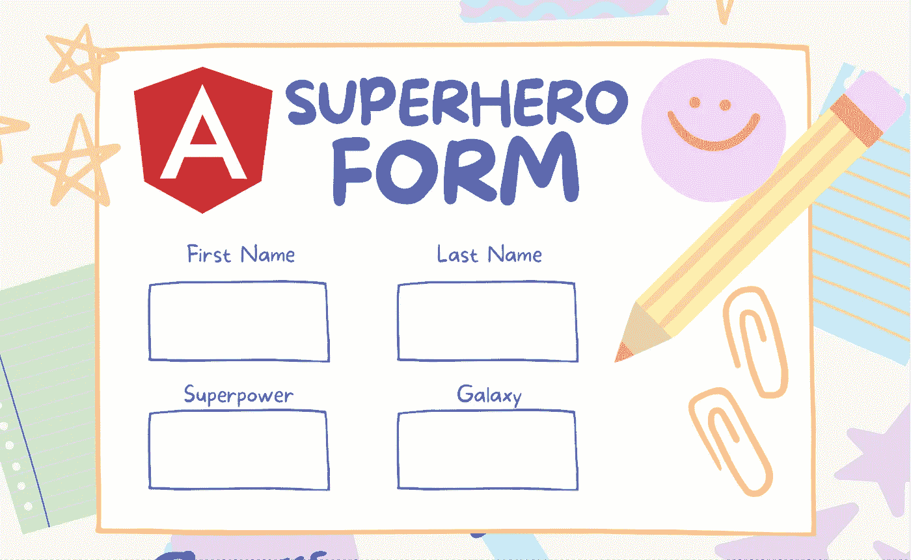
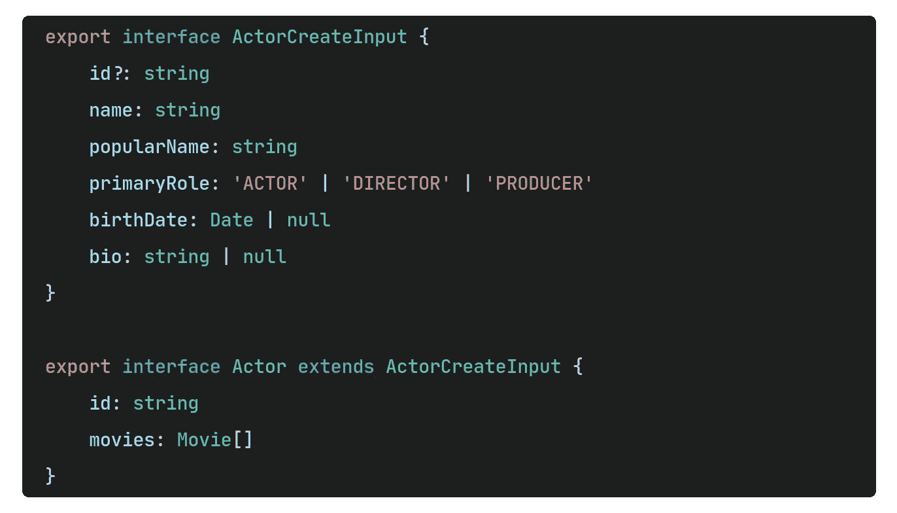
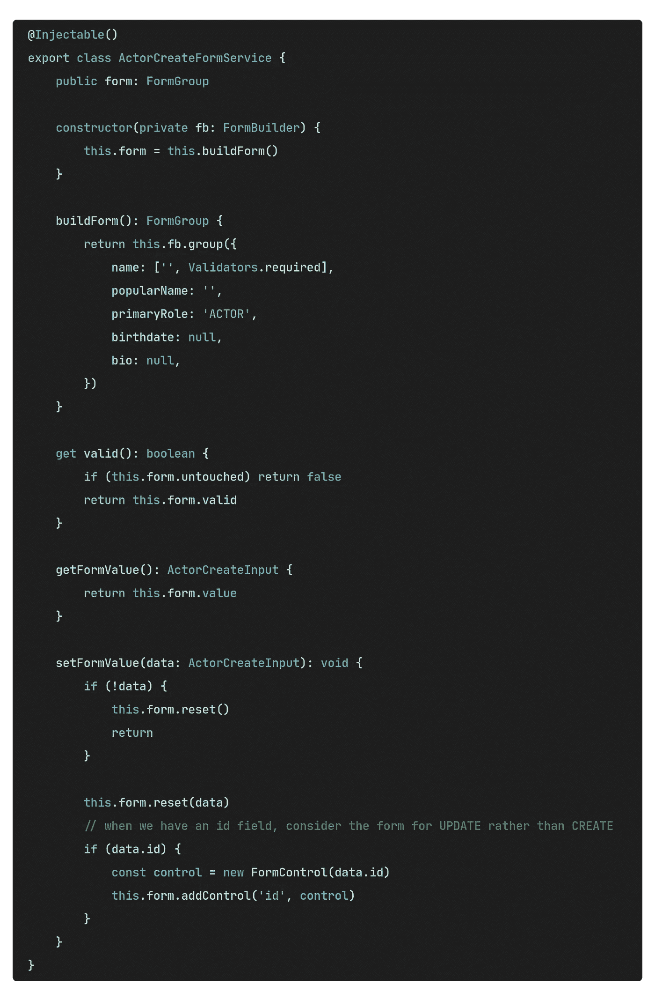
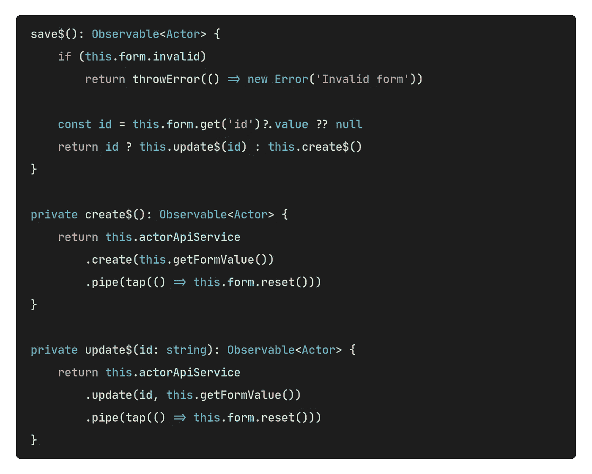
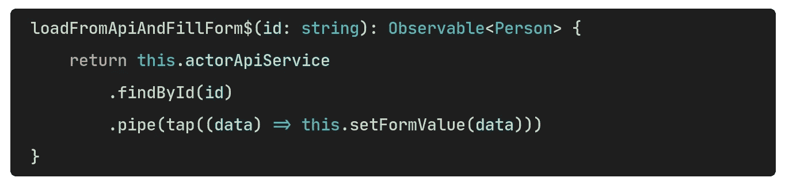
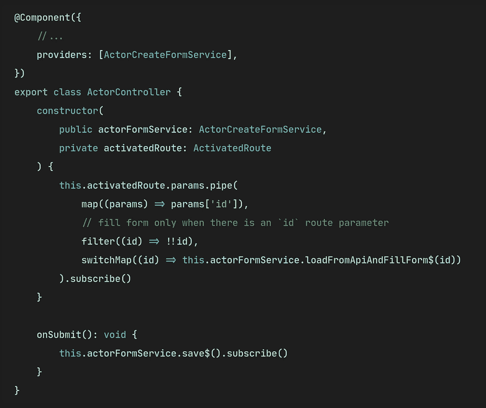
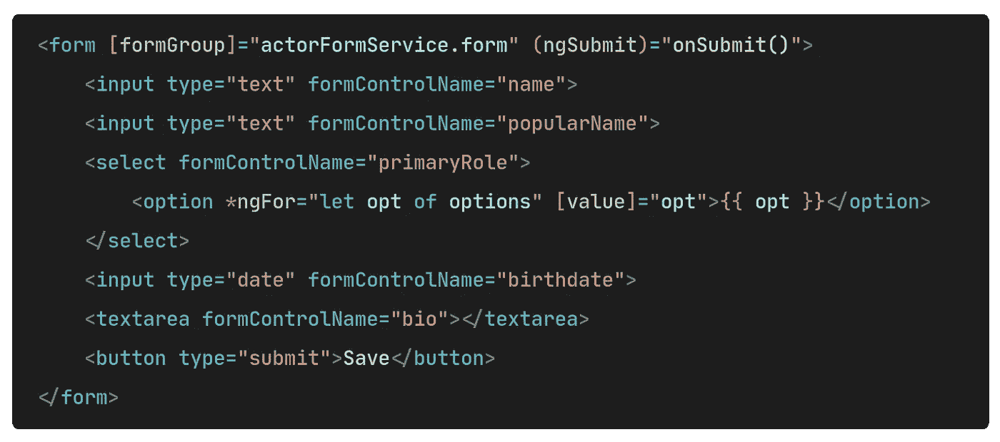
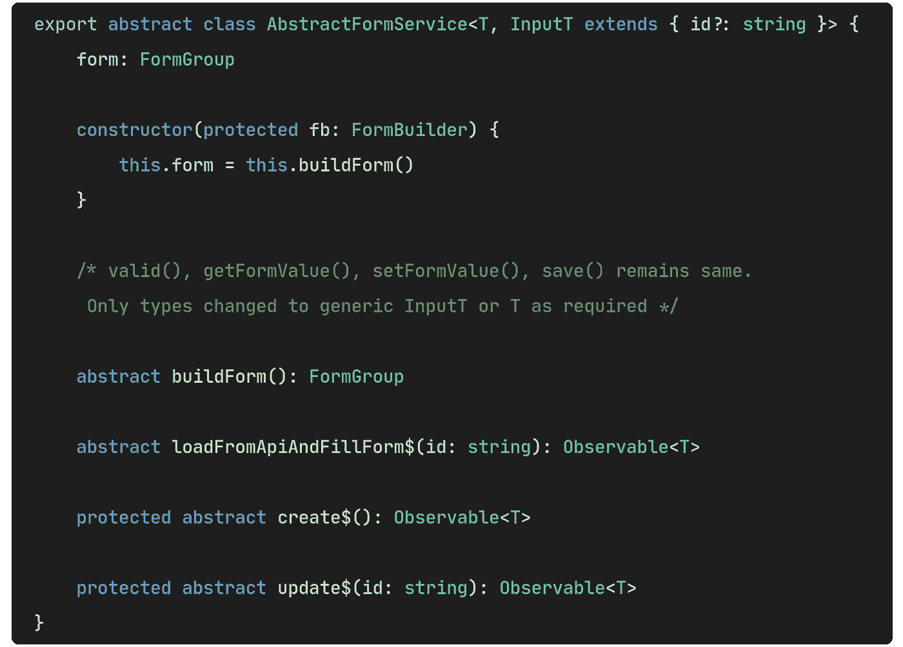
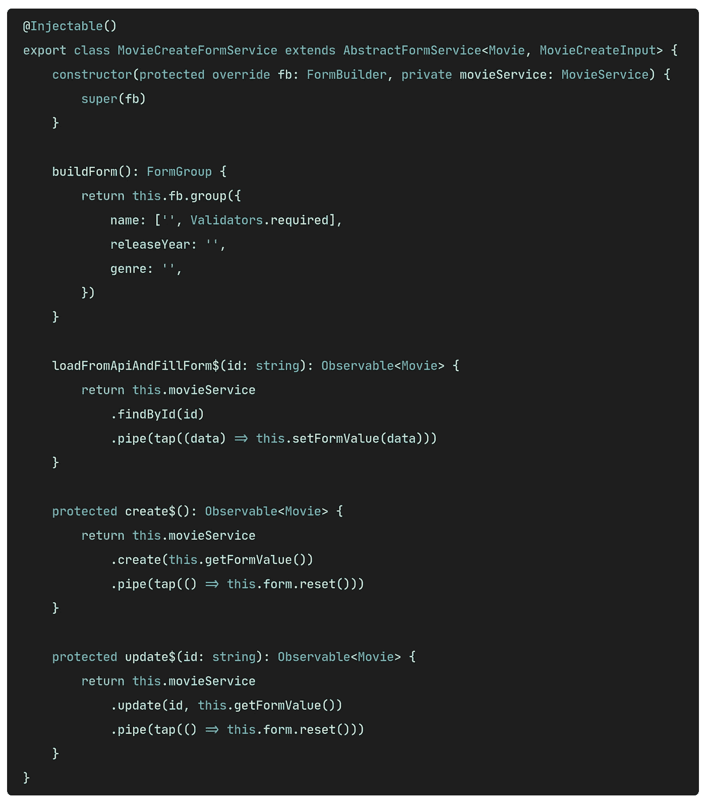

# 使用角形的更好方法

> 原文：<https://javascript.plainenglish.io/a-better-way-to-use-angular-forms-cd22a5a0488a?source=collection_archive---------2----------------------->



*“强权即公理”——你知道是谁*。不过这是真的！尽管角形很强大，但它也给控制器造成了巨大的混乱。FormBuilder，FormGroup，FormControl，保存逻辑，更新逻辑——近乎疯狂。今天，我将向您展示如何管理表单并带来一些理智。

进入服务——它们是可注射的，并在您需要时提供。那为什么不用服务来管理表单呢？那我们开始吧。

## 第一步:接口

首先，我们需要创建接口。在这个演示中，我将创建两个界面— `Actor`是最终的实体，`ActorCreateInput`是表单输入的形状。



## 第二步:服务

创建一个 ActorCreateFormService，它不是在根注入的，这意味着`{ providedIn: 'root' }`没有传递给装饰者:



到目前为止，所有的事情都是不言自明的。在这个阶段，该服务除了创建 FormGroup 并将其分配给`form`类属性之外，什么也不做。我添加了一些方便的方法来检索表单值和有效性。

为了保存或更新 actors，我们需要连接 HTTP 服务。假设我们有一个 ActorApiService 来完成这项工作。所以把它注入:

```
constructor(
    private fb: FormBuilder,
    **private actorApiService: ActorApiService**,
) {}
```

现在让我们编写一些创建和更新参与者的方法:



我们需要最后一个方法来从数据库加载一个 actor 并填写表单。当一个演员需要剪辑时，这将派上用场。



## 第三步:控制器

现在让我们看看如何在组件中使用它。因为我们没有在`root`中提供，所以需要在正确的范围内提供(通常在组件内):



注意控制器有多干净。此外，您可以在其他地方使用相同的表单服务。

## 最后一步:抽象服务

我们还没完。如果你仔细观察，表单服务有一些可重用的部分，我们也可以用于其他表单，例如— MovieCreateFormService。所以，让我们把表单类更进一步，使它变得抽象`AbstractFormService`。它不再需要包含`@Injectable()`装饰器:(为了简洁，省略了一些代码)。



现在创建并扩展 MovieCreateFormService:



仅此而已，你只需要重写 4 个方法就可以让你的表单生效。它自动处理表单提交后的保存、更新和重置。您现在可以像使用`ActorCreateFormService`一样使用`MovieCreateFormService`。

## 最后的想法

你认为这种方法怎么样？我敢打赌，这种模式将在整个应用程序中节省大量 loc(代码行)。但是请分享您对潜在问题和改进的想法。

感谢阅读！

## 完整代码

*更多内容请看*[***plain English . io***](http://plainenglish.io/)*。报名参加我们的* [***免费周报***](http://newsletter.plainenglish.io/) *。在我们的* [***社区***](https://discord.gg/GtDtUAvyhW) *获得独家获得写作机会和建议。*