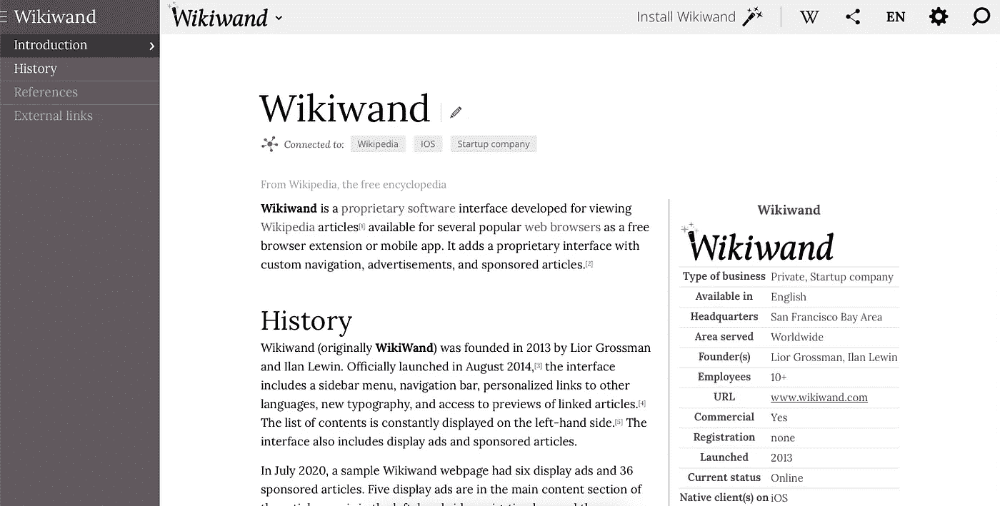
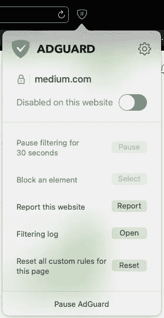
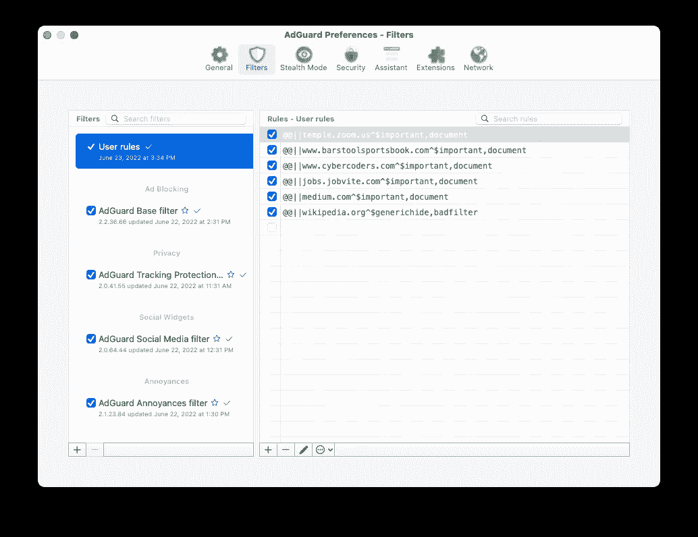
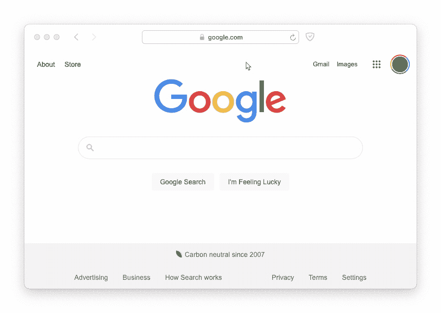

# 使用 JavaScript 注入获得更好的维基百科体验

> 原文：<https://javascript.plainenglish.io/a-better-wikipedia-experience-using-javascript-injection-bf4140d9c5de?source=collection_archive---------14----------------------->

## JavaScript & Wikiwand 如何改善您的维基百科阅读体验。



Screenshot of a Wikiwand article about itself

维基百科是你需要的任何信息的一站式资源。尽管你的教授不允许你在研究论文中引用维基百科，但它是一个非常值得信赖的来源。

维基百科有很好的信息，但也很难看。字体很小，你不能配置他们使用的字体，颜色，目录和图片/标题都很可怕。

很多年前，我发现了一个叫 Wikiwand 的网站。他们提供了 Chrome 和 Firefox 扩展，可以自动将你重定向到他们的网站，以更好的格式查看同一篇文章。

[](https://www.wikiwand.com) [## 维基世界

### 在旅途中寻找答案的最快方式。使用 Wikiwand 强大的搜索和…

www.wikiwand.com](https://www.wikiwand.com) 

所以你可以从各自的网络商店安装 Chrome 和 Firefox 扩展。但是 Safari 呢？我是一个狂热的 Safari 用户(尽管我是一名 web 开发人员)，因为我喜欢隐私和速度。

# Safari 怎么样？

如果你在 Safari 上，你如何使用 Wikiwand？为此，您可以使用一个简单的脚本注入。

首先，您需要安装 AdGuard Safari 扩展。你也可以安装 TamperMonkey，但你必须支付 1.99-2.99 美元。

[](https://adguard.com/en/adguard-safari/overview.html) [## Safari 的 AdGuard

### 自从苹果开始强迫每个人都使用新的 SDK 以来，Safari 的广告拦截扩展就很困难…

adguard.com](https://adguard.com/en/adguard-safari/overview.html) 

AdGuard 是一款免费的浏览器隐私屏蔽软件。它做了很多很酷的事情来保证你的浏览体验安全——但是我们需要它还有一个原因:它可以执行脚本。

你需要在浏览器工具栏中设置图标，并在右上角设置图标。



应该会打开 AdGuard 设置窗口。你要点击**过滤器**工具栏按钮，并确保你正在编辑`User rules`。



然后点击用户规则底部的`+`图标。复制并粘贴以下代码:

```
@@||wikipedia.org^$generichide,badfilter
wikipedia.org#%#if (window.location.search === "") { var lang = window.location.hostname.split('.')[0]; var article = window.location.pathname.split('/')[2]; window.location.href = "[http://www.wikiwand.com/](http://www.wikiwand.com/)" + lang + "/" + article; }
```

一旦你保存了这个过滤器，无论你什么时候去维基百科的文章，它都会自动把你重定向到维基百科的版本。



Redirection from Wikipedia to Wikiwand (in a tiny browser window) — the full desktop size browser window shows a much better Wikiwand layout

# **这个脚本是如何工作的？**

`window.location.search`检查你是否在维基百科上搜索或者正在浏览一篇文章。从主机名中，提取维基百科的地区(国家和语言)。然后我们取出文章的 ID(通常是一个字符串，包含文章名和括号中的一些歧义)。接下来，我们将网页的位置(重定向)更改为同一篇维基百科文章的 Wikiwand URL。

如果你喜欢这个指南，看看我的其他文章。

[](https://medium.com/@thesoggywaffle/whats-new-in-chrome-103-3b118b6dadde) [## Chrome 103 有什么新功能

### 谷歌 Chrome 的每一次更新都充满了独特的功能。以下是 Chrome 版本的一些新功能…

medium.com](https://medium.com/@thesoggywaffle/whats-new-in-chrome-103-3b118b6dadde) [](https://medium.com/@thesoggywaffle/internet-explorer-is-dead-whats-next-with-microsofts-infamous-browser-3cc908b796c8) [## Internet Explorer 已死:微软臭名昭著的浏览器的下一步是什么

### 微软在 2022 年 6 月 15 日扼杀了 Internet Explorer。以下是对浏览器和微软未来计划的反思。

medium.com](https://medium.com/@thesoggywaffle/internet-explorer-is-dead-whats-next-with-microsofts-infamous-browser-3cc908b796c8) [](/web-development-a-roadmap-to-success-5ed8439c72a2) [## Web 开发:成功的路线图

### 成为一名优秀的 web 开发人员只需要十个步骤。这很简单，我会告诉你怎么做。

javascript.plainenglish.io](/web-development-a-roadmap-to-success-5ed8439c72a2) 

*更多内容请看*[***plain English . io***](https://plainenglish.io/)*。报名参加我们的* [***免费周报***](http://newsletter.plainenglish.io/) *。关注我们关于*[***Twitter***](https://twitter.com/inPlainEngHQ)*和*[***LinkedIn***](https://www.linkedin.com/company/inplainenglish/)*。查看我们的* [***社区不和谐***](https://discord.gg/GtDtUAvyhW) *加入我们的* [***人才集体***](https://inplainenglish.pallet.com/talent/welcome) *。*