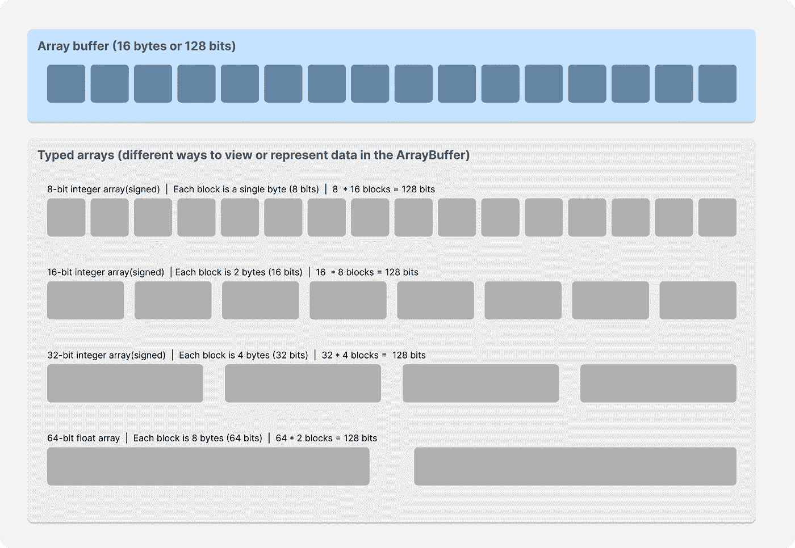

# Node.js 中工作线程的简要指南

> 原文：<https://javascript.plainenglish.io/a-brief-guide-on-worker-threads-in-node-js-80bd1e7846cb?source=collection_archive---------1----------------------->

## 如何在 Node.js 中使用工作线程


Node.js 在处理数据密集型 I/O 调用时非常有效，但是 CPU 密集型任务(图像/视频处理或解析大型 JSON)可能会阻塞单线程实例，从而影响整体响应时间。在这种情况下，多线程应用将具有明显的优势，因为当一个线程忙于处理繁重的计算任务时，其他线程可以简单地处理其余的请求。一个潜在的解决方案是使用子流程，但是创建一个新的流程实例在时间和内存方面都很昂贵。这就是工作线程出现的原因**。**

核心思想还是一样的，**并行执行 JavaScript**。工作线程也称为工作线程是同一个进程的一部分。这些线程中的每一个都有自己的 JS 引擎实例、自己的 Node.js 实例和自己的事件循环，这样它就可以独立工作，而不会干扰其他线程。由于它们是同一个进程的一部分，它们可以共享分配给那个特定进程的内存，这就是为什么它们比子进程更有效。

请注意，这不是 JavaScript 语言的一部分。它是 Node.js 中的一个实现，利用了 JavaScript workers。好的，让我们看看如何实现这个目标。

我在 Youtube 上也有一些关于这篇文章的视频，一定要看看。

## 基本设置

在空文件夹中，使用`npm init -y`创建 Node.js 应用程序。另外，通过输入`npm i express`来安装 express。现在创建一个服务器文件( **app.js** )，并在文件中复制以下代码:

```
const app = require("express")()app.get("/light", (req, res) => {
   res.send(`Request successful!\n`);
})app.get("/heavy", (req, res) => {
   let counter = 0;
   while (counter < 900000000) {
      counter++;
   }
   res.send(`${counter} iterations completed!`);
})app.listen(3000, () *=>* console.log("Listening to port 3000"));
```

如果您运行这个 Express 应用程序，尝试向`/heavy`端点发出请求，然后立即向`/light`端点发出请求，您将看到`/heavy`端点阻塞了事件循环。因此，当`/heavy` 端点计算请求并获得响应时，`/light`请求必须在那里等待。这肯定是一个问题，我们将使用工作线程来解决这个问题。

从 Node.js 中的`worker_threads`模块导入`Worker`类，在`/heavy`端点中，使用`Worker`类创建一个 worker。当创建一个实例时，您可以向该类传递两个参数。

1.  工人文件的 URL(**worker . js**)。这个文件现在将拥有执行繁重计算的代码。
2.  一个选项对象(我们将在后面讨论)

将计算结果复制到 worker 文件中。现在你的代码应该是这样的。

```
//app.js**const {Worker} = require(”worker_threads”)**...app.get("/heavy", (req, res) => {
   **const worker = new Worker("./worker.js")**
})...
```

工人文件将如下所示:

```
//.worker.jslet counter = 0;
while (counter < 900000000) {
   counter++;
}
```

现在，无论何时调用`/heavy`端点，我们都会创建一个新的 worker，它将单独进行计算。一旦计算完成，工作线程就使用可以从`worker_threads`模块中获得的`parentPort.postMessage`方法将响应发送回主线程。

```
//worker.js 
**const {parentPort} = require("worker_threads")**let counter = 0;
while (counter < 900000000) {
   counter++;
}
**parentPort.postMessage(`${counter} iterations completed!)**
```

来自工人的任何消息都需要在主线程中捕获。我们在`/heavy`端点中创建的 worker 实例是 Node.js 中的`EventEmitter`类的扩展。这意味着它可以发送或侦听事件，而我们将侦听`message`事件。

```
//app.jsapp.get("/heavy", (req, res) => {
   const worker = new Worker("./worker.js");   
   **worker.on("message", data => {
      res.send(data)
   })**
})
```

现在应该可以了。如果您重启服务器并尝试点击`/heavy`端点，然后点击`/light`端点，这一次它将按预期工作。`/heavy`端点计算现在被转移到一个单独的工作线程，这使得事件循环对其他请求保持空闲。

## 选项参数

在创建工作者时，您还可以将一组配置传递给工作者。

*   **argv** —允许您将自定义参数追加到原始 process.argv 对象
*   **env** —允许您添加特定于线程的环境变量。这些变量被克隆，因此父线程和工作线程将拥有这些变量的单独副本。
*   **eval —** 允许您将字符串作为 JavaScript 表达式进行计算。
*   **resourceLimits —** 为工作进程设置资源限制，以便一旦工作进程达到该限制，它将自动终止。
*   **workerData —** 克隆并传递给员工的数据。

你可以从官方[文档](https://nodejs.org/api/worker_threads.html#new-workerfilename-options)中查看其余选项。

## 使用工人的另一种方式

我们可以使用同一个(app.js)文件来分离我们的主线程和工作线程功能，而不是为我们的工作代码创建一个单独的文件。有一个名为`isMainThread`的属性，它告诉你代码是在工作线程还是父线程中运行。

如果它在主线程中，我们将设置我们的 Express 服务器和端点。但是当我们发出繁重的请求时，我们会产生一个新的线程并卸载繁重的操作。将这些 CPU 密集型操作卸载到 worker 才有意义，因为 API 调用等 I/O 操作已经由本机 async Node.js APIs 进行了优化处理。

所以现在每次我们创建一个新的 worker，它都会重新加载这个 app.js 文件，并在 worker 线程内部运行它。一旦计算完成，我们就像前面一样使用`postMessage`方法发送回响应。

就我个人而言，我并不喜欢这种方法，因为我喜欢把事情分开，我总是试图减少主服务器文件中的混乱。

## 其他员工事件

现在，worker 实例有几个它可以监听的其他事件。

*   **错误** —如果工作线程抛出未捕获的异常，则发出该错误。
*   **退出** —一旦工人停止，发出退出信号。它也是任何`Worker`实例发出的最终事件。
*   **在线** —当工作线程开始执行 JavaScript 代码时发出。

```
worker.on("error", err => { throw err })
worker.on("exit", () => console.log("Thread exiting"))
worker.on("online", () => console.log("I am online"))
worker.on("message", data => res.send(data))
```

## 线程间的通信

子进程和工作线程之间的一个核心区别是工作线程可以共享内存，因为它们本质上是同一个进程的一部分。谈到线程通信，有两个主要的实体。一个`MessageChannel`和`MessagePorts`。


我们只是使用了`parentPort`实例向工人发回一条消息。当工人使用`worker.postMessage`发送消息时，默认情况下，它在幕后使用`MessagePort`类。工作线程和父线程都是`MessagePort`的实例。

从`worker_threads`模块导入`MessageChannel`类。这个类本质上没有方法。当我们实例化这个类时，它返回一个具有两个属性的对象，`port1`和`port2`。这两个端口是`MessagePort`类的实例。现在，我们将使用其中一个端口发送消息，另一个端口将侦听此消息。

```
const { MessageChannel } = require("worker_threads")
const { port1, port2 } = new MessageChannel()port1.on("message", msg => console.log(`Port 2 sent me: ${msg}`))port2.postMessage("hello")
```

如果我运行这个，您会看到控制台上打印的消息。还有一个`close`事件，当通道的任何一端断开连接时就会触发该事件。这些端口不会自动关闭。您可以使用`close`方法关闭端口。

```
port1.on("message", msg => console.log(`Port 2 sent me: ${msg}`))
port1.on('close', () => console.log('Channel closed!'));port2.postMessage("hello")
port2.close()
```

`postMessage`方法有一个额外的参数，即**传送列表**。这个转移名单到底是什么，我们为什么需要这个？让我解释一下。

我们现在在`postMessage`中发送的值是一个简单的字符串。这也可能是一个具有深层嵌套结构的非常复杂的对象。默认情况下，我们发送的数据正在被克隆。所以发送者和接收者将有两个不同的副本。这种克隆是使用结构化克隆算法完成的，该算法是一种递归算法。


因此，如果你有一个深度嵌套的对象作为消息发送，克隆它将花费大量的时间和计算能力，这是不理想的。

这就是**转移列表**出现的原因。当您使用传输列表时，您不是在克隆数据。基本上就是将数据从一个线程转移到另一个线程。当你这样做时，你将失去对发送者端数据的访问，因为它实际上是把数据交给了接收者。

你可以在转移列表中传递 3 样东西。
-`MessagePort`-
-`ArrayBuffer`-
-`FileHandle`

## 传输列表中的消息端口

您想要转移消息端口的原因是，这样您就可以通过在不同线程之间传递端口来重用同一个消息通道。


我们在主线程中有一个通道，有两个端口。现在，当应用程序启动时，我们创建一个工人。我们的目标是将我们的一个端口转移到 worker，以便这个 worker 现在可以与父端口通信。

> 它可以通过使用`parentPort`直接与父线程通信，但我只想向您展示如何使用`postMessage`转移端口。

现在简单用`worker.postMessage(port2, [port2])`。第一个参数是您希望与 worker 共享的值，在本例中是端口。第二个参数是转移列表。因为我们已经将`port2`添加到了转移列表中，所以它将被转移到 worker 中，一旦它被转移，你将无法在父线程中使用它。所以本质上我们现在已经把`port2`从主线程转移到了工作线程。

```
//app.jsconst app = require("express")()
const { Worker } = require("worker_threads")
const { MessageChannel } = require("worker_threads")
const { port1, port2 } = new MessageChannel()const worker = new Worker("./worker.js") **//Step 1**
port1.on("message", msg => console.log(`Calculated complex iteration: ${msg}`)) **//Step 4**worker.postMessage(port2, [port2])  **//Step 2**
```

工人文件将如下所示:

```
//worker.js
const { parentPort, workerData } = require("worker_threads")const complexCalc = () => {
    let counter = 0;
    while (counter < 900000000) {
        counter++;
    }
    return counter;
}parentPort.on("message", msg => {
    //msg is the port that we're sending from the main thread
    msg.postMessage(complexCalc())  **//Step 3**
})
```

注释中的步骤是本例中的执行顺序。

## 传输列表中的数组缓冲区

现在我们可以在传递列表中传递的第二个项目是一个`Array Buffer`。你可以把数组缓冲区想象成一个**固定长度的连续内存**区域。您不能直接访问`ArrayBuffer`中的元素。我们需要一个叫做**数据视图**的东西，它基本上是我们创建的`ArrayBuffer`的解释。

假设我们想要创建一个`16-byte ArrayBuffer`。现在每个字节是 8 位。所以总共有 128 比特的空间。现在我可以把这个缓冲区看作 16，8 位整数。因此，每个块将能够容纳 0-255 之间的数字，因为 8 位数字最多只能容纳 255。我也可以把这个缓冲区看作 8 位和 16 位整数。它仍将占用相同的 128 位，但这次每个块可以容纳更大的数，因为 16 位整数的范围很广，从 0 到 65535。这也可以被看作是 4，32 位整数。所以基本上你可以对一个数组缓冲区使用不同的数据视图。



让我们回到工作线程。现在，这个数组缓冲区也可以包含在传递列表中。就实现而言，这与我们看到的消息端口非常相似。

我们将首先创建一个 16 字节的`ArrayBuffer`。我要使用的数据视图将是一个 8 位有符号整数数组，这意味着缓冲区中的每个元素应该在-128 到 127 之间。这些数组数据视图称为类型化数组。我们将数据视图发送到工作线程(在值参数和传输列表中传递它),在工作线程内部，我们将只记录它的控制台日志。

```
//app.js
const app = require("express")()
const { Worker } = require("worker_threads")
const { MessageChannel } = require("worker_threads")
const { port1, port2 } = new MessageChannel()const worker = new Worker("./worker.js")
**const ab = new ArrayBuffer(8);
const dv = new Int8Array(ab, 0, 8)**//We need to transfer the buffer property and not the typed array **worker.postMessage(dv, [dv.buffer])**
```

工人文件将如下所示。

```
//worker.js
const { parentPort, workerData } = require("worker_threads")const complexCalc = () => {
    let counter = 0;
    while (counter < 900000000) {
        counter++;
    }
    return counter;
}parentPort.on("message", msg => {
    console.log(msg)  **//Logs the buffer in the console**
})
```

一旦`ArrayBuffer`被转移到 worker，你将无法在主线程中使用它。它变得毫无用处。

Node.js 希望我们传输这些实体而不是克隆它们的原因是两个线程可能同时对数据进行一些操作。这可能会造成不一致，因为在中，每个线程对于该段数据都有不同的值。在共享内存的情况下，这是一个关键问题。现在，尽管这可能会导致问题，但有一种方法可以让您在线程之间共享数据，而无需克隆/传输数据。我们可以使用`SharedArrayBuffer`。只需将当前示例中的`ArrayBuffer`替换为`SharedArrayBuffer`，并从`postMessage`方法中移除传输列表。这将在线程间共享`ArrayBuffer`,而无需克隆或转移它。

## 传输列表中的文件句柄

还有一种类型的数据可以传输，那就是`Filehandle`。文件句柄是对系统中文件的数字引用。您可以向这个`Filehandle`实例写入、读取、追加数据或做一系列其他事情。这个实例只能被转移到不同的工作线程，这是有意义的，因为你不希望两个不同的线程同时对同一个文件进行更改。

您可以在 promises 部分的文件系统模块中使用`open`方法创建一个文件句柄实例。这个 open 方法将接受文件名、文件的标志和文件的模式。这个实例现在可以转移到另一个 worker，就像我们在数组缓冲区或消息端口的情况下所做的那样。


## 结论

这就是本教程的基本内容。这些概念有点复杂，因为它们有很多细节和错综复杂的地方需要你去处理。试着用你自己的一套例子来玩一玩，我相信它会对你更有意义。

[***我在 Youtube 上也有几个关于这个帖子的视频，你可以去看看。***](https://youtu.be/kDr7YycaZ5E)

这篇文章是我们研究 Node.js 中多任务处理的系列文章的一部分。

*   [**node . js 中多任务带子进程**](/multitasking-in-node-js-with-child-process-d82841fd8d29)
*   [**使用集群模块**](/multitasking-in-node-js-with-the-cluster-module-ee8480208f86) 在 Node.js 中进行多任务处理
*   [**node . js 中的流程管理与 PM2**](/process-management-in-node-js-with-pm2-ca32d75c94af)

如果你有任何疑问或建议，你可以在评论中提出，或者通过我的任何一个社交网站与我联系。干杯！

[YouTube](https://www.youtube.com/channel/UCaktnqx_IENyT5T2lJ3F09w)
[LinkedIn](https://www.linkedin.com/in/akilesh-rao-610357137/)
[Twitter](https://twitter.com/themangalorian)
[GitHub](https://github.com/AkileshRao)

*更多内容请看*[***plain English . io***](https://plainenglish.io/)*。报名参加我们的* [***免费周报***](http://newsletter.plainenglish.io/) *。关注我们关于*[***Twitter***](https://twitter.com/inPlainEngHQ)[***LinkedIn***](https://www.linkedin.com/company/inplainenglish/)*[***YouTube***](https://www.youtube.com/channel/UCtipWUghju290NWcn8jhyAw)*[***不和***](https://discord.gg/GtDtUAvyhW) *。对增长黑客感兴趣？检查* [***电路***](https://circuit.ooo/) *。***