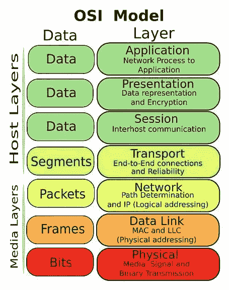
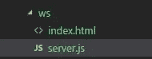

# WebSocket 简介

> 原文：<https://javascript.plainenglish.io/a-brief-introduction-to-websocket-eada28567057?source=collection_archive---------5----------------------->

## 如何使用 websocket，websocket.io


近年来，许多 H5 API 和技术开始蓬勃发展，今天我们将讨论其中一个更有趣的 API，WebSocket。

## 超文本传送协议

HTTP 是客户端/服务器模型中用于请求-响应的协议，在这种模型中，浏览器向服务器提交 HTTP 请求，服务器用请求的资源进行响应。

> 言下之意，你可以把这个模型想象成一个对讲机，一个人说话，另一个人听

**HTTP 是半双工通信**

这种半双工通信的特征如下。

*   数据在同一时刻向一个方向流动，客户端向服务器请求数据->单向，服务器向客户端返回数据->单向
*   服务器无法主动将数据推送到客户端

以上是对 HTTP 协议的简要概述，所以下面直接进入今天的话题。

**双工通信**

在 H5 出现 websocket 之前，实现这种推送技术最常见的三种方式是:轮询、长轮询和 iframe 流，但这三种方式都或多或少存在相同的缺点。

所以，websocket，一个好的 API，来完善一个更好的双工通信的实现。

## WebSocket

WebSocket 的实现是为了在客户端和服务器之间建立一个持久的连接，双方可以随意发送数据。

当然，如果你了解的比较多，应该知道它属于应用层协议，基于 TCP 传输协议，复用了 HTTP 的握手通道。



让我们实现前端页面的 WebSocket，看看基本用法:

```
// Create index.html

let ws = new WebSocket('ws://localhost:9999');

// onopen is triggered when the client establishes a connection with the server
ws.onopen = function() {
    ws.send('Hello,Maxwell');
};

// onmessage is triggered when the server sends a message to the client
ws.onmessage = function(res) {
    console.log(res);   // MessageEvent object
    // The real message data is res.data
    console.log(res.data);
};
```

让我们编写 websocket 的后端部分来接收和发送消息。

这里我们用 node 的 express 简单的搭建一个后端服务，目录结构也很简单，如下:



server.js

```
const express = require('express');
const app = express();
// Setting up static folders
app.use(express.static(__dirname));
// Listening to port 3000
app.listen(3000);
// =============================================
// Start creating a websocket service
const Server = require('ws').Server;
// Here is to set the port number of the server, and the above port 3000 do not have to be consistent
const ws = new Server({ port: 9999 });

// Listen to the connection between the server and the client
ws.on('connection', function(socket) {
    // Listening to messages from the client
    socket.on('message', function(msg) {
        console.log(msg);   // This is the message from the client
        // The server can also send messages to the client
        socket.send(`server say： ${msg}`);
    });
});
```

这将建立一个后端服务，浏览`localhost:3000`然后你可以在控制台看到消息。

这还没有结束，因为 websocket 是来自 H5 标准的东西，旧的浏览器当然不能很好地支持它，这就是前端必须处理该死的兼容性问题的时候。这就是为什么有一个更好的库，著名的 socket.io

## socket.io

[](https://socket.io/) [## 插座。超正析象管(Image Orthicon)

### 放心！在 WebSocket 连接不可行的情况下，它将回退到 HTTP 长轮询。如果…

socket.io](https://socket.io/) 

**socket . io 的特性**

*   易用性:封装了服务器端和客户端，易于使用
*   跨平台:支持跨平台，可以选择在服务器端或客户端开发实时应用
*   自适应:将使用 WebSocket、Ajax 长轮询或 Iframe 流来根据浏览器选择最佳方式，甚至支持 IE5.5

**安装**

```
npm i socket.io -S
```

使用 express framework in node 构建一个服务，代码如下:

```
// server.js
const express = require('express');
const app = express();
// Setting up static folders
app.use(express.static(__dirname));
// Create a server service via node's http module
const server = require('http').createServer(app);
// WebSocket is dependent on the HTTP protocol for handshaking
const io = require('socket.io')(server);
// Listen to the connection between the client and the server
io.on('connection', function(socket) {
    // send a message to the client
    socket.send('Hi,I am server');
    // Listening to the client for successful message reception
    socket.on('message', function(msg) {
        console.log(msg);  // Message from the client
        socket.send('Hello, I am client' );
    });
});
// Listening to port 3000
server.listen(3000);
```

服务器端代码已经写好了，接下来开始写前端部分。

一旦服务器运行，客户端将需要引用一个动态生成的文件路径，该路径通过直接引用(/socket.io/socket.io.js)来固定

```
// index.html
// Reference to socket.io js file
<script src="/socket.io/socket.io.js"></script>
<script>
    const socket = io('/');
    // Listening for successful connection events with the server
    socket.on('connect', () => {
        console.log('Connection successful');
        socket.send('HELLO I AM MAXWELL');
    });
    // Listening for messages from the server
    socket.on('message', msg => {
        console.log(`Messages received by the client： ${msg}`);  
    });
    // Listening for disconnection events with the server
    socket.on('disconnect', () => {
        console.log('Connection disconnected successfully');
    });
</script>
```

这里有一个提示:io 在创建套接字时可以接受一个 url 参数。

*   url 可以是套接字服务的完整 http 地址，例如:**io(' http://localhost:3000 ')**
*   也可以是相对路径，比如: **io('/')**
*   如果不填，表示当前路径默认连通，如: **io()**

这是基本用法，还有其他划分命名空间、添加房间和广播的方法会在后续文章中继续介绍。如果你对我的文章感兴趣，可以关注我。

*更多内容看* [***说白了就是 io***](https://plainenglish.io/) *。报名参加我们的* [***免费周报***](http://newsletter.plainenglish.io/) *。关注我们关于* [***推特***](https://twitter.com/inPlainEngHQ) ， [***领英***](https://www.linkedin.com/company/inplainenglish/) *，*[***YouTube***](https://www.youtube.com/channel/UCtipWUghju290NWcn8jhyAw)*[***不和***](https://discord.gg/GtDtUAvyhW) *。对增长黑客感兴趣？检查* [***电路***](https://circuit.ooo/) *。**