# 使用 TypeScript、Webpack 创建 Web 开发环境，带/不带 React

> 原文：<https://javascript.plainenglish.io/a-complete-guide-to-use-typescript-in-web-development-with-without-react-3ab58ab4f03c?source=collection_archive---------1----------------------->

## **通过 React、Create React App 和 Next.js 在 Web 开发中使用 TypeScript 的完整指南**

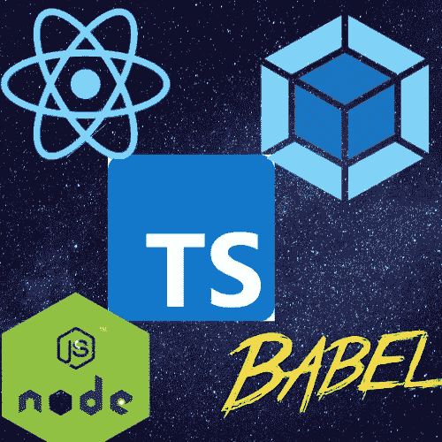

Photo by the author made in Canva.

# 介绍

TypeScript 在 web 开发中变得非常流行。为了帮助您在 web 开发中开始使用 TypeScript，本文将慢慢介绍基本的 TypeScript、它在构建网页中的用法以及它与 React 的集成。

*   *🔗设置一个 TypeScript Web 开发环境:* [*代码*](https://github.com/amy-juan-li/typescript-web-dev) *，* [*演示*](#1b2f) *。*
*   *🔗设置一个 TypeScript React Web 开发环境:* [代码](https://github.com/amy-juan-li/typescript-react-webpack-dev) *。*

# 目录

*   [什么是 TypeScript，为什么它很重要](#7ca2)
*   [先决条件](#bff7)
*   使用类型脚本 Globall
*   [在项目中使用打字稿](#7263)
*   [为 Web 开发准备打字稿知识](#a491)
*   [为没有框架的 Node.js+TypeScript 项目搭建 Web 开发环境](#81a4)
*   [为 React 项目开发准备打字稿知识](#835d)
*   [为 React TypeScript 项目建立 Web 开发环境](#45c5)
*   [使用 creat-react-app](#49f5) 为 React TypeScript 项目设置 Web 开发环境
*   [使用 Next.js 为 React TypeScript 项目创建 Web 开发环境](#b118)
*   [结论](#f396)

# 什么是 TypeScript，为什么它很重要

> TypeScript 提供了 JavaScript 的所有特性，并在这些特性的基础上增加了一层:TypeScript 的静态类型系统。TypeScript 的主要好处是它可以突出代码中的意外行为，从而降低出现错误的可能性。
> 
> — [面向 JavaScript 程序员的类型脚本](https://www.typescriptlang.org/docs/handbook/typescript-in-5-minutes.html)

TypeScript 是一种静态类型语言(如 Java ),其中变量类型在编译时是已知的，不能在任何时候更改。相比之下，JavaScript 是一种动态类型的语言，其中变量类型是可以改变的。TypeScript 的类型系统可以方便快捷地帮助开发人员在开发过程中发现与变量类型相关的错误。因此运行时错误会少得多。

打字稿一直是就业市场的需求。TypeScript 不仅可以帮助开发人员减少出现错误的机会，还可以使团队协作变得更加容易，因为开发人员可以很容易地理解团队中其他开发人员创建的变量和方法的意图。所以知道如何使用 TypeScript 将有助于你申请更多的好工作。

# 先决条件

*   在你的电脑上安装[节点](https://nodejs.org/en/download/)

我们需要 Node 的原因是 TypeScript 开发和运行时环境都需要 Node。安装 TypeScript 有几种方法，在本指南中，我们将使用一个依赖管理器— `npm or yarn`来下载 TypeScript。为了运行这个包，我们还需要一个`Node`环境。在哪里安装完全由我们决定——要么全局安装(下载并安装 [LTS 版本](http://nodejs.org))要么使用`nvm` (Node.js 版本管理器)本地安装，以避免各个项目之间的版本冲突。

*   安装计算机上安装的 TypeScript 编译器(TSC)。

为什么我们需要 TSC 仅仅是因为浏览器不能理解 TypeScript，所以它必须被 TS 编译成 JavaScript。类似地，我们可以选择在全球或本地安装 TSC(例如，基于每个项目)。

# 全局使用 TypeScript

您需要在计算机上全局安装 TypeScript 编译器

## 步骤 1:在您的计算机上全局安装 TypeScript 编译器

```
# Install TypeScript
$ npm i -g typescript
# or 
$ yarn global add typescript# Check the version
$ tsc --version // or tsc -v
```

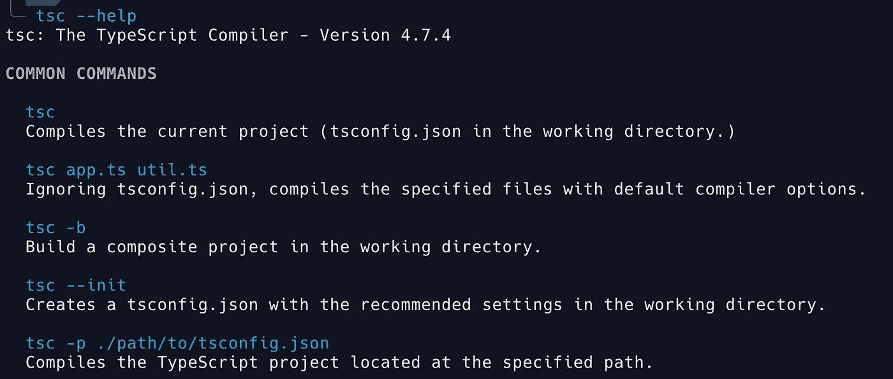

Run ‘tsc — help’ from the terminal to see a list of tsc commands.

## 步骤 2:创建一个类型脚本文件

从终端运行命令:

```
vim index.ts // for vim user
touch index.ts // for Mac user
```

并将下面的代码粘贴到文件— *index.ts*

```
interface User {
  name: string;
  id: number;
}const user: User = {
  name: "Hayes", // fixed
  id: 0,
};
```

## 步骤 3:将 TypeScript 文件编译成 JavaScript 文件

运行以下命令，将 TypeScript 文件编译并类型检查为同名的 JavaScript 文件:

```
tsc index.ts
```

如果要指定输出文件的名称，可以运行以下命令:

```
tsc index.ts --outfile new-file-name.js
```

*提示:* `*to --noEmit*` *类型检查你的项目而不编译任何东西。*

## **演示:在本地机器上编译和类型检查一个类型脚本文件**

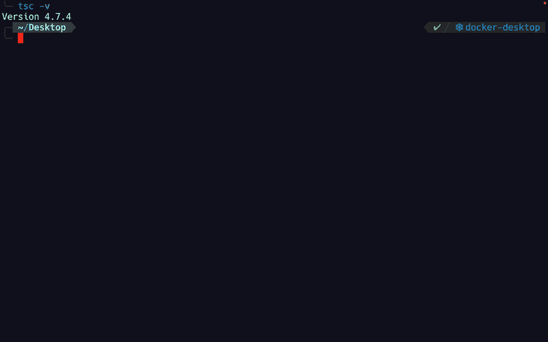

Compile TypeScript file to JavaScript file using the `**tsc**` command. GIF by [Amy Li](https://medium.com/u/9f2dc23bfffa?source=post_page-----3ab58ab4f03c--------------------------------)

*注意:诊断信息的原因是我没有在桌面目录下创建一个.* `*eslintrc.json*` *。这个演示不需要。事实上，我们将在一个真正的打字稿项目中需要它。*

# 在项目中使用 TypeScript

在每个项目的基础上设置 TypeScript 的好处是，您可以让许多项目具有许多不同版本的 TypeScript，这可以保持每个项目一致地工作。

## 步骤 1:创建一个 TypeScript 项目

创建项目目录:

```
$ mkdir typescript-project$ cd typescript-project
```

在项目中安装 TypeScript

```
$ npm i typescript — save-dev
# or 
$ yarn add typescript --dev
```

编译器安装在`node_modules`目录下，可以用`npx tsc`运行。

我们仅出于开发目的使用 TypeScript。出于生产目的，我们将把 TypeScript 编译成 JavaScript。

现在我们的 TypeScript 项目结构如下所示:

```
typescript-project
│ -- package-lock.json
│ -- package.json
```

`typescript`添加到`devDependencies` *(package.json)*

```
{
 “devDependencies”: {
    “typescript”: “⁴.8.4”
  }
}
```

初始化 TypeScript 项目:

```
$ npx tsc — init
```

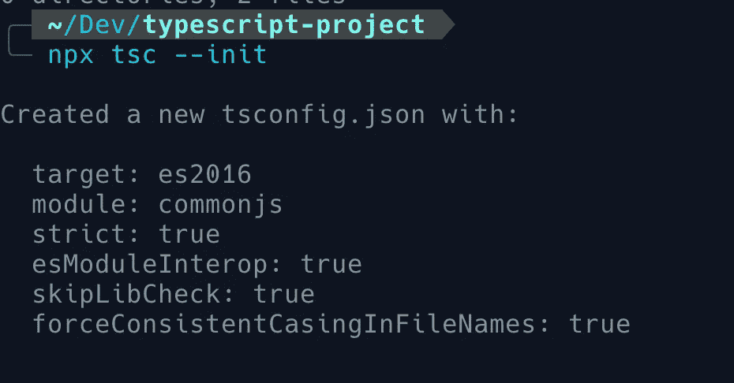

Initializes a TypeScript project by running ‘npx tsc— init’. Screenshot by author.

`*tsc*`是内置的 TypeScript 编译器。运行`*tsc*`会将 TypeScript 代码编译成 JavaScript。使用`--init`标志通过在根项目目录中创建一个`tsconfig.json`文件来初始化一个 TypeScript 项目。本地运行`tsc`将编译由`tsconfig.json.`定义的项目运行`tsc --noEmit`类型检查项目而不编译任何东西。

## 步骤 2:编译 TypeScript 项目

在项目根目录下创建一个 TypeScript 文件— `index.ts`

```
interface User {
  name: string;
  id: number;
}const user: User = {
  username: "Hayes", // Error 
  id: 0,
};
```

请注意，我们的文本编辑器中突出显示了类型错误:

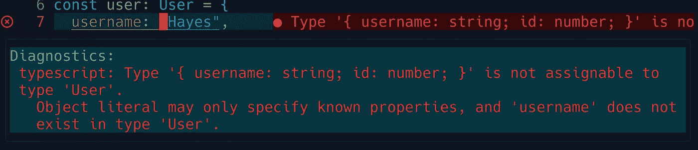

如果我们尝试使用以下命令编译我们的代码:

```
$ tsc index.ts 
```

它会由于上面的类型错误而失败:

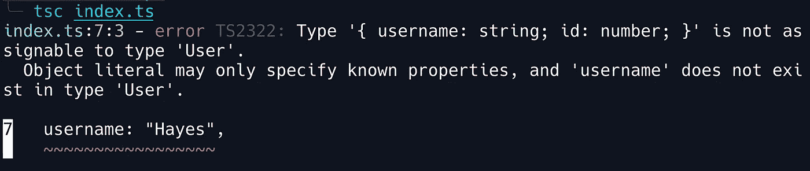

修理`index.ts`

```
interface User {
  name: string;
  id: number;
}const user: User = {
  name: "Hayes", // fixed
  id: 0,
};
```

再次运行`tsc index.ts`，你会在根目录下看到编译好的 JavaScript 文件:

```
$PROJECT_ROOT
├── package.json     
└── package-lock.json
```

现在，您只能在`index.js`文件中看到一个已定义的用户对象:

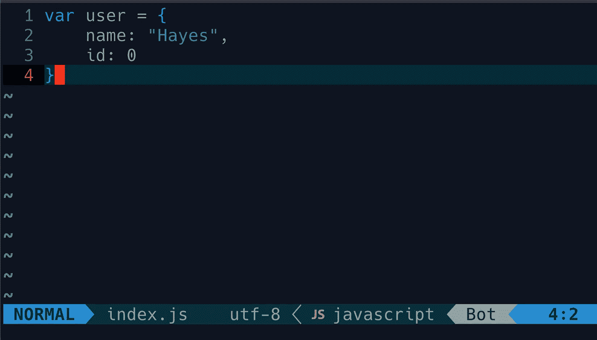

## 第 3 步:在项目的根目录下建立 TypeScript 配置文件( *tsconfig.json* )

> 目录中出现`tsconfig.json`文件表示该目录是 TypeScript 项目的根。`tsconfig.json`文件指定编译基于 TypeScript 的项目所需的根文件和编译器选项。
> 
> — [类型脚本文档:什么是 tsconfig.json](https://www.typescriptlang.org/docs/handbook/tsconfig-json.html)

运行命令:

```
$ tsc --init
```

将在根目录下自动创建一个`tsconfig.json`文件，如下所示:

```
$PROJECT_ROOT
├── tsconfig.json
|── package.json     
└── package-lock.json
```

这是如下生成的`tsconfig.json`文件:

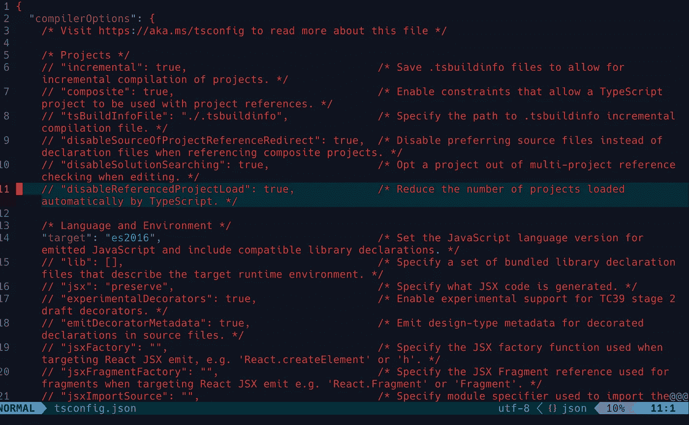

A tsconfig.json is generated by ‘tsc — init’. Screenshot by author.

基于 TSConfig 的示例:

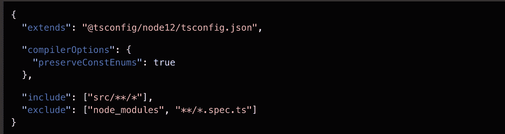

Source: [https://www.typescriptlang.org/docs/handbook/tsconfig-json.html](https://www.typescriptlang.org/docs/handbook/tsconfig-json.html)

***在下一节继续使用 TypeScript 进行 web 开发之前，让我们先了解一些关于 TypeScript 语法的知识，尤其是它的类型系统。***

# 为 Web 开发准备打字稿知识

## 三个主要原语

*   布尔- `true`或`false`
*   编号- `12`或`12.34`
*   字符串- `hello world`

## 类型脚本类型和接口

```
interface User {
  name: string;
  id: number;
}// or using types
types User = {
  name: string;
  id: number;
}const user: User = {
  name: "Hayes",
  id: 0,
};
```

## TypeScript 分配类型的两种主要方式:

*   显式类型——更易于阅读，更具目的性

```
let name: **string** = “table”;
```

*   隐式类型——更短，打字更快，通常在开发和测试时使用

```
let name = “table”;
```

## 联合类型-分配多个类型

当一个值有多种类型时，使用联合类型。

```
let price: string | number;
price = 100;
price = '100';
```

## TypeScript 类型数组

```
let ids: number[] = [1, 2, 3, 4, 5]; 
let names: string[] = ['table', 'chair', 'lamp'];
let results: boolean[] = [true, false, false];
```

## 类型脚本类型对象

TypeScript 中的对象必须同时具有正确的属性和值类型:

```
interface User {
  name: string;
  id: number;
}const user1: User = {
  firstName: "Hayes", // Error - not correct properties
  id: 0,
};const user2: User = {
  name: "Hayes", 
  id: "1234", // Error - not correct value type
};
```

## TypeScript 类型函数

TypeScript 允许我们定义参数类型以及返回类型。

```
function getItemPrice(name: string, price: number): string {
  return `The price of ${name} is ${price} dollars`;
}
console.log(typeof(getItemPrice('apple', 20)) // string
```

arrow function——在函数参数后添加一个返回类型，用冒号(`:`)分隔。

```
const getItemPrice = (name: string, price: number): string => {
 return `The price of ${name} is ${price} dollars`;
}
```

## 类型分配中的错误

```
let name: string = “table”; // type string
name = 33; // attempts to re-assign the value to a different type
```

*提示:请参考*[*TypeScript 文档和手册*](https://www.typescriptlang.org/docs/handbook/typescript-in-5-minutes.html) k *了解更多关于 TypeScript 的信息。*

***了解如何使用 TypeScript 的最好方法是将其与一个项目结合起来。因此，在接下来的部分中，我们将把 TypeScript 集成到不同的 web 开发环境中来构建一个简单的 web 页面。***

# 为不带框架的 Node.js+TypeScript 项目设置 Web 开发环境

## ***第一步:创建项目文件夹结构***

```
$ mkdir typescript-web-dev
$ cd typescript-web-dev
$ mkdir src dist
```

项目结构如下所示:

```
$PROJECT_ROOT
├── dist      
└── src
```

## 第二步:启动 Node.js ***项目***

运行`yarn init`

```
╰─ yarn init
yarn init v1.22.19
question name (typescript-web-dev):
question version (1.0.0):
question description:
question entry point (index.js):
question repository url:
question author:
question license (MIT):
question private:
success Saved package.json
✨  Done in 17.88s.
```

或者`yarn init -y`到

```
╰─ yarn init -y
yarn init v1.22.19
warning The yes flag has been set. This will automatically answer yes to all questions, which may have security implications.
success Saved package.json
✨  Done in 0.04s.
```

现在项目结构如下图所示:

```
$PROJECT_ROOT
├── dist      
|── src
├── package.json 
```

通过将即将安装的`Webpack-dev-server`添加到*package . JSON*文件中的脚本，使用 NPM 脚本启动 Webpack 开发服务器:

```
// ./package.json
"scripts": {
    "dev": "webpack-dev-server --mode development",// or "webpack serve",
    "build": "webpack --mode production", 
},
```

*提示:命令* `*yarn dev*` *在监视模式下自动启动 webpack dev 服务器。在本节结束时，您将看到 GIF 演示。*

## 步骤 3:安装 TypeScript 和 WebPack 依赖项

*   [安装 TypeScript 编译器及其加载器](https://webpack.js.org/guides/typescript/#basic-setup)

```
yarn add -D typescript ts-loader
```

`[ts-loader](https://github.com/TypeStrong/ts-loader)`是 webpack 的一个类型脚本加载器。为了让它工作，我们还需要安装 TypeScript。

*   安装 webpack 和 webpack 开发服务器

```
yarn add -D webpack webpack-cli webpack-dev-server
```

## 步骤 4:配置 Webpack 和 TypeScript

```
// ./webpack.config.js
const path = require("path");
module.exports = {
  entry: "./src/main.ts",
  output: {
    filename: "bundle.js", // all js files are bundled into this single file
    path: path.resolve(__dirname, "dist"),
  },
  devtool: "source-map",
  devServer: {
    static: "./dist",
    port: 9000, //default port: 8080
  },
  module: {
    rules: [
      {
        test: /\.ts$/,
        use: "ts-loader", // TypeScript loader
        exclude: /node_modules/,
      },
    ],
  },
  resolve: {
    extensions: [".ts", ".js"],
  },
};
```

*注意:在 webpack dev 服务器的开发模式下，dist 文件夹中没有 bundle.js 文件，只有内存中有。要在 dist 文件夹中创建 bundle.js 文件，请运行* `*yarn build*` *。在本节结束时，您将看到 GIF 演示。*

运行`tsc -init`或者在项目根目录中手动创建 *tsconfig.json* 。

```
// ./tsconfig.json
{
  "compilerOptions": {
    "outDir": "./dist/",
    "sourceMap": true,
    "noImplicitAny": true,
    "module": "es6",
    "target": "es5",
    "allowJs": true
  }
}
```

## 步骤 5:准备由 Webpack Dev 服务器提供服务的文件

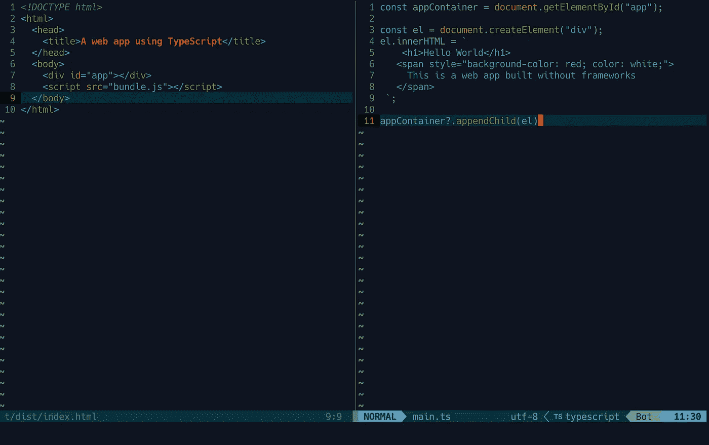

Left: ./dist/index.html; right: ./src/main.ts Screenshot by [Amy Li](https://medium.com/u/9f2dc23bfffa?source=post_page-----3ab58ab4f03c--------------------------------)

*。/dist/index.html*

```
<!DOCTYPE html>
<html>
  <head>
    <title>A web app using TypeScript</title>
  </head>
  <body>
    <div id="app"></div>
    <script src="bundle.js"></script>
  </body>
</html>
```

*。/src/main.ts*

```
const appContainer = document.getElementById("app");const el = document.createElement("div");
el.innerHTML = `
    <h1>Hello World</h1>
   <span style="background-color: red; color: white;">
     This is a web app built without frameworks
   </span>
 `;appContainer?.appendChild(el);
```

现在项目结构看起来像这样:

```
$PROJECT_ROOT
└── dist
|   └── ***index.html***
├── src
│   └── ***main.ts***
├── webpack.config.js
├── node_modules
├── tsconfig.json
├── package.json
└── yarn-lock.json
```

如果你运行`yarn build` (webpack —模式生产)，你会注意到`dist`目录中的`bundle.js`。项目结构变成了:

```
$PROJECT_ROOT
└── dist
|   ├── ***index.html*** 
|   ├── **bundle.js.map**
|   └── **bundle.js** ├── src
│   └── ***main.ts*** |── webpack.config.js
|── node_modules
|── tsconfig.json
|── package.json     
└── yarn-lock.json
```

*。/dist/bundle.js*

```
(()=>{var e=document.getElementById("app"),n=document.createElement("div");n.innerHTML='\n    <h1>Hello World </h1>\n   <span style="background-color: blue; color: white;">\n     This is a web app built without frameworks\n   </span>\n ',null==e||e.appendChild(n)})();
//# sourceMappingURL=bundle.js.map
```

## 步骤 6:运行应用程序——使用 W `ebpack Dev Server`提供单个网页

*   运行`yarn dev` - >打开浏览器([http://localhost:9000/](http://localhost:9000/))->对代码进行更改- >更改立即显示在网页上。
*   运行`yarn build` - >捆绑文件显示在这个目录下。


Demo the web dev environment built with TypeScript and the Webpack Dev Server. GIF by [Amy Li](https://medium.com/u/9f2dc23bfffa?source=post_page-----3ab58ab4f03c--------------------------------)

🔗 [GitHub 代码](https://github.com/amy-juan-li/typescript-web-dev)

***由于 React 是 web 开发行业中最流行的前端框架之一，所以让我们继续下一阶段——在 React 项目中集成 TypeScript 以创建类型安全的 React 组件及其好处。***

# 为 React 项目开发准备打字稿知识

## 使用 TypeScript 键入 React 属性

React 中可以使用类型或接口来类型化 Props 和 State，那么我们应该使用哪一个呢？

使用 React 中的类型或接口的经验法则由[React-typescript-cheat sheet doc](https://react-typescript-cheatsheet.netlify.app/docs/basic/getting-started/basic_type_example/#types-or-interfaces)提供:

*   创作库或第三方环境类型定义时，始终使用`interface`作为公共 API 的定义。
*   考虑使用`type`作为你的 React 组件道具和状态。

但实际上，大多数开发人员更喜欢使用接口来指定适当的类型。所以，选择取决于你的工作要求。

使用`interface`键入 React props 的示例:

```
// src/components/person.tsx

import React from 'react';**interface PersonProps** **{
  name: string;
  age: number;
  skills: string[];
}**const Person: React.FC<PersonProps> = ({ name, age, skills }) => {
  return (
    <div>
      <div>{name}</div>
      <div>{age}</div>
      <div>Skills<ul>{ skills.map((skill) => <li>{skill}</li>}</ul></div>
</div> 
);};

export default Person;
```

消耗`Person`组件:

```
// src/index.tsximport React from 'react';
import Person from './components/person';

const App: React.FC = () => {
  return (
    <div>
      <Person name='Fish' age={40} skills={['Programming', 'Writing', 'Storytelling'}/>
    </div>
  );
};

export default App;
```

您可以在 Props 中定义许多其他属性。这里有一个[道具的例子](https://react-typescript-cheatsheet.netlify.app/docs/basic/getting-started/basic_type_example/#useful-react-prop-type-examples)作为参考:

```
export declare interface AppProps {
  children?: React.ReactNode; 
  childrenElement: JSX.Element;
  style?: React.CSSProperties; 
  onChange?: React.FormEventHandler<HTMLInputElement>; 
  props: Props & React.ComponentPropsWithoutRef<"button">; 
  props2: Props & React.ComponentPropsWithRef<MyButtonWithForwardRef>;
}
```

## 使用 TypeScript 键入 React 挂钩

```
// useState<T>()
const [count, setCount] = **useState**<number | null>(1);// createContext<T>(), useContext()
const ScrollContext = React.createContext<ScrollValue>({
  scrollY: 0
})// useRef<T>()
const { scrollY } = **useContext**(ScrollContext)
const divRef = **useRef**<HTMLDivElement>(null)
```

*提示:请访问* [React TypeScript 备忘单](https://react-typescript-cheatsheet.netlify.app/) *以了解更多关于 React TypeScript 的信息。*

有了 React+TypeScript 的知识，我们可以继续进行 React 项目。创建 React 项目有两种方法——从头开始或者利用 React 框架。为了更好地理解 React 的设置，让我们在下一节学习如何在不使用任何框架的情况下创建 React 项目。

# 为 React TypeScript 项目设置 Web 开发环境

与上面的中的[创建 TypeScript web dev 项目有几个相同的步骤。](#81a4)

## 步骤 1:创建 TypeScript React 项目文件夹结构

```
$ mkdir typescript-react-web-dev  
$ cd typescript-react-web-dev  
$ mkdir src dist
```

## 步骤 2:启动 Node.js 项目

```
yarn init -y
```

将以下脚本添加到 *package.json*

```
"scripts": {  
    "dev": "webpack-dev-server --mode development",  
    "build": "webpack --mode production",   
},
```

## 步骤 3:安装 TypeScript、React 和 WebPack 依赖项

```
yarn add -D typescript [@typescript](http://twitter.com/typescript)-eslint/parser
yarn add react react-dom 
yarn add -D [@types/react](http://twitter.com/types/react) [@types/react-dom](http://twitter.com/types/react-dom)
yarn add -D @babel/core babel-loader @babel/preset-react [@babel/preset-typescript](http://twitter.com/babel/preset-typescript)
yarn add -D webpack webpack-cli webpack-dev-server
```

## 步骤 4:配置 WebPack、Babel、TypeScript

*。/webpack.config.js*

```
const path = require("path");  
module.exports = {  
  entry: "**./src/main.tsx**",  
  output: {  
    filename: "bundle.js", // all js files are bundled into this single file  
    path: path.resolve(__dirname, "dist"),  
  },  
  devtool: "source-map",  
  devServer: {  
    static: "./dist",  
    port: 9000, //default port: 8080  
  },  
  module: {  
    rules: [  
      {  
        test: **/\.tsx?$/**,  
        use: {
          loader: 'babel-loader',
         },        
        exclude: /node_modules/,  
      },  
    ],  
  },  
  resolve: {  
    extensions: [**".tsx"**, ".ts", ".js", ".jsx],  
  },  
};
```

*。/babel.config.json*

```
{
  "presets": [
    "@babel/preset-typescript",
    "@babel/preset-react"
   ]
}
```

*。/tsconfig.json*

```
{
  "compilerOptions": {
    "target": "ESNext",
    "module": "umd",
    "lib": ["ESNext", "dom"],
    "jsx": "react",
   "noEmit": true,
    "sourceMap": true,
    "strict": true,
    "noImplicitAny": true,
    "strictNullChecks": true,
    "moduleResolution": "node",
    "forceConsistentCasingInFileNames": true,
    "esModuleInterop": true
  },
  "include": ["src"]
}
```

## 步骤 5:准备由 Webpack Dev 服务器提供服务的文件

*。/dist/index.html*

```
// *./dist/index.html* <!DOCTYPE html>
<html>
  <head>
    <title>A web app using TypeScript</title>
  </head>
  <body>
    <div id="app"></div>
    <script src="bundle.js"></script>
  </body>
</html>
```

*。/src/main.tsx*

```
import React from 'react';
import { createRoot } from 'react-dom/client';
import { App } from './App';
createRoot(document.getElementById('app'))
  .render(<App />);
```

*。/src/App.tsx*

```
import React from 'react';
export const App = () => (
  <h1>TypeScript + React</h1>
);
```

## 第六步:运行应用程序

运行`yarn dev`在本地环境中启动我们的应用程序:

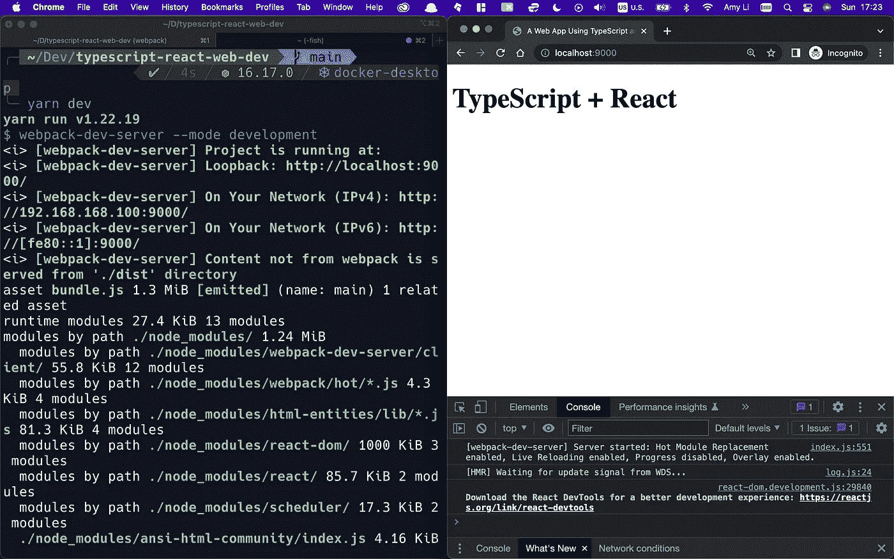

(Left) Run webpack dev server. (Right) Open the web page from a browser on port 9000\. Screenshot by [Amy Li](https://medium.com/u/9f2dc23bfffa?source=post_page-----3ab58ab4f03c--------------------------------)

🔗 [GitHub 代码](https://github.com/amy-juan-li/typescript-react-webpack-dev)

我们的应用程序在现代浏览器中运行良好，但如果你想在旧引擎中运行，那么你需要使用两个工具— `Transpilers`和`Polyfills`。请参考这两篇文章进一步了解—[trans file 和 Polyfill to ES5](https://itnext.io/create-react-typescript-project-with-webpack-and-babel-2431cac8cf5b#f996) 和[了解 Transipers 和 poly fill](https://javascript.info/polyfills)。

***如今很多框架都支持开箱即用的 TypeScript，比如***[***Create React App***](https://create-react-app.dev/)***——***[***TS Docs***](https://create-react-app.dev/docs/adding-typescript/)***，***[***next . js***](https://nextjs.org/)***——*让我们把上面的 React-TypeScript 知识带到另一个由**** `***creat-react-app***` ***生成的 React 项目中(可以参考*** [***用 Next.js 和 TypeScript******使用 react-beautiful-dnd 来学习一个 Next.js 使用 TypeScript 构建的编码项目。).***](https://blog.devgenius.io/using-react-beautiful-dnd-with-next-js-and-typescript-58a198b7266b)

# 使用 creat-react-app 为 React TypeScript 项目设置 Web 开发环境

## 使用 TypeScript 创建 React 项目

当您刚刚开始学习如何在 React 项目中使用 TypeScript 时，使用样板文件会很方便。

```
yarn create react-app typescript-react-app --template typescript
```

## 项目结构

```
$PROJECT_ROOT
├── public     
|── src    
|   ├── App.css
|   ├── App. tsx
|   ├── index.css
|   └── index.tsx
├── tsconfig.json
├── package.json
└── yarn.lock
```

`tsconfig.json`将由`create-react-app`负责，但是你可以定制它来满足你的需求。例如，将生产分发文件夹设置为根目录`production`

## 在开发环境中运行应用程序

```
npm start
# or
yarn start
```

*请注意，开发构建没有优化，捆绑的 js 文件在内存中。当您准备好部署到生产环境时，运行* `*npm run build*` *或* `*yarn build*` *将在构建文件夹中创建应用的优化构建。*

您可以在`tsconfig.json`内定制生产配送代码的存储位置

*编译后的反应应用程序的项目结构:*

```
$PROJECT_ROOT
├── build
|   └── static
|         |-- css
|         |-- js
|         └── media
|── src
└── public
```

# 使用 Next.js 为反应类型脚本项目创建一个 Web 开发环境

## 创建下一个. js 项目

运行以下命令以生成具有预安装依赖项的 Next.js 项目，包括 react、`react-dom`、`next`、`eslint`、`eslint-config-next`、`typescript`、`[@types/react](http://twitter.com/types/react)`、`[@types/node](http://twitter.com/types/node)`、`[@types/react-dom](http://twitter.com/types/react-dom)`。

```
yarn create next-app --typescript typescript-nextjs-app
```

## 项目结构

```
$PROJECT_ROOT
├── pages
│   ├── _app.tsx
│   ├── index.tsx
│   ├── api
│        ├── hello.ts
├── styles
│   ├── Home.module.css
│   ├── globas.css
├── node_modules
├── next-env.d.ts
├── next.config.js
├── tsconfig.json
├── README.md
├── package.json
└── yarn.lock
```

## 启动应用程序

运行`yarn dev`启动`next dev`命令:

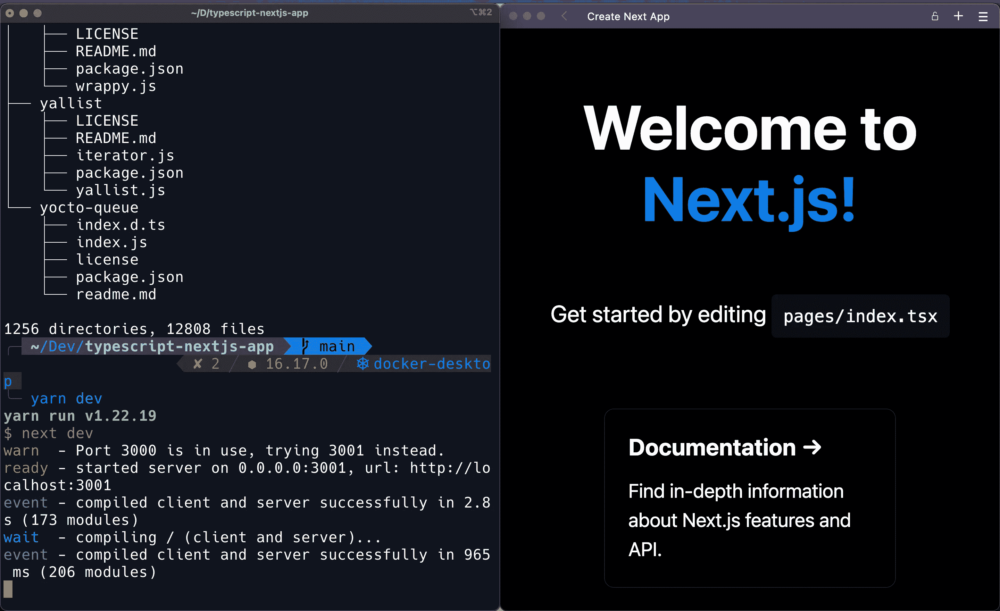

(Left) Run next dev. (Right) Open the Next.js app from a browser on port 3001\. Screenshot by [Amy Li](https://medium.com/u/9f2dc23bfffa?source=post_page-----3ab58ab4f03c--------------------------------)

如果您想了解更多关于在其他 React 框架(如 Next.js)中使用 TypeScript 的示例/教程，您可以查看本文:

[](https://blog.devgenius.io/using-react-beautiful-dnd-with-next-js-and-typescript-58a198b7266b) [## 使用反应-美观-dnd 与 Next.js 和 TypeScript

### 在 Next.js 应用程序中创建一个漂亮的拖放组件。

blog.devgenius.io](https://blog.devgenius.io/using-react-beautiful-dnd-with-next-js-and-typescript-58a198b7266b) 

# 结论

我希望你能在下一个反应项目中开始尝试使用 TypeScript。一开始，您可能会觉得用 TypeScript 编写会减慢您的工作过程，但这肯定会有回报。

谢谢你的阅读！快乐编码！😊

[](https://medium.com/@amyjuanli/membership) [## 加入 Medium，我的推荐链接-李冠仪

### 阅读李冠仪(以及其他数千名媒体作家)的每一个故事。您的会员费直接支持李冠仪…

medium.com](https://medium.com/@amyjuanli/membership) 

# 有用的来源和链接

*   [reach+TypeScript 作业本](https://github.com/typescript-cheatsheets/react)s-关于 reach 和 type script 的最新信息。
*   [使用 Webpack 和 Babel 创建反应类型脚本项目](https://itnext.io/create-react-typescript-project-with-webpack-and-babel-2431cac8cf5b)——一篇文章涵盖了一步一步的构建过程。

*更多内容请看*[***plain English . io***](https://plainenglish.io/)*。报名参加我们的* [***免费周报***](http://newsletter.plainenglish.io/) *。关注我们关于*[***Twitter***](https://twitter.com/inPlainEngHQ)[***LinkedIn***](https://www.linkedin.com/company/inplainenglish/)*[***YouTube***](https://www.youtube.com/channel/UCtipWUghju290NWcn8jhyAw)*[***不和***](https://discord.gg/GtDtUAvyhW) *。对增长黑客感兴趣？检查* [***电路***](https://circuit.ooo/) *。***