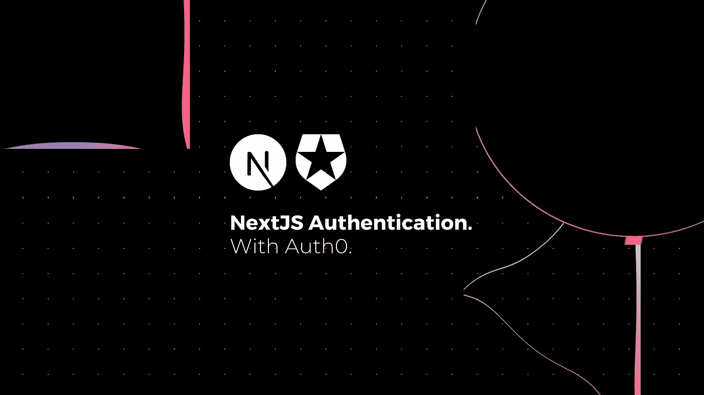

# 使用 Auth0 进行 Next.js 身份验证的综合指南

> 原文：<https://javascript.plainenglish.io/a-comprehensive-guide-to-next-js-authentication-with-auth0-c5af1e472fdb?source=collection_archive---------5----------------------->



*你好，我的名字是 Igor，如果你碰巧喜欢我写的东西，你可能也喜欢我在* [*我的 Twitter 个人资料*](https://www.twitter.com/igorasilveira) *上说的话，来打个招呼吧！👋。*

在本文中，我将向您展示如何使用 [Auth0](https://auth0.com/) 来保护您的 [Next.js](https://nextjs.org/) web 应用程序(包括社交登录)。

> *💡你可以在这里* *找到资源库* [*。*](https://github.com/igorasilveira/blog-examples/tree/main/auth0-app)

# 先决条件:

*   节点≥ 12
*   基础 Next.js 知识
*   反应和反应挂钩基础知识

# 什么是认证？

*认证*在全球的所有系统中，在保护任何种类的应用程序方面扮演着重要的角色。

保护一些资源或一组资源(物理的或数字的)通常由两步过程组成，**认证**和**授权**系统的一些用户(人或机器)。

**认证** —验证系统中的某人是谁。

**授权** —检查用户拥有哪些权限来访问给定的资源以及对其拥有哪些权限(读取、更新、删除)。

在本文中，我们将只关注将*认证*合并到我们的 Next.js 应用程序中，而将*授权*留待以后的文章讨论。

# 创建 Next.js 项目

要创建一个新的 Next.js 项目，请转到命令行，将 *cd* 放入您希望项目所在的文件夹。Next.js 将在您当前选择的目录下的一个新文件夹中创建项目，因此您不需要创建实际的项目文件夹，只需要创建一个您想要保存它的父目录。

运行以下命令创建 Next.js 应用程序，并完成创建向导:

```
npx create-next-app@latest
```

一旦向导完成，将 *cd* 放入您为项目新创建的文件夹中，并启动开发环境。

```
cd auth0-app && npm run dev
```

如果一切顺利，你访问[*http://localhost:3000*](http://localhost:3000/)的时候应该能看到下面这个页面。


## 创建新页面

目前，我们的应用程序中只有一个页面，即`index`。我们将添加一个新的**受保护的**页面，只有登录的用户才能看到，但目前任何人都可以看到，因为我们还没有在我们的应用程序中实现认证。

因此，在您的`/pages`文件夹中，创建一个新文件`protected.js`并粘贴以下代码(为了本教程的简单起见，我们将重用主页样式表)。

现在如果你转到[*http://localhost:3000/protected*](http://localhost:3000/protected)你会看到我们刚刚创建的新页面，这个页面目前还没有得到很好的保护。


## 创建导航栏组件

为了简化应用程序的登录和注销过程，并保持页面间的一致性，我们将创建一个 *Navbar* 组件，然后我们将在页面间重用它。

让我们首先在项目中创建一个新文件夹来存储应用程序的所有可重用组件。所以在你的项目的根目录下，创建一个新的文件夹`/components`。在其中，我们将创建一个新文件`Navbar.js`，并添加以下代码:

我们还为`/styles/Navbar.module.css`下的导航栏创建了一个新的样式表，内容如下:

然后，我们将新组件添加到两个页面中，就在每个 React 组件的`<Head>`标签下:

```
<Navbar /> // <-- Inserted this below the <Head> closing tag
```

现在，如果我们访问任何页面，我们可以在顶部看到新创建的组件。


# OAuth 和 Auth0

## 什么是 OAuth

OAuth 代表“开放授权”,它是一个开放的授权标准，任何人都可以实现。它*不是*一个 API 或服务，而是一组完善的规则，这些规则定义了一个协议，用访问令牌而不是凭证来授权设备、API、服务器和应用程序，从而为客户端应用程序提供“安全的委托访问”。

这允许网站、服务和应用代表用户通过**访问令牌**授予访问权限来访问由其他服务托管的资源，该访问令牌稍后可单独用于识别服务或应用并授予权限。

下面的图表从较高的层面解释了这一流程。关于 OAuth 的深入解释，请参考 Matt Raible 的这篇博文—[https://developer . okta . com/blog/2017/06/21/what-the-heck-is-OAuth](https://developer.okta.com/blog/2017/06/21/what-the-heck-is-oauth)


## 什么是 Auth0


[Auth0](https://auth0.com/) (读作“Auth Zero”)是一家公司提供的服务，该公司通过控制用户访问、角色和社交提供商登录的简单即插即用的大量功能来确保认证和授权功能。

正如我们上面讨论的那样，它基于 OAuth 2.0 标准工作，因此它使用令牌来管理应用程序中的身份验证和授权流。

最棒的是，它面向开发人员，让我们开发人员可以用最少的代码在我们的应用程序中轻松实现任何身份验证流程。

## Auth0 的优势

除了使用 Auth0 作为认证服务的所有这些美妙的好处之外，还有更多。

1.  **安全性** — Auth0 主要关注提供任何身份认证服务提供商所需的安全性和可靠性，因此投入了大量时间和资源来创建最安全的数据基础架构，以保护 Auth0 中的所有客户数据。
2.  **可扩展性** — Auth0 通过为开发人员提供现代工具来扩展基础服务，从而实现可在 Auth0 市场中共享的第三方应用，从而实现轻松的可扩展性。
3.  **额外的身份认证安全性** —除了我们已经讨论过的所有内容，Auth0 使在其服务中启用多因素身份认证(MFA)变得更加容易，从而消除了自己实现这种服务的需要。
4.  **分析** — Auth0 带有内置分析功能，可跟踪您的网站或应用程序的使用情况，如新用户数量、登录次数、使用的提供商等。
5.  **面向开发人员的** —为开发人员特别制作的无限量资源和教程。强大的文档和特定于技术的库可以让您在几分钟内使用您选择的语言启动并运行 Auth0。

# 在我们的应用中实现 Auth0

现在有趣的部分来了！我们将向 Auth0 注册一个新帐户，并创建一个项目，我们可以为该项目生成一个 API 密钥，我们将在代码中使用该密钥来标识它。然后，我们将在 Next.js 应用程序中创建必要的页面和链接，使它们无缝地协同工作。

## 创建 Auth0 帐户和应用程序

顾名思义，这是一个非常简单的步骤。前往 https://auth0.com/[创建一个新账户。](https://auth0.com/)

登录后，您将被重定向到您的仪表板。

在侧边菜单上，您可以找到您的 Auth0 帐户的注册应用程序。您会发现已经为您创建了一个默认的，您可以自定义它。让我们点击它来打开它。


## 我们的 Auth0 应用程序设置

在此屏幕中，您可以更改所有的应用程序设置，进行使用设置并扩展其功能。

这里要采取的重要步骤是获取应用程序的**域**、**客户端 ID** 和**客户端秘密**。我们还需要更新*应用程序 URIs* 选项卡上的信息，以便 Auth0 了解如何处理请求和重定向。


## 更新我们的应用程序 URIs

在设置页面的*应用程序 URIs* 部分，我们为**回调**和**注销**定义了*允许的 URL*，因为这些是 Auth0 Next.js 包在与 Auth0 的服务通信时正常工作所必需的。确保您的字段如下图所示填写。

**注意:其他字段是可选的，但建议使用，以进一步保护您的应用程序。**


# 准备我们的 Next.js 项目

现在我们已经设置好了 Auth0 项目，是时候准备 Next.js 应用程序来处理身份验证请求，并根据 Auth0 的服务对自己进行授权了。

## 正在安装 Auth0 的 Next.js SDK

在项目目录中，运行以下命令安装 Auth0 Next.js SDK:

```
npm install @auth0/nextjs-auth0
```

该 SDK 将公开方法和变量，使您能够轻松地将 Auth0 集成到 Next.js 应用程序中，并使用其所有功能。

## 添加我们的环境变量

在您的项目中，创建一个新的`.env.local`文件，该文件将用于存储我们的*环境变量*。在其中，添加以下内容，用应用程序设置屏幕上生成的变量替换所需的变量。

*   `AUTH0_SECRET`:用于加密会话 cookie 的长密值。您可以在命令行上使用`openssl rand -hex 32`生成一个合适的字符串。
*   `AUTH0_BASE_URL`:你的应用程序的基础 URL，在我们的例子中是[*http://localhost:3000*](http://localhost:3000/)。
*   `AUTH0_ISSUER_BASE_URL`:您的 Auth0 租户域的 URL。如果您正在使用带有 Auth0 的 [**自定义域，请将其设置为您的自定义域的值，而不是“设置”选项卡中反映的值。**](https://auth0.com/docs/custom-domains)
*   `AUTH0_CLIENT_ID`:您的 Auth0 应用的客户端 ID。
*   `AUTH0_CLIENT_SECRET`:你的 Auth0 应用的客户端机密。

此时，我们的 Auth0 Next.js SDK 已经完全配置好，可以在我们的应用程序中使用了。

**注意:这个新文件不应该被你的版本控制软件版本化。**

## 添加动态 API 路由

下一步是在我们的项目中添加一个动态 API 路由，自动创建一系列路由，这些路由将被映射到处理每个单独操作的特定 SDK 方法。

在`pages/api`目录中，创建一个新的`auth`目录，并在其中创建一个`[...auth0].js`文件。在文件中导入来自 SDK 的`handleAuth`方法，并导出调用它的结果。

这将创建以下路线:

*   `/api/auth/login`:使用 Auth0 进行登录的路径。
*   `/api/auth/logout`:用户退出的路径。
*   `/api/auth/callback`:成功登录后，路由 Auth0 会将用户重定向到。
*   `/api/auth/me`:获取用户配置文件的路径。

## 添加 UserProvider 组件

在前端，SDK 将使用 *React Context* 来管理用户的认证状态。为了让所有页面都可以使用这个状态，我们覆盖了基础的 *App* 组件，并用一个`UserProvider`包装它的内部组件。这样，应用程序中的所有组件都可以访问身份验证*上下文*，并提供*挂钩*，这在以后会很方便。

您的`/pages/_app.js`现在应该是这样的:

# 使用 Auth0 Next.js SDK

现在我们已经完成了 Auth0 项目及其 Next.js 特定 SDK 的设置，剩下要做的就是使用它了！现在，让我们来看看如何做到这一点。

## 登录用户

用户现在可以通过访问 SDK 提供的`/api/auth/login`路径登录到您的应用程序。在我们的`Navbar`组件中，让我们使用锚标记添加一个链接到您的登录路径。

现在，如果用户点击`Navbar`上的 ***登录*** 按钮，他或她将被重定向到我们应用的 Auth0 登录屏幕，这有多神奇？！

在用户注册或使用用户名和密码使用现有帐户或任何提供和启用的社交提供者进行身份验证后，Auth0 将重定向回您的应用程序。


## 注销用户

现在我们知道了如何登录用户，让我们看看如何注销他们。

要做到这一点，首先，我们需要知道是否有用户通过了身份验证，以便知道我们显示的是*登录*按钮还是*注销*按钮。

使用由 Auth0 Next.js SDK 管理的*用户上下文*,我们可以通过 SDK 提供的`useUser`钩子轻松获得这些信息。这个钩子提供了关于*用户上下文*当前状态的不同信息，但是，对于这个场景，我们只需要知道上下文中是否有一个`user`，如果有，显示一个*注销*按钮。

如下更新您的`Navbar`组件。

现在，如果用户出现在应用程序*用户上下文*中，我们将显示一个*注销*按钮，该按钮将用户重定向到`/api/auth/logout`路由，该路由由 SDK 处理，并将自动采取所有必要的措施来删除用户的活动会话。

## 访问用户配置文件信息

因为我们已经知道，为了验证当前是否有登录的用户，我们可以检查 SDK 提供的`useUser`钩子中的`user`属性的存在，我们已经拥有了访问用户本身所需的所有信息，因为所有可用的用户信息都包含在该属性中。

除了`user`属性，`useUser`钩子还导出了其他属性，比如`error`和`isLoading`，这样我们就可以更好地控制上下文的当前状态。

让我们创建一个简单的页面，在这里我们可以检查当前用户的可用信息。姑且称之为`Profile`。

在`/pages`文件夹中新建一个`profile.js`文件，粘贴以下内容。

现在让我们在`Navbar`中添加一个新按钮，这样我们就可以很容易地进入这个页面。*该按钮仅在有登录用户时显示。*

用以下内容更新`Navbar`组件:

现在，如果用户登录，他或她将能够在 Auth0 服务中访问他们自己的个人资料以及他们所有的注册信息！


## 保护页面

为了保护页面不被未登录的用户访问，Auth0 Next.js SDK 页面还提供了一些功能来为您处理这些问题。因此，让我们保护我们的*个人资料*页面，因为如果没有用户显示个人资料，它应该是不可访问的。

我们需要应用的主要变化是，我们的页面组件现在应该由 SDK 方法`withPageAuthRequired`导出的*高阶组件(HOC)* 返回。

这也将为我们的页面组件提供作为*道具*的*用户上下文*的状态。所以我们可以通过*属性*直接访问`user`、`error`和`isLoading`属性，但是我们仍然可以从组件内部访问上下文，所以如果我们愿意，我们也可以使用`useUser`钩子。

您的`Profile`组件现在应该看起来像这样:

**注意:SSR 页面和 CSR 页面的主要区别在于，在 SSR 页面上，** `**getServerSideProps**` **方法应该返回 HOC 本身。**

```
export const getServerSideProps = withPageAuthRequired();
```

# 恭喜你！

如果您已经做到了这一步，那么您应该已经有了一个功能正常的 Next.js 应用程序，它只需要几行代码就可以实现一个安全可靠的身份验证系统。

如果你遇到任何麻烦，请随时通过我的推特个人资料联系我，我很乐意帮忙。