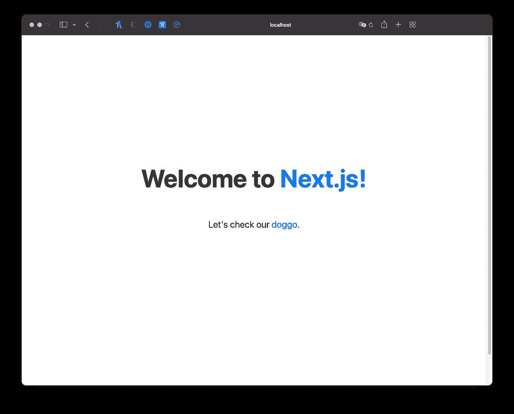
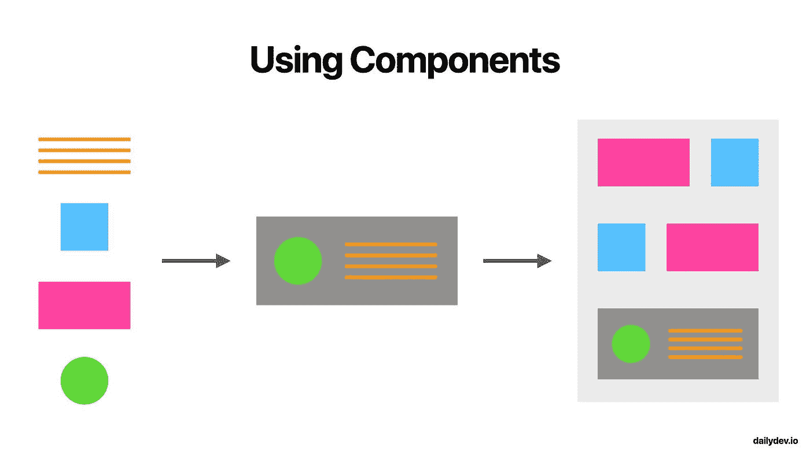
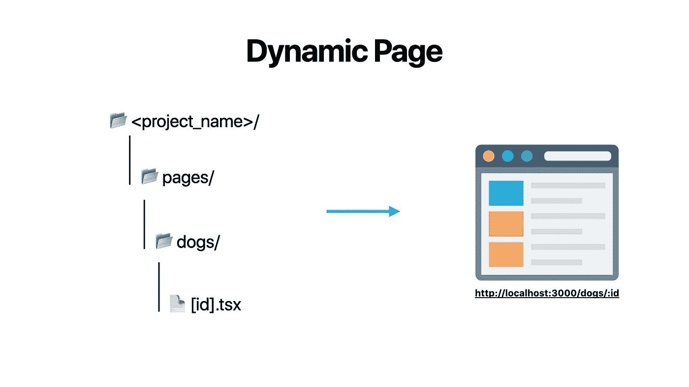
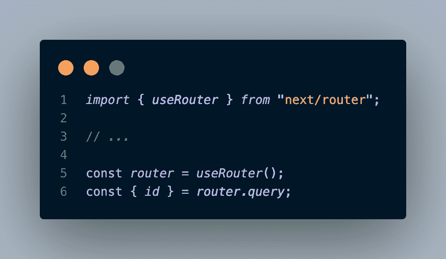
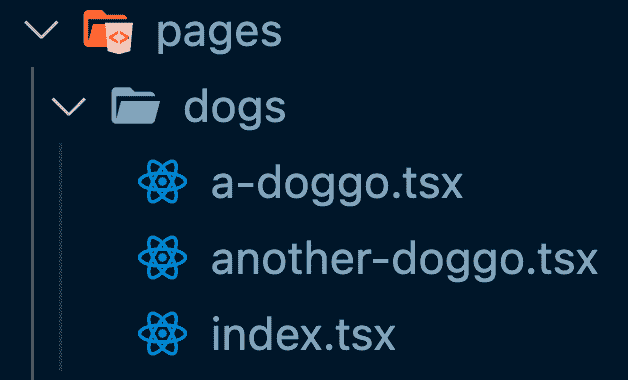
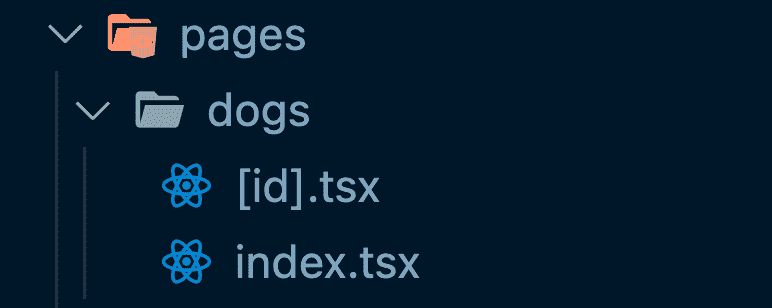
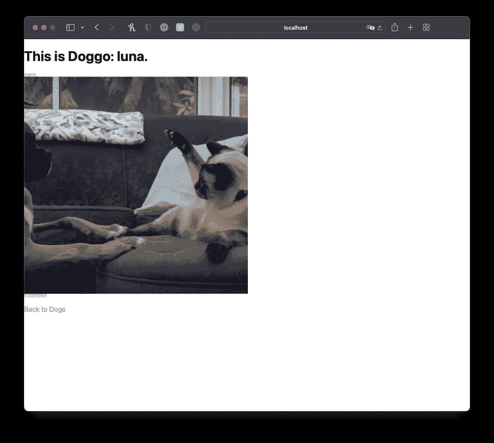
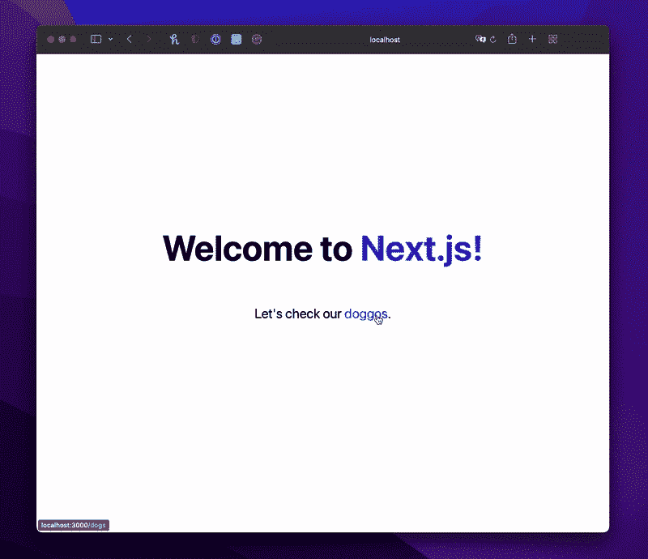

# Next.js 动态路由综合指南

> 原文：<https://javascript.plainenglish.io/a-comprehensive-guide-to-next-js-dynamic-routing-aac1883593b5?source=collection_archive---------14----------------------->


本文是我整理的整个 Next.js 系列文章的一部分，旨在帮助您成为 Next.js 专业人士，并开始构建速度极快的 React 应用程序。

💡如果你不想错过任何教程，请点击[此处](https://www.getrevue.co/profile/igorasilveira)注册我的时事通讯，或前往 [DailyDev.io](https://dailydev.io/) 获取更多信息。

在这个问题上，我们将了解 Next.js 如何让我们轻松地从下面的单个 React 组件创建动态页面。

💡你可以在这里找到这个项目[的源代码。](https://github.com/igorasilveira/blog-examples/tree/main/nextjs-dynamic-routing)

所以让我们开始吧！

# 先决条件

*   节点≥ 12
*   反应基础

# 快速回顾

上次我们在这里时，我们创建了一个基本的 web 应用程序，以更好地理解如何使用 Next.js 构建应用程序的基础知识。

我们介绍了`pages`的概念，以及 Next.js 希望我们如何构建我们的应用程序和我们的`React`组件，以便它自动创建和管理页面 URL 和转换。

如果您错过了那期介绍，我强烈建议您在继续之前查看一下。

# 页

在 Next.js 中，每个页面都是一个 React 组件，它是从位于项目根目录下的`/pages`目录中的文件导出的。文件名决定了它将关联的路径，包括 React 组件所在的文件夹(如果有)。

*   `/pages/index.tsx`到`/`路线的地图(特殊文件)
*   `/pages/dogs/a-doggo.tsx`映射到`/dogs/a-doggo.tsx`路线。

新文件的内容可以是您希望的任何内容，只要它导出一个默认的 React 组件，该组件呈现一些 Next.js 可以呈现为 HTML 的 JSX。

# 生成我们的项目

为此，我们将创建 Next.js 项目来托管这个应用程序，方法是在您希望存储所有优秀的 Next.js 项目的目录中运行这个命令。

```
npx create-next-app nextjs-dynamic-routing --use-npm --typescript -e [https://github.com/igorasilveira/blog-examples/tree/main/nextjs-basic-routing](https://github.com/igorasilveira/blog-examples/tree/main/nextjs-basic-routing)
```

*我们刚刚所做工作的明细:*

*   `npx` -是一个命令行界面工具，它使执行 npm 软件包变得容易，而不需要在您自己的机器上实际安装它们。
*   我们最好的朋友，将为你搭建一个完美平衡的 Next.js 应用。
*   这是我决定给我的项目起的名字，可以随意混合一下。
*   `--use-npm` -这个标志指定我们想要使用 NPM 作为我们的依赖管理器。
*   这个标志告诉搭建工具我们想要生成一个 TypeScript 项目，它初始化所有需要的依赖项(这更多的是我的个人偏好——❤️typescript)。
*   `-e` -此选项指定引导应用程序的示例。在这种情况下，我们使用前一期的 GitHub 库，这样我们就可以从上次停下的地方继续构建我们的应用程序。

# 运行我们的应用

我们的 Next.js 项目已经创建，所有依赖项都已自动安装。我们现在可以运行它，并看到我们的应用程序来生活！为此，在我们用来生成项目的同一个终端中，我们现在将`cd`放入我们的项目文件夹，并运行以下命令，以**开发模式**启动我们的项目。

```
npm run dev
```

几秒钟后，你的 Next.js 应用服务器启动(希望成功),你现在可以导航到`http://localhost:3000`并检查我们基于 doggo 的应用！🐶



# 动态路由

现在我们已经启动并运行了我们的应用程序，让我们进一步了解什么是动态路由，我们为什么需要它，以及 Next.js 将如何为客户端呈现的页面处理它。

# 我们为什么需要它

像我们在上一篇教程中使用的预定义的基于路径的路线并不总是大型复杂和动态应用的最佳选择。

如果我们坚持以前的方法，它将涉及到每次我们想要创建新页面时创建一个 React 组件，这将要求应用程序的开发人员创建新代码，将其推送到主分支，然后将更改部署到生产中。这不仅是一个 CI/CD 噩梦，因为它也是复制意大利面条代码的配方。

例如，在我们的 doggo 应用程序中，每次我们想要向应用程序添加新的 doggo 页面时，我们都不想复制以前的组件，并进行必要的更改以反映新添加的内容，特别是因为我们所有的 doggo 页面都呈现完全相同的结构。这是**组件可重用性**的完美用例。

# 组件可重用性

如果你以前在你的网络旅程中使用过**组件**，你就已经熟悉了它们的好处。

组件允许您定义通用应用程序的结构，您可以轻松地重用这些结构，而无需重写它们的外观和行为。然后，您可以按照您希望的任何方式排列这些组件，形成更大、更复杂的组件，最终成为构建完整应用程序页面的各个部分。如果以后您希望更改该结构、设计或功能，您只需更新您想要的组件，这些更改将反映在使用它们的任何地方。



# Next.js 如何处理

在 Next.js 中，您可以做到这一点(就像任何现代 web 框架一样)，最终，您可以从一个导出的 **React 组件**中为您的应用程序获得一个**可重用页面**。以后，如果你需要改变你的应用程序中的每一个 doggo 页面，你将只需要更新一个文件中的一个组件。

为了生成动态(可重用)页面，我们需要对之前的 **React 组件**进行一些更改和添加，以便 Next.js 可以理解它实际上是一个动态路由，而不是静态路由。

这一切都是从`pages`文件夹中的文件名开始的，和以前一样，但这一次有所改变。动态(可重用)页面将从括号(`[param]`)包围的特殊命名文件中导出。正如我们在上一篇文章中所讨论的，路径的其余部分仍然由文件夹层次结构定义。让我们来看一些例子:

如果我们考虑第一个例子`pages/dogs/[id].tsx`，任何匹配`/dogs/:id`模式的路线都将由`pages/dogs`目录下的特殊`[id].tsx`页面导出的 **React 组件**渲染，比如`/dogs/123`和`/dogs/russel`。



要访问路由的动态部分(本例中的`id`，我们可以直接访问 **Next.js Router** 并通过`query`对象获取它。在`/dogs/russel`的例子中，`query`对象如下:

```
{ "id": "russel" }
```

要在您的 **React 组件**中访问它，您可以使用提供的 Next.js 钩子`useRouter`。



# 更新我们的 Doggo 应用

让我们考虑一下我们在第一个教程中构建的狗应用程序，其中有一个文件为每只狗导出一个 **React 组件**:



你可以看到，一旦我们有了几十到几百只狗，这很快就会变成一场管理的噩梦。所以让我们使用动态路由来管理单个文件。

# 创建特殊的`[id].tsx`文件

为了保留我们 doggo 页面的先前结构，但仍然重构使用**动态路由**，我们可以简单地将其中一个文件重命名为`[id].tsx`，并删除所有其他呈现单只狗的文件。我们可以保留`index.tsx`文件，因为它有不同的用途，并且不会与我们正在创建的动态路由相匹配。

所以最终结果应该是这样的:



现在，每条`/dogs/:id`路线都将由单个`[id].tsx`文件呈现，而不是要求每只狗都有一个文件。完美！

# 更新文件内容

我们现在可以对新更新的特殊文件进行更改，这样我们就可以实际看到每页上传递的动态`id`。

我们将通过`query`对象访问`id`,然后通过将它添加到之前的`h1`标签来将其呈现在屏幕上。

太好了！现在我们可以根据提供的路线在每个狗页面上看到不同的内容。多棒啊。😎



# 决赛成绩

经过你所有的努力，这是你的 doggo 应用程序的预期结果。看起来已经很棒了！



# 结束语

现在你有了一个动态 doggo 应用程序，你可以尝试开发一个单独的狗页面，以便动态地获取更多的信息，或者测试创建新的目录和更复杂的动态路线。如果你遇到任何麻烦，请随时在 Twitter 上联系我，我的 DMs 永远是开放的。

**下一步:**请关注我接下来的 Next.js 教程，我们将在其中讨论*静态生成的动态路线*(performant 动态网页的下一步)以及更多内容！如果你不想错过任何教程，点击[这里](https://www.getrevue.co/profile/igorasilveira)注册我的时事通讯。

*原载于【http://github.com】[](https://gist.github.com/igorasilveira/0175de1997ae7e3f64e22112371c2bed)**。***

**更多内容请看*[***plain English . io***](https://plainenglish.io/)*。报名参加我们的* [***免费周报***](http://newsletter.plainenglish.io/) *。关注我们关于*[***Twitter***](https://twitter.com/inPlainEngHQ)*和*[***LinkedIn***](https://www.linkedin.com/company/inplainenglish/)*。查看我们的* [***社区不和谐***](https://discord.gg/GtDtUAvyhW) *加入我们的* [***人才集体***](https://inplainenglish.pallet.com/talent/welcome) *。**