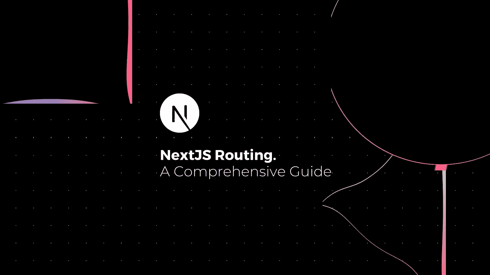
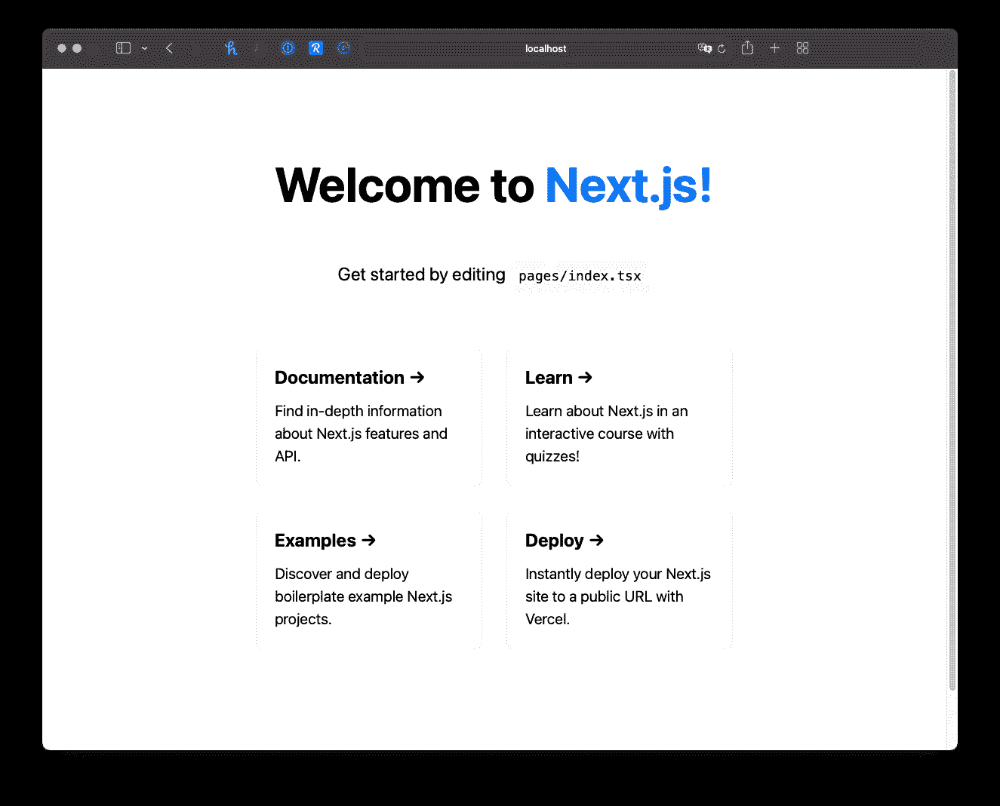
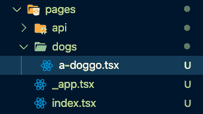
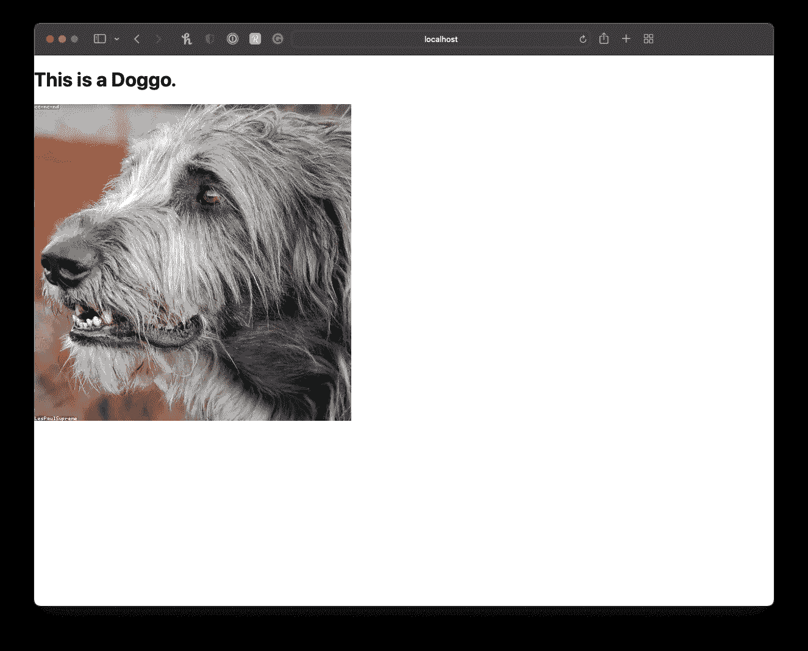
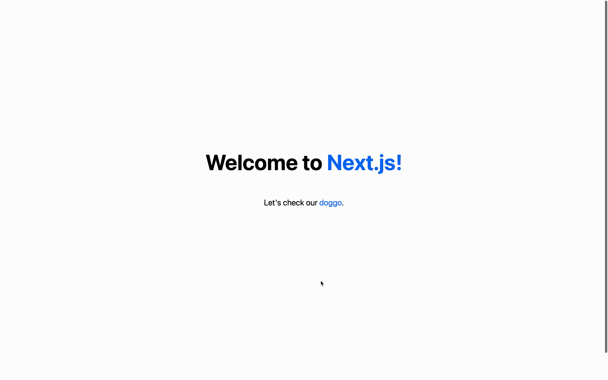

# NextJS 路由综合指南

> 原文：<https://javascript.plainenglish.io/a-comprehensive-guide-to-nextjs-routing-72b1abcf7c26?source=collection_archive---------5----------------------->



*大家好，我的名字是 Igor，如果你喜欢我写的东西，你可能也会喜欢我在 Twitter 上说的话，请过来说‘嗨！👋。*

本文是我整理的整个 Next.js 系列文章的一部分，旨在帮助您成为 Next.js 专业人员，并开始构建速度极快的 React 应用程序，可以是静态的、客户端呈现的、服务器呈现的或两者兼而有之(但我们将在后面讨论)。

💡如果你不想错过任何教程，请点击[此处](https://www.getrevue.co/profile/igorasilveira)注册我的时事通讯，或前往 [DailyDev.io](https://dailydev.io/) 获取更多信息。

在这个问题上，我们将了解 Next.js 如何通过使用*预取*来确保我们的应用快速安全，从而使我们的应用在页面间导航变得异常简单。

## 💡你可以在这里找到这个项目[的源代码。](https://github.com/igorasilveira/blog-examples/tree/main/nextjs-basic-routing)

所以让我们开始吧！

# 先决条件

*   节点≥ 12
*   反应基础

# 创建 Next.js 应用程序

为此，我们需要自己全新构建的 Next.js，只需在您希望存储所有优秀的 Next.js 项目的目录中运行该命令，就可以获得它。

```
npx create-next-app nextjs-basic-routing — use-npm — typescript
```

*我们刚刚所做工作的明细:*

*   `npx` -是一个命令行界面工具，可以轻松执行 npm 软件包，而无需在您自己的计算机上实际安装它们。
*   `create-next-app` -我们最好的朋友，将为你搭建一个完美平衡的 Next.js 应用。
*   `nextjs-basic-routing`——这是我决定给我的项目取的名字，可以随意混合一下。
*   `--use-npm` -该标志指定我们希望使用 NPM 作为我们的依赖管理器。
*   `--typescript`——这个标志告诉搭建工具我们想要生成一个 TypeScript 项目，它初始化所有需要的依赖项(这更多的是我的个人偏好——❤️typescript)。

# 运行我们的应用

我们的 Next.js 项目已经创建，所有依赖项都已自动安装。我们现在可以运行它，并看到我们的应用程序来生活！

在我们用来搭建项目的同一个终端中，我们现在`cd`进入我们的项目文件夹 ie。`cd nextjs-basic-routing`我们运行下面的命令，以**开发模式**启动我们的项目。

```
npm run dev
```

几秒钟后，你的 Next.js 应用服务器启动(希望成功),你现在可以导航到`http://localhost:3000`并显示你的 Next.js 应用，如下图所示。



Next.js Application Homepage

我们现在开始营业了！🥳

# Next.js 路由

现在我们已经启动并运行了我们的应用程序，让我们开始看看 Next.js 如何漂亮地处理它的页面和路由，从创建我们自己的新页面开始。

# 页

在 Next.js 中，每个页面都是一个 React 组件，它是从项目根目录下的`/pages`目录中的一个文件中导出的。文件名决定了它将关联的路径，包括 React 组件所在的文件夹(如果有)。有一个特殊的文件名与你的应用程序的**根**相关联，那就是已经包含在我们初始搭建中的`index.tsx`文件。

*   `/pages/index.tsx`地图到`/`路线(我们的主页)
*   `/pages/dogs/a-doggo.tsx`映射到`/dogs/a-doggo.tsx`路线。

# 创建新页面

因此，如果我们要创建映射到该特定路径的 doggo 页面，我需要在`/pages`中创建一个新文件夹，在这个新文件夹中，从名为`a-doggo.tsx`的文件中导出一个新的 React 组件。您的文件树将如下所示:



Next.js File Structure

(不要介意`_app.tsx`文件，就目前而言，那是一个特殊的文件)

新文件的内容可以是您希望的任何内容，只要它导出一个默认的 React 组件，该组件呈现一些 JSX，然后 Next.js 可以将其呈现为 HTML。例如，这是我的 React 组件的代码。

我想要一个狗狗的随机图像，所以我使用了[https://loremflickr.com](https://loremflickr.com)，一个随机生成资产的好工具。为了让它与 Next.js 一起工作，我们需要将这个域作为图像提供者添加到下面的`next.config.js`文件中。

(**注意:**这是可选的，您可以让 React 组件显示您想要的任何内容，而不使用这个图像生成器)

如果我们现在运行我们的服务器并导航到`http://localhost:3000/dogs/a-doggo`，将会有一个狗的随机图像供我们思考。🐶



Next.js Custom Static Doggo Page

# 导航静态路线

我们的应用程序现在有两个页面，为了在它们之间导航，我们一直在地址栏中手动更改我们的 URL。让我们改变这一切！

通常，我们使用`<a>` HTML 标签来链接我们自己或外部网站上的页面。但是 Next.js 建立在这个基础之上。您可以使用`Link`组件包装`<a>`标签，允许您在应用程序的不同页面进行**客户端导航**。

**客户端导航**意味着使用 *JavaScript* 进行页面转换，这比默认的浏览器导航方式更快。

使用 Next.js `Link`组件的另一个好处是，一旦`Link`在视窗中可见，包含一个或多个`Link`组件的页面就会**在后台预取**链接页面的代码。这允许更快的初始页面呈现，因为 Next.js 将只加载您请求的页面的代码，并且只在`Link`组件可见时加载其他链接的页面，并且它在后台进行，不会影响整体用户体验，并且使客户端应用程序的导航速度极快。

但是我们如何使用它呢？嗯，这非常简单，就像使用普通的`<a>` HTML 标签一样。所以让我们在我们的主页上包含一个`Link`来进入我们的 *doggo* 页面，另一个用来回家。

用以下代码替换您的`/pages/index.tsx`代码:

在您的`/pages/a-doggo.tsx`中，用这段代码替换您的代码，在这段代码中，我们添加了一个链接到我们主页的样式化段落。

现在，我们可以轻松地浏览我们的应用程序页面😎



现在，您已经有了一个可用的 Next.js 应用程序，不要止步于此。作为一个很好的练习，继续为你的应用程序创建更多的页面。关于我们，联系人)和更多 doggos。如果你遇到任何麻烦，请随时在 Twitter 上联系我，我的 DMs 永远是开放的。

**下一步:**请关注我接下来的 Next.js 教程，我们将在其中复习*动态路线*和更多内容！如果你不想错过任何教程，点击这里注册我的时事通讯。

*更多内容请看*[***plain English . io***](http://plainenglish.io/)*。报名参加我们的* [***免费周报***](http://newsletter.plainenglish.io/) *。在我们的* [***社区***](https://discord.gg/GtDtUAvyhW) *获得独家获得写作机会和建议。*